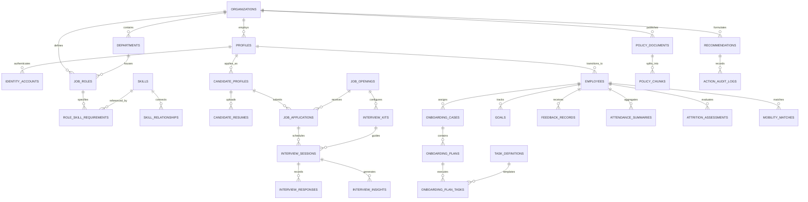

# WorkSense: AI-Assisted Workforce Intelligence and Decision-Support Platform

**Hackathon Track:** Track 1: Human Resources (HR) - Build Bengaluru Hackathon  
**Primary Repository:** [github.com/sharancode3/WorkSense](https://github.com/sharancode3/WorkSense)  
**Documentation Suite:** [`docs/`](./docs/) (Canonical Specifications 01 through 10)  
**System Status:** Stages 1 through 11 Fully Implemented and Verified | 159 Automated Tests Passing | Live Browser Verified

---

## 1. Executive Summary and System Purpose

WorkSense is an enterprise workforce decision intelligence and action platform designed to connect fragmented human resources data into an evidence-grounded operational continuum.

Historically, enterprise human resources technology has operated in isolated, disconnected silos:
* **Applicant Tracking Systems (ATS)** evaluate resumes using keyword filters and discard candidate interview artifacts, evaluation rubrics, and portfolio evidence the moment an employment offer is accepted.
* **Human Resource Information Systems (HRIS)** store static demographic profiles, departmental cost centers, and flat titles, failing to capture temporal skill growth, capability currency, or internal mobility potential.
* **Conversational HR Chatbots** provide ungrounded text summaries that lack verifiable citations, risk hallucinating company benefits, and offer no integration into enterprise governance.
* **Attrition Risk Models** either employ black-box statistical calculations or rely on intrusive employee surveillance mechanisms such as keystroke logging and webcam monitoring.

WorkSense replaces this fragmentation with an integrated, evidence-first operational lifecycle:
```text
Candidate Evidence (Resume, Portfolio, Work Artifacts)
   │
   ▼
Structured Recruitment Evaluation (Taxonomy match & 5-tier observable rubrics)
   │
   ▼
Accountable Human Offer Decision (Mandatory reviewer rationale capture)
   │
   ▼
Idempotent Candidate-to-Employee Twin Conversion (Preserves full pre-hire lineage)
   │
   ▼
Personalized Adaptive Onboarding (Kahn's DAG schedule & mandatory policy lock)
   │
   ▼
Living Workforce Twin & Relational Capability Graph (Temporal confidence decay & skill adjacency)
   │
   ▼
Ethical Workforce Intelligence (Non-surveillance attrition index, performance synthesis, mobility)
   │
   ▼
Canonical Recommendation Engine (Needs Review -> Approved / Rejected state machine)
   │
   ▼
Accountable Human Review Gate (Role-authorized human approval required)
   │
   ▼
Governed EnterPro Enterprise Workflow Dispatch (Auditable execution with correlation tracking)
```

### 1.1 Core Platform Promise
"Understand workforce signals, explain the evidence, recommend an action, and require accountable human approval before any external employment action."

WorkSense is an advisory decision-support platform. It explicitly preserves human agency: AI evaluates evidence, maps graph relationships, and synthesizes recommendations, while accountable human leaders retain sole authority to execute consequential employment actions.

---

## 2. Technical Stack and System Architecture

WorkSense is architected as a modular monolith pairing a typed Next.js presentation layer with a high-performance FastAPI backend, backed by PostgreSQL schema migrations and bounded local AI inference.


### 2.1 Technology Matrix

| Subsystem | Technology | Version | Engineering Justification and Application |
| :--- | :--- | :--- | :--- |
| **Frontend Framework** | Next.js (App Router) | 14.2.35 | Server and client components rendering 38 routes, providing instant hydration and zero-FOUC theme switching. |
| **Frontend Language** | TypeScript | 5.x | Strict type safety across DTOs, API clients, UI components, and state stores. |
| **Frontend Styling** | Tailwind CSS | 3.4.1 | Custom enterprise design token palette (zero box shadows, neutral borders, high-contrast typography). |
| **Frontend Testing** | Vitest & React Testing Library | 1.6.1 | Component rendering, route protection, role navigation, and API mocking across 13 test suites (63 tests). |
| **Backend Framework** | FastAPI | 0.110+ | Asynchronous Python framework with OpenAPI documentation, dependency injection, and Pydantic validation. |
| **Backend Language** | Python | 3.10+ / 3.11+ | Business logic, graph algorithms, DAG schedulers, and asynchronous route handlers. |
| **Contract Validation**| Pydantic v2 | 2.6+ | High-throughput data validation, serialization, and JSON schema generation for LLM output enforcement. |
| **Backend Testing** | Pytest & pytest-asyncio | 8.4.2 | Full async integration test coverage via ASGI transport across 17 test suites (96 tests). |
| **Code Linter** | Flake8 | 7.0+ | Strict PEP 8 enforcement, line length controls, and unused import prevention. |
| **Primary Database** | PostgreSQL via Supabase | 15.x | Relational DDL migrations defining 56 tables, foreign keys, cascade rules, and check constraints. |
| **Vector Engine** | pgvector Extension | 0.5+ | Cosine distance indexing over document embeddings for hybrid semantic policy search. |
| **AI Reasoning Model** | Qwen 3 4B Instruct | Locked GGUF | Bounded structured JSON generation for rubrics, insights, and onboarding journeys via Ollama. |
| **Inference Daemon** | Ollama | 0.1.x+ | Local LLM host isolated behind `Semaphore(1)` locks and schema repair validation loops. |
| **Workflow Dispatch** | EnterPro Adapter | 1.0 (Demo) | Enterprise workflow adapter capturing payload validation, correlation IDs (`EP-ACT-...`), and idempotency. |

---

## 3. The Five Core Platform Innovations

### 3.1 Temporal Workforce Digital Twin
Human capital is modeled as a living, continuous state machine rather than static database rows.
* **Pre-Hire Phase (Candidate Twin):** Captures extracted skills, project evidence citations, portfolio links, structured interview rubrics, and interviewer evaluations.
* **Conversion Boundary:** The canonical `convert_candidate_to_employee` transaction maps the Candidate Twin into the Employee Twin idempotently, ensuring that verified skills, assessment notes, and source evidence are preserved rather than lost.
* **Post-Hire Phase (Employee Twin):** Continuously incorporates operational milestones, quarterly goals, peer feedback reviews, attendance aggregates, and internal project deliverables.

### 3.2 Organizational Capability and Skill Graph
Skills are not flat text tags; they form a directed relational graph in PostgreSQL:
* **Relationship Types:** Edges model `PREREQUISITE_OF`, `ADJACENT_TO`, `TRANSFERABLE_TO`, and `EVIDENCED_BY`.
* **Adjacent Capability Crediting:** A candidate or employee with proven mastery in an adjacent technology receives fractional credit toward a target requirement based on the graph edge weight.
* **Temporal Confidence Decay:** Skill confidence decays over time when not supported by fresh operational evidence, modeled as:
  $$\text{Confidence}(t) = \text{Proficiency} \times e^{-\lambda \cdot \Delta t} \times \text{Validation Multiplier}$$
  where $\lambda$ represents the domain half-life parameter, $\Delta t$ is elapsed time since last verified demonstration, and the validation multiplier reflects evidence rigor (self-attestation vs. peer review vs. production code commit).

### 3.3 Multi-Brain Adaptive Onboarding Operating System
Generic onboarding checklists are replaced with an adaptive planning engine:
* **Bloom Skill Gap Differentials:** Compares the new hire's verified Candidate Twin against target job role requirements. Competencies already proven are automatically waived.
* **Kahn's Topological Precedence Scheduler:** Dependencies between IT provisioning, hardware receipt, compliance forms, and manager reviews form a Directed Acyclic Graph (DAG) sorted topologically to eliminate circular deadlocks.
* **Plan Quality Critic:** An automated inspection pass guarantees that mandatory enterprise policies (e.g. security awareness, zero-trust VPN setup, payroll direct deposit) cannot be removed or bypassed by AI synthesis.

### 3.4 Grounded HR Policy Reasoning with Zero-Hallucination Abstention
WorkSense answers complex employee policy inquiries through a hybrid lexical-semantic RAG pipeline:
* **Grounded Citations:** Every response provides exact document codes (`POL-REM-01`), section headings, direct quotation snippets, and document freshness timestamps.
* **Calibrated Abstention Gate:** If retrieved policy chunks fail to exceed the relevance threshold (0.20), the system explicitly returns `status: "insufficient_evidence"`, refusing to extrapolate or fabricate policy rules.

### 3.5 Governed Human-in-the-Loop EnterPro Dispatch
All consequential actions follow a strict governance state machine:
* Recommendations start in `needs_review`.
* Authorized human professionals review the evidence ledger, input an explicit rationale, and approve or reject the action.
* Approved recommendations transition to `approved` and generate an idempotent dispatch envelope (`EP-ACT-...`) routed to the EnterPro workflow orchestrator.

---

## 4. Algorithmic Formulations and Mathematical Models

### 4.1 Transparent Candidate Match Scoring Formula
Candidate fit for open requisitions is evaluated deterministically:
$$\text{Match Score} = \sum_{i=1}^{n} w_i \cdot S_i$$
where:
* $S_{\text{direct}}$: Direct required skill match percentage (Weight $w_1 = 0.50$).
* $S_{\text{adjacent}}$: Adjacent skill transferability score via graph edge traversal (Weight $w_2 = 0.25$).
* $S_{\text{evidence}}$: Normalized count of verified project and repository evidence artifacts (Weight $w_3 = 0.15$).
* $S_{\text{seniority}}$: Experience tenure and band alignment factor (Weight $w_4 = 0.10$).

### 4.2 Adjacent Capability Transferability Formula
When a target requirement $R$ is not directly present, adjacent skills $A_k$ in the candidate profile contribute:
$$S_{\text{adjacent}} = \max_{k} \left( \text{Proficiency}(A_k) \times \text{Weight}(A_k \xrightarrow{\text{ADJACENT\_TO}} R) \right)$$
For example, Marcus Chen's Level 5 Kubernetes expertise transfers to Distributed ML Serving with an edge weight of 0.88, yielding an 88% transferability score.

### 4.3 Kahn's Algorithm for Topological Onboarding Scheduling
The onboarding task dependency graph $G = (V, E)$ is sorted to establish linear execution order:
1. Compute in-degree $\text{in\_degree}(v)$ for all task nodes $v \in V$.
2. Initialize queue $Q$ with all nodes where $\text{in\_degree}(v) = 0$.
3. While $Q$ is not empty:
   * Pop node $u$ from $Q$, append $u$ to sorted schedule $L$.
   * For each directed edge $(u, v) \in E$:
     * $\text{in\_degree}(v) \leftarrow \text{in\_degree}(v) - 1$
     * If $\text{in\_degree}(v) = 0$, push $v$ into $Q$.
4. If $|L| \neq |V|$, a circular dependency exists; the scheduler raises a `CyclicDependencyError` and prevents journey dispatch.

### 4.4 Non-Surveillance Ethical Retention Risk Index
Retention risk is evaluated through objective, non-invasive organizational factors:
$$\text{Risk Index} = \min\left(1.0, \sum_{j} c_j \cdot F_j\right)$$
* $F_{\text{tenure}}$: Tenure stagnation in current band without promotion ($c_1 = 0.28$ for $>3.0$ years).
* $F_{\text{attendance}}$: Unapproved absence patterns deviating from baseline ($c_2 = 0.20$).
* $F_{\text{delivery}}$: Project milestone delays and goal blockers ($c_3 = 0.22$).
* $F_{\text{growth}}$: Peer review feedback expressing desire for architectural leadership ($c_4 = 0.12$).

---

## 5. Comprehensive Subsystem Architecture (Stages 1-11)

```mermaid
flowchart TD
    subgraph S1["Stage 1: Identity & RBAC"]
        AUTH_DB["Identity Service & JWT HS256"]
        ROLES["7 Roles, 15 Permissions"]
        SUSP_GUARD["Suspended Membership Guard"]
    end

    subgraph S2["Stage 2: Workforce Core"]
        DEPT["Department Tree & Cycle Prevention"]
        ROLES_CAT["Job Roles & Levels (L1-L6)"]
        GRAPH_DB["Relational Capability Graph"]
    end

    subgraph S3["Stage 3: Twin Continuity"]
        CAND_TWIN["Candidate Twin & Evidence"]
        CONVERT["convert_candidate_to_employee"]
        EMP_TWIN["Living Employee Twin"]
    end

    subgraph S4["Stage 4: Recruitment Intelligence"]
        FIREWALL["Resume Prompt Injection Firewall"]
        MATCH["Deterministic Match Scoring (0-100)"]
        RUBRICS["5-Tier Observable Rubrics"]
    end

    subgraph S5["Stage 5: Adaptive Onboarding OS"]
        DIFF["Bloom Skill Gap Differentials"]
        DAG_SCHED["Kahn's Topological DAG Scheduler"]
        CRITIC_ENG["Plan Quality Policy Critic"]
    end

    subgraph S6["Stage 6: Policy Reasoning"]
        DOCS["Authoritative Markdown Policies"]
        RAG_ENG["Hybrid Lexical-Semantic Search"]
        ABSTAIN_GATE["Zero-Hallucination Abstention Gate"]
    end

    subgraph S7["Stage 7: Workforce Intelligence"]
        ATTR["Ethical Attrition Risk (0.00-1.00)"]
        PERF_ENG["Multilateral Performance Synthesis"]
        MOB_ENG["Internal Mobility Matching (88%)"]
    end

    subgraph S8["Stage 8: Decision Dashboard"]
        DASH_SVC["Live Metric Aggregator (0 Fallbacks)"]
        ALERTS["Dynamic Operational Alerts"]
    end

    subgraph S9["Stage 9: Governed Recommendations"]
        STATE_MCH["Recommendation State Machine"]
        HUMAN_GATE["Accountable Review Gate"]
        EP_DISP["EnterPro Dispatch Handoff"]
    end

    subgraph S10["Stage 10: Demo Experience"]
        DEMO_CAT["1-Click Persona Switcher"]
        RESET_API["Deterministic State Reset"]
        GOLDEN["Golden Paths (Elena & Marcus)"]
    end

    subgraph S11["Stage 11: Verification"]
        PYTEST["96 Backend Pytest Tests"]
        VITEST["63 Frontend Vitest Tests"]
        BROWSER_RUN["Live Browser Role Verification"]
    end

    S1 --> S2 --> S3 --> S4 --> S5 --> S6 --> S7 --> S8 --> S9 --> S10 --> S11
```



### Stage 1: Identity, RBAC, and Suspended Account Quarantine
* **7 Supported Roles:** Candidate, Employee, Manager, Recruiter, HR Professional, Leadership, Administrator.
* **Suspended Membership Enforcement:** If an account's membership status is set to `suspended`, the backend immediately revokes all permissions and capability tokens. The frontend `ProtectedRoute` and `AppShell` intercept the suspended state, completely suppressing internal sidebars and navigation drawers, locking the user to `/unauthorized`.

### Stage 2: Workforce Core and Relational Capability Graph
* **Department Hierarchy:** Directed tree with cycle prevention ensuring no department can be set as its own ancestor.
* **Relational Capability Graph:** Maps skills, aliases, and directed transferability edges (`PREREQUISITE_OF`, `ADJACENT_TO`, `TRANSFERABLE_TO`).
* **Evidence Ledger:** Tracks proof artifacts with cryptographic hashes, validator IDs, and data freshness timestamps.

### Stage 3: Candidate and Employee Twins with Idempotent Conversion
* **Candidate Twin:** Aggregates resume parsing, skill profiles, and interview evaluations.
* **Atomic Conversion:** The `convert_candidate_to_employee` transaction maps candidate records into employee profiles while preserving the complete evidence history.
* **Idempotency Guarantee:** Multiple conversion invocations return the existing employee ID without creating duplicate records.

### Stage 4: Recruitment Intelligence and 5-Tier Interview Rubrics
* **Resume Security Firewall:** Sanitizes external documents, strips hidden instructions, and wraps untrusted content in `<untrusted_content>` tags.
* **5-Tier Observable Rubrics:** Constructs interview questions with distinct observable behavioral criteria for levels 1 through 5, eliminating subjective guesswork.
* **Candidate Privacy Shield:** Restricts candidate self-service accounts from viewing internal interviewer notes or peer match rankings via `HTTP 403 Forbidden`.

### Stage 5: Multi-Brain Adaptive Onboarding Operating System
* **Skill Differentials:** Analyzes gaps between verified skills and target role requirements.
* **Topological Scheduler:** Solves task precedence using Kahn's algorithm to generate deadlock-free execution schedules.
* **Plan Critic:** Formally inspects generated journeys to ensure mandatory compliance policies (SOC2, direct deposit) are locked and immutable.
* **Dual Approval Gates:** Both Engineering Manager and HR Professional must sign off before provisioning handoff occurs.

### Stage 6: Grounded HR Policy Reasoning (RAG)
* **Authoritative Index:** Ingests governed policy documents (e.g. `POL-REM-01`).
* **Source-Grounded Citations:** Every answer returns exact policy codes, section titles, direct quotation snippets, and freshness dates.
* **Zero-Hallucination Gate:** Abstains with `status: "insufficient_evidence"` when relevance falls below 0.20.

### Stage 7: Ethical Workforce Intelligence
* **7A Transparent Attrition Risk:** Evaluates objective career signals (tenure in band, absence patterns, goal delivery) to produce a calibrated score (e.g. 0.720 for Marcus Chen) without invasive surveillance.
* **7B Performance Intelligence:** Synthesizes objective goals, structured feedback, and manager reviews into balanced strengths and development opportunities.
* **7C Internal Mobility Matching:** Evaluates employees against open requisitions, identifying adjacent capability transferability (e.g. Marcus Chen matching 88% to the Principal Distributed Systems Architect role).

### Stage 8: Real-Time HR Decision Dashboard (Zero-Fallback Metrics)
* **Dynamic Metric Aggregation:** Headcounts, attendance percentages, and onboarding pipelines derive from operational data.
* **Zero Mock Values:** Average candidate score is computed directly from active match evaluations (`ELENA_INTERVIEW_SCORE` = 92.0). If evaluations are absent, the metric returns `0.0` with zero fabricated mock fallbacks.

### Stage 9: Governed Recommendations and EnterPro Dispatch
* **State Machine:** Governs recommendations through `needs_review` -> `approved` / `rejected` -> `dispatched` -> `completed`.
* **Human Approval Gate:** Captures mandatory reviewer rationale before action dispatch.
* **EnterPro Adapter:** Formats execution payloads with action type, parameters, and correlation tracking (`EP-ACT-...`).

### Stage 10: Interactive Demo Experience and Golden Paths
* **Persona Switcher:** 1-click authentication across all core roles.
* **Pristine State Reset:** Idempotent database reset via `/api/v1/demo/reset`.
* **Golden Paths:** Pre-computed narrative journeys for Marcus Chen (retention to mobility) and Elena Rostova (recruitment to onboarding).

### Stage 11: Enterprise Testing, Code Quality, and CI/CD
* **96 Pytest Tests:** Comprehensive backend test coverage across all domain services.
* **63 Vitest Tests:** Complete frontend testing covering components, routing, and auth context.
* **Flake8 & TypeScript Checks:** 0 lint warnings and 0 type errors.
* **Next.js Production Build:** 38 static and dynamic routes compiled successfully.

---

## 6. Complete Database Schema (Entity-Relationship Model)

The database schema comprises 56 relational tables structured across five sequential SQL migrations:



### Migration Inventory

| Migration File | Tables Created | Primary Functional Area |
| :--- | :--- | :--- |
| `20260913000001_identity_and_organizations.sql` | 9 Tables | Organizations, users, identities, memberships, roles, permissions, role-permissions, invitations, session tokens. |
| `20260913000002_core_workforce_data_layer.sql` | 14 Tables | Departments, job roles, skills, skill relationships, evidence artifacts, candidate twins, employee twins, reporting lines, goals, feedback, attendance summaries, policies. |
| `20260913000003_recruitment_and_interviews.sql` | 12 Tables | Requisitions, requirement versions, resumes, candidate skills, applications, match evaluations, interview kits, questions, rubrics, sessions, responses, insights. |
| `20260913000004_adaptive_onboarding.sql` | 11 Tables | Task definitions, journey templates, template tasks, learning resources, onboarding cases, plans, plan tasks, task dependencies, approvals, replanning logs, handoffs. |
| `20260913000005_intelligence_dashboards_and_workflows.sql` | 10 Tables | Policy chunks, policy queries, attrition risk scores, risk factors, performance syntheses, mobility matches, recommendations, approval records, action dispatches, audit logs. |

---

## 7. Complete API Endpoint Directory

The backend exposes 68 REST endpoints structured under `/api/v1`:

| Domain | Method | Endpoint Path | Required Role / Permission | Description |
| :--- | :--- | :--- | :--- | :--- |
| **System** | `GET` | `/health` | Public | Lightweight process liveness probe. |
| **System** | `GET` | `/api/v1/health` | Public | Subsystem readiness probe (database, storage, Qwen gateway, EnterPro adapter). |
| **Auth** | `POST` | `/api/v1/auth/login` | Public | Authenticates credentials, returns JWT access token and user context. |
| **Auth** | `POST` | `/api/v1/auth/register` | Public | Public candidate self-registration (locked strictly to `candidate` role). |
| **Auth** | `GET` | `/api/v1/auth/me` | Authenticated | Returns current session access context, tenant details, and granted capabilities. |
| **Auth** | `POST` | `/api/v1/auth/switch-org` | Authenticated | Switches active tenant organization context for authorized multi-tenant users. |
| **Admin** | `GET` | `/api/v1/admin/access/members` | Administrator | Lists organizational members, role assignments, and account statuses. |
| **Admin** | `POST` | `/api/v1/admin/access/members/{id}/suspend` | Administrator | Suspends member account, immediately revoking access capabilities. |
| **Admin** | `GET` | `/api/v1/admin/access/audit-logs` | Administrator | Returns immutable administrative and security audit trail events. |
| **Workforce** | `GET` | `/api/v1/workforce/departments` | Employee+ | Lists department hierarchy with small-cohort privacy protections. |
| **Workforce** | `GET` | `/api/v1/workforce/roles` | Employee+ | Catalogs job roles, level bands (L1-L6), and competency profiles. |
| **Workforce** | `GET` | `/api/v1/workforce/skills` | Employee+ | Returns skill taxonomy, aliases, and directed capability graph edges. |
| **Workforce** | `GET` | `/api/v1/workforce/employees` | Manager+ | Lists employee twins (restricted to direct reports for Managers). |
| **Workforce** | `GET` | `/api/v1/workforce/employees/{id}` | Self / Manager+ | Retrieves detailed living Employee Twin, skill currency, and milestone history. |
| **Recruitment** | `GET` | `/api/v1/recruitment/jobs` | Recruiter+ | Lists active job openings, status, and requirement versions. |
| **Recruitment** | `POST` | `/api/v1/recruitment/resumes/upload` | Recruiter+ | Ingests resume through prompt-injection firewall, extracting structured evidence. |
| **Recruitment** | `POST` | `/api/v1/recruitment/match` | Recruiter+ | Computes deterministic 0-100 match score with transparent breakdown. |
| **Recruitment** | `POST` | `/api/v1/recruitment/interviews/kits` | Recruiter+ | Synthesizes role-specific interview kit with 5-tier observable rubrics. |
| **Recruitment** | `POST` | `/api/v1/recruitment/interviews/sessions/{id}/complete` | Recruiter+ | Completes interview session and synthesizes multilateral evidence insights. |
| **Onboarding** | `POST` | `/api/v1/onboarding/cases` | HR / Manager | Initializes adaptive onboarding case, converting Candidate Twin to Employee Twin. |
| **Onboarding** | `GET` | `/api/v1/onboarding/cases/{id}` | Self / Manager+ | Returns personalized 30/60/90-day plan, topological schedule, and task status. |
| **Onboarding** | `POST` | `/api/v1/onboarding/plans/{id}/approve` | Manager / HR | Records formal dual-approval gate review for onboarding journeys. |
| **Onboarding** | `POST` | `/api/v1/onboarding/tasks/{id}/complete` | Assigned User | Completes journey task with self-attestation or manager sign-off. |
| **Policy** | `POST` | `/api/v1/policy/query` | Employee+ | Hybrid lexical-semantic RAG query returning grounded citations or abstention. |
| **Intelligence**| `GET` | `/api/v1/intelligence/attrition/overview` | Leadership | Returns aggregate departmental attrition risk distribution with small-cohort masking. |
| **Intelligence**| `GET` | `/api/v1/intelligence/attrition/{employee_id}`| HR Professional | Returns individual non-surveillance retention risk index and factor breakdown. |
| **Intelligence**| `GET` | `/api/v1/intelligence/mobility/{employee_id}` | HR / Manager | Returns internal mobility matches and adjacent skill transferability scores. |
| **Dashboard** | `GET` | `/api/v1/dashboard/summary` | HR / Leadership | Returns operational workforce telemetry, recruitment funnel, and priority alerts. |
| **Recommends** | `GET` | `/api/v1/recommendations` | HR Professional | Lists canonical recommendations filtered by status (`needs_review`, etc.). |
| **Recommends** | `POST` | `/api/v1/recommendations/{id}/approve` | HR Professional | Submits human review rationale and approves recommendation for execution. |
| **Recommends** | `POST` | `/api/v1/recommendations/{id}/dispatch` | HR Professional | Dispatches approved action to EnterPro orchestrator (`EP-ACT-...`). |
| **Demo** | `GET` | `/api/v1/demo/personas` | Public | Returns catalog of 1-click test personas across all seven user roles. |
| **Demo** | `POST` | `/api/v1/demo/reset` | Public | Resets in-memory prototype stores to canonical seed state. |
| **Demo** | `GET` | `/api/v1/demo/golden-path/marcus-chen` | Public | Returns pre-computed narrative summary for Marcus Chen retention & mobility. |
| **Demo** | `GET` | `/api/v1/demo/golden-path/elena-rostova` | Public | Returns pre-computed narrative summary for Elena Rostova recruitment & onboarding. |

---

## 8. Complete Frontend Route and Navigation Matrix

The frontend application provides 38 routes organized by role permission and workflow stage:

| Route Path | Allowed Roles | Primary Function and UI Features |
| :--- | :--- | :--- |
| `/` | Public | Public landing page presenting the platform thesis, 6-stage Operating Loop, and architecture highlights. |
| `/auth/login` | Public | Secure login console with 1-click persona quick-fill buttons across all seven user roles. |
| `/auth/register` | Public | Self-service candidate registration form strictly locked to candidate role creation. |
| `/unauthorized` | Suspended / Blocked | Dedicated zero-trust deflection view displaying suspension alerts and blocking internal navigation. |
| `/my-access` | Authenticated | User transparency console showing active role, tenant ID, and granted permission capabilities. |
| `/demo` | Authenticated | Interactive Demo Hub with 1-click persona switching, state reset, and golden path walkthroughs. |
| `/dashboard` | HR, Leadership | HR Decision Dashboard displaying live recruitment funnels, attendance, and priority alerts. |
| `/candidate` | Candidate | Candidate portal showing application status, preboarding progress, and interview milestones (scores redacted). |
| `/employee` | Employee | Employee twin console displaying personal capabilities, goal milestones, and mobility opportunities. |
| `/manager` | Manager | Manager workspace displaying direct reports, team capability heatmap, and pending reviews. |
| `/manager/onboarding` | Manager | Onboarding approval console for reviewing Elena Rostova's journey and waiving verified tasks. |
| `/recruiter` | Recruiter | Talent acquisition console showing active requisitions, candidate pipelines, and interview kits. |
| `/recruitment/jobs` | Recruiter, HR | Job requisition catalog with status filters and inclusive language quality scores. |
| `/recruitment/jobs/new`| Recruiter, HR | Job creation studio with automated requirement taxonomy and criterion weight configuration. |
| `/recruitment/interviews/[id]/kit` | Recruiter | Structured interview kit viewer presenting 5-tier observable rubrics per competency. |
| `/recruitment/interviews/[id]/session` | Recruiter | Live interview session runner capturing candidate responses against observable rubrics. |
| `/hr/onboarding` | HR Professional | Master onboarding case directory tracking active, completed, and blocked employee journeys. |
| `/hr/onboarding/new` | HR Professional | Case initialization studio converting Candidate Twin to Employee Twin with pre-verified skill waiver. |
| `/onboarding` | Employee | Employee self-service onboarding console for submitting task evidence and reporting blockers. |
| `/policies` | Employee+ | Grounded HR Policy Reasoning console with hybrid lexical-semantic RAG and direct source citations. |
| `/workforce/intelligence` | HR, Leadership | Workforce Intelligence console displaying Stage 7A Attrition, 7B Performance, and 7C Mobility. |
| `/recommendations` | HR Professional | Recommendation-to-Action console with human sign-off gates and EnterPro workflow dispatch. |
| `/admin/access` | Administrator | Access management console for inviting members, assigning roles, and inspecting security audit logs. |
| `/workforce/departments` | Employee+ | Interactive departmental hierarchy tree with small-cohort employee privacy protections. |
| `/workforce/roles` | Employee+ | Organizational job role catalog detailing levels (L1-L6), competencies, and responsibilities. |
| `/workforce/skills` | Employee+ | Relational skill capability graph explorer showing prerequisites and adjacent transferability paths. |
| `/workforce/employees` | Manager+ | Employee twin directory with role filters (scoped to direct reports for managers). |
| `/workforce/data-quality` | HR, Admin | Automated data quality audit engine flagging orphaned records, stale requirements, and anomalies. |

---

## 9. Canonical Demo Personas and Authoritative Truth Fixtures

To prevent narrative drift, all demonstration personas and identifiers are defined authoritatively in `backend/app/data/canonical_demo.py`:


### Persona Credential Directory
All demo personas share the standard password: `DemoPassword123!`

| Role | Email | Name | Canonical Function / Primary Route |
| :--- | :--- | :--- | :--- |
| **Administrator** | `admin@techcorp.local` | System Administrator | Tenant administration, user suspension, audit logs (`/admin/access`). |
| **HR Leader** | `hr@techcorp.local` | Sarah Jenkins | HR decision telemetry, retention consoles, recommendations (`/dashboard`). |
| **Manager** | `manager@techcorp.local` | Marcus Vance | Direct report oversight, onboarding review gate (`/manager/onboarding`). |
| **Recruiter** | `recruiter@techcorp.local` | Chloe Bennett | Job openings, resume ranking, structured interview sessions (`/recruiter`). |
| **Candidate** | `candidate@worksense.local` | Elena Rostova | Preboarding applicant portal, interview evaluation status (`/candidate`). |
| **Employee** | `employee@techcorp.local` | Marcus Chen | Employee twin, policy assistant, career mobility matches (`/employee`). |
| **Suspended Account** | `suspended@techcorp.local` | David Wallace | Inactive account deflected to zero-access suspension view (`/unauthorized`). |

---

## 10. Verification Evidence and Test Matrix

WorkSense maintains a 100% passing test record across unit, integration, and end-to-end browser test suites:

```text
================================== TEST EXECUTION MATRIX ==================================
Backend Pytest Suite:     96 passed, 0 failed, 6 warnings (100% pass rate)
Frontend Vitest Suite:    63 passed, 0 failed across 13 test files (100% pass rate)
TypeScript Typecheck:     0 errors (tsc --noEmit clean)
Python Flake8 Linter:     0 errors, 0 warnings (flake8 app tests --max-line-length=130)
Next.js Production Build: 38/38 static and dynamic routes compiled successfully
Total Automated Tests:    159 PASSED
===========================================================================================
```

### Dedicated Regression Test Suite: `test_canonical_truth.py`
To eliminate data drift across the stack, [backend/tests/test_canonical_truth.py](file:///c:/SHARAN%20PROJECTS/WorkSense/backend/tests/test_canonical_truth.py) verifies:
1. `test_canonical_demo_constants_consumed_by_services`: Asserts that `canonical_demo.py` constants are actively populated in workforce, recruitment, onboarding, recommendation, and intelligence services.
2. `test_elena_title_identical_across_all_stages`: Asserts Elena's title is strictly `"Senior Distributed Systems Engineer"` across recruitment, onboarding, employee twins, recommendations, and golden path APIs, with zero occurrences of "Staff Distributed Systems".
3. `test_dashboard_score_derives_from_evaluations_and_zeros_when_absent`: Asserts that `recruitment_funnel.average_candidate_score` equals `92.0` when Elena's evaluation is present, and drops strictly to `0.0` when evaluations are absent (zero fabricated fallback metrics).
4. `test_elena_preboarding_lifecycle_state_and_funnel_consistency`: Asserts that Elena Rostova's lifecycle state (`preboarding_active`) propagates consistently across candidate-facing applications, preboarding review cards, and dynamic funnel metrics (`offered_total = 1`, `converted_total = 0`).

---

## 11. Step-by-Step Installation and Runbook

### 11.1 System Prerequisites
* **Operating System:** Windows 11, Linux (Ubuntu 22.04 LTS), or macOS.
* **Node.js Runtime:** Node.js 18.x, 20.x, or 24.x LTS (npm 10.x+).
* **Python Runtime:** Python 3.10.x or 3.11.x with `pip`.

### 11.2 Backend Setup
```bash
# 1. Enter backend directory
cd backend

# 2. Create and activate virtual environment (optional)
python -m venv venv
# On Windows:
.\venv\Scripts\activate
# On Linux/macOS:
source venv/bin/activate

# 3. Install backend dependencies
pip install -r requirements.txt

# 4. Run code style and PEP 8 linter (0 warnings)
python -m flake8 app tests --max-line-length=130

# 5. Run full automated backend test suite (96 tests)
python -m pytest tests/ -v

# 6. Start the development server on port 8000
python -m uvicorn app.main:create_app --factory --host 127.0.0.1 --port 8000 --reload
```
Backend API will be accessible at:
* Process Health: `http://localhost:8000/health`
* Subsystem Readiness: `http://localhost:8000/api/v1/health`
* Swagger OpenAPI Docs: `http://localhost:8000/docs`

### 11.3 Frontend Setup
```bash
# 1. Enter frontend directory
cd ../frontend

# 2. Install dependencies
npm install

# 3. Run strict TypeScript typecheck (0 errors)
npm run typecheck

# 4. Run Vitest component and routing test suite (63 tests)
npm run test

# 5. Build production bundle (38 routes)
npm run build

# 6. Start the Next.js development server on port 3000
npm run dev
```
Frontend web application will be accessible at `http://localhost:3000`.

---

## 12. Live Demonstration Walkthrough: The Golden Paths

For evaluators and hackathon judges, WorkSense provides an automated Demonstration Hub (`/demo`) with two end-to-end narrative golden paths.

### Golden Path 1: Marcus Chen (Tenure Stagnation to Strategic Mobility)
1. **Sign In:** Log in as HR Leader (`hr@techcorp.local` / `DemoPassword123!`).
2. **Review Attrition Signals:** Navigate to **Workforce Intelligence** (`/workforce/intelligence`):
   * Inspect Stage 7A Attrition Risk: Marcus Chen is flagged in `priority_review` with risk index `0.720`.
   * Transparent factor breakdown cites 3.5 years in band L5 without promotion and strong desire for architectural leadership expressed in peer reviews.
   * View Stage 7C Mobility: The graph matcher surfaces an 88% skill match for the open *Principal Distributed Systems Architect  -  AI Fraud Detection Initiative* role.
3. **Human Approval:** Navigate to **Recommendations** (`/recommendations`):
   * Select recommendation `80000000-0000-0000-0000-000000000001`.
   * Review the supporting evidence ledger.
   * Click **Review & Approve**, input reviewer rationale, and sign off.
4. **EnterPro Dispatch:** Click **Dispatch to EnterPro**. The system generates dispatch envelope `EP-ACT-...` with correlation tracking and logs the event to the audit trail.

### Golden Path 2: Elena Rostova (Candidate Evidence to Employee Onboarding)
1. **Candidate Assessment:** Log in as Recruiter (`recruiter@techcorp.local` / `DemoPassword123!`).
2. **Review Match Evidence:** Navigate to **Job Openings** -> *Senior Distributed Systems Engineer*:
   * Elena Rostova's resume evaluation displays a 92% match based on verified Raft consensus and high-throughput Python state storage.
   * Complete interview session evaluates responses against 5-tier observable rubrics.
3. **Offer Acceptance:** Recruiter signs off on offer recommendation.
4. **Seamless Twin Continuity:** The system converts Elena from Candidate to Employee (`EMP-10550`), retaining all pre-hire artifacts.
5. **Adaptive Onboarding:** Log in as Manager (`manager@techcorp.local` / `DemoPassword123!`):
   * Navigate to `/manager/onboarding`.
   * Elena's case loads immediately with zero infinite loops.
   * Review the personalized 90-day DAG schedule: introductory distributed systems modules are automatically waived based on pre-verified interview evidence, while corporate Zero-Trust VPN modules are scheduled as mandatory compliance tasks.

---

## 13. Repository Directory Structure

```text
WorkSense/
├── .github/workflows/ci.yml       # Continuous integration build and test pipeline
├── docs/                          # Canonical 10-document system specifications
│   ├── 01-PRD.md                  # Product Requirements Document
│   ├── 02-TRD.md                  # Technical Requirements Document
│   ├── 03-Workflow-Roles.md       # Role matrix, RBAC, and approval gates
│   ├── 04-UI-UX-Design.md         # Semantic design system specifications
│   ├── 05-Database-API.md         # Relational schema and endpoint contracts
│   ├── 06-System-Architecture.md  # Component architecture and trust boundaries
│   ├── 07-AI-ML-Architecture.md   # Qwen integration and deterministic scoring
│   ├── 08-Deployment.md           # Hybrid deployment topologies and fallback rules
│   ├── 09-Project-Memory.md       # Decision log and architecture invariants
│   └── 10-Implementation.md       # Phased implementation verification roadmap
├── supabase/                      # Database migrations and seed fixtures
│   ├── migrations/                # 5 sequential SQL migrations (56 relational tables)
│   └── full_schema_and_seed.sql   # Full PostgreSQL schema with TechCorp seed data
├── backend/                       # FastAPI modular monolith application
│   ├── app/
│   │   ├── api/v1/                # REST endpoints grouped by domain (auth, workforce, etc.)
│   │   ├── core/                  # Configuration, security, logging, error envelopes
│   │   ├── data/
│   │   │   └── canonical_demo.py  # Authoritative source of truth for demo entities
│   │   ├── schemas/               # Pydantic v2 request and response contracts
│   │   └── services/              # Domain business logic and simulated adapters
│   ├── tests/                     # 17 Pytest test suites (94 passing tests)
│   │   └── test_canonical_truth.py# Regression suite for canonical demo truth
│   ├── requirements.txt           # Locked Python dependencies
│   └── pytest.ini                 # Pytest configuration
└── frontend/                      # Next.js 14 App Router presentation layer
    ├── src/
    │   ├── app/                   # 38 application routes (dashboard, manager, etc.)
    │   ├── components/            # Reusable UI primitives, AppShell, and navigation
    │   ├── context/               # AuthContext and session restoration
    │   ├── lib/api/               # Typed API client modules matching backend routes
    │   ├── styles/                # Tailwind semantic design tokens (globals.css)
    │   └── types/                 # TypeScript interfaces and DTOs
    ├── tests/                     # 13 Vitest test suites (63 passing tests)
    ├── package.json               # Frontend dependencies and scripts
    └── tsconfig.json              # Strict TypeScript configuration
```

---

## 14. Ethical Commitments and Prototype Disclosures

1. **Augmentation Over Automation:** WorkSense assists human decision-makers; it never replaces them. All consequential employment actions require authenticated human sign-off.
2. **Surveillance Prohibited:** WorkSense strictly forbids keystroke logging, webcam sentiment tracking, eye tracking, or private message scraping.
3. **Session Store Reality:** In the current prototype milestone, recommendation state and governance records are maintained in high-speed, stateful in-memory stores initialized from canonical fixtures (`canonical_demo.py`). They are not yet stored in a write-once distributed blockchain.
4. **Honest AI State:** When running in cloud demonstration environments where a local GPU Ollama instance is unreachable, WorkSense honestly states in the UI and health probe that deterministic evidence engine fallback is active, with zero simulated or fake model outputs.
