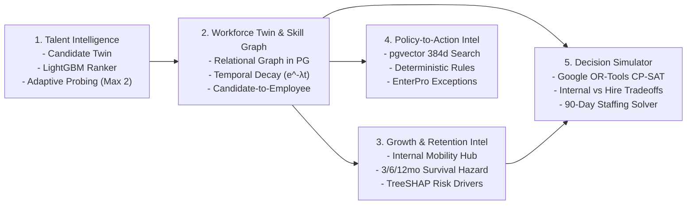
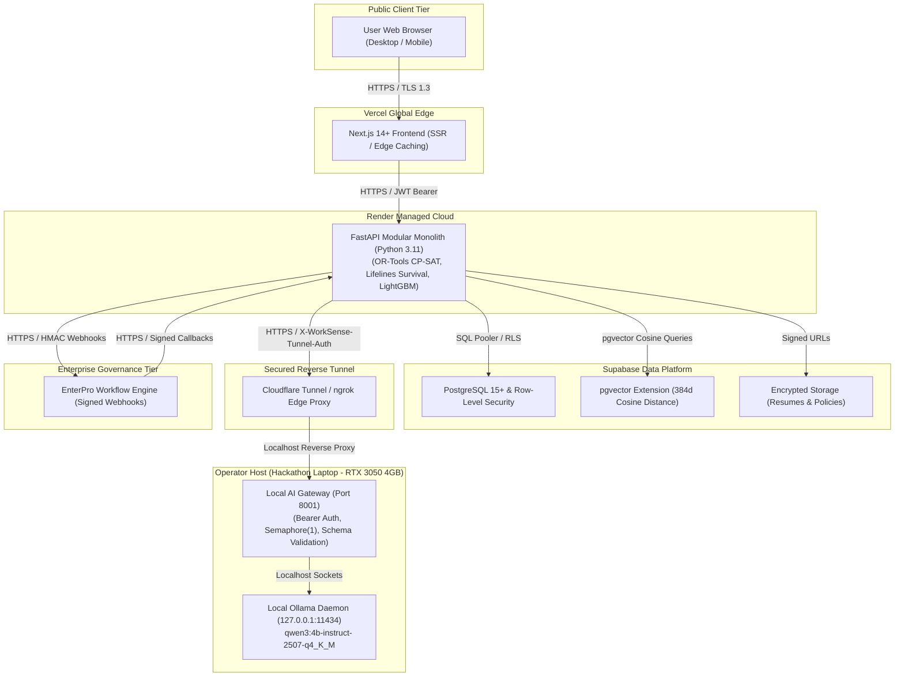

# WorkSense — AI Workforce Decision & Action Platform

> **Hackathon:** HackDriven *Build Bengaluru* Hackathon — Track 1: Human Resources (HR)  
> **Repository:** [github.com/sharancode3/WorkSense](https://github.com/sharancode3/WorkSense)

---

## 1. Executive Summary

**WorkSense** is a role-aware, evidence-first workforce decision and action platform whose living Candidate and Employee Twins and temporal Skill/Capability Graph connect recruitment, interviewing, onboarding, growth, retention, policy reasoning, and workforce planning; Qwen provides bounded reasoning and explanation, specialized components perform calculations, Supabase provides the secure prototype data layer, and EnterPro converts human-approved recommendations into auditable enterprise workflows.

Unlike fragmented HR portals, keyword resume matchers, or superficial LLM wrappers, WorkSense enforces a fundamental architectural principle:

```text
Qwen is not the entire AI system.
```

Every operational workforce problem is assigned to its mathematically and operationally optimal engine:
* **Natural-Language Understanding & Explanation:** Local **Qwen3-4B-Instruct** (`qwen3:4b-instruct-2507-q4_K_M`) via Ollama, shielded behind an authenticated Local AI Gateway.
* **Candidate-Requisition Matching:** **LightGBM Multi-Feature Learning-to-Rank** (12 objective features including adjacent skill graph credits, experience recency, and verified production PRs).
* **Longitudinal Retention Modeling:** **Continuous Time-to-Event Survival Analysis** (Cox Proportional Hazards & Random Survival Forests) across 3-month, 6-month, and 12-month hazard horizons.
* **Model Explainability:** **TreeSHAP** local and global feature attribution separating risk drivers from protective organizational factors.
* **Strategic Workforce Allocation:** **Google OR-Tools CP-SAT** solving mixed-integer combinatorial optimization under budget ceilings, deadlines, and headcount constraints.
* **Policy Reasoning:** Dual-engine architecture combining **`pgvector`** (384d cosine semantic search) with an in-process **Deterministic Python Rules Engine**.
* **Enterprise Governance:** **EnterPro** enterprise workflow orchestration managing human approval state machines and signed REST webhooks.
* **Human Primacy:** Consequential employment decisions (offers, transfers, terminations, formal ratings) are strictly owned by authenticated humans.

---

## 2. Canonical Architecture & Specification Suite

The complete architectural blueprint is documented across nine authoritative specifications in [`docs/`](./docs/):

| Specification | Document File | Core Responsibility |
| :--- | :--- | :--- |
| **01. PRD** | [`docs/01-PRD.md`](./docs/01-PRD.md) | Product Requirements Document: 7 user roles, 5 core engines, 90-day AI team Golden Demo narrative. |
| **02. TRD** | [`docs/02-TRD.md`](./docs/02-TRD.md) | Technical Requirements Document: Stack boundaries, architectural invariants, non-functional targets. |
| **03. Workflows & Roles** | [`docs/03-Workflow-Roles.md`](./docs/03-Workflow-Roles.md) | Workflows, Roles & Permissions: EnterPro 10-state machine, cross-role handoffs, human sign-off gates. |
| **04. UI/UX Design** | [`docs/04-UI-UX-Design.md`](./docs/04-UI-UX-Design.md) | Visual Design Specification: Electric Blue & Cyber Lime system, WHAT-WHY-EVIDENCE layout, 10 screen contracts. |
| **05. Database & API** | [`docs/05-Database-API.md`](./docs/05-Database-API.md) | Database & API Specification: 16 data domains (131 tables), 109 REST endpoints, pgvector, Row-Level Security. |
| **06. System Architecture** | [`docs/06-System-Architecture.md`](./docs/06-System-Architecture.md) | System Architecture: Modular monolith, 20 domain engines, trust boundaries, AI Document Firewall. |
| **07. AI/ML Architecture** | [`docs/07-AI-ML-Architecture.md`](./docs/07-AI-ML-Architecture.md) | AI & Machine Learning Architecture: LightGBM ranker, Cox survival model, OR-Tools CP-SAT, TreeSHAP, Qwen. |
| **08. Deployment Architecture**| [`docs/08-Deployment-Architecture.md`](./docs/08-Deployment-Architecture.md)| Deployment Architecture & Runbook: Vercel, Render, Supabase, local Ollama tunnel, degraded modes. |
| **09. Project Memory** | [`docs/09-Project-Memory.md`](./docs/09-Project-Memory.md) | Master Project Memory & Navigation Layer: First-read operational memory, locked decision register, agent contract. |

---

## 3. The Five Connected Intelligence Systems



---

## 4. Hybrid Cloud-Edge Deployment Topology



---

## 5. Flagship Golden Demo Narrative

The live presentation executes a continuous, 15-minute operational narrative:
1. **Strategic Need:** Executive Leadership accesses the *Strategic Workforce Simulator* (`SCR-10`) needing to staff an **8-person AI Fraud Detection Team in 90 days** within a $180,000 budget.
2. **Combinatorial Optimization:** Google OR-Tools CP-SAT solves Strategy A, B, and C. Strategy B (Balanced Hybrid: 3 transfers, 3 upskills, 2 external hires, ready in 70 days at $140,000) is chosen.
3. **Retention Mitigation:** **Marcus Chen** (Senior Infrastructure Lead) is flagged in the *Retention Risk Console* (`SCR-08`) with an elevated 6-month attrition risk (72%). TreeSHAP reveals tenure stagnation in band L5 (+34%). Marcus is matched to lead the AI Fraud Team infrastructure, retaining institutional knowledge.
4. **EnterPro Governance:** The internal transfer is dispatched as an auditable workflow request to **EnterPro**.
5. **Screening External Talent:** The Recruiter screens applicants in `SCR-02`. LightGBM ranks **Sarah Lin** #1 (94% match), crediting Triton expertise toward CUDA adjacency and citing verified production PR #402.
6. **Structured Adaptive Interview:** In `SCR-03`, Sarah completes the distributed caching competency with an adaptive probe targeting Redis split-brain recovery.
7. **Twin Continuity & Adaptive Onboarding:** Sarah is hired; her Candidate Twin converts into an Employee Twin in `SCR-04`, automatically waiving redundant technical onboarding tracks based on pre-verified screening evidence.

---

## 6. Directory Structure

```text
WorkSense/
├── docs/                                  # AUTHORITATIVE MASTER SPECIFICATIONS
│   ├── 01-PRD.md                          # Product Requirements Document
│   ├── 02-TRD.md                          # Technical Requirements Document
│   ├── 03-Workflow-Roles.md               # Workflows, Roles & Permissions
│   ├── 04-UI-UX-Design.md                 # UI/UX & Visual Design System
│   ├── 05-Database-API.md                 # Database Schemas & REST APIs
│   ├── 06-System-Architecture.md          # System Architecture & Modular Monolith
│   ├── 07-AI-ML-Architecture.md           # AI, Machine Learning & Governance
│   ├── 08-Deployment-Architecture.md      # Deployment Architecture & Runbook
│   └── 09-Project-Memory.md               # Master Project Operational Memory
├── backend/                               # FASTAPI MODULAR MONOLITH (To Be Initialized)
├── frontend/                              # NEXT.JS 14+ APP ROUTER (To Be Initialized)
├── .gitignore                             # Environment, secrets, and build exclusions
└── README.md                              # Master Repository Overview (This Document)
```

---

## 7. License & Compliance

WorkSense is built for HackDriven's *Build Bengaluru* Hackathon (Track 1: Human Resources). All synthetic datasets, demo fixtures, and code comply with strict ethical AI governance standards, enforcing Human Primacy, Zero Surveillance, and verifiable evidence-led decision-making.
