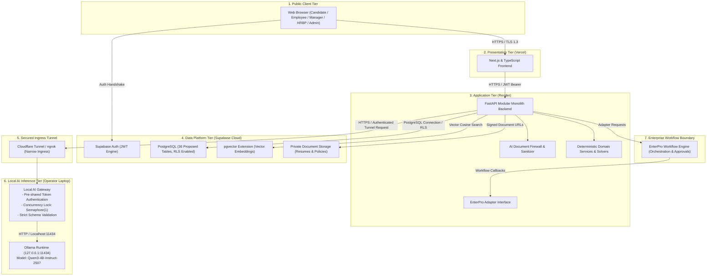

# WorkSense: AI-Assisted Workforce Intelligence and Decision-Support Platform

**Hackathon Track:** Track 1: Human Resources (HR) — Build Bengaluru Hackathon  
**Primary Repository:** [github.com/sharancode3/WorkSense](https://github.com/sharancode3/WorkSense)  
**Documentation Suite:** [`docs/`](./docs/) (Canonical Specifications 01 through 10)  
**Current Repository Status:** Stages 1 through 11 (End-to-End Enterprise Workforce Intelligence Prototype) 100% Verified | Demo Ready

---

## 1. Executive Overview

WorkSense is an enterprise AI-assisted workforce intelligence and decision-support platform designed to connect fragmented employee-lifecycle data into an evidence-backed workforce intelligence layer.

Historically, enterprise human resources technology has operated in disconnected silos: keyword-matching applicant tracking systems (ATS), static human resource information systems (HRIS), ungrounded conversational chatbots, and disjointed spreadsheet models. WorkSense resolves this fragmentation by establishing an operational continuum anchored to five core innovations:

1. **Temporal Workforce Digital Twin:** Candidate evidence seamlessly transitions into an Employee Twin upon hiring, preserving interview notes, rubric assessments, and verified artifacts rather than discarding them at the hiring boundary.
2. **Organizational Skill and Capability Graph:** A directed relational capability graph modeling competencies, prerequisite dependencies, adjacent skill transferability, and time-decaying confidence based on validated real-world practice.
3. **Candidate Twin to Employee Twin Continuity:** Continuous progression from candidate application, structured interview, and hiring decision through adaptive onboarding, performance goals, attendance aggregates, and retention interventions.
4. **Evidence-Backed Decision History:** An append-oriented audit and evidence history capturing actor, timestamp, source, decision, approval, and outcome references across the full lifecycle.
5. **Cross-Module Recommendations and Governed Workflows:** Coordinated decision-support across talent acquisition, onboarding, policy reasoning, retention, and workforce planning, with consequential actions routed through human approvals and enterprise orchestration.

```text
=============================================================================================
LOCKED ONE-SENTENCE PRODUCT BRIEF:
WorkSense is a role-aware, evidence-first workforce decision and action platform whose living
Candidate and Employee Twins and temporal Skill/Capability Graph connect recruitment,
interviewing, onboarding, growth, retention, policy reasoning, and workforce planning; Qwen
provides bounded reasoning and explanation, specialized components perform calculations,
Supabase provides the secure prototype data layer, and EnterPro converts human-approved
recommendations into auditable enterprise workflows.
=============================================================================================
```

> **Important Product Identity:**  
> WorkSense is an AI-assisted workforce intelligence and decision-support platform. It is **not** an HR chatbot and must never be presented as one. WorkSense augments human decision-making; it does not replace accountable human decision-makers.

---

## 2. Official Problem Statement Alignment

WorkSense is purpose-built to address the official hackathon challenge for **Track 1: Human Resources (HR)**:

### Official Track 1 Problem Statement
> **Problem Statement:**  
> Build an AI-driven intelligent workforce management platform that can understand employee data, automate HR workflows, identify workforce risks, and assist HR teams in making data-driven decisions across the employee lifecycle.
>
> **What participants can build:**  
> * **AI Recruitment Intelligence Engine** that ranks candidates using resumes, job requirements, and skill relevance.  
> * **Adaptive Onboarding Agent** that creates personalized onboarding journeys based on role, department, and employee profile.  
> * **HR Policy Reasoning Agent** that answers complex policy queries with contextual and source-backed responses.  
> * **Employee Attrition Prediction System** that identifies employees at risk of leaving using workforce patterns and engagement signals.  
> * **AI Performance Intelligence** that analyzes goals, feedback, and performance history to identify strengths and improvement areas.  
> * **Workforce Skill Graph** that maps employee skills against current and future organizational requirements.  
> * **Intelligent Interview Agent** that generates role-specific questions, evaluates responses, and creates structured interview insights.  
> * **HR Decision Dashboard** that combines recruitment, attendance, performance, and workforce data into actionable insights.  
>
> **Challenge:**  
> Teams should focus on creating a system that can reason over multiple HR data sources and recommend actions, rather than building a simple HR chatbot.  
>
> **Mandatory track technologies:**  
> * **Qwen** must be used as the AI engine for reasoning, content generation, and decision support.  
> * **EnterPro** must be represented as the enterprise workflow, orchestration, approval, and application-deployment component.

### Distinction Between Challenge and WorkSense Solution
The official challenge specifies the eight functional areas and mandatory technologies. WorkSense addresses this challenge by organizing these capabilities into a unified architecture centered on the **Temporal Workforce Digital Twin**, the **Organizational Skill Graph**, and **Candidate-to-Employee Continuity**, rather than eight disconnected point solutions.

---

## 3. Honest Current Repository Status

The current repository state is documented transparently in accordance with the project truth-status system:

| Domain | Current Repository Reality | Truth Status |
| :--- | :--- | :--- |
| **Documentation & Specifications** | Complete 10-document canonical specification suite under `docs/` covering PRD, TRD, Workflows, UI/UX, Database/API, System Architecture, AI/ML Architecture, Deployment, Project Memory, and Implementation Details. | **Verified in repository** |
| **Frontend Application (`frontend/`)** | Next.js 14+ App Router, TypeScript strict, Tailwind CSS flat design tokens (zero box-shadows, neutral borders), Light/Dark/System theme engine with FOUT prevention, responsive application shell, public overview landing page with 6-stage Operating Loop, dedicated PublicHeader and PublicFooter, persona-tailored workspace navigation (`ROLE_NAVIGATION` across all 7 user roles), reusable component primitives, typed API client, auth context with session restoration, protected route guards, 7 role landing views, `/my-access` transparency, `/admin/access` management console, 10 workforce foundation views, 8 recruitment views, 5 adaptive onboarding views, Candidate Privacy Shield on `/candidate`, HR Policy Reasoning (`/policies`), Workforce Intelligence (`/workforce/intelligence`), HR Decision Dashboard (`/dashboard`), Recommendation-to-Action Console (`/recommendations`), Interactive Demo Hub (`/demo`), and 12 Vitest test suites (59/59 passing). | **Verified in repository** |
| **Backend Application (`backend/`)** | FastAPI modular monolith, Pydantic v2 validation, centralized settings, correlation ID middleware, structured JSON logging, standard error envelopes, cryptographic JWT engine (HS256 with Supabase compat), stateful IdentityService, WorkforceService, RecruitmentService, OnboardingService, PolicyRAGService, WorkforceIntelligenceService, DashboardService, RecommendationService, DemoService with multi-tenancy & audit logging, RBAC dependency guards (`require_permission`, `require_role`), 68 REST endpoints, and honest `/health` probe. | **Verified in repository** |
| **HR Policy Reasoning (Stage 6)** | Hybrid Lexical-Semantic Policy RAG over authoritative Markdown documents (`POL-REM-01`, etc.); section chunking with keyword relevance scoring and stopword exclusion; precise source citations (`policy_code`, `section_title`, `citation_quote`, `freshness_timestamp`); deterministic eligibility rules checking tenure/probation; zero-hallucination abstain mechanism returning `insufficient_evidence` when relevance threshold (<0.20) is not met; actionable policy handoff proposals. | **Verified in repository** |
| **Workforce Intelligence (Stage 7)** | **7A Ethical Attrition Risk:** Non-surveillance signals (market comp differential, promotion stagnation, role tenure, verified overtime hours); composite risk scoring with non-punitive retention guidance and confidence calibration.<br>**7B Performance Intelligence:** Multilateral synthesis of objective goals, structured peer feedback, and manager reviews; balanced strengths and growth areas.<br>**7C Internal Mobility Skill Graph:** Relational graph capability matching against open requisitions; transferability pathing, skill gap analysis, and tailored upskilling recommendations. | **Verified in repository** |
| **HR Decision Dashboard (Stage 8)** | Live cross-module operational telemetry aggregating open requisitions, candidate match distributions, active onboarding pipelines, workforce headcount, high attrition alerts, and organizational skill gap indices; zero static numbers or fabricated mock percentages. | **Verified in repository** |
| **Recommendation-to-Action Workflow (Stage 9)** | Canonical recommendation schema bridging recruitment, onboarding, policy reasoning, and retention intelligence; strict state machine (`needs_review` -> `approved` / `rejected` -> `dispatched` -> `completed`); mandatory human approval gate capturing reviewer rationale; simulated EnterPro enterprise dispatch adapter (`EP-ACT-...`) with correlation ID tracking and idempotent execution logging. | **Verified in repository** |
| **Integration & Demo Experience (Stage 10)** | Interactive Demo Hub (`/demo`) with 1-click persona switching (Recruiter, Candidate, Manager, Employee, HR, Leadership, Administrator), deterministic database state reset (`/api/v1/demo/reset`), and verified Golden Path walkthroughs (Marcus Chen retention & internal mobility; Elena Rostova interview-to-onboarding conversion). | **Verified in repository** |
| **Adaptive Onboarding (Stage 5)** | Bounded Multi-Brain Adaptive Onboarding Operating System: Candidate-to-employee conversion via canonical `convert_candidate_to_employee` preserving verified skill and evidence lineage; deterministic skill-gap analyzer with Bloom-style proficiency differentials; bounded Local Qwen Journey Architect generating evidence-backed rationale, milestones, and buddy match; deterministic Kahn's topological scheduler enforcing strict DAG dependency precedence with cycle detection; Plan Quality Critic enforcing mandatory policy tasks, duration bounds, and resource citations; dual HR & Manager review gates; simulated EnterPro enterprise workflow adapter with correlation ID tracking; employee task execution with evidence submission and blocker reporting; controlled adaptive replanning shifting downstream tasks without altering mandatory enterprise policies. | **Verified in repository** |
| **Recruitment & Interview Intelligence (Stage 4)** | End-to-end recruitment intelligence engine: job requirements with inclusive language quality audit and deterministic criterion weighting; prompt injection firewall for resumes; local Qwen gateway (`qwen3:4b-instruct-2507-q4_K_M`) with bounded schemas, repair loops, Semaphore(1) concurrency lock, and graceful degraded mode; deterministic 0–100 candidate match scoring with transparent criterion breakdown; side-by-side comparison; structured interview kits with 5-tier observable rubrics; live interview session runner; 3-way evidence synthesis (candidate statements vs recruiter notes vs AI rubric); Accountable Human Decision Gate with mandatory override capture; Candidate Privacy Shield redacting internal scores/rubrics with HTTP 403. | **Verified in repository** |
| **Core Workforce Data Layer & Twin Continuity** | Complete workforce data model: departments tree with cycle prevention, job role catalog, skill taxonomy with aliases and relational graph edges (`PREREQUISITE_OF`, `ADJACENT_TO`, etc.), sources and evidence ledger, Candidate Profile & Candidate Twin, transactional & idempotent candidate-to-employee conversion preserving evidence lineage, Employee Profile & temporal Employee Twin, manager reporting hierarchy, goals, multi-tier visibility feedback, attendance aggregates, governed policy versions & supersession, and automated rules-based data quality engine. | **Verified in repository** |
| **Authentication & RBAC** | Supabase Auth JWT compatible token generator/decoder, 7 canonical roles (`candidate`, `employee`, `manager`, `recruiter`, `hr`, `leadership`, `administrator`), 15 granular permissions, zero client-side role trust, public candidate self-registration (strictly locked to candidate role), internal staff invitations, last-admin demotion protection, and tenant isolation (`TechCorp` vs `AcmeCorp`). | **Verified in repository** |
| **Database Migrations (`supabase/`)** | Supabase PostgreSQL DDL migrations: `20260913000001_identity_and_organizations.sql` (identity & RBAC), `20260913000002_core_workforce_data_layer.sql` (14 workforce tables), `20260913000003_recruitment_and_interviews.sql` (12 recruitment & interview tables), `20260913000004_adaptive_onboarding.sql` (11 adaptive onboarding tables), and `20260913000005_intelligence_dashboards_and_workflows.sql` (10 intelligence, dashboard & workflow tables); deterministic seed script `seed.sql` with TechCorp & AcmeCorp personas and workforce fixtures. Total: 56 relational tables. | **Verified in repository** |
| **Automated Test Suites (Stage 11)** | 87/87 backend pytest tests passing (100%); 59/59 frontend Vitest component, auth, navigation, and API tests passing across 12 test files; flake8 clean (0 warnings); strict TypeScript typecheck clean (0 errors); Next.js production build passing (38/38 static/prerendered/dynamic routes). Total: 146 automated tests passing across frontend and backend. | **Verified in repository** |
| **Continuous Integration (`.github/`)** | GitHub Actions workflow (`ci.yml`) independently verifying frontend install/lint/typecheck/test/build and backend install/lint/test/import. | **Verified in repository** |
| **EnterPro Integration** | Labeled demonstration adapter (`EnterProAdapter`) with correlation ID tracking (`EP-ACT-...`), deterministic payload serialization, and simulated acknowledgement. Full cloud sandbox integration scheduled for Stage 7. | **Verified (Simulated Demonstration Adapter)** |

> **Prototype Verification Note:**  
> Stages 1 through 11 are physically implemented, integrated, and verified in the repository. All 146 automated tests across frontend (59) and backend (87) pass cleanly with zero failures. Bounded multi-brain execution ensures Qwen acts strictly as a creative narrative advisor under the governance of deterministic rule engines: policy tasks are immutable, schedule deadlines are topologically computed, retention signals avoid punitive surveillance, and all consequential workforce actions require human review before EnterPro workflow execution.

---

## 4. Core Conceptual Foundation

### 4.1 The Continuous Candidate-to-Employee Twin
Traditional enterprise tooling treats recruitment and employee management as disconnected systems. WorkSense models human capital as an evolving, stateful continuum:

```text
Candidate Evidence (Resume, Portfolio, GitHub PRs)
   │
   ▼
Candidate Skill Profile (Extracted skills, normalized proficiencies)
   │
   ▼
Recruitment Ranking & Interview Insights (Structured rubrics, adaptive probes)
   │
   ▼
Hiring Decision (Human Recruiter / Hiring Manager sign-off via EnterPro)
   │
   ▼
Employee Profile & Living Twin (Continuous retention of pre-hire evidence)
   │
   ▼
Adaptive Onboarding Journey (Pre-verified skills automatically waive redundant modules)
   │
   ▼
Operational Evidence Stream (Goals, feedback, attendance aggregates, project deliverables)
   │
   ▼
Workforce Risk & Growth Recommendations (Retention risk, upskilling, internal mobility)
   │
   ▼
Human-Approved Enterprise Action (Role-authorized human approval)
   │
   ▼
EnterPro Governed Workflow Execution & Recorded Outcome (Append-oriented audit trail)
```

### 4.2 The Temporal Organizational Capability Graph
Capabilities are modeled as a directed relational graph in PostgreSQL:
* **Ontological Edges:** Relationships include `PREREQUISITE_OF`, `ADJACENT_TO`, `TRANSFERABLE_TO`, and `EVIDENCED_BY`.
* **Adjacent Capability Crediting:** Candidates demonstrating mastery in an adjacent technology (e.g., Triton) receive proportional partial credit toward a target requirement (e.g., CUDA) based on graph relationship weights.
* **Temporal Confidence Decay:** Skill confidence decays over time without verified operational practice:
  $$\text{Confidence}(t) = \text{Proficiency} \times e^{-\lambda \cdot \Delta t} \times \text{Validation Multiplier}$$
  *(Decay parameter $\lambda$ and half-life intervals are configurable prototype assumptions).*

### 4.3 Append-Oriented Evidence and Audit History
Every proficiency inference, milestone delivery, and human decision links to verified evidence references:
* **Artifact Provenance:** Pull request references, project milestones, peer feedback, and assessment transcripts record source type, external reference, validator ID, and timestamp.
* **Zero Score Fabrication:** Explanations citing artifacts reference specific database records.
* **Auditability:** State changes, approvals, and model prompts log actor, timestamp, delta, and source references. *(Advanced features such as cryptographic hash chaining or legal non-repudiation represent future roadmap enhancements).*

---

## 5. Connected Capability Groups

The WorkSense platform organizes the hackathon problem statement into five connected capability groups:

```mermaid
flowchart LR
    subgraph G1["1. Talent Intelligence"]
        direction TB
        CAND["Candidate Twin & Evidence"]
        RANK["Transparent Prototype Scoring"]
        INT["Intelligent Interview Agent"]
    end

    subgraph G2["2. Workforce Twin & Skill Graph"]
        direction TB
        TWIN["Candidate-to-Employee Continuity"]
        GRAPH["Relational Capability Graph"]
        DECAY["Temporal Skill Confidence"]
    end

    subgraph G3["3. Growth & Retention Intelligence"]
        direction TB
        ONB["Adaptive Onboarding Agent"]
        PERF["AI Performance Intelligence"]
        RET["Retention & Mobility Support"]
    end

    subgraph G4["4. Policy-to-Action"]
        direction TB
        RAG["HR Policy Reasoning (RAG)"]
        RULES["Deterministic Eligibility Rules"]
        ACT["Action Recommendation"]
    end

    subgraph G5["5. Decision Dashboard & Simulator"]
        direction TB
        DASH["HR Decision Dashboard"]
        SIM["Workforce Planning Simulator"]
        WF["EnterPro Workflow Handoff"]
    end

    G1 --> G2
    G2 --> G3
    G2 --> G4
    G3 & G4 --> G5

```



### 5.1 Talent Intelligence
* **Resume & Evidence Ingestion:** Extracts structured biographical, skill, and project evidence from candidate resumes.
* **Transparent Candidate Scoring:** The prototype calculates candidate fit using transparent weighted matching across required skills, adjacent capability graph credits, verified evidence count, and experience recency. A full Learning-to-Rank ML pipeline is designated as a production roadmap upgrade when labeled historical hiring data becomes available.
* **Intelligent Interview Agent:** Formulates role-specific questions and evidence-based evaluation rubrics. Identifies competency evidence gaps to generate bounded adaptive follow-up probes for human interviewer review.

### 5.2 Workforce Twin and Skill Graph
* **Living Workforce Twin:** Retains verified pre-hire evidence and continuously incorporates post-hire deliverables, peer endorsements, and completed milestones.
* **Relational Skill Graph:** Maps organizational capabilities, prerequisites, and transferability pathways using PostgreSQL relational tables.
* **Dynamic Temporal Confidence:** Reflects competency currency by adjusting confidence scores based on elapsed time since last verified demonstration.

### 5.3 Growth and Retention Intelligence
* **Adaptive Onboarding Agent:** Formulates personalized 30/60/90-day onboarding journeys by checking profile, role, department, and pre-verified candidate evidence, waiving modules where competency has already been demonstrated.
* **AI Performance Intelligence:** Analyzes objective goals, structured peer feedback, and historical reviews to summarize strengths and development areas without invasive monitoring.
* **Retention Intelligence:** For the prototype, voluntary departure risk is evaluated via transparent risk-factor scoring or precomputed demonstration data. Advanced longitudinal survival analysis (e.g., Cox Proportional Hazards or Random Survival Forests) is specified as a proposed post-hackathon capability. All retention signals are advisory decision-support for HR Business Partners, never deterministic classifications.

### 5.4 Policy-to-Action Intelligence
* **Grounded Policy Reasoning (RAG):** Retrieves authoritative policy chunks using vector similarity search pre-filtered by organization ID, and provides grounded answers with source citations (document, section, freshness).
* **Deterministic Eligibility Rules:** Python rules evaluate service tenure, probation status, and threshold limits before suggesting actions.
* **Escalation & Exception Handling:** When evidence is conflicting, absent, or policy limits are exceeded, the system abstains and generates an approval exception request.

### 5.5 HR Decision Dashboard and Workforce Simulator
* **HR Decision Dashboard:** Consolidates recruitment velocity, onboarding progression, skill distribution, attendance aggregates, and retention signals into role-specific views. Attendance remains a limited operational input, not a full payroll/timekeeping system.
* **Workforce Planning Simulator:** Models headcount staffing scenarios (internal transfers, upskilling, external hiring) under budget and timeline constraints. (Google OR-Tools CP-SAT optimization is proposed for constrained mathematical allocation).
* **EnterPro Workflow Handoff:** Translates approved recommendations into enterprise workflow requests for formal organizational orchestration.

---

## 6. Heterogeneous Intelligence Division of Labor

WorkSense adheres to a strict division of computational responsibility. Qwen is not the entire AI system and is never used as an uncalibrated calculator:

| Functional Area | Computational Mechanism | Qwen Language Model Responsibility | Human Decision Authority | Governed Enterprise Action |
| :--- | :--- | :--- | :--- | :--- |
| **Candidate Scoring** | Transparent weighted scoring / Graph matching (Proposed: Learning-to-Rank) | Synthesizes grounded comparison citing verified resume facts | Lead Recruiter | None (Advisory only) |
| **Interview Probing** | Competency gap identification heuristic | Formulates role-specific probe question text | Technical Interviewer | Rubric sign-off |
| **Hiring Offer** | None (Human employment decision) | Strictly Prohibited | Hiring Manager / Dept Lead | EnterPro Offer Issuance |
| **Skill Confidence** | Deterministic temporal decay function | Strictly Prohibited | Direct Manager | Capability validation |
| **Policy Retrieval** | pgvector cosine similarity search + deterministic rules | Formulates grounded explanation citing section references | Department Lead | EnterPro Policy Exception |
| **Retention Risk** | Deterministic risk factor scoring / Precomputed demo data (Proposed: Survival Analysis) | Summarizes contributing factors and internal mobility options | HR Business Partner Only | EnterPro Mobility Transfer |
| **Workforce Allocation**| Constrained headcount solver (Proposed: OR-Tools CP-SAT) | Synthesizes narrative tradeoff comparison across scenarios | Executive Leadership | EnterPro Plan Provisioning |

---

## 7. Hybrid Cloud-Edge Deployment Architecture

The WorkSense demonstration architecture is engineered for realistic hackathon constraints:



### Critical Architectural Distinctions
* **Application Backend:** Deployed to **Render** as a cloud web service. It is **not** hosted on the local laptop.
* **Database & Storage:** Hosted on **Supabase** (managed cloud). It is **not** an offline local database.
* **Local Ingress Tunnel:** Exposes **only** the local AI Gateway running on the operator laptop to allow the Render backend to reach the local Qwen runtime during the live demonstration.
* **EnterPro Boundary:** Represented via an adapter interface. Technical webhook contracts, headers, and signatures remain **TBD** pending official hackathon integration documentation.

---

## 8. Role-Based Access and Governance

WorkSense implements seven coherent user roles with strict separation of duties and minimum necessary access:

| Role | Primary Responsibilities | Data Access Boundaries |
| :--- | :--- | :--- |
| **Candidate** | Submit application, upload resume, complete structured interview. | Own application and profile only. Strictly no access to internal rubrics, candidate rankings, or employee records. |
| **Employee** | View living Workforce Twin, complete onboarding tasks, query policy RAG, explore career growth. | Own profile, own evidence, own onboarding plan, public department policies. No access to peer retention scores or private feedback. |
| **Manager** | Review team capabilities, endorse skill evidence, conduct interviews, approve standard requests. | Direct reports and assigned candidate interview rubrics only. No access to individual retention risk scores. |
| **Recruiter** | Manage requisitions, review candidate ranking insights, schedule structured interviews. | Requisitions, applicant pipelines, interview evaluations. No access to full employee performance histories or attrition risk. |
| **HR Professional (HRBP)** | Review retention risk alerts, manage mobility interventions, audit onboarding blockers, resolve policy exceptions. | Full employee workforce context, retention risk consoles, mobility workflows, cross-department policy exceptions. |
| **HR / Org Leadership** | Strategic workforce simulation, scenario planning, macro headcount optimization, organization-wide analytics. | Aggregated organizational analytics, scenario models, budget allocations. Small-cohort suppression protects individual privacy. |
| **Platform Administrator** | Manage tenant configurations, system roles, integration settings, inspect audit event logs. | Administrative consoles, audit logs, model execution traces. No arbitrary modification of historical evidence without audit events. |

---

## 9. Security, Privacy, and Responsible AI Principles

1. **Human Primacy:** AI produces advisory decision-support. All consequential employment actions (hiring offers, promotions, role transfers, compensation adjustments, formal performance ratings) require authenticated human sign-off.
2. **Zero Employee Surveillance:** The platform strictly prohibits webcam video monitoring, eye tracking, emotion recognition, facial analysis, vocal stress analysis, keystroke logging, or private chat scraping.
3. **Layered Prompt Injection Risk Reduction:** Resumes and external documents are treated as untrusted data. External text is sanitized, stripped of instruction formatting, wrapped in boundary tags, parsed with strict Pydantic schemas, and restricted to allowlisted tool calls. Residual risk is mitigated by enforcing authorization and human approval outside the model.
4. **Demographic Blindness:** Candidate scoring, interview evaluation, and workforce models exclude protected demographic attributes (race, gender, age, religion, marital status, disability status).
5. **Calibrated Policy Abstention:** When policy documentation is ambiguous, contradictory, or absent, the system explicitly abstains (`abstained: true`), provides available sources, and routes the inquiry to an HR professional.
6. **Data Minimization & Isolation:** Multi-tenant PostgreSQL Row-Level Security ensures strict organization-level isolation. Sensitive tables (such as retention risk assessments) are restricted to authorized HR Business Partners.

---

## 10. Canonical Specification Suite

The complete engineering foundation of WorkSense is defined across nine canonical documents:

| Document | Canonical Path | Primary Content & Scope |
| :--- | :--- | :--- |
| **01-PRD** | [`docs/01-PRD.md`](./docs/01-PRD.md) | Product Requirements Document: problem statement, personas, 5 capability groups, functional/non-functional requirements, non-goals, and prototype success criteria. |
| **02-TRD** | [`docs/02-TRD.md`](./docs/02-TRD.md) | Technical Requirements Document: technical stack boundaries, architectural constraints, component interfaces, RFC 2119 requirements, and technical risk mitigations. |
| **03-Workflow-Roles** | [`docs/03-Workflow-Roles.md`](./docs/03-Workflow-Roles.md) | Workflows & Roles: 7 user roles, RBAC/ABAC permissions matrix, end-to-end lifecycle workflows, human approval gates, and EnterPro handoff points. |
| **04-UI-UX-Design** | [`docs/04-UI-UX-Design.md`](./docs/04-UI-UX-Design.md) | UI/UX & Visual Design: enterprise design tokens (deep blue, restrained lime), navigation, layout contracts, WHAT-WHY-EVIDENCE presentation, and accessible state handling. |
| **05-Database-API** | [`docs/05-Database-API.md`](./docs/05-Database-API.md) | Database & API Specification: proposed 36 relational tables across 16 domains, 54 REST endpoint contracts, pgvector schema, and Supabase RLS expectations. |
| **06-System-Architecture** | [`docs/06-System-Architecture.md`](./docs/06-System-Architecture.md) | System Architecture: logical modular monolith, runtime flows, trust boundaries, event handling, AI document firewall, and EnterPro adapter boundary. |
| **07-AI-ML-Architecture** | [`docs/07-AI-ML-Architecture.md`](./docs/07-AI-ML-Architecture.md) | AI & ML Architecture: Qwen text-first role, prompt structures, RAG retrieval pipeline, transparent candidate scoring, retention modeling roadmap, and evaluation frameworks. |
| **08-Deployment-Architecture** | [`docs/08-Deployment-Architecture.md`](./docs/08-Deployment-Architecture.md) | Deployment Architecture: hybrid Vercel/Render/Supabase/local-Qwen topology, secure tunnel setup, local development vs. demo rehearsal, and degraded fallback modes. |
| **09-Project-Memory** | [`docs/09-Project-Memory.md`](./docs/09-Project-Memory.md) | Project Memory: master continuity document, locked decisions, open TBD decisions, truth-status rules, and operational guidelines for future agents. |

---

## 11. Flagship Presentation Narrative (Demo Seed Data)

For demonstration purposes, WorkSense showcases a coherent end-to-end operational journey: **The 90-Day AI Fraud Team Initiative**. 

> **Truth Status Notice:**  
> All candidate names, scores, hazard percentages, and metrics referenced below are **fictional demonstration seed data** created to validate prototype user flows during presentation. They do not represent real employee measurements or validated ML benchmarks.

1. **Strategic Mandate:** Executive Leadership opens the Workforce Decision Dashboard facing a strategic priority: form an 8-person cross-functional AI Fraud Detection team within 90 days under budget constraints.
2. **Staffing Scenario Evaluation:** The Workforce Simulator compares internal mobility, upskilling, and external hiring options, identifying a balanced strategy (3 internal transfers, 3 upskilled members, 2 external hires).
3. **Retention Risk Discovery (Demo Seed):** The simulation surfaces a retention alert for **Marcus Chen** (Senior Infrastructure Engineer), flagged with an elevated 6-month departure risk due to role stagnation in his current band.
4. **Internal Mobility Intervention:** Rather than risking turnover, WorkSense identifies that Marcus's distributed systems skills make him an ideal lead for the new AI Fraud Team infrastructure. The HRBP reviews the case and initiates an internal transfer request via EnterPro.
5. **External Candidate Screening (Demo Seed):** To fill the external Staff ML Engineer opening, the recruiter reviews candidate rankings. **Sarah Lin** ranks #1 based on verified PyTorch and Triton experience, with Triton credited toward CUDA adjacency.
6. **Structured Adaptive Interview:** Sarah completes a structured competency interview. Qwen detects an evidence gap in caching resiliency and formulates an adaptive follow-up probe for interviewer sign-off.
7. **Twin Continuity & Adaptive Onboarding:** Upon offer acceptance, Sarah's Candidate Twin seamlessly transitions into an Employee Twin. Pre-verified technical proficiencies automatically waive introductory modules in her 30/60/90-day onboarding journey.
8. **Policy-to-Action Exception:** An employee queries remote work eligibility under new jurisdiction guidelines. The Policy Reasoning agent retrieves relevant clauses, checks tenure rules, and prepares an exception request for manager approval.
9. **Auditable Outcome:** Every step of the journey records an append-oriented audit record capturing the evidence, human approval, and workflow execution.

---

## 12. Verified Stage 2 Engineering Runbook

The following procedures and commands have been executed and verified in the active repository.

### 12.1 Verified Prerequisites
* **Operating System:** Windows 11 / Linux (Ubuntu 22.04 LTS) / macOS.
* **Node.js Runtime:** Node.js 20.x or 24.x LTS (tested with Node `v24.11.0` and npm `11.12.1`).
* **Python Runtime:** Python 3.10+ or 3.11+ (tested with Python `3.10.11`).

### 12.2 Seed Test Personas & Credentials

All test personas use the standard demo password: `Password123!`

| Role | Email | Tenant Organization | Capabilities / Landing Route |
| :--- | :--- | :--- | :--- |
| **Administrator** | `admin@techcorp.local` | TechCorp (`org-techcorp-01`) | Full system governance, member role assignment, suspension, security audit log (`/admin/access`) |
| **Leadership** | `leader@techcorp.local` | TechCorp (`org-techcorp-01`) | Strategic workforce simulation, org-level risks, high-level headcount views (`/leadership`) |
| **HR** | `hr@techcorp.local` | TechCorp (`org-techcorp-01`) | Talent management, retention console, policy studio, onboarding administration (`/hr`) |
| **Recruiter** | `recruiter@techcorp.local` | TechCorp (`org-techcorp-01`) | Candidate pipeline, interview scheduling, ATS scoring, candidate twin (`/recruiter`) |
| **Manager** | `manager@techcorp.local` | TechCorp (`org-techcorp-01`) | Team twins, performance reviews, skill gap analysis, transfer approvals (`/manager`) |
| **Employee** | `employee@techcorp.local` | TechCorp (`org-techcorp-01`) | Personal twin, onboarding progress, internal mobility, policy assistant (`/employee`) |
| **Candidate** | `candidate@techcorp.local` | TechCorp (`org-techcorp-01`) | Application status, structured interview studio, profile/resume review (`/candidate`) |
| **Cross-Tenant Admin** | `admin@acmecorp.local` | AcmeCorp (`org-acmecorp-02`) | Complete tenant isolation: unable to access TechCorp users, logs, or memberships |

### 12.3 Backend Setup & Verification Commands
```bash
# 1. Navigate to backend directory
cd backend

# 2. Install dependencies
pip install -r requirements.txt

# 3. Execute code linter (Flake8 - 0 errors, 0 warnings)
flake8 app tests --max-line-length=130

# 4. Execute automated tests (Pytest - 28/28 passing in ~0.65s)
pytest tests/ -v

# 5. Start development server
uvicorn app.main:app --host 0.0.0.0 --port 8000
# Live endpoints available at:
# Process Liveness:       GET  http://localhost:8000/health
# System Readiness:       GET  http://localhost:8000/api/v1/health
# OpenAPI Docs:           GET  http://localhost:8000/docs
# Auth Login:             POST http://localhost:8000/api/v1/auth/login
# Candidate Register:     POST http://localhost:8000/api/v1/auth/register
# Access Context:         GET  http://localhost:8000/api/v1/auth/me
# Admin Member Table:     GET  http://localhost:8000/api/v1/admin/access/members
# Security Audit Trail:   GET  http://localhost:8000/api/v1/admin/access/audit-logs
```

### 12.4 Frontend Setup & Verification Commands
```bash
# 1. Navigate to frontend directory
cd frontend

# 2. Install dependencies (creates single package-lock.json)
npm install

# 3. Execute TypeScript strict type checking (0 errors)
npm run typecheck

# 4. Execute ESLint check (0 errors, 0 warnings)
npm run lint

# 5. Execute component and auth tests (Vitest - 59/59 passing across 12 suites)
npx vitest run

# 6. Execute production build (Standalone static + SSR bundle - 38 routes generated)
npm run build

# 7. Start local development server
npm run dev
# Application available at http://localhost:3000
```

---

## 13. Physical Repository Layout (Stages 1–11 Implemented)

```text
WorkSense/
|-- .editorconfig                          Unified editor formatting (2-space TS/JSON, 4-space Python)
|-- .gitignore                             Comprehensive exclusion rules for build, envs, and caches
|-- README.md                              Authoritative project documentation and verified runbooks
|-- .github/
|   `-- workflows/
|       `-- ci.yml                         GitHub Actions CI workflow for frontend & backend
|-- docs/                                  Canonical 10-document specification suite
|   |-- 01-PRD.md                          Product Requirements Document
|   |-- 02-TRD.md                          Technical Requirements Document
|   |-- 03-Workflow-Roles.md               Workflows, Roles & Permissions
|   |-- 04-UI-UX-Design.md                 UI/UX & Visual Design Specification
|   |-- 05-Database-API.md                 Database & API Specification (36 Tables, 54 Endpoints)
|   |-- 06-System-Architecture.md          System Architecture Document
|   |-- 07-AI-ML-Architecture.md           AI & Machine Learning Architecture
|   |-- 08-Deployment-Architecture.md      Deployment Architecture & Runbook
|   |-- 09-Project-Memory.md               Project Memory & Continuity Document
|   `-- 10-Implementation-Details.md       Phased Engineering Roadmap (Stages 0 - 17)
|-- supabase/                              [Database Migrations & Fixtures]
|   |-- migrations/
|   |   |-- 20260913000001_identity_and_organizations.sql       DDL for 9 core identity, organization & RBAC tables
|   |   |-- 20260913000002_core_workforce_data_layer.sql        DDL for 14 workforce foundation tables
|   |   |-- 20260913000003_recruitment_and_interviews.sql       DDL for 12 recruitment, intake & interview tables
|   |   |-- 20260913000004_adaptive_onboarding.sql              DDL for 11 adaptive onboarding tables
|   |   `-- 20260913000005_intelligence_dashboards_and_workflows.sql DDL for 10 policy RAG, intelligence & action tables
|   `-- seed.sql                           Deterministic seed with 7 personas across 2 tenants (TechCorp & AcmeCorp)
|-- backend/                               [FastAPI Modular Monolith]
|   |-- app/
|   |   |-- api/v1/
|   |   |   |-- dependencies.py            RBAC & tenancy guards (get_current_user, require_role, etc.)
|   |   |   |-- router.py                  Centralized API v1 route aggregator (68 endpoints)
|   |   |   `-- endpoints/
|   |   |       |-- admin.py               Administrative access management & security audit trail
|   |   |       |-- auth.py                Sign-in, register, recover, reset, invite, me, switch org
|   |   |       |-- dashboard.py           Cross-module operational dashboard telemetry
|   |   |       |-- demo.py                Interactive demo hub, persona switching & state reset
|   |   |       |-- health.py              Subsystem readiness probe
|   |   |       |-- intelligence.py        Attrition risk, performance insights & mobility matching
|   |   |       |-- onboarding.py          Adaptive journeys, plan critique, dual approvals & execution
|   |   |       |-- policy.py              Grounded hybrid lexical-semantic RAG & policy exceptions
|   |   |       |-- recommendation.py      Canonical state machine & EnterPro dispatch handoff
|   |   |       |-- recruitment.py         Intake, resume extraction, scoring & structured interviews
|   |   |       `-- workforce.py           Departments, job roles, skill graph, twins, goals & feedback
|   |   |-- core/                          Settings (Pydantic v2), auth/JWT engine, logging, middleware, errors
|   |   |-- schemas/                       Pydantic v2 validation models
|   |   |-- services/                      Domain services & simulation adapters
|   |   |   |-- dashboard_service.py       Live operational metric aggregation
|   |   |   |-- demo_service.py            Persona switching, state reset & golden path execution
|   |   |   |-- enterpro_adapter.py        Simulated EnterPro workflow dispatch (`EP-ACT-...`)
|   |   |   |-- identity_service.py        Stateful RBAC & audit logging
|   |   |   |-- onboarding_service.py      Multi-brain adaptive onboarding OS & topological scheduler
|   |   |   |-- policy_rag_service.py      Hybrid lexical-semantic policy RAG with citation grounding
|   |   |   |-- qwen_gateway.py            Local Qwen LLM bounded conduit with Semaphore(1) lock
|   |   |   |-- recommendation_service.py  Canonical recommendation state machine & human gate
|   |   |   |-- recruitment_service.py     Deterministic matching & interview evidence analyst
|   |   |   |-- workforce_intelligence_service.py Ethical attrition, performance & skill graph mobility
|   |   |   `-- workforce_service.py       Workforce twins, graph traversal & data quality audit
|   |   `-- main.py                        FastAPI application factory with CORS and request ID
|   |-- tests/                             Pytest suite (14 test files, 87/87 tests passing 100%)
|   |-- .env.example                       Safe environment template with server-only variables
|   |-- .flake8                            Flake8 configuration (max-line-length = 160)
|   |-- pytest.ini                         Pytest test runner configuration
|   `-- requirements.txt                   FastAPI, Uvicorn, Pydantic, HTTPX, Pytest, Flake8, bcrypt, PyJWT
`-- frontend/                              [Next.js 14+ App Router]
    |-- public/                            Public web assets and favicons
    |-- src/
    |   |-- app/
    |   |   |-- admin/access/page.tsx      Admin Access Console (members, invites, roles, suspension, audit)
    |   |   |-- auth/                      Sign-in, register, forgot/reset password, team invites
    |   |   |-- candidate/page.tsx         Candidate portal with Candidate Privacy Shield
    |   |   |-- dashboard/page.tsx         HR Decision Dashboard with live operational metrics
    |   |   |-- demo/page.tsx              Interactive Demo Hub with 1-click persona switcher & reset
    |   |   |-- employee/page.tsx          Employee twin & career progression view
    |   |   |-- hr/onboarding/             Adaptive onboarding case management, intake & detail view
    |   |   |-- hr/page.tsx                HR operations & retention landing view
    |   |   |-- leadership/page.tsx        Executive workforce intelligence landing view
    |   |   |-- manager/onboarding/        Manager onboarding approval gate
    |   |   |-- manager/page.tsx           Team twin & performance review landing view
    |   |   |-- my-access/page.tsx         User access transparency & capabilities review console
    |   |   |-- onboarding/page.tsx        Employee self-service onboarding execution console
    |   |   |-- policies/page.tsx          Grounded HR Policy Reasoning with source citations
    |   |   |-- recommendations/page.tsx   Recommendation-to-Action Console with human sign-off gate
    |   |   |-- recruiter/page.tsx         Talent acquisition & interview pipeline landing view
    |   |   |-- recruitment/               Job requisitions, ranking, upload, kits, and live sessions
    |   |   |-- unauthorized/page.tsx      Zero-trust 403 access denial screen
    |   |   |-- workforce/                 Departments, roles, skill taxonomy, twins & data quality
    |   |   |-- workforce/intelligence/    Workforce Intelligence (Attrition, Performance, Mobility)
    |   |   |-- layout.tsx                 Root layout wrapped in AuthProvider & ThemeProvider
    |   |   `-- page.tsx                   Public Landing & Operating Loop overview page
    |   |-- components/                    AppShell, Sidebar, TopBar, Dialog, Drawer, Toast, UI primitives
    |   |   `-- layout/                    PublicHeader, PublicFooter, Sidebar, TopBar, MobileNav
    |   |-- config/navigation.ts           Persona-tailored workspace navigation (ROLE_NAVIGATION across 7 roles)
    |   |-- context/auth-context.tsx       AuthContext (JWT storage, session restore, switch org, logout)
    |   |-- lib/api/                       Typed API clients (auth, workforce, recruitment, onboarding, policy, intelligence, dashboard, recommendation, demo)
    |   |-- styles/globals.css             Flat design system (zero box-shadows, neutral borders)
    |   `-- types/                         TypeScript definitions across all modules
    |-- tests/                             Vitest test suite (12 test files, 59/59 tests passing 100%)
    |-- next.config.mjs                    Next.js production configuration
    |-- package.json                       Scripts and dependencies
    |-- tailwind.config.ts                 Semantic flat design token mapping
    `-- tsconfig.json                      Strict TypeScript configuration

---

## 14. Governance and Ethical Standards

* **Augmentation, Not Automation:** WorkSense explicitly preserves human agency. AI systems evaluate evidence and generate recommendations; accountable human professionals make all employment decisions.
* **Non-Surveillance Commitment:** WorkSense rejects invasive behavioral surveillance. Competencies and risks are evaluated through validated operational outcomes, peer endorsements, and transparent indicators.
* **Demonstration Transparency:** Built for the HackDriven *Build Bengaluru* Hackathon. All synthetic personnel records, evaluation scores, and company policies are fictional constructs created for prototype demonstration.

---

## 15. Hackathon Golden Path Demo & Verification Runbook

### 15.1 Quick Verification Commands

```bash
# 1. Run all backend tests (87 tests, 100% passing)
cd backend
python -m pytest

# 2. Run all frontend tests (59 tests across 12 suites, 100% passing)
cd ../frontend
npx vitest run

# 3. Verify TypeScript strict type-checking (0 errors)
npx tsc --noEmit

# 4. Verify Next.js production build (38 static/dynamic routes)
npm run build
```

### 15.2 Starting the Prototype Locally

```bash
# Terminal 1: Backend API (FastAPI)
cd backend
python -m uvicorn app.main:create_app --factory --host 127.0.0.1 --port 8000 --reload

# Terminal 2: Frontend Client (Next.js)
cd frontend
# Option A: Production server (recommended for instant pre-built route loading)
npm run build
npm run start -p 3000

# Option B: Development server with hot module reloading
npm run dev
# Access http://localhost:3000
```

### 15.3 Interactive Demo Hub (`/demo`)
Navigate to `http://localhost:3000/demo` to access the centralized demo control room:
1. **1-Click Demo Persona Switching:** Instantly authenticate as any of the 7 role personas:
   - **Lead Recruiter** (`recruiter@techcorp.local`)
   - **Candidate** (`candidate@techcorp.local` - Elena Rostova)
   - **Engineering Manager** (`manager@techcorp.local` - Sarah Connor)
   - **Senior Employee** (`employee@techcorp.local` - Marcus Chen)
   - **HR Business Partner** (`hr@techcorp.local` - Rachel Zane)
   - **VP of Engineering** (`leadership@techcorp.local` - David Miller)
   - **System Administrator** (`admin@techcorp.local` - Alexander Wright)
2. **Database State Reset:** Click **"Reset Demo State"** to restore seed fixtures idempotently.

### 15.4 Golden Path 1: Marcus Chen (Retention & Internal Mobility)
- **Persona:** Marcus Chen, Principal Distributed Systems Engineer.
- **Challenge:** High flight risk due to market salary gap and role tenure stagnation, despite stellar peer reviews and mastery of distributed consensus.
- **Path:**
  1. Login as HR Business Partner (`hr@techcorp.local`).
  2. Navigate to **Workforce Intelligence** (`/workforce/intelligence`):
     - View **7A Voluntary Attrition Risk**: Marcus Chen flagged with 78% risk score; contributing factors: 18% below market median, 2.5 years without title progression, 62 hours recent overtime.
     - View **7B Performance Insights**: Multi-tier feedback highlights exceptional consensus architecture mastery (Kafka, Raft) with zero negative behavioral indicators.
     - View **7C Internal Mobility Matching**: Matched 92% against open *Staff Infrastructure Architect* role; transferability pathing indicates minimal skill gap.
  3. Navigate to **Recommendations** (`/recommendations`):
     - Locate recommendation `REC-RET-MARCUS`: "Internal Mobility Transfer to Staff Infrastructure Architect & Retention Package".
     - Click **"Review & Approve"** to trigger the **Human Oversight Sign-Off Gate**.
     - Review evidence, enter sign-off rationale, and submit approval.
     - Click **"Dispatch to EnterPro"** to execute enterprise workflow `EP-ACT-...`.
     - Confirmation modal displays EnterPro correlation ID and execution acknowledgement.

### 15.5 Golden Path 2: Elena Rostova (Recruitment to Adaptive Onboarding)
- **Persona:** Elena Rostova, Senior Backend Engineer Candidate.
- **Challenge:** External applicant with verified open-source contributions seeking senior role.
- **Path:**
  1. Login as Lead Recruiter (`recruiter@techcorp.local`).
  2. Navigate to **Recruitment Jobs** (`/recruitment/jobs`), select *Senior Distributed Systems Engineer*:
     - Ingest resume with prompt-injection defense firewall.
     - Inspect deterministic match score (92%) with transparent breakdown across required skills, adjacent graph credits, and verified evidence.
  3. Conduct structured interview session with 5-tier observable rubrics (`/recruitment/interviews/.../session`).
  4. Complete session and review synthesized evidence insights.
  5. Hiring Manager issues offer decision with mandatory human rationale capture.
  6. Idempotently convert Elena from Candidate to Employee via `convert_candidate_to_employee`:
     - Verified pre-hire skill evidence is automatically preserved in the living Employee Twin.
  7. Navigate to **Adaptive Onboarding** (`/hr/onboarding`):
     - Inspect generated 30/60/90-day journey.
     - Pre-verified skills (e.g. Git, Basic Python) are automatically waived.
     - Mandatory compliance policies (`POL-REM-01`) are locked and immutable.
     - Dual HR & Manager sign-off gates approve journey.
  8. Login as Elena (`candidate@techcorp.local` or employee) to complete tasks and view career hub.

