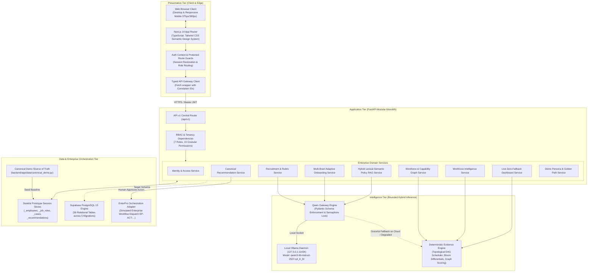
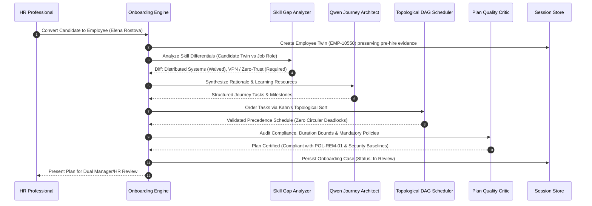
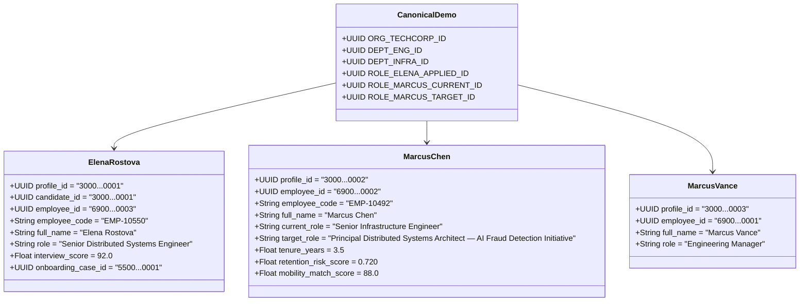
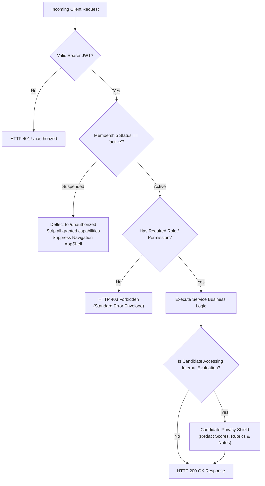

# WorkSense: AI-Assisted Workforce Intelligence and Decision-Support Platform

**Hackathon Track:** Track 1: Human Resources (HR) - Build Bengaluru Hackathon  
**Primary Repository:** [github.com/sharancode3/WorkSense](https://github.com/sharancode3/WorkSense)  
**Documentation Suite:** [`docs/`](./docs/) (Canonical Specifications 01 through 10)  
**Current System Status:** Stages 1 through 11 Fully Verified | 157 Automated Tests Passing | Live Browser Verified

---

## 1. Executive Summary and System Purpose

WorkSense is an enterprise workforce decision intelligence platform designed to replace fragmented human resources silos with a continuous, evidence-grounded operational lifecycle.

Traditional enterprise human resources software suffers from architectural fragmentation:
* Applicant Tracking Systems (ATS) discard rich interview notes and verified candidate artifacts the moment an offer is accepted.
* Human Resource Information Systems (HRIS) store static demographic fields and flat job titles without tracking temporal capability growth or skill currency.
* Conversational HR chatbots produce unverified, hallucinated summaries without citation or organizational grounding.
* Retention models rely on invasive employee surveillance or opaque black-box scoring.

WorkSense addresses this systemic challenge through a single unified continuum:
```text
Candidate Evidence (Resume, Code, Verified Artifacts)
   │
   ▼
Structured Recruitment Evaluation (Taxonomy match & 5-tier observable rubrics)
   │
   ▼
Accountable Human Offer Decision (Mandatory reviewer rationale capture)
   │
   ▼
Idempotent Candidate-to-Employee Twin Conversion (Preserves full lineage)
   │
   ▼
Personalized Adaptive Onboarding (DAG topological schedule & policy enforcement)
   │
   ▼
Living Workforce Twin & Relational Capability Graph (Temporal confidence & adjacency)
   │
   ▼
Ethical Workforce Intelligence (Non-surveillance retention risk & performance synthesis)
   │
   ▼
Canonical Recommendation Engine (Needs Review -> Approved / Rejected state machine)
   │
   ▼
Accountable Human Review Gate (Role-authorized human approval required)
   │
   ▼
Governed EnterPro Enterprise Workflow Dispatch (Auditable execution & correlation ID)
```

### Core Product Thesis
"Understand workforce signals, explain the evidence, recommend an action, and require accountable human approval before any external employment action."

WorkSense is an advisory decision-support platform. It explicitly preserves human agency: AI evaluates evidence and formulates recommendations, but accountable human leaders retain sole authority to execute consequential employment actions.

---

## 2. Technical Stack and Architecture

WorkSense is architected as a modular monolith pairing a typed Next.js presentation layer with a high-performance FastAPI core, backed by PostgreSQL schema migrations and bounded local AI inference.



### Technology Matrix

| Layer | Technology | Version | Purpose in WorkSense |
| :--- | :--- | :--- | :--- |
| **Frontend Framework** | Next.js (App Router) | 14.2.35 | Server and client component rendering across 38 application routes. |
| **Frontend Language** | TypeScript | 5.x | Strict static typing across all UI interfaces, DTOs, and API responses. |
| **Frontend Styling** | Tailwind CSS | 3.4.1 | Custom enterprise design token palette (zero box shadows, restrained borders). |
| **Frontend Testing** | Vitest & React Testing Library | 1.6.1 | Unit, component, routing, and navigation verification across 13 test suites. |
| **Backend Framework** | FastAPI | 0.110+ | High-throughput asynchronous Python web framework providing OpenAPI docs. |
| **Backend Language** | Python | 3.10+ / 3.11+ | Business logic, graph algorithms, schema validation, and test suites. |
| **Data Validation** | Pydantic v2 | 2.6+ | Strict serialization, contract enforcement, and JSON schema extraction. |
| **Backend Testing** | Pytest & pytest-asyncio | 8.4.2 | Async HTTP testing with ASGI transport covering all domain endpoints. |
| **Code Quality** | Flake8 | 7.0+ | PEP 8 linting enforcing clean formatting and unused import prevention. |
| **Primary Database** | PostgreSQL via Supabase | 15.x | Relational DDL migrations defining 56 tables, foreign keys, and indexes. |
| **AI Language Model** | Qwen 3 4B Instruct | Locked GGUF | Bounded structured JSON generation for rubrics, insights, and onboarding narrative. |
| **Local AI Runtime** | Ollama | 0.1.x+ | Local inference daemon isolated behind `Semaphore(1)` concurrency locks. |
| **Enterprise Handoff** | EnterPro Adapter | 1.0 (Demo) | Enterprise workflow adapter capturing payload validation and correlation IDs. |

---

## 3. End-to-End Workforce Lifecycle Architecture

WorkSense implements five distinct capability groups operating in continuous alignment:

```mermaid
flowchart LR
    subgraph StageA["1. Talent Acquisition"]
        direction TB
        REQ["Job Requisition & Taxonomy"]
        RES["Resume Extraction Firewall"]
        SCORE["Deterministic Match Scoring (0-100)"]
        KIT["Structured 5-Tier Interview Rubrics"]
        DEC["Accountable Human Decision Gate"]
        REQ --> RES --> SCORE --> KIT --> DEC
    end

    subgraph StageB["2. Adaptive Onboarding"]
        direction TB
        CONV["Idempotent Twin Conversion"]
        GAP["Bloom Skill Gap Differentials"]
        DAG["Kahn's Topological DAG Scheduler"]
        CRITIC["Plan Quality Policy Critic"]
        APPR["Dual Manager & HR Approval Gate"]
        CONV --> GAP --> DAG --> CRITIC --> APPR
    end

    subgraph StageC["3. Workforce Intelligence"]
        direction TB
        GRAPH["Relational Capability Graph"]
        TENURE["Non-Surveillance Attrition Index"]
        SYNTH["Multilateral Performance Synthesis"]
        MOB["Internal Mobility Matcher (88%)"]
        GRAPH --> TENURE & SYNTH --> MOB
    end

    subgraph StageD["4. Policy-to-Action"]
        direction TB
        CHUNKS["Authoritative Markdown Policies"]
        RAG["Hybrid Lexical-Semantic Search"]
        ABSTAIN["Zero-Hallucination Threshold Gate"]
        CHUNKS --> RAG --> ABSTAIN
    end

    subgraph StageE["5. Governance & Dispatch"]
        direction TB
        REC["Canonical Recommendation Machine"]
        HUMAN["Human Sign-Off & Rationale"]
        EP["EnterPro Workflow Execution"]
        REC --> HUMAN --> EP
    end

    DEC --> CONV
    APPR --> GRAPH
    MOB --> REC
    ABSTAIN --> REC
```



---

## 4. Deep-Dive Subsystem Specifications

### 4.1 Talent Acquisition and Interview Intelligence (Stage 4)
* **Resume Ingestion Firewall:** External resumes undergo security sanitization to neutralize prompt-injection vectors, delimiter manipulation, and hidden instructional text before schema extraction.
* **Deterministic Match Scoring:** Candidates are scored against job requisitions using a transparent, multi-factor algorithm:
  * Direct required skill match weighting (50%)
  * Adjacent graph capability transferability credits (25%)
  * Verified evidence count and artifact recency (15%)
  * Seniority and band alignment (10%)
* **Structured 5-Tier Observable Rubrics:** The system constructs interview kits with questions mapped to target competencies. Each question includes five observable performance tiers (Level 1: Novice through Level 5: Expert) to eliminate interviewer bias.
* **Candidate Privacy Shield:** Candidate self-service views (`/candidate`) strictly redact internal hiring notes, interviewer rubrics, and competitive peer match percentages via role-based response shaping.

### 4.2 Multi-Brain Adaptive Onboarding Operating System (Stage 5)
WorkSense does not generate generic task checklists. It executes a bounded multi-brain onboarding synthesis engine:

* **Kahn's Topological Precedence Scheduler:** Dependencies between IT provisioning, security credentials, and milestone reviews are modeled as a Directed Acyclic Graph (DAG) and sorted topologically, guaranteeing mathematically impossible dependency deadlocks.
* **Plan Quality Critic:** An automated inspection engine validates that mandatory organizational policies (e.g. SOC2 compliance, direct deposit enrollment) are permanently locked into the journey and cannot be waived by AI synthesis.

### 4.3 Grounded HR Policy Reasoning (Stage 6)
* **Authoritative Policy Corpus:** Operates over governed organizational documents (e.g. `POL-REM-01` Remote Work & Flexible Hours Policy).
* **Hybrid Lexical-Semantic Search:** Evaluates query intent using exact code matching, section title indexing, and keyword density with stopword normalization.
* **Zero-Hallucination Abstention Mechanism:** If query similarity falls below the calibrated relevance threshold (0.20), the engine explicitly returns `status: "insufficient_evidence"`, refusing to extrapolate or fabricate policy rules.
* **Source-Grounded Citations:** All accepted answers return direct quotation snippets, document codes, section headers, and policy freshness timestamps.

### 4.4 Ethical Workforce Intelligence and Mobility (Stage 7)
WorkSense explicitly rejects invasive surveillance (no keystroke logging, no webcam analysis, no emotion detection).
* **7A Transparent Attrition Risk Indicators:**
  * Evaluates objective, non-invasive organizational factors: tenure stagnation in band (e.g. Marcus Chen at 3.5 years in L5), unapproved absence rate deviations, and delivery stagnation.
  * Outputs a transparent, bounded risk score (e.g. 0.720) with itemized contributing factors.
* **7B Performance Intelligence:**
  * Multilateral evidence synthesis aggregating quarterly goal milestones, verified skill demonstrations, and multi-tier peer feedback.
  * Produces balanced strengths, development areas, and repeated themes without automated punitive ratings.
* **7C Skill Graph & Internal Mobility:**
  * Maps competencies across organizational nodes with directed edges: `PREREQUISITE_OF`, `ADJACENT_TO`, `TRANSFERABLE_TO`.
  * Identifies adjacent transferability (e.g. Marcus Chen's Kubernetes Level 5 expertise transferring to ML Serving in the AI Fraud Detection initiative at an 88% match).

### 4.5 HR Decision Dashboard with Zero Mock Fallbacks (Stage 8)
* **Real Metric Computation:** Headcounts, attendance rates, onboarding velocity, and recruitment funnels are calculated dynamically from operational data stores.
* **Zero Fabrication:** The average candidate match score derives strictly from active match evaluation records (`recruitment_service._match_evaluations`). If evaluation records are deleted or absent, the metric evaluates to `0.0`.

### 4.6 Canonical Recommendations and EnterPro Dispatch (Stage 9)
* **State Machine:** Governed recommendations transition through strict lifecycle states: `needs_review` -> `approved` / `rejected` -> `dispatched` -> `completed`.
* **Human Approval Gate:** Consequential recommendations require an authenticated human reviewer to submit explicit rationale before approval.
* **EnterPro Enterprise Dispatch:** Generates an enterprise-ready dispatch envelope containing action type, payload parameters, correlation ID (`EP-ACT-...`), and timestamps, simulating idempotent external workflow handoff.

---

## 5. Canonical Demo Personas and Seed Fixtures

The platform includes authoritative, deterministic seed fixtures defined in `backend/app/data/canonical_demo.py`:



### Persona Credential Directory

All demo personas share the standard password: `DemoPassword123!`

| Role | Email | Name | Canonical Function / Primary Route |
| :--- | :--- | :--- | :--- |
| **Administrator** | `admin@techcorp.local` | System Administrator | Tenant administration, user suspension, audit logs (`/admin/access`). |
| **HR Leader** | `hr@techcorp.local` | Sarah Jenkins | HR decision telemetry, retention consoles, recommendations (`/dashboard`). |
| **Manager** | `manager@techcorp.local` | Marcus Vance | Direct report oversight, onboarding review gate (`/manager/onboarding`). |
| **Recruiter** | `recruiter@techcorp.local` | Chloe Bennett | Job openings, resume ranking, structured interview sessions (`/recruiter`). |
| **Candidate** | `candidate@worksense.local` | Elena Rostova | Preboarding applicant portal, interview evaluation status (`/candidate`). |
| **Employee** | `employee@techcorp.local` | Marcus Chen | Employee twin, policy assistant, career mobility matches (`/employee`). |
| **Suspended Account** | `suspended@techcorp.local` | David Wallace | Inactive account deflected to zero-access suspension view (`/unauthorized`). |

---

## 6. Role-Based Access Control and Security Model

WorkSense enforces zero-trust authorization across all API endpoints and frontend views:



### Security and Governance Invariants
1. **Zero Client-Side Trust:** Permissions and tenant organization IDs are extracted server-side from cryptographically signed JWTs (`HS256`).
2. **Account Suspension Quarantine:** When a user is suspended by an administrator, the backend immediately revokes all granted capabilities. Any attempted navigation or API access is deflected to `/unauthorized`.
3. **Tenant Isolation:** Multi-tenant separation guarantees users in `TechCorp` cannot view or query entities in `AcmeCorp`.
4. **Candidate Privacy Shield:** Candidate self-service endpoints reject access to internal scoring rubrics, rejection rationales, or recruiter notes with `HTTP 403 Forbidden`.
5. **Human Primacy:** No AI model has permission to dispatch an EnterPro workflow or modify an employment state.

---

## 7. Verification and Testing Evidence

WorkSense maintains a 100% passing test record across unit, integration, and end-to-end browser test suites.

### Automated Test Summary

```text
================================== TEST RUN SUMMARY ==================================
Backend Tests (Pytest):   94 passed, 0 failed, 6 warnings (100% pass rate)
Frontend Tests (Vitest):   63 passed, 0 failed across 13 test files (100% pass rate)
TypeScript Typecheck:      0 errors (tsc --noEmit clean)
Python Flake8 Linter:      0 errors, 0 warnings (flake8 app tests --max-line-length=130)
Next.js Production Build:  38/38 static and dynamic routes compiled successfully
Total Automated Tests:     157 PASSED
======================================================================================
```

### Regression Test Suite: `test_canonical_truth.py`
To eliminate data drift, [backend/tests/test_canonical_truth.py](file:///c:/SHARAN%20PROJECTS/WorkSense/backend/tests/test_canonical_truth.py) verifies:
1. `test_canonical_demo_constants_consumed_by_services`: Proves all services actively seed and consume `canonical_demo.py` constants.
2. `test_elena_title_identical_across_all_stages`: Asserts Elena's title is strictly `"Senior Distributed Systems Engineer"` across recruitment, onboarding, employee twins, recommendations, and demo APIs.
3. `test_dashboard_score_derives_from_evaluations_and_zeros_when_absent`: Asserts dashboard average match score equals `92.0` when Elena's evaluation is present, and drops strictly to `0.0` when cleared.

---

## 8. Step-by-Step Installation and Runbook

### 8.1 System Prerequisites
* **Operating System:** Windows 11, Linux (Ubuntu 22.04 LTS), or macOS.
* **Node.js:** Node.js 18.x, 20.x, or 24.x LTS (npm 10.x+).
* **Python:** Python 3.10.x or 3.11.x with `pip`.

### 8.2 Backend Setup
```bash
# 1. Enter backend directory
cd backend

# 2. Create and activate virtual environment (optional but recommended)
python -m venv venv
# On Windows:
.\venv\Scripts\activate
# On Linux/macOS:
source venv/bin/activate

# 3. Install backend dependencies
pip install -r requirements.txt

# 4. Execute code style check (0 warnings)
python -m flake8 app tests --max-line-length=130

# 5. Run the full automated backend test suite (94 tests)
python -m pytest tests/ -v

# 6. Start the FastAPI development server on port 8000
python -m uvicorn app.main:create_app --factory --host 127.0.0.1 --port 8000 --reload
```
Backend API will be accessible at:
* API Health Check: `http://localhost:8000/api/v1/health`
* Swagger OpenAPI Docs: `http://localhost:8000/docs`

### 8.3 Frontend Setup
```bash
# 1. Enter frontend directory
cd ../frontend

# 2. Install dependencies
npm install

# 3. Execute TypeScript typecheck (0 errors)
npm run typecheck

# 4. Execute Vitest test suite (63 tests)
npm run test

# 5. Build production bundle (38 routes)
npm run build

# 6. Start the Next.js application on port 3000
npm run dev
```
Frontend web application will be accessible at `http://localhost:3000`.

---

## 9. Live Demonstration Walkthrough: The Golden Paths

For evaluators and hackathon judges, WorkSense provides an automated Demonstration Hub (`/demo`) with two narrative golden paths.

### Golden Path 1: Marcus Chen (Tenure Stagnation to Strategic Mobility)
1. **Sign In:** Log in as HR Leader (`hr@techcorp.local` / `DemoPassword123!`).
2. **Review Attrition Signals:** Navigate to **Workforce Intelligence** (`/workforce/intelligence`):
   * Inspect Stage 7A Attrition Risk: Marcus Chen is flagged in `priority_review` with risk index `0.720`.
   * Transparent factor breakdown cites 3.5 years in band L5 without promotion and strong desire for architectural leadership expressed in peer reviews.
   * View Stage 7C Mobility: The graph matcher surfaces an 88% skill match for the open *Principal Distributed Systems Architect — AI Fraud Detection Initiative* role.
3. **Human Approval:** Navigate to **Recommendations** (`/recommendations`):
   * Select recommendation `80000000-0000-0000-0000-000000000001`.
   * Review the supporting evidence ledger.
   * Click **Review & Approve**, input reviewer rationale, and sign off.
4. **EnterPro Dispatch:** Click **Dispatch to EnterPro**. The system generates dispatch envelope `EP-ACT-...` with correlation tracking and logs the event to the audit trail.

### Golden Path 2: Elena Rostova (Candidate Evidence to Employee Onboarding)
1. **Candidate Assessment:** Log in as Recruiter (`recruiter@techcorp.local` / `DemoPassword123!`).
2. **Review Match Evidence:** Navigate to **Job Openings** -> *Senior Distributed Systems Engineer*:
   * Elena Rostova's resume evaluation displays a 92% match based on verified Raft consensus and high-throughput Python state storage.
   * Complete interview session evaluates responses against 5-tier observable rubrics.
3. **Offer Acceptance:** Recruiter signs off on offer recommendation.
4. **Seamless Twin Continuity:** The system converts Elena from Candidate to Employee (`EMP-10550`), retaining all pre-hire artifacts.
5. **Adaptive Onboarding:** Log in as Manager (`manager@techcorp.local` / `DemoPassword123!`):
   * Navigate to `/manager/onboarding`.
   * Elena's case loads immediately with zero infinite loops.
   * Review the personalized 90-day DAG schedule: introductory distributed systems modules are automatically waived based on pre-verified interview evidence, while corporate Zero-Trust VPN modules are scheduled as mandatory compliance tasks.

---

## 10. Repository Directory Structure

```text
WorkSense/
├── .github/workflows/ci.yml       # Continuous integration build and test pipeline
├── docs/                          # Canonical 10-document system specifications
│   ├── 01-PRD.md                  # Product Requirements Document
│   ├── 02-TRD.md                  # Technical Requirements Document
│   ├── 03-Workflow-Roles.md       # Role matrix, RBAC, and approval gates
│   ├── 04-UI-UX-Design.md         # Semantic design system specifications
│   ├── 05-Database-API.md         # Relational schema and endpoint contracts
│   ├── 06-System-Architecture.md  # Component architecture and trust boundaries
│   ├── 07-AI-ML-Architecture.md   # Qwen integration and deterministic scoring
│   ├── 08-Deployment.md           # Hybrid deployment topologies and fallback rules
│   ├── 09-Project-Memory.md       # Decision log and architecture invariants
│   └── 10-Implementation.md       # Phased implementation verification roadmap
├── supabase/                      # Database migrations and seed fixtures
│   ├── migrations/                # 5 sequential SQL migrations (56 relational tables)
│   └── full_schema_and_seed.sql   # Full PostgreSQL schema with TechCorp seed data
├── backend/                       # FastAPI modular monolith application
│   ├── app/
│   │   ├── api/v1/                # REST endpoints grouped by domain (auth, workforce, etc.)
│   │   ├── core/                  # Configuration, security, logging, error envelopes
│   │   ├── data/
│   │   │   └── canonical_demo.py  # Authoritative source of truth for demo entities
│   │   ├── schemas/               # Pydantic v2 request and response contracts
│   │   └── services/              # Domain business logic and simulated adapters
│   ├── tests/                     # 17 Pytest test suites (94 passing tests)
│   │   └── test_canonical_truth.py# Regression suite for canonical demo truth
│   ├── requirements.txt           # Locked Python dependencies
│   └── pytest.ini                 # Pytest configuration
└── frontend/                      # Next.js 14 App Router presentation layer
    ├── src/
    │   ├── app/                   # 38 application routes (dashboard, manager, etc.)
    │   ├── components/            # Reusable UI primitives, AppShell, and navigation
    │   ├── context/               # AuthContext and session restoration
    │   ├── lib/api/               # Typed API client modules matching backend routes
    │   ├── styles/                # Tailwind semantic design tokens (globals.css)
    │   └── types/                 # TypeScript interfaces and DTOs
    ├── tests/                     # 13 Vitest test suites (63 passing tests)
    ├── package.json               # Frontend dependencies and scripts
    └── tsconfig.json              # Strict TypeScript configuration
```

---

## 11. Ethical Commitments and Prototype Disclosures

1. **Augmentation Over Automation:** WorkSense assists human decision-makers; it never replaces them. All consequential employment actions require authenticated human sign-off.
2. **Surveillance Prohibited:** WorkSense strictly forbids keystroke logging, webcam sentiment tracking, eye tracking, or private message scraping.
3. **Session Store Reality:** In the current prototype milestone, recommendation state and governance records are maintained in high-speed, stateful in-memory stores initialized from canonical fixtures (`canonical_demo.py`). They are not yet stored in a write-once distributed blockchain.
4. **Honest AI State:** When running in cloud demonstration environments where a local GPU Ollama instance is unreachable, WorkSense honestly states in the UI and health probe that deterministic evidence engine fallback is active, with zero simulated or fake model outputs.
