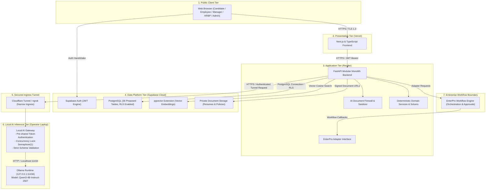

# WorkSense: AI-Assisted Workforce Intelligence and Decision-Support Platform

**Hackathon Track:** Track 1: Human Resources (HR) — Build Bengaluru Hackathon  
**Primary Repository:** [github.com/sharancode3/WorkSense](https://github.com/sharancode3/WorkSense)  
**Documentation Suite:** [`docs/`](./docs/) (Canonical Specifications 01 through 09)  
**Current Repository Status:** Authoritative Architectural Specification Suite Complete | Application Implementation Pending (Stage 1+)

---

## 1. Executive Overview

WorkSense is an enterprise AI-assisted workforce intelligence and decision-support platform designed to connect fragmented employee-lifecycle data into an evidence-backed workforce intelligence layer.

Historically, enterprise human resources technology has operated in disconnected silos: keyword-matching applicant tracking systems (ATS), static human resource information systems (HRIS), ungrounded conversational chatbots, and disjointed spreadsheet models. WorkSense resolves this fragmentation by establishing an operational continuum anchored to five core innovations:

1. **Temporal Workforce Digital Twin:** Candidate evidence seamlessly transitions into an Employee Twin upon hiring, preserving interview notes, rubric assessments, and verified artifacts rather than discarding them at the hiring boundary.
2. **Organizational Skill and Capability Graph:** A directed relational capability graph modeling competencies, prerequisite dependencies, adjacent skill transferability, and time-decaying confidence based on validated real-world practice.
3. **Candidate Twin to Employee Twin Continuity:** Continuous progression from candidate application, structured interview, and hiring decision through adaptive onboarding, performance goals, attendance aggregates, and retention interventions.
4. **Evidence-Backed Decision History:** An append-oriented audit and evidence history capturing actor, timestamp, source, decision, approval, and outcome references across the full lifecycle.
5. **Cross-Module Recommendations and Governed Workflows:** Coordinated decision-support across talent acquisition, onboarding, policy reasoning, retention, and workforce planning, with consequential actions routed through human approvals and enterprise orchestration.

```text
=============================================================================================
LOCKED ONE-SENTENCE PRODUCT BRIEF:
WorkSense is a role-aware, evidence-first workforce decision and action platform whose living
Candidate and Employee Twins and temporal Skill/Capability Graph connect recruitment,
interviewing, onboarding, growth, retention, policy reasoning, and workforce planning; Qwen
provides bounded reasoning and explanation, specialized components perform calculations,
Supabase provides the secure prototype data layer, and EnterPro converts human-approved
recommendations into auditable enterprise workflows.
=============================================================================================
```

> **Important Product Identity:**  
> WorkSense is an AI-assisted workforce intelligence and decision-support platform. It is **not** an HR chatbot and must never be presented as one. WorkSense augments human decision-making; it does not replace accountable human decision-makers.

---

## 2. Official Problem Statement Alignment

WorkSense is purpose-built to address the official hackathon challenge for **Track 1: Human Resources (HR)**:

### Official Track 1 Problem Statement
> **Problem Statement:**  
> Build an AI-driven intelligent workforce management platform that can understand employee data, automate HR workflows, identify workforce risks, and assist HR teams in making data-driven decisions across the employee lifecycle.
>
> **What participants can build:**  
> * **AI Recruitment Intelligence Engine** that ranks candidates using resumes, job requirements, and skill relevance.  
> * **Adaptive Onboarding Agent** that creates personalized onboarding journeys based on role, department, and employee profile.  
> * **HR Policy Reasoning Agent** that answers complex policy queries with contextual and source-backed responses.  
> * **Employee Attrition Prediction System** that identifies employees at risk of leaving using workforce patterns and engagement signals.  
> * **AI Performance Intelligence** that analyzes goals, feedback, and performance history to identify strengths and improvement areas.  
> * **Workforce Skill Graph** that maps employee skills against current and future organizational requirements.  
> * **Intelligent Interview Agent** that generates role-specific questions, evaluates responses, and creates structured interview insights.  
> * **HR Decision Dashboard** that combines recruitment, attendance, performance, and workforce data into actionable insights.  
>
> **Challenge:**  
> Teams should focus on creating a system that can reason over multiple HR data sources and recommend actions, rather than building a simple HR chatbot.  
>
> **Mandatory track technologies:**  
> * **Qwen** must be used as the AI engine for reasoning, content generation, and decision support.  
> * **EnterPro** must be represented as the enterprise workflow, orchestration, approval, and application-deployment component.

### Distinction Between Challenge and WorkSense Solution
The official challenge specifies the eight functional areas and mandatory technologies. WorkSense addresses this challenge by organizing these capabilities into a unified architecture centered on the **Temporal Workforce Digital Twin**, the **Organizational Skill Graph**, and **Candidate-to-Employee Continuity**, rather than eight disconnected point solutions.

---

## 3. Honest Current Repository Status

The current repository state is documented transparently in accordance with the project truth-status system:

| Domain | Current Repository Reality | Truth Status |
| :--- | :--- | :--- |
| **Documentation & Specifications** | Complete 9-document canonical specification suite under `docs/` covering PRD, TRD, Workflows, UI/UX, Database/API, System Architecture, AI/ML Architecture, Deployment, and Project Memory. | **Verified in repository** |
| **Application Code (Frontend)** | Next.js and TypeScript frontend application structure is designed in specifications; source code files are pending development. | **Prototype proposal** |
| **Application Code (Backend)** | FastAPI modular monolith backend is architecturally specified; Python source code files are pending development. | **Prototype proposal** |
| **Database Migrations** | Proposed 36 core relational tables across 16 domains specified in `docs/05-Database-API.md`; physical SQL migration scripts pending creation. | **Prototype proposal** |
| **Local AI Gateway** | Architectural specification and security requirements defined; implementation script pending creation. | **Prototype proposal** |
| **EnterPro Integration** | Adapter-interface design specified; physical integration endpoints and credentials marked TBD pending official hackathon documentation. | **TBD / Prototype proposal** |
| **Automated Test Suites** | Test plans and acceptance criteria documented; executable test files pending implementation. | **Prototype proposal** |

> **Repository Note:**  
> This repository currently contains the authoritative architectural specifications and design documentation. No application source code has been fabricated. Installation, seeding, migration, and run commands described below represent the **target engineering runbook** to be executed as codebase files are implemented in Stage 1+.

---

## 4. Core Conceptual Foundation

### 4.1 The Continuous Candidate-to-Employee Twin
Traditional enterprise tooling treats recruitment and employee management as disconnected systems. WorkSense models human capital as an evolving, stateful continuum:

```text
Candidate Evidence (Resume, Portfolio, GitHub PRs)
   │
   ▼
Candidate Skill Profile (Extracted skills, normalized proficiencies)
   │
   ▼
Recruitment Ranking & Interview Insights (Structured rubrics, adaptive probes)
   │
   ▼
Hiring Decision (Human Recruiter / Hiring Manager sign-off via EnterPro)
   │
   ▼
Employee Profile & Living Twin (Continuous retention of pre-hire evidence)
   │
   ▼
Adaptive Onboarding Journey (Pre-verified skills automatically waive redundant modules)
   │
   ▼
Operational Evidence Stream (Goals, feedback, attendance aggregates, project deliverables)
   │
   ▼
Workforce Risk & Growth Recommendations (Retention risk, upskilling, internal mobility)
   │
   ▼
Human-Approved Enterprise Action (Role-authorized human approval)
   │
   ▼
EnterPro Governed Workflow Execution & Recorded Outcome (Append-oriented audit trail)
```

### 4.2 The Temporal Organizational Capability Graph
Capabilities are modeled as a directed relational graph in PostgreSQL:
* **Ontological Edges:** Relationships include `PREREQUISITE_OF`, `ADJACENT_TO`, `TRANSFERABLE_TO`, and `EVIDENCED_BY`.
* **Adjacent Capability Crediting:** Candidates demonstrating mastery in an adjacent technology (e.g., Triton) receive proportional partial credit toward a target requirement (e.g., CUDA) based on graph relationship weights.
* **Temporal Confidence Decay:** Skill confidence decays over time without verified operational practice:
  $$\text{Confidence}(t) = \text{Proficiency} \times e^{-\lambda \cdot \Delta t} \times \text{Validation Multiplier}$$
  *(Decay parameter $\lambda$ and half-life intervals are configurable prototype assumptions).*

### 4.3 Append-Oriented Evidence and Audit History
Every proficiency inference, milestone delivery, and human decision links to verified evidence references:
* **Artifact Provenance:** Pull request references, project milestones, peer feedback, and assessment transcripts record source type, external reference, validator ID, and timestamp.
* **Zero Score Fabrication:** Explanations citing artifacts reference specific database records.
* **Auditability:** State changes, approvals, and model prompts log actor, timestamp, delta, and source references. *(Advanced features such as cryptographic hash chaining or legal non-repudiation represent future roadmap enhancements).*

---

## 5. Connected Capability Groups

The WorkSense platform organizes the hackathon problem statement into five connected capability groups:

```mermaid
flowchart LR
    subgraph G1["1. Talent Intelligence"]
        direction TB
        CAND["Candidate Twin & Evidence"]
        RANK["Transparent Prototype Scoring"]
        INT["Intelligent Interview Agent"]
    end

    subgraph G2["2. Workforce Twin & Skill Graph"]
        direction TB
        TWIN["Candidate-to-Employee Continuity"]
        GRAPH["Relational Capability Graph"]
        DECAY["Temporal Skill Confidence"]
    end

    subgraph G3["3. Growth & Retention Intelligence"]
        direction TB
        ONB["Adaptive Onboarding Agent"]
        PERF["AI Performance Intelligence"]
        RET["Retention & Mobility Support"]
    end

    subgraph G4["4. Policy-to-Action"]
        direction TB
        RAG["HR Policy Reasoning (RAG)"]
        RULES["Deterministic Eligibility Rules"]
        ACT["Action Recommendation"]
    end

    subgraph G5["5. Decision Dashboard & Simulator"]
        direction TB
        DASH["HR Decision Dashboard"]
        SIM["Workforce Planning Simulator"]
        WF["EnterPro Workflow Handoff"]
    end

    G1 --> G2
    G2 --> G3
    G2 --> G4
    G3 & G4 --> G5

```



### 5.1 Talent Intelligence
* **Resume & Evidence Ingestion:** Extracts structured biographical, skill, and project evidence from candidate resumes.
* **Transparent Candidate Scoring:** The prototype calculates candidate fit using transparent weighted matching across required skills, adjacent capability graph credits, verified evidence count, and experience recency. A full Learning-to-Rank ML pipeline is designated as a production roadmap upgrade when labeled historical hiring data becomes available.
* **Intelligent Interview Agent:** Formulates role-specific questions and evidence-based evaluation rubrics. Identifies competency evidence gaps to generate bounded adaptive follow-up probes for human interviewer review.

### 5.2 Workforce Twin and Skill Graph
* **Living Workforce Twin:** Retains verified pre-hire evidence and continuously incorporates post-hire deliverables, peer endorsements, and completed milestones.
* **Relational Skill Graph:** Maps organizational capabilities, prerequisites, and transferability pathways using PostgreSQL relational tables.
* **Dynamic Temporal Confidence:** Reflects competency currency by adjusting confidence scores based on elapsed time since last verified demonstration.

### 5.3 Growth and Retention Intelligence
* **Adaptive Onboarding Agent:** Formulates personalized 30/60/90-day onboarding journeys by checking profile, role, department, and pre-verified candidate evidence, waiving modules where competency has already been demonstrated.
* **AI Performance Intelligence:** Analyzes objective goals, structured peer feedback, and historical reviews to summarize strengths and development areas without invasive monitoring.
* **Retention Intelligence:** For the prototype, voluntary departure risk is evaluated via transparent risk-factor scoring or precomputed demonstration data. Advanced longitudinal survival analysis (e.g., Cox Proportional Hazards or Random Survival Forests) is specified as a proposed post-hackathon capability. All retention signals are advisory decision-support for HR Business Partners, never deterministic classifications.

### 5.4 Policy-to-Action Intelligence
* **Grounded Policy Reasoning (RAG):** Retrieves authoritative policy chunks using vector similarity search pre-filtered by organization ID, and provides grounded answers with source citations (document, section, freshness).
* **Deterministic Eligibility Rules:** Python rules evaluate service tenure, probation status, and threshold limits before suggesting actions.
* **Escalation & Exception Handling:** When evidence is conflicting, absent, or policy limits are exceeded, the system abstains and generates an approval exception request.

### 5.5 HR Decision Dashboard and Workforce Simulator
* **HR Decision Dashboard:** Consolidates recruitment velocity, onboarding progression, skill distribution, attendance aggregates, and retention signals into role-specific views. Attendance remains a limited operational input, not a full payroll/timekeeping system.
* **Workforce Planning Simulator:** Models headcount staffing scenarios (internal transfers, upskilling, external hiring) under budget and timeline constraints. (Google OR-Tools CP-SAT optimization is proposed for constrained mathematical allocation).
* **EnterPro Workflow Handoff:** Translates approved recommendations into enterprise workflow requests for formal organizational orchestration.

---

## 6. Heterogeneous Intelligence Division of Labor

WorkSense adheres to a strict division of computational responsibility. Qwen is not the entire AI system and is never used as an uncalibrated calculator:

| Functional Area | Computational Mechanism | Qwen Language Model Responsibility | Human Decision Authority | Governed Enterprise Action |
| :--- | :--- | :--- | :--- | :--- |
| **Candidate Scoring** | Transparent weighted scoring / Graph matching (Proposed: Learning-to-Rank) | Synthesizes grounded comparison citing verified resume facts | Lead Recruiter | None (Advisory only) |
| **Interview Probing** | Competency gap identification heuristic | Formulates role-specific probe question text | Technical Interviewer | Rubric sign-off |
| **Hiring Offer** | None (Human employment decision) | Strictly Prohibited | Hiring Manager / Dept Lead | EnterPro Offer Issuance |
| **Skill Confidence** | Deterministic temporal decay function | Strictly Prohibited | Direct Manager | Capability validation |
| **Policy Retrieval** | pgvector cosine similarity search + deterministic rules | Formulates grounded explanation citing section references | Department Lead | EnterPro Policy Exception |
| **Retention Risk** | Deterministic risk factor scoring / Precomputed demo data (Proposed: Survival Analysis) | Summarizes contributing factors and internal mobility options | HR Business Partner Only | EnterPro Mobility Transfer |
| **Workforce Allocation**| Constrained headcount solver (Proposed: OR-Tools CP-SAT) | Synthesizes narrative tradeoff comparison across scenarios | Executive Leadership | EnterPro Plan Provisioning |

---

## 7. Hybrid Cloud-Edge Deployment Architecture

The WorkSense demonstration architecture is engineered for realistic hackathon constraints:



### Critical Architectural Distinctions
* **Application Backend:** Deployed to **Render** as a cloud web service. It is **not** hosted on the local laptop.
* **Database & Storage:** Hosted on **Supabase** (managed cloud). It is **not** an offline local database.
* **Local Ingress Tunnel:** Exposes **only** the local AI Gateway running on the operator laptop to allow the Render backend to reach the local Qwen runtime during the live demonstration.
* **EnterPro Boundary:** Represented via an adapter interface. Technical webhook contracts, headers, and signatures remain **TBD** pending official hackathon integration documentation.

---

## 8. Role-Based Access and Governance

WorkSense implements seven coherent user roles with strict separation of duties and minimum necessary access:

| Role | Primary Responsibilities | Data Access Boundaries |
| :--- | :--- | :--- |
| **Candidate** | Submit application, upload resume, complete structured interview. | Own application and profile only. Strictly no access to internal rubrics, candidate rankings, or employee records. |
| **Employee** | View living Workforce Twin, complete onboarding tasks, query policy RAG, explore career growth. | Own profile, own evidence, own onboarding plan, public department policies. No access to peer retention scores or private feedback. |
| **Manager** | Review team capabilities, endorse skill evidence, conduct interviews, approve standard requests. | Direct reports and assigned candidate interview rubrics only. No access to individual retention risk scores. |
| **Recruiter** | Manage requisitions, review candidate ranking insights, schedule structured interviews. | Requisitions, applicant pipelines, interview evaluations. No access to full employee performance histories or attrition risk. |
| **HR Professional (HRBP)** | Review retention risk alerts, manage mobility interventions, audit onboarding blockers, resolve policy exceptions. | Full employee workforce context, retention risk consoles, mobility workflows, cross-department policy exceptions. |
| **HR / Org Leadership** | Strategic workforce simulation, scenario planning, macro headcount optimization, organization-wide analytics. | Aggregated organizational analytics, scenario models, budget allocations. Small-cohort suppression protects individual privacy. |
| **Platform Administrator** | Manage tenant configurations, system roles, integration settings, inspect audit event logs. | Administrative consoles, audit logs, model execution traces. No arbitrary modification of historical evidence without audit events. |

---

## 9. Security, Privacy, and Responsible AI Principles

1. **Human Primacy:** AI produces advisory decision-support. All consequential employment actions (hiring offers, promotions, role transfers, compensation adjustments, formal performance ratings) require authenticated human sign-off.
2. **Zero Employee Surveillance:** The platform strictly prohibits webcam video monitoring, eye tracking, emotion recognition, facial analysis, vocal stress analysis, keystroke logging, or private chat scraping.
3. **Layered Prompt Injection Risk Reduction:** Resumes and external documents are treated as untrusted data. External text is sanitized, stripped of instruction formatting, wrapped in boundary tags, parsed with strict Pydantic schemas, and restricted to allowlisted tool calls. Residual risk is mitigated by enforcing authorization and human approval outside the model.
4. **Demographic Blindness:** Candidate scoring, interview evaluation, and workforce models exclude protected demographic attributes (race, gender, age, religion, marital status, disability status).
5. **Calibrated Policy Abstention:** When policy documentation is ambiguous, contradictory, or absent, the system explicitly abstains (`abstained: true`), provides available sources, and routes the inquiry to an HR professional.
6. **Data Minimization & Isolation:** Multi-tenant PostgreSQL Row-Level Security ensures strict organization-level isolation. Sensitive tables (such as retention risk assessments) are restricted to authorized HR Business Partners.

---

## 10. Canonical Specification Suite

The complete engineering foundation of WorkSense is defined across nine canonical documents:

| Document | Canonical Path | Primary Content & Scope |
| :--- | :--- | :--- |
| **01-PRD** | [`docs/01-PRD.md`](./docs/01-PRD.md) | Product Requirements Document: problem statement, personas, 5 capability groups, functional/non-functional requirements, non-goals, and prototype success criteria. |
| **02-TRD** | [`docs/02-TRD.md`](./docs/02-TRD.md) | Technical Requirements Document: technical stack boundaries, architectural constraints, component interfaces, RFC 2119 requirements, and technical risk mitigations. |
| **03-Workflow-Roles** | [`docs/03-Workflow-Roles.md`](./docs/03-Workflow-Roles.md) | Workflows & Roles: 7 user roles, RBAC/ABAC permissions matrix, end-to-end lifecycle workflows, human approval gates, and EnterPro handoff points. |
| **04-UI-UX-Design** | [`docs/04-UI-UX-Design.md`](./docs/04-UI-UX-Design.md) | UI/UX & Visual Design: enterprise design tokens (deep blue, restrained lime), navigation, layout contracts, WHAT-WHY-EVIDENCE presentation, and accessible state handling. |
| **05-Database-API** | [`docs/05-Database-API.md`](./docs/05-Database-API.md) | Database & API Specification: proposed 36 relational tables across 16 domains, 54 REST endpoint contracts, pgvector schema, and Supabase RLS expectations. |
| **06-System-Architecture** | [`docs/06-System-Architecture.md`](./docs/06-System-Architecture.md) | System Architecture: logical modular monolith, runtime flows, trust boundaries, event handling, AI document firewall, and EnterPro adapter boundary. |
| **07-AI-ML-Architecture** | [`docs/07-AI-ML-Architecture.md`](./docs/07-AI-ML-Architecture.md) | AI & ML Architecture: Qwen text-first role, prompt structures, RAG retrieval pipeline, transparent candidate scoring, retention modeling roadmap, and evaluation frameworks. |
| **08-Deployment-Architecture** | [`docs/08-Deployment-Architecture.md`](./docs/08-Deployment-Architecture.md) | Deployment Architecture: hybrid Vercel/Render/Supabase/local-Qwen topology, secure tunnel setup, local development vs. demo rehearsal, and degraded fallback modes. |
| **09-Project-Memory** | [`docs/09-Project-Memory.md`](./docs/09-Project-Memory.md) | Project Memory: master continuity document, locked decisions, open TBD decisions, truth-status rules, and operational guidelines for future agents. |

---

## 11. Flagship Presentation Narrative (Demo Seed Data)

For demonstration purposes, WorkSense showcases a coherent end-to-end operational journey: **The 90-Day AI Fraud Team Initiative**. 

> **Truth Status Notice:**  
> All candidate names, scores, hazard percentages, and metrics referenced below are **fictional demonstration seed data** created to validate prototype user flows during presentation. They do not represent real employee measurements or validated ML benchmarks.

1. **Strategic Mandate:** Executive Leadership opens the Workforce Decision Dashboard facing a strategic priority: form an 8-person cross-functional AI Fraud Detection team within 90 days under budget constraints.
2. **Staffing Scenario Evaluation:** The Workforce Simulator compares internal mobility, upskilling, and external hiring options, identifying a balanced strategy (3 internal transfers, 3 upskilled members, 2 external hires).
3. **Retention Risk Discovery (Demo Seed):** The simulation surfaces a retention alert for **Marcus Chen** (Senior Infrastructure Engineer), flagged with an elevated 6-month departure risk due to role stagnation in his current band.
4. **Internal Mobility Intervention:** Rather than risking turnover, WorkSense identifies that Marcus's distributed systems skills make him an ideal lead for the new AI Fraud Team infrastructure. The HRBP reviews the case and initiates an internal transfer request via EnterPro.
5. **External Candidate Screening (Demo Seed):** To fill the external Staff ML Engineer opening, the recruiter reviews candidate rankings. **Sarah Lin** ranks #1 based on verified PyTorch and Triton experience, with Triton credited toward CUDA adjacency.
6. **Structured Adaptive Interview:** Sarah completes a structured competency interview. Qwen detects an evidence gap in caching resiliency and formulates an adaptive follow-up probe for interviewer sign-off.
7. **Twin Continuity & Adaptive Onboarding:** Upon offer acceptance, Sarah's Candidate Twin seamlessly transitions into an Employee Twin. Pre-verified technical proficiencies automatically waive introductory modules in her 30/60/90-day onboarding journey.
8. **Policy-to-Action Exception:** An employee queries remote work eligibility under new jurisdiction guidelines. The Policy Reasoning agent retrieves relevant clauses, checks tenure rules, and prepares an exception request for manager approval.
9. **Auditable Outcome:** Every step of the journey records an append-oriented audit record capturing the evidence, human approval, and workflow execution.

---

## 12. Target Engineering Runbook (Implementation Blueprint)

The following procedures describe the target execution workflow once application code is implemented in subsequent stages.

### 12.1 Target Prerequisites
* **Operating System:** Windows 11 / Linux (Ubuntu 22.04 LTS) / macOS (Apple Silicon).
* **Python Runtime:** Python 3.11.x (with `pip` and `virtualenv`).
* **Node.js Runtime:** Node.js 20.x LTS (with `npm 10.x`).
* **AI Runtime:** Ollama CLI with `qwen3:4b-instruct-2507-q4_K_M`.
* **Tunnel Utility:** Cloudflare `cloudflared` (or `ngrok`) for exposing local AI gateway during demo.
* **Cloud Services:** Vercel account, Render account, Supabase project with PostgreSQL 15+ and pgvector.

### 12.2 Target Startup Sequence (Proposed)
```bash
# 1. Local AI Engine (Operator Laptop)
ollama run qwen3:4b-instruct-2507-q4_K_M

# 2. Local AI Gateway (Shield microservice on port 8001)
python -m backend.gateway.local_ai_gateway --port 8001

# 3. Secure Ingress Tunnel (Exposes port 8001 to Render backend)
cloudflared tunnel --url http://localhost:8001

# 4. FastAPI Backend Application (Local dev or Render web service)
cd backend
python -m venv venv && source venv/bin/activate  # Or .\\venv\\Scripts\\Activate.ps1
pip install -r requirements.txt
uvicorn main:app --reload --port 8000

# 5. Next.js Frontend Application (Local dev or Vercel edge)
cd frontend
npm install
npm run dev
```

---

## 13. Proposed Repository Layout

```text
WorkSense/
|-- .gitignore                             Exclusion rules for builds, envs, and secrets
|-- README.md                              Authoritative project entry point and overview
|-- docs/                                  Canonical 9-document specification suite
|   |-- 01-PRD.md                          Product Requirements Document
|   |-- 02-TRD.md                          Technical Requirements Document
|   |-- 03-Workflow-Roles.md               Workflows, Roles & Permissions
|   |-- 04-UI-UX-Design.md                 UI/UX & Visual Design Specification
|   |-- 05-Database-API.md                 Database & API Specification (36 Tables, 54 Endpoints)
|   |-- 06-System-Architecture.md          System Architecture Document
|   |-- 07-AI-ML-Architecture.md           AI & Machine Learning Architecture
|   |-- 08-Deployment-Architecture.md      Deployment Architecture & Runbook
|   `-- 09-Project-Memory.md               Project Memory & Continuity Document
|-- backend/                               [Target Implementation - Stage 1+]
|   |-- api/v1/                            Domain REST routers
|   |-- core/                              Security, config, middleware, database session
|   |-- services/                          Domain business logic engines
|   |-- database/migrations/               Supabase PostgreSQL DDL migration scripts
|   |-- gateway/local_ai_gateway.py        Authenticated Ollama shield microservice
|   `-- main.py                            FastAPI application entry point
`-- frontend/                              [Target Implementation - Stage 1+]
    |-- app/                               Next.js App Router layouts, pages, and routes
    |-- components/                        Design-system conforming UI components
    `-- lib/                               API clients, auth hooks, state stores
```

---

## 14. Governance and Ethical Standards

* **Augmentation, Not Automation:** WorkSense explicitly preserves human agency. AI systems evaluate evidence and generate recommendations; accountable human professionals make all employment decisions.
* **Non-Surveillance Commitment:** WorkSense rejects invasive behavioral surveillance. Competencies and risks are evaluated through validated operational outcomes, peer endorsements, and transparent indicators.
* **Demonstration Transparency:** Built for the HackDriven *Build Bengaluru* Hackathon. All synthetic personnel records, evaluation scores, and company policies are fictional constructs created for prototype demonstration.
