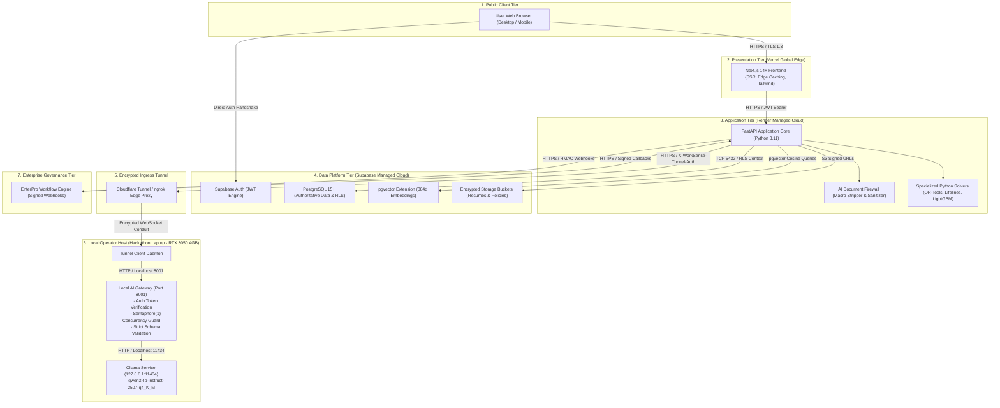

# WorkSense: Role-Aware Workforce Decision and Action Platform

**Hackathon:** HackDriven *Build Bengaluru* Hackathon — Track 1: Human Resources (HR)  
**Primary Repository:** [github.com/sharancode3/WorkSense](https://github.com/sharancode3/WorkSense)  
**Documentation Suite:** [`docs/`](./docs/) (Specifications 01 through 09)  
**Status:** Architecture Baseline Approved | Implementation Ready  

---

## Table of Contents

- [1. Executive Overview](#1-executive-overview)
- [2. The Architectural Imperative: Beyond Monolithic LLMs](#2-the-architectural-imperative-beyond-monolithic-llms)
- [3. Core Conceptual Foundation](#3-core-conceptual-foundation)
  - [3.1 The Living Workforce Digital Twin](#31-the-living-workforce-digital-twin)
  - [3.2 The Temporal Organizational Capability Graph](#32-the-temporal-organizational-capability-graph)
  - [3.3 The Cryptographic Evidence Ledger](#33-the-cryptographic-evidence-ledger)
- [4. The Five Connected Intelligence Systems](#4-the-five-connected-intelligence-systems)
  - [4.1 Talent Intelligence Engine](#41-talent-intelligence-engine)
  - [4.2 Workforce Twin and Skill Graph Engine](#42-workforce-twin-and-skill-graph-engine)
  - [4.3 Growth and Retention Intelligence Engine](#43-growth-and-retention-intelligence-engine)
  - [4.4 Policy-to-Action Intelligence Engine](#44-policy-to-action-intelligence-engine)
  - [4.5 Workforce Decision Simulator](#45-workforce-decision-simulator)
- [5. Heterogeneous Intelligence Division of Labor](#5-heterogeneous-intelligence-division-of-labor)
- [6. Hybrid Cloud-Edge Deployment Topology](#6-hybrid-cloud-edge-deployment-topology)
  - [6.1 Presentation Tier (Vercel)](#61-presentation-tier-vercel)
  - [6.2 Orchestration and Application Tier (Render)](#62-orchestration-and-application-tier-render)
  - [6.3 Data Platform Tier (Supabase)](#63-data-platform-tier-supabase)
  - [6.4 Local Edge AI Inference Tier (Hackathon Laptop)](#64-local-edge-ai-inference-tier-hackathon-laptop)
  - [6.5 Ingress Tunnel and Gateway Shield](#65-ingress-tunnel-and-gateway-shield)
  - [6.6 Enterprise Governance (EnterPro)](#66-enterprise-governance-enterpro)
- [7. Operational Robustness and Degraded Fallback Modes](#7-operational-robustness-and-degraded-fallback-modes)
- [8. Security, Privacy, and Ethical AI Governance](#8-security-privacy-and-ethical-ai-governance)
- [9. Canonical Specification Suite](#9-canonical-specification-suite)
- [10. UI/UX Design System and Screen Contracts](#10-uiux-design-system-and-screen-contracts)
- [11. Flagship Presentation Narrative: The 90-Day AI Fraud Team](#11-flagship-presentation-narrative-the-90-day-ai-fraud-team)
- [12. Local Development and Operational Runbook](#12-local-development-and-operational-runbook)
  - [12.1 Environment Prerequisites](#121-environment-prerequisites)
  - [12.2 Startup Sequence](#122-startup-sequence)
  - [12.3 Pre-Demo Verification Commands](#123-pre-demo-verification-commands)
- [13. Repository Layout](#13-repository-layout)
- [14. Governance and Compliance Mandates](#14-governance-and-compliance-mandates)

---

## 1. Executive Overview

WorkSense is an enterprise workforce decision intelligence and action platform designed to connect talent acquisition, structured interviewing, personalized onboarding, internal talent mobility, longitudinal retention modeling, source-grounded policy reasoning, and strategic workforce optimization into a unified operational continuum.

Historically, enterprise human resources technology has been fractured into disconnected silos: keyword-matching applicant tracking systems (ATS), static human resource information systems (HRIS), ungrounded conversational chatbots, and disconnected spreadsheet models. WorkSense resolves this fragmentation by anchoring the entire employee lifecycle to two persistent, mathematically grounded constructs:

1. **The Continuous Workforce Digital Twin:** Every applicant enters as a Candidate Twin. Upon hire, this entity seamlessly evolves into an Employee Twin, retaining verified screening evidence, interview transcripts, and rubric evaluations rather than discarding them.
2. **The Temporal Organizational Capability Graph:** A directed relational capability graph that tracks competencies, prerequisite relationships, skill adjacencies, and dynamic temporal confidence decay based on verified real-world demonstration.

Natural language understanding, explanation synthesis, and bounded tool orchestration are powered by a locally hosted **Qwen3-4B-Instruct** model. Formal enterprise actions (such as offer issuance, policy exception approvals, and internal mobility transfers) are governed by **EnterPro** signed workflows with strict human-in-the-loop authorization.

```text
=============================================================================================
LOCKED ONE-SENTENCE PRODUCT BRIEF:
WorkSense is a role-aware, evidence-first workforce decision and action platform whose living
Candidate and Employee Twins and temporal Skill/Capability Graph connect recruitment,
interviewing, onboarding, growth, retention, policy reasoning, and workforce planning; Qwen
provides bounded reasoning and explanation, specialized components perform calculations,
Supabase provides the secure prototype data layer, and EnterPro converts human-approved
recommendations into auditable enterprise workflows.
=============================================================================================
```

---

## 2. The Architectural Imperative: Beyond Monolithic LLMs

Modern enterprise software frequently succumbs to the anti-pattern of treating a single Large Language Model (LLM) as an omniscient black box tasked with calculation, ranking, prediction, optimization, and policy enforcement. In consequential human resources environments, this results in non-deterministic hallucinations, uncalibrated risk projections, algorithmic bias, and legal liability.

WorkSense operates on a strict foundational principle:

```text
Qwen is not the entire AI system.
```

The platform establishes an uncompromising division of labor across specialized computational engines:

* **Natural-Language Reasoning and Synthesis:** Governed by local **Qwen3-4B-Instruct** (`qwen3:4b-instruct-2507-q4_K_M`) via Ollama. Qwen parses user intent, synthesizes explanations citing concrete evidence, structures adaptive interview probes, and compares workforce plans. Qwen is strictly prohibited from inventing numerical scores, computing attrition probabilities, or solving optimization matrices.
* **Candidate Match Scoring:** Governed by **LightGBM Multi-Feature Learning-to-Rank** (with an auditable deterministic weighted formula fallback for prototype data scarcity) evaluating 12 objective features including adjacent skill credits and verified production artifacts.
* **Longitudinal Retention Hazard Modeling:** Governed by **Continuous Time-to-Event Survival Analysis** (Cox Proportional Hazards and Random Survival Forests), modeling voluntary attrition across 3-month, 6-month, and 12-month horizons while handling right-censored employee records.
* **Predictive Explainability:** Governed by **TreeSHAP** (SHapley Additive exPlanations), quantifying exact contributing risk drivers and protective organizational factors without asserting unverified causal claims.
* **Strategic Workforce Allocation:** Governed by **Google OR-Tools CP-SAT**, executing mixed-integer linear programming to optimize internal transfers, upskilling paths, and external hiring against hard budget ceilings, deadlines, and operational disruption limits.
* **Policy Reasoning:** Governed by a dual-engine architecture: **`pgvector`** executes 384-dimensional cosine semantic retrieval, while an in-process **Deterministic Python Rules Engine** validates jurisdictional eligibility and probation constraints before Qwen formats the explanation.
* **Enterprise Execution:** Governed by **EnterPro**, managing an auditable 10-state lifecycle with HMAC SHA-256 signed REST callbacks.
* **Human Primacy:** Consequential employment decisions (offers, terminations, transfers, formal performance ratings) remain strictly reserved for authorized human operators.

---

## 3. Core Conceptual Foundation

### 3.1 The Living Workforce Digital Twin

Rather than treating employee data as static table rows, WorkSense maintains an evolving, stateful digital model of individual human capital:
* **Continuous Candidate-to-Employee Transition:** When a candidate is hired, their Candidate Twin (consisting of parsed resume artifacts, extracted skills, verified GitHub pull requests, and interview transcripts) automatically converts into an Employee Twin. No historical competency evidence is discarded.
* **Evidence-Anchored Attributes:** Competency levels are backed by verifiable references in the Evidence Ledger rather than self-asserted text resumes.
* **Role and Aspiration Privacy:** An employee's aspirational roles and internal gig interests remain private to the employee until they formally apply, preventing managerial retaliation or premature career pigeonholing.

### 3.2 The Temporal Organizational Capability Graph

Capabilities are modeled within a directed relational graph in PostgreSQL:
* **Ontological Edges:** Relationships include `PREREQUISITE_OF`, `ADJACENT_TO`, `TRANSFERABLE_TO`, and `EVIDENCED_BY`.
* **Adjacent Capability Crediting:** A candidate demonstrating mastery in an adjacent technology (e.g., Triton) receives proportional partial credit toward a target requirement (e.g., CUDA) based on validated graph distance weights.
* **Dynamic Temporal Confidence Decay:** Skills decay over time if unpracticed in verified production work:

$$	ext{Skill Confidence}(t) = 	ext{Base Proficiency} 	imes e^{-\lambda \cdot \Delta t} 	imes 	ext{Validation Multiplier}$$

Where $\lambda = 0.00385$ (half-life of approximately 180 days) and $\Delta t$ represents days elapsed since the last verified evidence artifact. If $\Delta t > 180$, the capability transitions to `stale` status, prompting a capability refresh alert without deleting historical demonstration.

### 3.3 The Cryptographic Evidence Ledger

Every claim of proficiency, milestone delivery, or performance excellence is backed by an immutable ledger entry in `evidence_items`:
* **Artifact Provenance:** Pull request merges, closed Jira tickets, customer commendations, and assessment transcripts are fingerprinted with SHA-256 hashes upon ingestion.
* **Zero Score Fabrication:** Any Qwen explanation that cites an artifact must reference a validated `evidence_id` present in the database.

---

## 4. The Five Connected Intelligence Systems

```mermaid
flowchart LR
    subgraph System1["1. Talent Intelligence"]
        CAND["Candidate Twin Ingestion"]
        RANK["LightGBM Ranker (12 Feat)"]
        PROBE["Adaptive Interview Prober"]
    end

    subgraph System2["2. Workforce Twin & Skill Graph"]
        TWIN["Continuous Twin Lifecycle"]
        GRAPH["Relational Graph Traversal"]
        DECAY["Temporal Skill Decay (180d)"]
    end

    subgraph System3["3. Growth & Retention Intel"]
        MOBILITY["Internal Gig Recommender"]
        SURVIVAL["Cox Survival Hazard (3/6/12mo)"]
        SHAP["TreeSHAP Factor Attribution"]
    end

    subgraph System4["4. Policy-to-Action Intel"]
        PGV["pgvector 384d Cosine Search"]
        RULES["Deterministic Rules Engine"]
        EXCEPT["EnterPro Exception Dispatch"]
    end

    subgraph System5["5. Decision Simulator"]
        OR_TOOLS["Google OR-Tools CP-SAT Solver"]
        SCENARIO["Headcount Strategy Evaluation"]
        TRADEOFF["Cost / Time / Disruption Matrix"]
    end

    System1 --> System2
    System2 --> System3
    System2 --> System4
    System2 & System3 --> System5
```



### 4.1 Talent Intelligence Engine

* **Automated Screening & Feature Extraction:** Resumes undergo programmatic text extraction (`pypdf`/`pdfplumber`) and XML-boundary sanitization via the AI Document Firewall.
* **Objective Candidate Ranking:** Evaluates 12 demographic-blind features: mandatory skill coverage, adjacent skill graph credits, relevant engineering experience years (capped at 10 to eliminate age-proxy bias), verified production evidence count, recency decay weighting, and semantic requisition alignment.
* **Structured Core + Adaptive Probing Interviewing:** Every candidate receives an identical set of core competency questions to guarantee baseline fairness. Qwen assesses responses against an objective rubric and executes a bounded information-gain heuristic to formulate at most **two adaptive follow-up probes** targeting unresolved evidence gaps.

### 4.2 Workforce Twin and Skill Graph Engine

* **Continuous Graph Topology:** Maintains 60 core technical and behavioral skills mapped across 15 enterprise engineering roles.
* **Automated Gap Identification:** Computes exact graph distance between current verified capabilities and target role requirements, instantly deriving individual upskilling curriculums.

### 4.3 Growth and Retention Intelligence Engine

* **Longitudinal Survival Formulation:** Voluntary attrition is formulated as a continuous hazard rate over time rather than an uncalibrated binary classifier. Evaluates 3-month, 6-month, and 12-month hazard probabilities handling right-censored data.
* **TreeSHAP Risk Factor Decomposition:** Explains hazard predictions by isolating contributing factors (e.g., tenure stagnation in band L5: $+34\%$) and protective organizational factors (e.g., high peer collaboration: $-18\%$).
* **Proactive Mobility Matching:** High-risk employees are automatically matched with open internal strategic initiatives matching their capabilities, creating an auditable retention intervention path.

### 4.4 Policy-to-Action Intelligence Engine

* **Contextual Clause Retrieval:** Policy queries are converted into 384-dimensional dense vectors and queried against active clauses using `pgvector` with mandatory `WHERE organization_id = ...` SQL pre-filtering.
* **Deterministic Rule Verification:** Evaluates tenure and probation constraints in Python. If an employee requests an action exceeding policy limits, the rules engine flags `requires_exception = true` and identifies the necessary approver role.
* **Automated Contradiction Detection:** Cross-compares active policy clauses to flag conflicting deontic requirements across published documents before employees encounter them.

### 4.5 Workforce Decision Simulator

* **Combinatorial Headcount Optimization:** Solves multi-variable workforce planning problems using Google OR-Tools CP-SAT:

$$\min \quad Z = w_1 \cdot 	ext{Cost}_{	ext{total}} + w_2 \cdot 	ext{Time}_{	ext{ready}} + w_3 \cdot 	ext{Disruption}_{	ext{org}} - w_4 \cdot 	ext{Capability}_{	ext{match}}$$

* **Scenario Strategy Comparison:** Evaluates Strategy A (Internal Transfers Heavy), Strategy B (Balanced Hybrid), and Strategy C (External Hiring Heavy), providing leadership with concrete tradeoffs across cost, time-to-readiness, and organizational disruption.

---

## 5. Heterogeneous Intelligence Division of Labor

The following matrix formally defines component ownership across the platform. No component is permitted to act outside its designated architectural boundary:

| Operational Capability | Algorithmic / Computational Mechanism | Qwen Language Model Role | Human Decision Authority | Governed Enterprise Action |
| :--- | :--- | :--- | :--- | :--- |
| **Candidate Match Scoring** | LightGBM Learning-to-Rank (12 Feat) | Strictly Prohibited | Lead Recruiter | None |
| **Match Comparative Brief** | Grounded Feature Delta Synthesis | Explains Citing PRs | Lead Recruiter | None |
| **Adaptive Interview Probe**| Bounded Info-Gain Gap Heuristic | Formulates Probe Text | Technical Interviewer | None |
| **Hiring Offer Issuance** | None (Human Employment Decision) | Strictly Prohibited | Department Lead | EnterPro Offer Issuance |
| **Skill Confidence Decay** | Exponential Decay Function ($e^{-\lambda t}$) | Strictly Prohibited | Direct Manager | None |
| **Capability Gap Extraction**| Relational Graph Distance Query | Strictly Prohibited | Direct Manager | EnterPro Curricula |
| **Policy Clause Retrieval** | pgvector 384d Cosine Search | Explains Retrieved Text | None | None |
| **Policy Eligibility Check** | Deterministic Python Rules Engine | Strictly Prohibited | Department Director | EnterPro Exception Sign-off|
| **Attrition Hazard Curve** | Cox Proportional Hazards Model | Strictly Prohibited | HR Business Partner Only | None |
| **Retention Attribution** | TreeSHAP Local Feature Attribution | Formulates Case Brief | HR Business Partner Only | EnterPro Internal Mobility |
| **Headcount Optimization** | Google OR-Tools CP-SAT Solver | Compares Plan Tradeoffs | Executive Leadership | EnterPro Plan Provisioning |

---

## 6. Hybrid Cloud-Edge Deployment Topology

WorkSense utilizes an engineered **Hybrid Cloud-Edge Architecture** tailored for hackathon demonstration: public cloud handles scalable user interfaces, data persistence, and workflow callbacks, while natural language reasoning executes locally on the operator's consumer GPU.



### 6.1 Presentation Tier (Vercel)
* **Hosting:** Next.js 14.2+ deployed on Vercel's global edge network.
* **Rendering Strategy:** Hybrid Server-Side Rendering (SSR) and React Server Components (RSC).
* **Asset Optimization:** Fonts (Outfit and Inter) preloaded with zero Cumulative Layout Shift (CLS = 0).

### 6.2 Orchestration and Application Tier (Render)
* **Hosting:** FastAPI Web Service deployed on Render running Python 3.11.9.
* **Worker Allocation:** Single Uvicorn worker process to eliminate multi-process concurrency race conditions during local in-process OR-Tools optimization.
* **External Integration Boundary:** Serves as the single authorized gateway connecting cloud clients to Supabase, EnterPro, and the local AI tunnel.

### 6.3 Data Platform Tier (Supabase)
* **Relational Persistence:** PostgreSQL 15.6 with 131 application tables and Row-Level Security (RLS) active across all user-facing schemas.
* **Vector Storage:** Native `pgvector` extension indexing 384-dimensional dense semantic embeddings.
* **Encrypted File Vault:** S3-compatible private buckets for resumes and policy files with time-bounded signed URLs (900-second expiration).

### 6.4 Local Edge AI Inference Tier (Hackathon Laptop)
* **Hardware Profile:** Consumer laptop equipped with an NVIDIA GeForce RTX 3050 Laptop GPU (4 GB VRAM).
* **Locked Model:** `qwen3:4b-instruct-2507-q4_K_M` (4-bit quantized GGUF format, occupying ~2.8 GB VRAM).
* **Execution Daemon:** Ollama bound strictly to `127.0.0.1:11434`.

### 6.5 Ingress Tunnel and Gateway Shield
* **Direct Ollama Exposure Prohibited:** Exposing raw Ollama port 11434 directly to public networks is strictly forbidden.
* **Local AI Gateway (`backend/gateway/local_ai_gateway.py`):** An in-process Python microservice listening on `localhost:8001` that validates pre-shared bearer tokens (`X-WorkSense-Tunnel-Auth`), queues requests via an `asyncio.Semaphore(1)` concurrency lock, enforces task allow-lists, and terminates hanging requests past 15.0 seconds.
* **Reverse Ingress Conduit:** An outbound-only HTTPS tunnel (Cloudflare Tunnel or ngrok) maps the local gateway to a secure public hostname without opening incoming firewall ports.

### 6.6 Enterprise Governance (EnterPro)
* **State Machine Governance:** EnterPro manages a formal 10-state lifecycle: `DRAFT`, `SUBMITTED`, `PENDING_APPROVAL`, `APPROVED`, `EXECUTING`, `COMPLETED`, `REJECTED`, `CANCELLED`, `FAILED`, and `EXPIRED`.
* **Cryptographic Callback Verification:** Webhook callbacks from EnterPro are validated using HMAC SHA-256 signatures (`X-EnterPro-Signature`) and timestamp replay protection (< 300 seconds).

---

## 7. Operational Robustness and Degraded Fallback Modes

Because local Qwen execution is tethered to the physical hackathon laptop, WorkSense implements five structured operational fallback levels to ensure the application never crashes during live presentation:

```text
+------------------------------------------------------------------------------------+
|                         WORKSENSE OPERATIONAL FALLBACK MODES                       |
+------------------------------------------------------------------------------------+
| LEVEL 0: FULL LIVE INTERACTION                                                     |
| All services reachable; live Qwen natural language synthesis and EnterPro active. |
|                                                                                    |
| LEVEL 1: AI-DEGRADED MODE (Laptop Asleep / Wi-Fi Disconnected)                     |
| Qwen offline; amber status badge visible on UI. Stored candidate rankings, skill   |
| graphs, survival curves, and policy chunks operate seamlessly from Supabase data.  |
|                                                                                    |
| LEVEL 2: WORKFLOW-DEGRADED MODE (EnterPro Unreachable)                             |
| Read-only operations and AI reasoning active; mutation actions queue locally in    |
| PENDING_APPROVAL state without claiming false enterprise execution.                |
|                                                                                    |
| LEVEL 3: CONTROLLED SEEDED DEMO MODE                                               |
| Bypasses dynamic calculations; showcases verified pre-calibrated Golden Demo       |
| state for Sarah Lin and Marcus Chen with explicit demonstration provenance labels. |
|                                                                                    |
| LEVEL 4: STATIC BACKUP WALKTHROUGH                                                 |
| High-resolution screenshot deck and pre-recorded video presentation fallback.      |
+------------------------------------------------------------------------------------+
```

---

## 8. Security, Privacy, and Ethical AI Governance

WorkSense establishes strict architectural safeguards to protect employee privacy and ensure equitable algorithmic assessment:

1. **Human Primacy:** Algorithmic outputs are legally and operationally advisory. Consequential employment actions require authenticated human sign-off via EnterPro.
2. **Zero Employee Surveillance:** Architecture strictly bans webcam video streaming, facial expression analysis, eye contact tracking, keystroke logging, vocal stress analysis, and private messaging surveillance.
3. **AI Document Firewall:** Uploaded resumes and policies are stripped of macros, programmatically parsed to plain text, and enclosed in `<untrusted_data>` XML safety boundaries to neutralize indirect prompt injection attacks.
4. **Demographic Blindness:** Candidate ranking models are strictly prohibited from evaluating candidate name, gender, age, race, ethnicity, disability, marital status, or photograph.
5. **Calibrated Abstention:** If a user query lacks authoritative policy grounding or encounters contradictory clauses, the system outputs `abstained: true` with a plain-language explanation and a button to file an HR ticket.
6. **Row-Level Security Enforcement:** Supabase RLS policies guarantee tenant isolation. Retention survival probabilities and TreeSHAP risk factors are restricted exclusively to the `hr_bp` role.

---

## 9. Canonical Specification Suite

The WorkSense engineering foundation is fully detailed across nine comprehensive specifications:

```text
docs/
|-- 01-PRD.md                      Product Requirements Document (1,268 lines, 126 KB)
|-- 02-TRD.md                      Technical Requirements Document (1,034 lines, 94 KB)
|-- 03-Workflow-Roles.md           Workflow & Roles Specification (1,415 lines, 112 KB)
|-- 04-UI-UX-Design.md             UI/UX & Visual Design Specification (1,467 lines, 114 KB)
|-- 05-Database-API.md             Database & API Specification (1,739 lines, 89 KB)
|-- 06-System-Architecture.md      System Architecture Document (1,275 lines, 73 KB)
|-- 07-AI-ML-Architecture.md       AI & Machine Learning Architecture (1,208 lines, 74 KB)
|-- 08-Deployment-Architecture.md  Deployment Architecture & Runbook (989 lines, 57 KB)
`-- 09-Project-Memory.md           Project Memory & Navigation Layer (689 lines, 53 KB)
```

---

## 10. UI/UX Design System and Screen Contracts

The user experience is built upon a high-contrast *Electric Blue & Cyber Lime* design system adhering to strict readability and professional restraint:
* **Dark Theme Palette:** Deep Slate base (`#0F172A`), Elevated Surface (`#1E293B`), Cool Border (`#334155`), White Text (`#F8FAFC`), and Cyber Lime Accent (`#84CC16`).
* **Light Theme Palette:** Crisp Pure White base (`#FFFFFF`), Subdued Surface (`#F8FAFC`), Border (`#E2E8F0`), Deep Navy Text (`#0F172A`), and Dark Lime Accent (`#4D7C0F`).
* **Universal Screen Contract:** Every insight surface across all ten flagship views strictly adheres to the four-part layout:
  * **WHAT:** Clear, plain-language operational conclusion.
  * **WHY:** Contextual rationale explaining the underlying drivers.
  * **EVIDENCE:** Direct clickable citations to verified artifacts (e.g., `GitHub PR #402`, `Policy v4.1 §5.2`).
  * **WHAT NEXT:** Concrete, role-authorized action button triggering an EnterPro workflow.

---

## 11. Flagship Presentation Narrative: The 90-Day AI Fraud Team

The live demonstration presents a single, unbroken 15-minute operational journey:

1. **Strategic Need:** Executive Leadership launches the *Strategic Workforce Simulator* (`SCR-10`) facing an urgent mandate: staff an **8-person AI Fraud Detection Team in 90 days** under a $180,000 budget ceiling.
2. **Combinatorial Optimization:** Google OR-Tools CP-SAT evaluates candidate staffing strategies. Strategy B (Balanced Hybrid: 3 transfers, 3 upskills, 2 external hires) is selected, achieving full readiness in 70 days at $140,000 cost.
3. **Retention Risk Discovery:** The simulation reveals an operational vulnerability: **Marcus Chen** (Senior Infrastructure Lead) is flagged in the *Retention Risk Console* (`SCR-08`) with an elevated 6-month attrition risk (72%).
4. **TreeSHAP Attribution:** Local explainability reveals Marcus's risk is driven by tenure stagnation in band L5 (+34%) and below-market comp-ratio (+22%), while team collaboration acts as a strong protective factor (-18%).
5. **Internal Mobility Intervention:** WorkSense matches Marcus's L5 infrastructure skills to lead the new AI Fraud Team infrastructure. The HRBP approves the transfer, dispatching an auditable workflow to **EnterPro**.
6. **External Candidate Screening:** To fill the remaining Staff ML vacancy, the Recruiter opens `SCR-02`. LightGBM ranks **Sarah Lin** #1 (94% match), crediting Triton capability toward CUDA adjacency and citing verified production PR #402.
7. **Structured Adaptive Interview:** In `SCR-03`, Sarah answers the core high-concurrency caching question. Qwen detects an evidence gap and issues an adaptive probe targeting Redis replica split-brain recovery. Sarah validates the rubric requirement.
8. **Twin Continuity & Adaptive Onboarding:** Sarah is hired. Her Candidate Twin automatically converts into an Employee Twin in `SCR-04`. Pre-verified screening evidence automatically waives redundant technical onboarding modules.

---

## 12. Local Development and Operational Runbook

### 12.1 Environment Prerequisites
* **Operating System:** Windows 11 / Linux (Ubuntu 22.04 LTS) / macOS (Apple Silicon).
* **Python Runtime:** Python 3.11.x (with `pip` and `virtualenv`).
* **Node.js Runtime:** Node.js 20.x LTS (with `npm 10.x`).
* **GPU Hardware:** NVIDIA GPU with $\ge 4$ GB VRAM (for local Ollama execution).
* **CLI Tools:** Git 2.40+, Ollama CLI, and Cloudflare `cloudflared` (or `ngrok`).

### 12.2 Startup Sequence

```bash
# 1. LOCAL OLLAMA INFERENCE (Operator Laptop)
ollama run qwen3:4b-instruct-2507-q4_K_M

# 2. LOCAL AI GATEWAY (Shield Microservice)
python -m backend.gateway.local_ai_gateway --port 8001

# 3. SECURE REVERSE INGRESS TUNNEL
cloudflared tunnel --url http://localhost:8001
# Copy assigned public URL (e.g., https://<ephemeral-id>.trycloudflare.com)

# 4. BACKEND APPLICATION (FastAPI)
cd backend
python -m venv venv && source venv/bin/activate
pip install -r requirements.txt
# Update QWEN_GATEWAY_URL in .env with tunnel URL
uvicorn main:app --reload --port 8000

# 5. FRONTEND APPLICATION (Next.js 14+)
cd frontend
npm install
npm run dev
# Access local dashboard at http://localhost:3000
```

### 12.3 Pre-Demo Verification Commands

```bash
# Verify backend multi-component health status
curl -s http://localhost:8000/api/v1/health | jq .

# Execute 15-second Golden Demo database reseed
python backend/scripts/seed_demo_data.py

# Run backend unit test suite
pytest tests/unit/ -v

# Verify Next.js production build and TypeScript compilation
cd frontend && npm run build
```

---

## 13. Repository Layout

```text
WorkSense/
|-- .gitignore                             Exclusion rules for builds, envs, and secrets
|-- README.md                              Master repository architecture overview
|-- docs/                                  Authoritative 9-document specification suite
|   |-- 01-PRD.md                          Product Requirements Document
|   |-- 02-TRD.md                          Technical Requirements Document
|   |-- 03-Workflow-Roles.md               Workflows, Roles & Permissions
|   |-- 04-UI-UX-Design.md                 UI/UX & Visual Design System
|   |-- 05-Database-API.md                 Database Schemas & REST API Contracts
|   |-- 06-System-Architecture.md          System Architecture & Modular Monolith
|   |-- 07-AI-ML-Architecture.md           AI, ML, Solvers & Governance
|   |-- 08-Deployment-Architecture.md      Deployment Architecture & Operational Runbook
|   `-- 09-Project-Memory.md               Project Memory & Navigation Layer
|-- backend/                               FastAPI Modular Monolith Core (Target)
|   |-- api/v1/                            Domain REST routers
|   |-- services/                          20 domain engines
|   |-- database/migrations/               Supabase PostgreSQL DDL migrations
|   |-- gateway/local_ai_gateway.py        Authenticated Ollama shield microservice
|   `-- main.py                            FastAPI application entry point
`-- frontend/                              Next.js 14+ Presentation Tier (Target)
    |-- app/                               App Router pages, layouts, and route handlers
    |-- components/                        Design-system conforming UI components
    `-- public/assets/                     Brand SVGs, static vectors, and icons
```

---

## 14. Governance and Compliance Mandates

* **Ethical AI Alignment:** WorkSense adheres to international principles of algorithmic transparency, explainability, contestability, and purpose limitation.
* **Prohibition on Autonomous Adverse Actions:** The platform architecturally prohibits the automated execution of terminations, pay reductions, or adverse employment decisions.
* **Open Source and Demonstration Status:** Built for HackDriven's *Build Bengaluru* Hackathon. All synthetic applicant profiles, corporate policy clauses, and performance artifacts are fictional constructs designed to showcase enterprise decision intelligence.
