# WorkSense — UI/UX and Visual Design Specification

---

## 9.1 Document Control

| Property | Specification |
| :--- | :--- |
| **Document Title** | WorkSense UI/UX and Visual Design Specification |
| **Product Name** | **WorkSense** (Strictly locked; legacy aliases 'NEXUS', 'Nexus', 'Woot' are obsolete and prohibited) |
| **Document Type** | Authoritative Design System, UX Framework, and Screen Specification |
| **Status** | Approved Baseline (Implementation Ready) |
| **Version** | 1.0.0 |
| **Last Updated Date** | 2026-09-12 |
| **Owner** | WorkSense Design Systems & Product Experience Group |
| **Intended Audience** | Frontend Engineers, UI/UX Designers, Product Managers, QA/Testing Agents, Hackathon Evaluators |
| **Source-of-Truth Statement** | The PRD (`docs/01-PRD.md`) defines what WorkSense accomplishes. The TRD (`docs/02-TRD.md`) defines technical architecture. The Workflow + Roles specification (`docs/03-Workflow-Roles.md`) defines permissions and state machines. This document defines how users experience, navigate, comprehend, and interact with those requirements across light and dark themes. The UI **MUST NEVER** bypass permission gates, invent non-approved workflows, override security boundaries, or obscure evidence trails. |
| **Related Documents** | `docs/01-PRD.md` (PRD), `docs/02-TRD.md` (TRD), `docs/03-Workflow-Roles.md` (Workflows & Roles), `outputs/HR_Hackathon_Project_Context.md` (Context) |
| **Change Control Note** | Visual tokens, layout grids, and interaction patterns defined herein must be implemented via centralized design tokens; individual frontend contributors and agents must not introduce arbitrary one-off CSS or Tailwind utility values. |

---

## 9.2 Purpose and Scope

### 9.2.1 Purpose
This specification governs the end-to-end visual, interactive, and cognitive experience of the **WorkSense** workforce decision platform. It translates technical contracts and complex multi-system workforce models (Temporal Workforce Digital Twin, Temporal Skill Graph, Evidence Ledger, Qwen language reasoning, EnterPro governed workflows, and mathematical optimization solvers) into clear, trustworthy, and actionable enterprise user interfaces.

### 9.2.2 Scope Boundaries
* **What This Document Governs:** Product experience principles, information architecture, role-specific navigation, light and dark theme token specifications, typography, layout geometry, iconography, component states, data visualization standards, evidence and uncertainty presentation, contextual AI interaction patterns, local Qwen operational states, EnterPro workflow visualization, page-level screen specifications, ASCII wireframes, responsive breakpoints, WCAG 2.2 AA accessibility standards, error handling matrices, and pre-merge design QA checklists.
* **What This Document Does Not Govern:** Production CSS stylesheets, React/Next.js JSX implementations, backend database schemas, SQL DDL migrations, API endpoint business logic, or third-party cloud infrastructure.
* **Stakeholder Usage:**
  * **Frontend Developers & Agents:** Use as the direct, unambiguous design contract for building pages, navigation shells, data tables, and state indicators without inventing layout patterns.
  * **Designers:** Use to enforce visual consistency, design token discipline, and brand alignment.
  * **QA & Testing Agents:** Use to derive exact UI/UX acceptance criteria (Given/When/Then), accessibility validation checks, and state transition verifications.
  * **Screen Evaluation Gate:** Before adding any future screen, evaluate it against the 4 core pillars: Does it help the user **Understand**, **Decide**, **Act**, or **Complete a Workflow**? If none, the screen must not be created.

---

## 9.3 Sources Reviewed

### 9.3.1 Document Review Matrix

| Source Document | File / Location | Status | Authority Level | Relevant UI/UX Decisions Adopted | Conflicts / Gaps Observed |
| :--- | :--- | :--- | :--- | :--- | :--- |
| **Hackathon HR Track Problem Statement** | `outputs/HR_Hackathon_Project_Context.md` | Active | Primary Mandate | 8 core HR capabilities; mandatory Qwen reasoning and EnterPro workflow execution. | None. Fully addressed across role workspaces. |
| **WorkSense PRD** | `docs/01-PRD.md` | Approved | Authoritative Product | 5 connected intelligence modules; Candidate-to-Employee Twin continuity; WHAT-WHY-EVIDENCE-WHAT NEXT pattern; 90-day AI team Golden Demo narrative. | None. Fully reflected in screen inventory and interaction flows. |
| **WorkSense TRD** | `docs/02-TRD.md` | Approved | Authoritative Technical | Next.js + TypeScript; Tailwind CSS / shadcn/ui; local text-only Qwen3-4B-Instruct via Ollama; AI Document Firewall; zero client-side calculation of ML scores. | Addressed: Local Qwen states and offline banners specified. |
| **Workflow & Roles Specification** | `docs/03-Workflow-Roles.md` | Approved | Authoritative Operations | 7 human roles, hybrid RBAC+ABAC+RLS permissions, EnterPro 10-state machine, cross-role handoffs, strict abstention protocols. | Addressed: Navigation menus strictly role-scoped; no shared super-dashboards. |
| **Visual Reference Asset** | Ingested Clip (`codex-clipboard-*.png`) | Ingested | Visual Direction Only | Bold royal blue identity, fresh lime accent, clean white cards, high-contrast typography, controlled asymmetry, compact chips. | Rejected: Cream canvas, job-board layout, stickers, sparkles, giant brand block. |

### 9.3.2 Visual Reference Analysis & Translation

The reference image provided establishes a high-contrast, energetic visual tone. WorkSense translates its disciplined visual strengths while stripping away promotional or decorative tropes unsuited for serious enterprise decision-making:

| Reference Quality | WorkSense Adoption Decision | Architectural & Design Rationale |
| :--- | :--- | :--- |
| **Deep Blue Brand Color** | **Retained as Primary** (`#0B4DBA`) | Establishes commanding authority, executive confidence, and clear primary interactive focus. |
| **Vibrant Lime Accent** | **Retained as Restrained Accent** (`#9BEF3F`) | Deployed surgically ($<5\%$ surface area) for high role readiness ($>80\%$), verified positive states, and primary actions. |
| **Crisp White Surfaces** | **Retained** (`#FFFFFF` on `#F8FAFC`) | Provides maximum contrast, legibility, and visual hygiene for dense data tables and evidence inspection. |
| **Bold Modern Typography** | **Retained** (Geist / Inter sans-serif) | Clean geometric sans-serif; confident headings paired with tabular numerals for data readability. |
| **Controlled Asymmetry** | **Retained on Overview Surfaces** | Used in executive summary and simulator split-views; strictly disciplined in dense operational data views. |
| **Clean Rectangular Cards** | **Retained** (8px controls, 12px cards) | Moderate corner radii; creates structural container discipline without cartoonish pill-shaped boxes. |
| **Cream / Beige Background** | **REJECTED** | Unsuitable for enterprise software; replaced with cool, clinical slate-white (`#F8FAFC`) in light mode and deep navy (`#0B1020`) in dark mode. |
| **Floating Category Stickers** | **REJECTED** | Decorative stickers undermine analytical credibility and waste precious vertical screen real estate. |
| **Sparkles & Star Glyphs** | **REJECTED** | Magic-wand and sparkle tropes falsely suggest "AI magic"; replaced with disciplined `WorkSense Intelligence` badges. |
| **Giant Logo Block** | **REJECTED** | Hero branding belongs only on unauthenticated landing/sign-in; operational pages use a compact 28px text wordmark. |
| **Card Grids for Operational Data** | **REJECTED** | Dense multi-candidate screening and audit logs require structured, high-density data tables, not loose consumer cards. |

---

## 9.4 Experience Vision

### 9.4.1 Vision Statement
> **WorkSense is a calm, commanding workforce decision environment: visually confident enough to be memorable, structurally restrained to earn enterprise trust, and designed so that every recommendation immediately exposes its underlying evidence, uncertainty boundaries, responsible human owner, and governed next action.**

### 9.4.2 Core Experience Principles

| Principle | Meaning & UI Execution | Prohibited Anti-Pattern |
| :--- | :--- | :--- |
| **1. Clarity Before Decoration** | Every visual element must enhance comprehension. Visual hierarchy is established through typography, spatial rhythm, and border separation. | Glowing neon borders, glassmorphism, animated gradient blobs, floating sparkles, or decorative 3D elements. |
| **2. Evidence Before Assertion** | No capability score, match rank, or risk prediction appears without immediate, inspectable proof tethered directly to the claim. | Unexplained percentages, black-box scores, or asserting "AI verified" without citing underlying records. |
| **3. Action After Understanding** | Analytical cards follow **WHAT → WHY → EVIDENCE → WHAT NEXT**, connecting every diagnostic finding directly to an EnterPro workflow. | Passive informational cards displaying metrics without a concrete, governed enterprise next action. |
| **4. Progressive Disclosure** | High-level findings and status summaries appear first; detailed evidence ledgers, interview transcripts, and SHAP vectors expand on demand. | Overwhelming users with raw prompt logs, massive unstructured text walls, or unformatted JSON payloads. |
| **5. Role-Specific Relevance** | Navigation, metrics, data density, and available actions reflect the authenticated user's exact role and organizational boundary. | Generic "super-dashboards" where every user sees the same navigation links or unauthorized sensitive data. |
| **6. Human Primacy & Governance** | AI models advise, summarize, and draft; authorized humans decide and execute. Approval state and signature chains are prominent. | Presenting an AI recommendation as an automatically executed decision or allowing AI to self-publish policies. |
| **7. Calm Handling of Risk** | Attrition and capability risks are communicated analytically using multi-horizon survival curves paired with protective factors. | Alarming red employee profile cards, "flight risk" banners, or demoralizing public risk leaderboards. |
| **8. Employee Dignity & Agency** | Employees have transparent access to their Digital Twin, clear capability trajectories, and visible mechanisms to dispute inferences. | Keystroke surveillance telemetry, webcam tracking, or opaque algorithmic scores that cannot be contested. |
| **9. Visible System Status & Honesty** | If local AI is offline or policy evidence is conflicting, the UI displays clear status badges and explicit abstention notices. | Infinite loading spinners, fabricating answers during backend failure, or silent degradation without user notice. |
| **10. Lifecycle Continuity** | Candidate Twin data seamlessly transitions into the Employee Twin upon hire, maintaining unbroken evidence persistence. | Discarding recruitment interview transcripts post-hire or forcing new hires to re-declare verified skills. |

---

## 9.5 Design Personality

WorkSense projects a confident, authoritative enterprise presence:

```text
+------------------------------------------------------------------------------------+
|                         WORKSENSE BRAND PERSONALITY PROFILE                        |
+------------------------------------------------------------------------------------+
| WHAT WORKSENSE IS:                         | WHAT WORKSENSE IS NOT:                |
| - Assured, precise, and analytical         | - Playful HR gamification or social app|
| - High-contrast, editorial, and crisp      | - Generic gray-on-gray admin template |
| - Calm under operational complexity        | - Neon cyberpunk "AI" dashboard       |
| - Evidence-driven and deeply accountable   | - Cold surveillance or monitoring tool|
| - Fresh, energetic, and purposeful         | - Cluttered financial trading terminal|
| - Human-centered and respectful of agency  | - Consumer job board with stickers    |
+------------------------------------------------------------------------------------+
```

---

## 9.6 Core Interaction Model

### 9.6.1 The 5-Stage Intelligence Pattern
Every analytical insight, predictive hazard, and reasoning summary in WorkSense strictly adheres to this cognitive progression:
1. **WHAT:** The declarative finding (e.g., *"Elevated 6-month attrition risk (72% hazard probability)"*).
2. **WHY:** The business impact and context (e.g., *"Tenure stagnation in Band L5 combined with high external market demand"*).
3. **EVIDENCE:** Direct, verifiable citations (e.g., *"Last promotion: 38 months ago; Comp-ratio: 0.88; Protective factor: High peer collaboration"*).
4. **CONFIDENCE OR LIMITATION:** Calibrated uncertainty indicator (e.g., *"High Confidence (89%) based on 14 longitudinal signals across 24 months"*).
5. **WHAT NEXT:** Governed enterprise action (e.g., *"[Initiate EnterPro Internal Transfer to AI Fraud Team]"*).

### 9.6.2 Standard Insight-to-Action Component Anatomy

```text
+------------------------------------------------------------------------------------+
|                       STANDARD INSIGHT-TO-ACTION COMPONENT                         |
+------------------------------------------------------------------------------------+
| [CATEGORY: PREDICTION]                                  [CONFIDENCE: HIGH (89%)]   |
| WHAT:      Elevated 6-Month Voluntary Attrition Risk (72% Hazard Probability)      |
| WHY:       Tenure stagnation (3.2 yrs in band) + below-market compensation ratio.   |
| EVIDENCE:  - Last promotion: 38 months ago (Band L5 Senior Infrastructure)         |
|            - Comp-ratio: 0.88 against current market benchmark                     |
|            - Protective Factor: High team collaboration rating (4.8 / 5.0)         |
|            [View Complete Longitudinal Signal History (3 Artifacts) v]             |
| WHAT NEXT: Internal mobility transfer to newly forming AI Fraud Detection Team.    |
|                                                                                    |
| [ACTION: INITIATE ENTERPRO TRANSFER]           [SECONDARY: SNOOZE / DISMISS CASE]  |
+------------------------------------------------------------------------------------+
```

### 9.6.3 Domain Application Matrix

| Intelligence Domain | WHAT (Finding) | WHY (Context) | EVIDENCE (Citations) | CONFIDENCE / LIMITATION | WHAT NEXT (Action) |
| :--- | :--- | :--- | :--- | :--- | :--- |
| **Candidate Fit** | 94% Requisition Match | Strong PyTorch & Triton production experience | PR #402, Technical Screening transcript | High (94%) · 4 artifacts | `[Extend Offer via EnterPro]` |
| **Interview Evidence** | Demonstrated Split-Brain Recovery | Clear architecture for Redis Sentinel failover | Timestamp 14:22 in audio transcript | High · Direct validation | `[Validate Competency Rubric]` |
| **Skill Confidence** | Kubernetes Orchestration (L4) | Multi-cluster automated failover deployed | Jira Milestone PROJ-88, Manager Sign-off | High (92%) · Recent (14d) | `[Endorse Capability]` |
| **Role Readiness** | 78% Ready for Staff Architect | Lacks Multi-Region FinOps experience | 12 verified skills, 2 identified gaps | Moderate (78%) · 2 gaps | `[Assign Project Titan Gig]` |
| **Performance Insight** | High Execution Velocity | Delivered LLM inference latency reduction | Git commits, 3 peer commendations | High · Grounded in code | `[Include in Growth Review]` |
| **Attrition Risk** | 72% 6-Month Hazard Rate | Role stagnation + market compensation gap | 38 months in band, comp-ratio 0.88 | High (89%) · Longitudinal | `[Initiate Mobility Transfer]` |
| **Policy Answer** | Out-of-state remote requires Director approval | Probation restricts remote to 3 consecutive days | Global Remote Policy v4.1 §5.2, §7.1 | Grounded · Zero conflict | `[Submit EnterPro Exception]` |
| **Workforce Scenario** | Strategy B (Balanced) is optimal | Meets 90-day deadline within $180k budget | OR-Tools CP-SAT mathematical output | Feasible · Validated | `[Execute 8-Person Staffing]` |

---

## 9.7 Role-Based Experience Map

WorkSense serves 7 distinct human roles with tailored information density, navigation scopes, and permission boundaries. Shared, generic dashboards are strictly prohibited.

| User Role | Primary Workspace | Top 3 User Goals | Navigation Architecture | Information Density | Sensitive Data Restrictions | Dashboard Style | Mobile Strategy |
| :--- | :--- | :--- | :--- | :--- | :--- | :--- | :--- |
| **Candidate** | Application & Interview Portal | 1. Explore open roles<br>2. Verify extracted facts<br>3. Complete adaptive interview | Clean Top Header (Jobs, Application, Interview, Status) | Low to Medium | Strictly isolated to own application; rubrics hidden | Clean multi-step forms, focused question cards | 100% Mobile Optimized |
| **Employee** | My Workforce Twin | 1. Inspect capability standing<br>2. Explore role readiness<br>3. Submit policy requests | Left Sidebar (Twin, Career, Onboarding, Policies, Requests) | Medium | Strictly isolated to own Twin; salary bands masked | Interactive radar graph, milestone checklists | 100% Mobile Optimized |
| **Manager** | Manager Console | 1. Monitor team skill coverage<br>2. Unblock onboarding access<br>3. Approve leave/remote work | Left Sidebar (Team, Coverage, Onboarding, Approvals, Reviews) | Medium to High | Scoped strictly to direct reports; attrition masked | Actionable approval queues, split evidence view | Tablet / Desktop Priority |
| **Recruiter** | Talent Pipeline | 1. Screen applicants<br>2. Compare top candidates<br>3. Conduct adaptive interviews | Left Sidebar (Pipeline, Candidate Split-View, Interviews, Offers) | High (Dense) | Full candidate pool; internal salaries masked | Side-by-side comparison matrix, transcript viewer | Desktop Priority |
| **HRBP** | HR Command Center | 1. Triage capability risks<br>2. Review retention cases<br>3. Audit policy conflicts | Left Sidebar (Command, Capability, Retention, Policies, Planning) | High (Dense) | Full workforce scope; confidential retention access | Prioritized decision feed, SHAP waterfall charts | Desktop Priority |
| **Leadership** | Strategy Room | 1. Evaluate org readiness<br>2. Run workforce simulations<br>3. Execute staffing strategies | Left Sidebar (Readiness, Risks, Simulator, Decisions) | High (Aggregated) | Aggregated organizational data; no PII by default | Interactive constraint sliders, tradeoff tables | Tablet / Desktop Priority |
| **Admin / Gov** | Governance Console | 1. Audit model traces<br>2. Inspect human overrides<br>3. Manage access policies | Left Sidebar (Access, Workflows, Audit, Models, System) | High (Dense) | System configuration & append-oriented audit logs | Searchable audit event tables | Desktop Priority |

---

## 9.8 Global Information Architecture

```mermaid
flowchart TD
    subgraph Area1["1. Candidate Public Portal"]
        C1["Job Explorer (/jobs)"]
        C2["Application & Fact Review (/apply)"]
        C3["Adaptive Interview Studio (/interview)"]
        C4["Application Status Portal (/status)"]
    end

    subgraph Area2["2. Employee Self-Service"]
        E1["Employee Home (/employee)"]
        E2["My Workforce Twin (/employee/twin)"]
        E3["Career & Opportunities (/employee/career)"]
        E4["Personalized Onboarding (/employee/onboarding)"]
        E5["Policy Assistant & Requests (/employee/policy)"]
    end

    subgraph Area3["3. Manager Command"]
        M1["Manager Overview (/manager)"]
        M2["Team Capability Matrix (/manager/team)"]
        M3["Onboarding Blockers (/manager/onboarding)"]
        M4["Approvals Inbox (/manager/approvals)"]
    end

    subgraph Area4["4. Recruiter & HR Operations"]
        H1["HR Command Center (/hr)"]
        H2["Talent Pipeline (/hr/recruitment)"]
        H3["Candidate Split-View Comparison (/hr/candidates/compare)"]
        H4["Interview Evidence Review (/hr/interviews)"]
        H5["Confidential Retention Cases (/hr/retention)"]
        H6["Policy Studio & Governance (/hr/policies)"]
    end

    subgraph Area5["5. Executive Strategy & Governance"]
        L1["Organizational Readiness (/leadership)"]
        L2["Workforce Decision Simulator (/leadership/simulator)"]
        A1["Access & Roles (/admin/access)"]
        A2["Enterprise Audit Ledger (/admin/audit)"]
        A3["AI Model Registry & Prompts (/admin/models)"]
    end

    Area1 -.->|"Offer Accepted / Hired"| Area2
    Area2 --> Area3
    Area3 --> Area4
    Area4 --> Area5

```



---

## 9.9 Navigation System

### 9.9.1 Authenticated Application Shell
The standard authenticated WorkSense workspace utilizes an ergonomic 3-zone layout:
1. **Collapsible Left Sidebar (Width: 260px expanded, 72px collapsed):**
   * Top: Wordmark **WorkSense** with environment indicator pill (`[DEV]` or `[PROTOTYPE]`).
   * Role-Context Switcher: Dropdown pill displaying active persona (e.g., `HRBP — Core Platform`).
   * Navigation Groups: Clear semantic groupings (Core, Decision Surfaces, Governance) with Lucide outline icons and active state indicator bar.
   * Bottom: Local AI Engine Health status badge (`AI Engine: Connected` or `AI Engine: Offline`) and theme toggle.
2. **Compact Utility Top Bar (Height: 56px):**
   * Breadcrumbs: Dynamic hierarchical path (e.g., `HRBP > Retention Intelligence > Case #402`).
   * Global Search Trigger: Command-palette shortcut (`Cmd + K` / `Ctrl + K`).
   * EnterPro Action Inbox: Pending approval notification counter badge.
   * User Profile Menu: Avatar with role badge, settings link, and sign-out action.
3. **Primary Workspace Area:**
   * Responsive max-width container (`1440px` centered for dense views, fluid `100%` with `32px` gutters for comparison matrices).
   * Contextual Action Drawer: Sliding right-hand panel (`440px` width) for deep evidence inspection without losing primary page context.

### 9.9.2 Candidate Public Navigation
* Streamlined top header (`64px` height) with WorkSense wordmark, opportunity search, and authenticated status login. No sidebar navigation to eliminate friction.

### 9.9.3 Breadcrumb, Back & Unsaved Changes Behavior
* **Breadcrumbs:** Every level is clickable. Root level points to role home workspace.
* **Unsaved Changes Guard:** Navigating away from dirty forms (e.g., interview evaluation, scenario parameters) triggers a native confirmation modal: *"You have unsaved changes. Discard and proceed?"*.
* **Deep-Link Behavior:** All pages support deterministic URL parameters (e.g., `/hr/candidates/compare?req=REQ-2026-088&c1=sarah-lin&c2=david-kim`).

---

## 9.10 Page Hierarchy Standard

Every page across WorkSense follows a consistent 8-tier visual hierarchy to ensure predictability:
1. **Page Identity & Context:** Breadcrumbs, workspace title, and entity metadata pill.
2. **Primary Action Area:** Top-right anchored primary action button (e.g., `[Initiate Transfer]`).
3. **Critical Status / Alert Banner:** Visible only when system notices apply (e.g., AI offline, policy conflict, SLA breach).
4. **Contextual Filters & Controls:** Dynamic search input, status filter pills, date range picker.
5. **Main Decision Surface:** Central cognitive workspace (e.g., Comparison Table, Radar Graph, Scenario Builder).
6. **Supporting Evidence Ledger:** Chronological evidence cards, source document links, and SHAP vectors.
7. **Contextual Detail Drawer:** Slides from right (`440px`) upon row click for granular inspection.
8. **Audit & Governance Footer:** Event ID reference, last verified timestamp, and responsible human owner.

---

## 9.11 Light Theme Specifications

The Light Theme utilizes crisp white surfaces on a cool, slate-tinted canvas. **Cream, beige, and warm yellow backgrounds are strictly prohibited.**

```text
+------------------------------------------------------------------------------------+
|                             LIGHT THEME TOKEN ARCHITECTURE                         |
+------------------------------------------------------------------------------------+
| Canvas:             #F8FAFC (Cool slate near-white; crisp, modern, clean)          |
| Surface-Primary:    #FFFFFF (Pure white; elevated cards and decision containers)    |
| Surface-Secondary:  #F1F5F9 (Cool neutral; table headers, inactive tabs, sidebars) |
| Surface-Tertiary:   #E2E8F0 (Divider lines, subtle card headers, disabled inputs)  |
|                                                                                    |
| Text-Primary:       #0F172A (Deep slate-black; high-contrast readability)           |
| Text-Secondary:     #475569 (Cool charcoal; descriptions, metadata, table labels)  |
| Text-Muted:         #64748B (Muted slate; timestamps, placeholders, inactive icons) |
|                                                                                    |
| Brand-Primary:      #0B4DBA (Deep royal WorkSense blue; commands primary focus)     |
| Brand-Primary-Hover:#083D94 (Deep navy-blue hover state)                           |
| Brand-Primary-Soft: #EFF6FF (Subtle blue tint for selected rows and active states) |
|                                                                                    |
| Brand-Accent:       #9BEF3F (Vibrant lime; deployed strictly for active highlights) |
| Brand-Accent-Hover: #88D833 (Controlled lime hover)                                |
| Brand-Accent-Soft:  #F4FDE8 (Subtle lime tint for high-readiness badges)            |
|                                                                                    |
| Border-Subtle:      #E2E8F0 (Subtle, crisp card outline)                           |
| Border-Strong:      #CBD5E1 (Active inputs, focused containers, table dividers)    |
+------------------------------------------------------------------------------------+
```

### 9.11.1 Semantic Status Colors (Light Mode)
* **Success:** Green `#16A34A` (Background: `#F0FDF4`, Border: `#BBF7D0`) — Verified capabilities, completed milestones. *(Lime does not replace semantic green).*
* **Warning:** Amber `#D97706` (Background: `#FFFBEB`, Border: `#FDE68A`) — Stale evidence, review-required states.
* **Danger:** Rose `#E11D48` (Background: `#FFF1F2`, Border: `#FECDD3`) — Critical blockers, destructive actions.
* **Information:** Blue `#2563EB` (Background: `#EFF6FF`, Border: `#BFDBFE`) — Policy citations, active workflows.
* **Neutral:** Slate `#64748B` (Background: `#F8FAFC`, Border: `#E2E8F0`) — Inactive or informational tags.

---

## 9.12 Dark Theme Specifications

The Dark Theme is built on a deep navy-charcoal foundation. **Pure pitch black (`#000000`), inverted neon glows, and muddy gray surfaces are strictly prohibited.**

```text
+------------------------------------------------------------------------------------+
|                             DARK THEME TOKEN ARCHITECTURE                          |
+------------------------------------------------------------------------------------+
| Canvas:             #0B1020 (Deep navy-charcoal; restful, professional, technical) |
| Surface-Primary:    #111827 (Dark slate; primary card containers and modals)       |
| Surface-Secondary:  #182235 (Tonal elevated surface; sidebars, table headers)     |
| Surface-Tertiary:   #1F2E47 (Borders, card dividers, inactive button backgrounds)  |
|                                                                                    |
| Text-Primary:       #F8FAFC (Crisp off-white; maximum legibility without glare)    |
| Text-Secondary:     #CBD5E1 (Cool light slate; subtitles, secondary descriptions)  |
| Text-Muted:         #94A3B8 (Medium slate; metadata, timestamps, disabled labels)  |
|                                                                                    |
| Brand-Primary:      #3B82F6 (Luminous accessible blue; primary buttons & active UI)|
| Brand-Primary-Hover:#60A5FA (Brighter blue hover state)                            |
| Brand-Primary-Soft: #172554 (Subtle deep-blue glow for active rows and focus rings)|
|                                                                                    |
| Brand-Accent:       #9BEF3F (Restrained lime; high-readiness badges & active chips)|
| Brand-Accent-Hover: #88D833 (Controlled lime hover)                                |
| Brand-Accent-Soft:  #142808 (Subtle dark lime tint for selected highlights)        |
|                                                                                    |
| Border-Subtle:      #23324A (Clean, low-contrast container boundaries)              |
| Border-Strong:      #374B6E (Active input borders, highlighted card dividers)      |
+------------------------------------------------------------------------------------+
```

### 9.12.1 Dark Mode Discipline
* **Surface Hierarchy:** Depth is created via tonal elevation (`#0B1020` → `#111827` → `#182235`), never through drop shadows.
* **Contrast Compliance:** All text tokens maintain minimum $4.5:1$ contrast against their parent surfaces under WCAG 2.2 AA.
* **Accent Restraint:** Lime in dark mode is strictly paired with dark text (`#0F172A`) when used as a pill background, or deployed as a fine border highlight.

---

## 9.13 Color-Usage Rules

### 9.13.1 Distribution Hierarchy
* **80% Neutrals:** Canvas, surfaces, typography, and borders form the quiet, disciplined structural baseline.
* **15% Royal Blue:** Communicates product authority, active navigation, primary interactive buttons, and selected rows.
* **5% Vibrant Lime:** Deployed surgically for high role readiness ($>80\%$), selected comparison cards, and positive delta indicators.

### 9.13.2 Non-Negotiable Visual Prohibitions
1. ❌ **No Cream or Beige Canvas:** Global background must remain cool white (`#F8FAFC`) or navy (`#0B1020`).
2. ❌ **No Lime Body Text:** Lime text on white surfaces fails contrast and is strictly prohibited.
3. ❌ **No Generic "AI Gradients":** Purple-to-pink gradients, rainbow borders, and glowing AI neon effects are prohibited.
4. ❌ **No Decorative Stickers or Sparkles:** Whimsical stars, sparkles, and hand-drawn doodles are outlawed.
5. ❌ **No Robot or Brain Icons:** Generic AI clip-art is replaced by disciplined typography and standard Lucide icons.
6. ❌ **No Card Grids Where Tables Belong:** Candidate comparisons, employee lists, and audit logs **MUST** use tables.

---

## 9.14 Typography

The typography system conveys precision and structure. It is anchored in modern sans-serif typefaces (**Geist** or **Inter** as primary; system UI as fallback).

| Token | Size / Line-Height | Weight | Usage Context | Responsive Behavior |
| :--- | :--- | :--- | :--- | :--- |
| `font-display-xl` | 36px / 44px | Bold (700) | Hero stats, sign-in title | 28px on mobile |
| `font-display-lg` | 28px / 36px | Bold (700) | Major workspace headers | 24px on mobile |
| `font-heading-md` | 20px / 28px | Semi (600) | Card titles, modal titles | 18px on mobile |
| `font-heading-sm` | 16px / 24px | Semi (600) | Table headers, sub-cards | 15px on mobile |
| `font-body-md` | 14px / 20px | Regular (400) | Standard body, table data | 14px on mobile |
| `font-body-sm` | 13px / 18px | Regular (400) | Descriptions, citations | 13px on mobile |
| `font-caption` | 12px / 16px | Medium (500) | Badges, chips, timestamps | 12px on mobile |
| `font-mono-data` | 13px / 18px | Medium (500) | Hashes, IDs, metrics | 12px on mobile |

* **Tabular Numbers (`tnum`):** All financial metrics, candidate match scores, readiness percentages, and dates **MUST** enforce tabular numerals (`font-variant-numeric: tabular-nums`) to guarantee vertical visual alignment.

---

## 9.15 Spacing and Layout System

WorkSense is constructed on a strict **8-pixel grid system** (with 4px sub-grid tokens for micro-spacing).

```text
Spacing Scale:
├── space-1:   4px   (Tight inline badge padding, icon-text gap)
├── space-2:   8px   (Button inline gap, form label margin)
├── space-3:  12px   (Card inner element gap, compact table cell padding)
├── space-4:  16px   (Standard card padding, form field gap)
├── space-6:  24px   (Section padding, grid gutters)
├── space-8:  32px   (Workspace margins, major container gaps)
└── space-12: 48px   (Page top/bottom margins)
```

### 9.15.1 Layout Containers & Drawers
* **Max Container Width:** `1440px` centered for standard workspaces; fluid `100%` with `32px` gutters for comparison matrices.
* **Contextual Drawer Width:** Fixed `440px` sliding from right on desktop; full-width bottom sheet on mobile.
* **Modal Dialog Widths:** Small confirmation `480px`; standard form `640px`; complex comparison `800px`.

---

## 9.16 Shape, Borders and Elevation

### 9.16.1 Corner Radii
* Controls & Inputs: `8px` (`rounded-md`)
* Cards & Panels: `12px` (`rounded-lg`)
* Large Feature Containers & Modals: `16px` (`rounded-xl`)
* Status Pills & Tags: `9999px` (`rounded-full`)

### 9.16.2 Elevation & Shadows
* Surface Separation: Accomplished primarily via `1px` crisp borders (`border-subtle`).
* Shadows: Deployed sparingly. `shadow-sm` for cards on hover; `shadow-lg` for sliding drawers and modal dialogs. Ambient glowing drop shadows are strictly prohibited.

---

## 9.17 Iconography

* **Library:** **Lucide Icons** (outline style, `1.75px` stroke width, optical size: `18px` standard, `14px` for inline chips).
* **Usage Invariant:** Icons are communicative cues, not decorations. Unfamiliar icons **MUST** be paired with descriptive text labels.
* **AI Indicator:** WorkSense rejects magic-wand and sparkle icons. AI-synthesized insights utilize a restrained `Bot` or `Sparkle-Free Spark` glyph paired with the explicit label: `WorkSense Intelligence`.
* **Prohibitions:** No emoji as icons; no cartoon illustrations; no mixing filled and outline styles.

---

## 9.18 Logo and Brand Treatment

* **Wordmark:** **WorkSense** rendered in `font-display-lg` (Bold, tracking: `-0.02em`), where "Work" is styled in `Text-Primary` and "Sense" is rendered in `Brand-Primary` (`#0B4DBA`).
* **Environment Tag:** In prototype and test environments, an inline pill badge (`[DEV]` or `[PROTOTYPE]`) is appended directly to the wordmark.
* **Status:** Final corporate heraldic mark is `TBD — Product/design decision required`. Prototype enforces the clean text wordmark.

---

## 9.19 Component System Specifications

### 9.19.1 Actions
* **Primary Button:** Solid Deep Blue background (`#0B4DBA`), white text, `8px` radius. Hover: `#083D94`.
* **Accent Action (Positive High-Impact):** Solid Lime background (`#9BEF3F`), dark slate text (`#0F172A`), `8px` radius. Hover: `#88D833`. Used for final hiring sign-off or plan execution.
* **Secondary Button:** Outlined border (`#CBD5E1`), surface background, text-primary. Hover: surface-secondary.
* **Destructive Button:** Solid Rose background (`#E11D48`), white text. Used for rejecting offers or dismissing critical alerts.
* **Ghost / Text Button:** Transparent background, blue text. Hover: subtle blue background (`#EFF6FF`).

### 9.19.2 Inputs
* Form labels sit strictly **above** input fields (`font-caption`, Medium weight).
* Inputs feature a `1px` subtle border, transitioning to a crisp `2px` blue focus ring (`#0B4DBA`) on active focus.
* Validation errors render in Rose text directly below the field with an inline warning icon.

### 9.19.3 Navigation Components
* **Sidebar Item:** `40px` height, `8px` radius, icon + label. Active state: `Brand-Primary-Soft` background with a solid `3px` blue left edge indicator.
* **Tabs:** Underlined tab row; active tab renders a `2px` solid blue bottom border and bold text.
* **Breadcrumbs:** Muted text with `/` dividers; active leaf node in `Text-Primary`.

### 9.19.4 Data Presentation & Feedback Components
* Detailed specifications for Badges, Progress Bars, Tooltips, Modals, Drawers, Skeletons, and Banners follow semantic tokens in Sections 9.11 and 9.12.

---

## 9.20 Data Table Standards

Tables form the backbone of WorkSense's operational interfaces:

```text
+------------------------------------------------------------------------------------+
|                         STANDARD WORKSENSE DATA TABLE PATTERN                      |
+------------------------------------------------------------------------------------+
| [Search candidates...] [All Departments v] [Status: Active v]     [Filter Columns] |
+------------------------------------------------------------------------------------+
| CANDIDATE NAME ^ | ROLE APPLIED     | MATCH SCORE | ADJACENT SKILLS | STATUS       |
+------------------+------------------+-------------+-----------------+--------------+
| Sarah Lin        | Staff ML Eng     | [==== 94%]  | PyTorch, Triton | Shortlisted  |
| Marcus Chen      | Sr Infrastructure| [==== 88%]  | Go, eBPF        | In Screening |
| David Kim        | Cloud Architect  | [===  76%]  | Terraform, GCP  | In Review    |
+------------------------------------------------------------------------------------+
| Showing 1-3 of 48 candidates                        [< Previous] [Page 1] [Next >] |
+------------------------------------------------------------------------------------+
```

* **Table Standards:**
  * **Headers:** Sticky top position, uppercase muted typography (`font-caption`), sortable indicators on hover.
  * **Row Density:** `44px` compact rows for high-density screening; `56px` standard rows for general management.
  * **Selected Row:** Highlighted in `Brand-Primary-Soft` (`#EFF6FF` in light mode, `#172554` in dark mode) with a `3px` solid blue left edge border.
  * **Evidence Expansion:** Clicking a row expands an inline accordion or slides out the right-hand **Evidence Drawer**.

---

## 9.21 Evidence Presentation

Evidence is never hidden in a separate tab; it is visually tethered to the claim it supports:

```text
+------------------------------------------------------------------------------------+
|                              EVIDENCE CARD COMPONENT                               |
+------------------------------------------------------------------------------------+
| [TYPE: GITHUB PR]  [STRENGTH: STRONG]                    [RECENCY: 14 DAYS AGO]    |
| Claim: "Demonstrated production fault-tolerance in Redis cluster migration"        |
| Source: PR #402 — "Automated circuit breaker and multi-region replica failover"    |
| Validator: Marcus Vance (Director of Platform Engineering) on 2026-02-18           |
|                                                                                    |
| [View Original Code PR Link ->]                 [Status: Verified by Manager (v)]  |
+------------------------------------------------------------------------------------+
```

* **Visual Anchor:** Left-edge color bar indicates evidence strength: Green (`Strong`), Blue (`Moderate`), Gray (`Self-Declared`), Amber (`Disputed / Contested`).

---

## 9.22 Confidence and Uncertainty

* **Anti-Fake Precision Rule:** Match scores and predictions **MUST NOT** display arbitrary decimal places (e.g., displaying `87.432%` is prohibited).
* **Display Format:** Qualitative badge paired with an integer percentage and confidence interval:
  * `[HIGH CONFIDENCE (92%)]` — Supported by $\ge 3$ direct production evidence items.
  * `[MODERATE CONFIDENCE (74%)]` — Supported by assessment or resume claims with single validation.
  * `[LIMITED CONFIDENCE (48%)]` — Self-declared without secondary validation.
  * `[INSUFFICIENT EVIDENCE]` — Insufficient data to formulate evaluation; prompts human review.

---

## 9.23 Risk Presentation Guidelines

Attrition and workforce risks must be treated with enterprise composure:
* ❌ **Prohibited:** Alarming red cards, flashing warning icons, "Flight Risk" labels, public risk leaderboards.
* ✅ **Required:**
  * Framed as "Longitudinal Retention Horizons": 3-Month, 6-Month, 12-Month hazard probabilities.
  * Always paired with **Protective Factors** alongside risk drivers.
  * Framed around actionable organizational solutions: "Eligible for Internal Mobility Transfer to Project CyberCore".
  * Rendered in calm slate/amber tones (`#D97706`), reserving red strictly for active system errors.

---

## 9.24 AI Interaction Pattern

AI interaction occurs in three structured, contextual forms:
1. **Inline Synthesis:** Embedded directly inside review cards (e.g., Qwen candidate ranking rationale sitting directly below the match score).
2. **Contextual Drawer:** Slides from the right (`440px`) when clicking "Ask AI about this Policy" or "Explain this Attrition Driver".
3. **Focused Workspace:** Dedicated full-screen dialogue for Policy Studio or Workforce Simulator natural-language parameter setup.
* **Attribution Disclosure:** All AI-synthesized text is accompanied by a subtle label: `WorkSense Intelligence · Grounded in 4 verified artifacts`.

---

## 9.25 Qwen System States

The UI explicitly handles all operational states of the local `qwen3:4b-instruct-2507-q4_K_M` model:

| Qwen State | UI Presentation & Visual Cue | Allowed User Actions | Fallback / Degradation Behavior |
| :--- | :--- | :--- | :--- |
| **Available / Idle** | Normal interface; clean status badge. | Initiate query, generate summary. | N/A |
| **Generating** | Animated pulsing skeleton line loader. | Cancel generation button active. | Timeout threshold enforced at 15.0s. |
| **Waiting for Tool** | Step pill: `[Executing Vector Search...]` | User can observe progress steps. | Max tool timeout 5.0s. |
| **Needs Clarification** | Blue callout: *"Additional details required."* | Respond to prompt questions. | Re-submits with clarified parameters. |
| **Completed** | Clean text with citation chips and copy button. | Inspect citations, execute action. | Persists in session state. |
| **Abstained** | Clean amber callout: *"Policy clauses conflict. Routed to HR."* | Click `[Submit HR Inquiry Ticket]`. | Seamlessly opens manual HR ticket modal. |
| **Timed Out** | Red inline card: *"Generation timed out. Retry?"* | Click `[Retry with Reduced Context]`. | Displays raw retrieved evidence chunks. |
| **Offline** | Amber top banner: *"AI reasoning engine offline."* | All CRUD, browsing, and EnterPro approvals remain 100% active. | Serves cached/deterministic evidence records without AI synthesis. |
| **Malformed Response**| Amber callout: *"Output format unparseable."* | Click `[Regenerate Output]`. | Re-prompts with strict JSON schema. |
| **Permission-Limited**| Gray lock icon: *"Restricted data omitted."* | Request elevated authorization. | Masks salary/PII tokens gracefully. |
| **Cancelled** | Gray text: *"Generation halted by user."* | Re-start generation. | Discards incomplete token stream. |

---

## 9.26 EnterPro Workflow Presentation

Workflows must be visually distinct from recommendations. A recommendation represents an advisory state; EnterPro represents an active, auditable enterprise process:

```text
+------------------------------------------------------------------------------------+
|                           ENTERPRO WORKFLOW TRACKER CARD                           |
+------------------------------------------------------------------------------------+
| WORKFLOW: Remote Work Exception Request (10 Days)            [ID: EP-WF-9941]      |
| INITIATOR: Sarah Lin (Day 45, Probation)                     SUBMITTED: 2h ago     |
| CURRENT STATUS: Awaiting Direct Manager Approval                                   |
|                                                                                    |
| [X] Submitted  ──►  [X] Rule Evaluated  ──►  [ ] Manager Sign-Off  ──►  [ ] Active |
|     (Employee)       (Deterministic)         (Marcus Vance - Pending)   (Schedule) |
|                                                                                    |
| Policy Citation: Global Remote Guidelines §5.2 / Director Exception Required       |
| [View EnterPro Audit Certificate]                        [Cancel Request]          |
+------------------------------------------------------------------------------------+
```

### 9.26.1 Controlled Workflow States
`Recommended` → `Requested` → `Awaiting Approval` → `Approved` → `Execution Pending` → `In Progress` → `Completed` (or `Rejected` / `Failed` / `Cancelled`).

---

## 9.27 Visualization Principles

| Decision Question | Required Data | Recommended Chart Type | Visual Encodings | Interactivity | Prohibited Form |
| :--- | :--- | :--- | :--- | :--- | :--- |
| **Capability Gaps** | Required vs Actual Skill Level | Horizontal Bar Chart | Bar length: proficiency; Color: match status | Hover for evidence citations | Radial radar with > 8 axes |
| **Org Skill Coverage** | Department x Skill Coverage % | Matrix Heatmap | Cell color intensity: coverage depth | Click cell to filter employee list | 3D terrain surface |
| **Retention Hazard** | 3/6/12mo Survival Probability | Longitudinal Curve | Line: hazard rate; Shaded area: confidence | Scrub timeline for contributing events | Flashing red flight gauges |
| **Staffing Alternatives**| Transfer vs Upskill vs Hire | Stacked Horizontal Bar | Segment color: channel type; Width: headcount | Toggle strategy to update totals | Exploding pie charts |
| **Candidate Match** | Skill-by-skill rubric alignment| Comparison Table | Checks, adjacent credits, missing gaps | Expand row to view PRs/transcripts | Unexplained single score donut |
| **Career Trajectory** | Skill prerequisites to target role| Directed Node-Link Path | Node: milestone; Solid line: completed; Dashed: gap | Click node to enroll in learning track | Chaotic hairball graph |

---

## 9.28 Workforce Twin Screen (`/employee/twin`)

* **Page ID:** `SCR-EMP-05`
* **Role(s):** Employee (self-inspection), Manager (scoped team inspection), HRBP (governance).
* **Purpose:** Serves as the interactive visual record of an individual's validated capabilities, continuous evidence trail, and career readiness trajectory.
* **Primary Action:** `[Submit Fresh Evidence Artifact]` (Opens evidence submission drawer).
* **Information Hierarchy:**
  1. Identity & Twin Freshness Header (Employee name, band, last verified timestamp).
  2. Capability Summary Matrix (Radar graph showing verified vs inferred skills).
  3. Verified Evidence Ledger (Chronological cards with PRs, project milestones, manager sign-offs).
  4. Role Readiness Indicator (Readiness score for aspirational roles with highlighted gaps).
  5. Contest / Dispute Trigger (Allows employee to challenge stale or disputed inferences).
* **AI Involvement:** Qwen synthesizes monthly capability progress summaries; skill decay model flags skills unexercised for $>180$ days.
* **Acceptance Criteria:** Candidate interview transcripts MUST be visible under Evidence Ledger post-hire; capability decay states render as amber badges.

---

## 9.29 Candidate Comparison Screen (`/hr/candidates/compare`)

* **Page ID:** `SCR-REC-02`
* **Role(s):** Recruiter, Hiring Manager.
* **Purpose:** Enable dense, evidence-backed side-by-side comparison of top candidates for a specific job requisition.
* **Primary Action:** `[Select Candidate for Final Offer]` (Initiates EnterPro hiring workflow).
* **Information Hierarchy:**
  1. Requisition Context Bar (Job title, department, open headcount, required competencies).
  2. Candidate Columns (Candidate A vs Candidate B side-by-side).
  3. Exact Skill Coverage Rows (Verified direct skill matches).
  4. Adjacent Skill Credits (Qwen-credited adjacent skills with explanation).
  5. Grounded Comparative Rationale (Qwen plain-language synthesis of why Candidate A ranks higher).
* **AI Involvement:** Qwen explains rank order based on verified production evidence; ranking model computes multi-feature match score.
* **Acceptance Criteria:** The interface must never display an unexplained match score; both candidate columns must render identical rubric dimensions.

---

## 9.30 Structured Interview Screen (`/interview`)

* **Page ID:** `SCR-INT-03`
* **Role(s):** Candidate (Interviewee), Recruiter (Reviewer).
* **Purpose:** Conduct structured competency assessments with bounded local Qwen adaptive probing.
* **Candidate View:** Displays current competency question, real-time speech/text input, connection status, and progress indicator. Private scoring rubrics are completely masked.
* **Recruiter Review View:** Displays question transcript, candidate response, Qwen-generated adaptive probe, extracted evidence signals, and recommended rubric rating.
* **Primary Action:** `[Submit Response]` (Candidate); `[Validate Rubric Rating]` (Recruiter).
* **AI Involvement:** Qwen triggers a maximum of 2 adaptive probes per competency if an evidence gap is detected. Video emotion analytics are strictly prohibited.

---

## 9.31 Onboarding Journey Screen (`/employee/onboarding`)

* **Page ID:** `SCR-EMP-06`
* **Role(s):** Employee, Manager.
* **Purpose:** Provide a personalized 30/60/90-day onboarding journey that automatically waives training for pre-verified capabilities.
* **Primary Action:** `[Report Onboarding Blocker]` (Triggers EnterPro IT/HR unblocking workflow).
* **Information Hierarchy:**
  1. Overall Progress Header (Completion percentage, current day milestone).
  2. Pre-Verified Capabilities Section (Badged with *"Waived based on interview evidence"*).
  3. Active Milestone Checklist (Current week compliance, setup, and project tasks).
  4. Blocker Alert Card (Visible when access tickets are blocked, showing SLA timer).
* **Acceptance Criteria:** Any skill verified during candidate screening must render with a green waiver badge and zero redundant training requirements.

---

## 9.32 Career and Opportunities Screen (`/employee/career`)

* **Page ID:** `SCR-EMP-07`
* **Role(s):** Employee.
* **Purpose:** Explore aspirational internal roles, capability gap analyses, internal project gigs, and personalized learning pathways.
* **Primary Action:** `[Express Interest in Internal Gig]` (Opens manager notification workflow).
* **Information Hierarchy:**
  1. Target Role Selector (Dropdown of organizational career paths).
  2. Role Readiness Meter (Percentage match with highlighted existing vs missing capabilities).
  3. Recommended Gap-Closing Gigs (10% allocation internal projects matching missing skills).
  4. Learning Track Recommendations (Curated LMS courses directly closing identified gaps).
* **Privacy Invariant:** Employee career aspirations are private by default and masked from managers until explicit employee opt-in.

---

## 9.33 Performance and Growth Screen (`/employee/performance`)

* **Page ID:** `SCR-EMP-08`
* **Role(s):** Employee, Manager.
* **Purpose:** Review ongoing goal achievements, objective work outcomes, peer feedback, and continuous capability growth.
* **Primary Action:** `[Submit Performance Self-Reflection]`.
* **Information Hierarchy:**
  1. Goal Progress Cards (Key results, delivery metrics, completed deliverables).
  2. Continuous Evidence Stream (Git commits, closed Jira milestones, customer commendations).
  3. Manager Review State (Awaiting review, Draft review, Final sign-off).
  4. Employee Response / Addendum Field (Enables employee to formally append commentary).
* **Governance Rule:** AI may summarize delivery evidence but is strictly prohibited from generating employee performance ratings.

---

## 9.34 Retention Case Screen (`/hr/retention/:id`)

* **Page ID:** `SCR-RET-09`
* **Role(s):** HRBP (Strictly Restricted Access).
* **Purpose:** Evaluate confidential longitudinal attrition risks and orchestrate proactive internal mobility retention interventions.
* **Primary Action:** `[Initiate EnterPro Internal Mobility Transfer]`.
* **Information Hierarchy:**
  1. Confidentiality Header Banner (`[RESTRICTED ACCESS: HRBP ONLY]`).
  2. Multi-Horizon Survival Hazard Curves (3-Month, 6-Month, 12-Month risk percentages).
  3. Top Contributing Factors (TreeSHAP waterfall showing role stagnation, market comp delta).
  4. Top Protective Factors (High peer commendations, team collaboration score).
  5. Actionable Retention Interventions (Transfer to AI Fraud Team, compensation adjustment).
* **Acceptance Criteria:** Zero red "flight risk" badges; risk metrics must be paired with protective factors; direct manager cannot access this screen.

---

## 9.35 Policy Assistant Screen (`/employee/policy`)

* **Page ID:** `SCR-EMP-10`
* **Role(s):** Employee, HR Professional.
* **Purpose:** Provide grounded, zero-hallucination answers to complex policy questions paired with pre-filled EnterPro request forms.
* **Primary Action:** `[Confirm & Submit EnterPro Exception Request]`.
* **Information Hierarchy:**
  1. Natural-Language Query Input (With recommended prompt chips).
  2. Grounded Answer Card (Synthesized text strictly derived from active policy chunks).
  3. Source Citation Anchors (Clickable badges linking directly to specific policy sections).
  4. Policy Conflict / Abstention Banner (Renders if contradictory clauses are detected).
  5. Contextual Request Form (Pre-filled EnterPro form matching the policy question).
* **Governance Invariant:** If policy chunks conflict or do not cover the question, Qwen displays an explicit abstention notice and offers an HR ticket button.

---

## 9.36 Policy Governance Screen (`/hr/policies`)

* **Page ID:** `SCR-HR-11`
* **Role(s):** HRBP, HR Admin.
* **Purpose:** Manage enterprise policy versions, run automated conflict detection across policy corpora, and approve publications.
* **Primary Action:** `[Publish Policy Version via EnterPro]`.
* **Information Hierarchy:**
  1. Policy Registry Table (Document title, active version, effective date, status).
  2. Automated Conflict Detection Feed (Flags contradictory clauses across active policies).
  3. Impacted Employee Population Estimate (Simulated count of affected employees).
  4. Human Sign-Off Chain (Requires dual HR Director approval before publication).
* **Acceptance Criteria:** AI can detect potential contradictions but is strictly barred from publishing policies autonomously.

---

## 9.37 Workforce Decision Simulator (`/leadership/simulator`)

* **Page ID:** `SCR-SIM-12`
* **Role(s):** Leadership, HR Strategy Director.
* **Purpose:** Simulate and compare strategic workforce staffing alternatives (Transfer vs Upskill vs Hire) to meet critical organizational goals.
* **Primary Action:** `[Approve & Execute Selected Strategy via EnterPro]`.
* **Information Hierarchy:**
  1. Scenario Parameter Panel (Target role, required headcount, budget ceiling, deadline).
  2. Mathematical Solver Trigger (`[Run Optimization via Google OR-Tools CP-SAT]`).
  3. Comparative Strategy Cards (Strategy A: Internal Heavy vs Strategy B: Balanced vs Strategy C: External Hire).
  4. Tradeoff Metrics Matrix (Cost, Time-to-Ready, Feasibility, Organizational Disruption).
  5. Downstream EnterPro Execution Summary (List of transfers, upskilling tracks, and job requisitions to be created).
* **Acceptance Criteria:** Strategy results must display explicit mathematical feasibility; seed/simulated data must be explicitly labeled.

---

## 9.38 HR Command Center (`/hr`)

* **Page ID:** `SCR-HR-01`
* **Role(s):** HRBP.
* **Purpose:** Serve as the unified, priority-ranked operational command center for HR decision-making and workflow triage.
* **Primary Action:** Click-through to priority triage items.
* **Information Hierarchy:**
  1. Priority Decision Feed (Top P0/P1 items requiring immediate sign-off).
  2. Active Onboarding Blockers (SLA timers on stalled IT access tickets).
  3. Critical Capability Exposure (Heatmap of single-point-of-failure skills).
  4. Pending EnterPro Approval Queue (Grouped by urgency).
* **Acceptance Criteria:** The page MUST prioritize action items over passive vanity KPI cards; every feed item displays WHAT, WHY, EVIDENCE, and OWNER.

---

## 9.39 Manager Workspace (`/manager`)

* **Page ID:** `SCR-MGR-13`
* **Role(s):** Engineering & Department Managers.
* **Purpose:** Manage direct team capability coverage, resolve onboarding blockers, validate growth evidence, and approve workflow requests.
* **Primary Action:** `[Approve All Verified Requests]`.
* **Information Hierarchy:**
  1. Team Capability Coverage Matrix (Skill proficiency across direct reports).
  2. Onboarding Blocker Action Center (Immediate access unblocking triggers).
  3. Evidence Validation Inbox (Submissions from team members awaiting endorsement).
  4. Leave & Remote Work Approval Queue (One-click EnterPro approvals).
* **Acceptance Criteria:** View is strictly scoped to authorized direct reports via Supabase RLS; salary and attrition data are completely hidden.

---

## 9.40 Leadership Workspace (`/leadership`)

* **Page ID:** `SCR-LED-14`
* **Role(s):** Executive Leadership, CPO, VP Engineering.
* **Purpose:** High-level strategic overview of enterprise capability health, talent exposure risks, and strategic workforce scenario execution.
* **Primary Action:** `[Launch Workforce Decision Simulator]`.
* **Information Hierarchy:**
  1. Enterprise Readiness Index (Aggregated organizational score against quarterly goals).
  2. Critical Capability Heatmap (Coverage across strategic domains like Distributed AI).
  3. Talent Exposure Risk Summary (Identified single points of failure without individual PII).
  4. Strategic Plan Progress (Execution status of previously approved simulator strategies).
* **Acceptance Criteria:** Aggregated data only; individual employee disciplinary records or sensitive PII are excluded by default.

---

## 9.41 Admin and Governance Workspace (`/admin`)

* **Page ID:** `SCR-ADM-15`
* **Role(s):** System Admin, Governance Officer.
* **Purpose:** Oversee role-based access controls, inspect append-oriented audit logs, monitor AI model traces, and verify system health.
* **Primary Action:** `[Export Audit History Bundle]`.
* **Information Hierarchy:**
  1. User & Role Assignment Directory (Hybrid RBAC scope management).
  2. Enterprise Audit Ledger (Searchable history of every model inference, human override, and EnterPro transaction).
  3. AI Model Registry & Prompt Versions (Track active Ollama models, prompt hashes, latency).
  4. System Infrastructure Health (Supabase, Ollama, EnterPro connection monitors).
* **Acceptance Criteria:** Admin access provides audit and configuration capabilities but does NOT grant unilateral HR hiring/firing authority.

---

## 9.42 Search, Filtering and Command Behavior

* **Global Command Palette (`Cmd + K`):** Provides instant navigation across authorized pages, candidates, requisitions, and policies.
* **Role Scoping Invariant:** Global search **MUST NEVER** reveal the existence of restricted entities (e.g., an employee searching `Cmd+K` will never see retention cases or other employees' private Twins).
* **Dynamic Table Filters:** Instant text filter, multi-select status pills, and column visibility toggles.
* **Keyboard Navigation:** Full arrow-key selection in command palette; `Escape` clears search or closes modals.

---

## 9.43 Drawers, Modals and Page Navigation

* **Contextual Drawers (`440px` width):** Deployed for non-destructive deep inspection (e.g., viewing underlying GitHub PR evidence, reading full interview transcripts, inspecting policy clauses). Keeps the parent page context visible.
* **Modal Dialogs (`480px` / `640px`):** Deployed strictly for brief, focused, and consequential confirmations (e.g., confirming hiring offer, reporting a blocker, disclaiming unsaved changes). Nested modals are strictly prohibited.
* **Full Pages:** Used for deep cognitive tasks (Candidate Comparison split-view, Workforce Simulator, Interview Studio).

---

## 9.44 Form Design Standards

* **Label Placement:** Top-aligned directly above input controls (`font-caption`, Medium weight). Placeholders are never used as labels.
* **Required vs Optional:** Required fields marked with a subtle red asterisk `*`; optional fields explicitly labeled `(Optional)`.
* **Helper Text:** Persistent helper text sits below inputs in `Text-Muted`.
* **Validation & Errors:** Inline validation triggers on `blur`. Field borders highlight in Rose (`#E11D48`) with an inline warning icon and clear remediation copy.
* **Dirty State Protection:** Any unsaved form modification activates the global dirty state handler, warning users before tab closure or navigation.

---

## 9.45 Status Language & Vocabulary

WorkSense enforces a standardized, cross-platform status vocabulary:

| Status Name | Semantic Meaning | Light Theme (Pill / Text) | Dark Theme (Pill / Text) | Associated Lucide Icon |
| :--- | :--- | :--- | :--- | :--- |
| `Draft` | Privately editable; unsubmitted. | `#F1F5F9` / `#475569` | `#1E293B` / `#94A3B8` | `FileEdit` |
| `Ready for Review`| Submitted and queued for triage. | `#EFF6FF` / `#1D4ED8` | `#172554` / `#60A5FA` | `Clock` |
| `In Review` | Active inspection by evaluator. | `#EFF6FF` / `#1D4ED8` | `#172554` / `#60A5FA` | `Search` |
| `Needs Clarification`| Ambiguous; returned for input. | `#FFFBEB` / `#B45309` | `#451A03` / `#FBBF24` | `HelpCircle` |
| `Awaiting Approval`| Pending formal EnterPro sign-off. | `#FEF3C7` / `#D97706` | `#78350F` / `#FCD34D` | `UserCheck` |
| `Approved` | Formally authorized by human. | `#DCFCE7` / `#15803D` | `#14532D` / `#4ADE80` | `CheckCircle2` |
| `Rejected` | Formally denied by human. | `#FFE4E6` / `#BE123C` | `#4C0519` / `#FB7185` | `XCircle` |
| `Execution Pending`| Awaiting backend transaction commit. | `#F3E8FF` / `#7E22CE` | `#3B0764` / `#C084FC` | `Loader2` |
| `In Progress` | Active operational processing. | `#EFF6FF` / `#2563EB` | `#1E3A8A` / `#93C5FD` | `RefreshCw` |
| `Blocked` | Impeded by missing prerequisite. | `#FFF1F2` / `#E11D48` | `#881337` / `#FDA4AF` | `AlertOctagon` |
| `Completed` | Finalized, executed, and logged. | `#F4FDE8` / `#365314` (Lime) | `#142808` / `#9BEF3F` | `CheckCheck` |
| `Failed` | Transaction or execution aborted. | `#FEF2F2` / `#991B1B` | `#450A0A` / `#FCA5A5` | `AlertTriangle` |
| `Cancelled` | Withdrawn by initiator. | `#F8FAFC` / `#64748B` | `#0F172A` / `#64748B` | `Slash` |
| `Abstained` | System refused to answer due to conflict. | `#FEF2F2` / `#991B1B` | `#450A0A` / `#FCA5A5` | `ShieldAlert` |
| `Superseded` | Replaced by newer document version. | `#F1F5F9` / `#64748B` | `#1E293B` / `#64748B` | `Archive` |

---

## 9.46 Content and Microcopy

* **Voice & Tone:** Calm, precise, authoritative, respectful, and transparent.
* **Preferred Language:**
  * *"Additional evidence is required to assess this capability."*
  * *"WorkSense could not determine eligibility based on active policy clauses."*
  * *"Review recommended based on 14 longitudinal signals."*
  * *"Elevated predicted voluntary attrition hazard over next 6 months."*
* **Prohibited Phrasing:**
  * ❌ *"AI knows best"* or *"Guaranteed perfect hire"*
  * ❌ *"Employee is a flight risk"* or *"Biased manager detected"*
  * ❌ *"Supercharge your workforce with AI magic"*
* **Error Microcopy Standard:** Error messages must state: 1) What occurred, 2) What remains safe, and 3) What concrete action to take.

---

## 9.47 Empty States

Empty states provide immediate contextual orientation and a clear recovery call-to-action:
* **No Applications:** Displays folder icon, text *"No active candidate applications found"*, and button `[Create Job Requisition]`.
* **No Evidence Logged:** Displays ledger icon, text *"No production evidence logged yet"*, and button `[Connect GitHub or Jira]`.
* **No Policy Conflicts:** Displays shield check icon, text *"All active policy clauses are harmonious; zero contradictions detected"*.
* **Local Qwen Offline:** Displays plug icon, text *"Local reasoning engine is offline. Deterministic records remain available"*, and button `[Check Ollama Service]`.

---

## 9.48 Loading and Progressive Results

* **Skeletons:** Used for predictable layouts (cards, data table rows, headers) with a subtle, non-distracting pulse.
* **Determinate Progress:** Multi-step workflows (e.g., resume ingestion, policy indexing) display explicit step labels: `[Step 2 of 4: Extracting Document Entities...]`.
* **Zero Fake Percentages:** Progress bars reflect actual completed pipeline stages; arbitrary smooth timers are prohibited.

---

## 9.49 Error and Recovery States

| Error Scenario | Visual Treatment | User Message | Available Recovery Action | Underlying Data Status |
| :--- | :--- | :--- | :--- | :--- |
| **Authentication Expired** | Modal dialog overlay | *"Session expired for security."* | `[Log In Again]` | Form drafts saved to localStorage |
| **Permission Denied (403)** | Inline callout card | *"Restricted workspace. Authorized roles only."* | `[Switch Role]` or `[Return Home]` | Target records masked |
| **Record Not Found (404)** | Centered empty view | *"The requested entity does not exist or was moved."* | `[Back to Directory]` | N/A |
| **Local Qwen Offline** | Amber top banner | *"AI reasoning offline. Operating in deterministic mode."* | `[Retry Connection]` | Core records 100% accessible |
| **Qwen Response Timeout** | Inline error callout | *"Generation exceeded 15s SLA limit."* | `[Retry with Reduced Context]` | Partial evidence preserved |
| **Malformed Model Output** | Amber inline retry | *"Unable to parse model JSON schema."* | `[Regenerate Response]` | System prompts retried |
| **Document Firewall Rejection**| Red upload banner | *"Document rejected: Suspicious macros or PII breach."* | `[Upload Sanitized PDF]` | Rejected file discarded immediately |
| **Policy Contradiction** | Amber warning banner| *"Conflicting clauses detected between §5.2 and §7.1."* | `[Submit HR Support Ticket]` | Citations highlighted side-by-side |
| **EnterPro Workflow Failure** | Rose card banner | *"Workflow execution failed: Approver unavailable."* | `[Escalate to Department Head]` | Audit log state captured |
| **Network Disconnect** | Persistent bottom bar | *"Network connection lost. Offline changes queued."* | `[Reconnect]` | Mutations queued in IndexedDB |

---

## 9.50 Responsive Design

| Breakpoint Range | Device Class | Layout Adaptation | Navigation Pattern | Role Optimization Priority |
| :--- | :--- | :--- | :--- | :--- |
| **$\ge 1440	ext{px}$** | Large Desktop | Full 3-column layout (Sidebar + Workspace + Detail Drawer) | Expanded Left Sidebar (`260px`) | Recruiter, HRBP, Leadership |
| **$1024	ext{px} - 1439	ext{px}$**| Laptop | 2-column layout; Detail Drawer slides as overlay | Icon-collapsed Left Sidebar (`72px`) | All Authenticated Roles |
| **$768	ext{px} - 1023	ext{px}$** | Tablet | Single column workspace; tables support horizontal scroll | Top bar + off-canvas slide-out menu | Manager Approvals, Employee Self-Service |
| **$< 768	ext{px}$** | Mobile | Single column fluid; table rows collapse to compact cards | Bottom 4-tab bar | Candidate Application & Interview, Approvals |

* **Mobile Invariant:** Candidate application, interview response submission, employee Twin review, and manager leave/blocker approvals **MUST** be 100% executable on mobile devices ($375	ext{px}$ viewport width). Complex split-screen candidate comparisons and workforce scenario simulators are designated desktop/tablet priority.

---

## 9.51 Accessibility (WCAG 2.2 AA)

* **Contrast Compliance:** All text tokens maintain minimum $4.5:1$ contrast against their parent surfaces ($3.0:1$ for large text $\ge 18	ext{px}$).
* **Keyboard Navigation:** Every action, drawer trigger, and table row expansion **MUST** be navigable via `Tab`, `Shift + Tab`, `Enter`, and `Escape`.
* **Focus Rings:** Interactive elements render an unambiguous, high-visibility 2px focus ring (`#0B4DBA` in light mode, `#3B82F6` in dark mode) with a 2px offset.
* **Non-Color Dependence:** Risk levels, match bands, and status states **MUST NEVER** rely on color alone. Badges must combine text labels with semantic icons.
* **Screen Readers:** Tables enforce proper HTML5 `<thead>`, `<th>` with `scope="col"`, and accessible ARIA live regions (`aria-live="polite"`) for asynchronous Qwen text streaming.

---

## 9.52 Motion and Transitions

* **Duration:** Micro-interactions (button hover, chip toggle) use `150ms`; container expansions (drawers, accordions) use `250ms`.
* **Easing:** Standard functional curve: `cubic-bezier(0.16, 1, 0.3, 1)`.
* **Accessibility Fallback:** Respects `prefers-reduced-motion: reduce` by disabling transitions and rendering state updates immediately.
* **Prohibitions:** No continuous spinning loaders without progress; no bouncing icons; no parallax; no decorative floating particles.

---

## 9.53 Theme Switching

* **Modes Supported:** `Light`, `Dark`, and `System Default`.
* **Persistence:** User choice is persisted in `localStorage`.
* **No Flash of Incorrect Theme (FOUT):** Theme script executes in `<head>` before initial render.
* **State Retention:** Toggling themes does NOT reset form inputs, open drawers, or active simulation runs.

---

## 9.54 Data Visualization Palette

```text
+------------------------------------------------------------------------------------+
|                         DATA VISUALIZATION PALETTE (CALIBRATED)                    |
+------------------------------------------------------------------------------------+
| CATEGORICAL PALETTE (Light / Dark):                                                |
| Series 1 (Brand Blue):   #0B4DBA / #3B82F6  (Primary series, direct matches)       |
| Series 2 (Teal):         #0D9488 / #14B8A6  (Adjacent skills, internal transfers)  |
| Series 3 (Purple):       #7C3AED / #A78BFA  (Upskilling tracks, learning pathways) |
| Series 4 (Slate):        #64748B / #94A3B8  (External hires, historical baselines) |
| Series 5 (Lime Highlight):#9BEF3F / #88D833  (Selected scenario, optimal match)     |
|                                                                                    |
| SEQUENTIAL RISK PALETTE:                                                           |
| Low Risk / Stable:       #16A34A / #4ADE80  (Green)                                |
| Moderate Attention:      #D97706 / #FBBF24  (Amber)                                |
| Elevated Hazard:         #EA580C / #FB923C  (Orange)                               |
| Critical Concern:        #E11D48 / #FB7185  (Rose)                                 |
+------------------------------------------------------------------------------------+
```

---

## 9.55 Design Tokens Reference

```css
/* --- SEMANTIC TOKENS (LIGHT THEME) --- */
:root {
  --color-canvas: #F8FAFC;
  --color-surface-primary: #FFFFFF;
  --color-surface-secondary: #F1F5F9;
  --color-surface-tertiary: #E2E8F0;
  
  --color-text-primary: #0F172A;
  --color-text-secondary: #475569;
  --color-text-muted: #64748B;
  
  --color-brand-primary: #0B4DBA;
  --color-brand-primary-hover: #083D94;
  --color-brand-primary-soft: #EFF6FF;
  
  --color-brand-accent: #9BEF3F;
  --color-brand-accent-hover: #88D833;
  --color-brand-accent-soft: #F4FDE8;
  
  --color-border-subtle: #E2E8F0;
  --color-border-strong: #CBD5E1;
  
  --radius-control: 8px;
  --radius-card: 12px;
  --radius-panel: 16px;
}

/* --- SEMANTIC TOKENS (DARK THEME) --- */
.dark {
  --color-canvas: #0B1020;
  --color-surface-primary: #111827;
  --color-surface-secondary: #182235;
  --color-surface-tertiary: #1F2E47;
  
  --color-text-primary: #F8FAFC;
  --color-text-secondary: #CBD5E1;
  --color-text-muted: #94A3B8;
  
  --color-brand-primary: #3B82F6;
  --color-brand-primary-hover: #60A5FA;
  --color-brand-primary-soft: #172554;
  
  --color-brand-accent: #9BEF3F;
  --color-brand-accent-hover: #88D833;
  --color-brand-accent-soft: #142808;
  
  --color-border-subtle: #23324A;
  --color-border-strong: #374B6E;
}
```

---

## 9.56 Design-System Governance

1. **Token Discipline:** Frontend developers and agents **MUST** use predefined CSS custom properties or Tailwind tokens. Hard-coded arbitrary hex values (e.g., `#384920`) in component files are prohibited.
2. **Component Reuse:** Existing components in `components/` must be reused before authoring new UI primitives.
3. **No Decorative SVG Inventions:** Complex, hand-coded or AI-generated SVGs are outlawed; all iconography is strictly supplied by Lucide.
4. **Deprecation Policy:** Deprecated components must be flagged with `@deprecated` in their docstrings and replaced within one release cycle.

---

## 9.57 MVP Screen Inventory

| Screen ID | Screen Name | Role | Primary Goal / User Action | Main Data Entities | Critical States Handled | MVP Build Priority | Demo Relevance |
| :--- | :--- | :--- | :--- | :--- | :--- | :--- | :--- |
| `SCR-HR-01` | **HR Command Center** | HRBP | Triage P0 decision feed (Blockers, Retention alerts). | Decision items, SLA timers, capability exposure | Empty feed, P0 alerts | **P0 (Must Build)** | Narrative anchor |
| `SCR-REC-02`| **Candidate Comparison** | Recruiter | Split-view comparison of top candidates with Qwen rationale. | Requisition, candidate skills, evidence ledgers | Loading ranking, Qwen offline | **P0 (Must Build)** | Core matching proof |
| `SCR-INT-03`| **Interview Studio** | Candidate | Answer core competency questions; receive adaptive probes. | Question, transcript, adaptive probe | Disconnect, timeout | **P0 (Must Build)** | Adaptive probing proof |
| `SCR-REC-04`| **Hiring Decision** | Recruiter | Validate interview rubrics & extend formal EnterPro offer. | Transcripts, rubric scores, offer contract | In review, offer pending | **P0 (Must Build)** | Lifecycle gate |
| `SCR-EMP-05`| **Workforce Twin** | Employee | Inspect living capability radar, evidence links, and decay. | Skills, evidence links, decay indicators | Stale skills, contested | **P0 (Must Build)** | Twin persistence proof |
| `SCR-EMP-06`| **Adaptive Onboarding** | Employee | View journey waiving pre-verified skills; report blocker. | Milestones, waived skills, access tickets | Ticket blocked, in progress | **P0 (Must Build)** | Capability-gap proof |
| `SCR-MGR-07`| **Manager Approvals** | Manager | Approve onboarding access blocker and remote policy request. | EnterPro approval queue, policy citations | Awaiting sign-off, approved | **P0 (Must Build)** | Workflow execution proof |
| `SCR-EMP-08`| **Policy Assistant** | Employee | Ask leave question; observe citations, abstention, form. | Query, policy chunks, request form | Grounded, abstained | **P0 (Must Build)** | RAG & rules proof |
| `SCR-RET-09`| **Retention Case Room** | HRBP | Review 3/6/12mo hazard curves, SHAP factors, transfer. | Hazard curves, SHAP waterfall, mobility gig | Restricted access, active | **P0 (Must Build)** | Survival model proof |
| `SCR-SIM-10`| **Workforce Simulator** | Leadership | Define 90-day AI team goal; compare Transfer vs Upskill vs Hire. | Scenarios, OR-Tools output, budget/time | Feasible, infeasible | **P0 (Must Build)** | Flagship solver proof |
| `SCR-LED-11`| **Org Readiness Map** | Leadership | Evaluate aggregated capability coverage across domains. | Domain heatmaps, single-point-of-failure risks| Aggregated only, filtered | **P1 (Seed Data)** | Strategic context |
| `SCR-EMP-12`| **Career Explorer** | Employee | Explore aspirational roles and internal gap-closing gigs. | Role prerequisites, internal gig listings | Private aspirations | **P1 (Seed Data)** | Growth mobility |
| `SCR-HR-13` | **Policy Governance** | HR Admin | Detect conflicts across policy corpora; approve publish. | Policy versions, contradiction flags | Conflict detected, clean | **P1 (Seed Data)** | Enterprise governance |
| `SCR-ADM-14`| **Audit Ledger** | Admin | Inspect audit log traces of model & human decisions. | Event IDs, timestamps, actor IDs, deltas | Search, export | **P1 (Seed Data)** | Compliance proof |

---

## 9.58 Golden Demo Journey (90-Day AI Fraud Team)

The Golden Demo flows through a coherent, 15-step narrative demonstrating all 5 core intelligence engines:
1. **Recruiter Opens Requisition:** Opens Requisition `REQ-2026-088` (Staff ML Engineer) in Talent Pipeline (`SCR-REC-02`).
2. **Side-by-Side Comparison:** Compares Sarah Lin (Rank 1) and David Kim (Rank 2). Qwen highlights Sarah's verified Triton experience crediting CUDA adjacency.
3. **Inspect Grounded Rationale:** Recruiter inspects citation drawer linking directly to Sarah's production PR #402.
4. **Adaptive Interview Studio:** Sarah completes competency interview (`SCR-INT-03`). Qwen detects an evidence gap in distributed failover and generates an adaptive probe.
5. **Recruiter Hiring Sign-Off:** Recruiter reviews interview transcript, validates rubric rating, and extends offer via EnterPro (`SCR-REC-04`).
6. **Candidate Twin Transitions to Employee:** Sarah accepts offer. System automatically initializes Sarah's Employee Twin (`SCR-EMP-05`) preserving all interview evidence.
7. **Capability-Gap Onboarding:** Sarah opens Onboarding Journey (`SCR-EMP-06`). PyTorch training is automatically marked waived; GPU cluster access ticket is flagged as blocked.
8. **Manager Resolves Blocker:** Manager Marcus Vance reviews Approvals Inbox (`SCR-MGR-07`) and signs off on GPU access credential in EnterPro.
9. **Employee Policy Query:** Sarah queries Policy Assistant (`SCR-EMP-08`) regarding remote work during probation. Qwen cites Section 5.2 and pre-fills an exception request.
10. **Confidential Retention Triage:** HRBP opens HR Command Center (`SCR-HR-01`) and triages high-priority Retention Case #402 for Marcus Chen (`SCR-RET-09`).
11. **Evaluate Survival Model:** HRBP inspects 6-month hazard curve (72%) and SHAP factors (role stagnation in Band L5).
12. **Proactive Mobility Match:** System identifies Marcus as a strong internal transfer candidate for the newly forming AI Fraud Team.
13. **Workforce Scenario Simulation:** VP of Engineering opens Simulator (`SCR-SIM-10`) to staff 8-person AI Fraud Team in 90 days.
14. **OR-Tools Optimization:** Solver evaluates Strategy A (Internal Heavy) vs Strategy B (Balanced) vs Strategy C (External Hire). Strategy B meets budget ($140k) and timeline (70 days).
15. **EnterPro Governed Execution:** VP approves Strategy B, automatically generating 3 internal transfers (including Marcus), 3 upskilling tracks, and 2 external requisitions.

---

## 9.59 Page-Level Specification Template

Every MVP page is designed against this strict, implementation-ready contract:
```text
Page ID:              [Unique Identifier, e.g., SCR-HR-01]
Page Name:            [Human-readable title]
Role(s):              [Authorized roles]
Purpose:              [1-line declarative objective]
Primary User Question:[The exact operational question this screen resolves]
Entry Points:         [Navigation links / URLs that route here]
Permissions:          [Required RBAC/ABAC role checks]
Primary Action:       [Single primary button label & destination]
Secondary Actions:    [List of auxiliary actions]
Information Hierarchy:[Ordered list of visual sections from top to bottom]
Required Components:  [Tables, Cards, Drawers, Modals]
Required Data:        [Entities fetched from Supabase / ML APIs]
AI Involvement:       [Qwen reasoning role or ML solver involvement]
Evidence Shown:       [Artifact citations, links, timestamps]
Workflow States:      [EnterPro states displayed]
Loading State:        [Specific skeleton or spinner pattern]
Empty State:          [Message & action button when dataset is empty]
Error State:          [Failure presentation & retry action]
Offline-AI State:     [Behavior when local Ollama is unavailable]
Unauthorized State:   [Behavior when user lacks permission]
Responsive Behavior:  [Desktop vs Tablet vs Mobile layout adaptation]
Accessibility Notes:  [Keyboard flow, ARIA labels, focus management]
Light-Theme Notes:    [Specific light token applications]
Dark-Theme Notes:     [Specific dark token applications]
Acceptance Criteria:  [Given/When/Then testable conditions]
```

---

## 9.60 Key Screen Wireframes (10 Flagship Views)

### 9.60.1 Wireframe 1: HR Command Center (`/hr`)
```text
┌──────────────────────────────────────────────────────────────────────────────────┐
│ WorkSense [PROTOTYPE]   HRBP > Command Center             [Search Cmd+K] (User)  │
├──────────────┬───────────────────────────────────────────────────────────────────┤
│ [Dashboard]  │ PRIORITY DECISION FEED (3 Actions Requiring Immediate Sign-Off)   │
│ Candidates   ├───────────────────────────────────────────────────────────────────┤
│ Retention    │ [P0: RETENTION] Marcus Chen (Sr Infrastructure Lead)              │
│ Policies     │ WHAT: Elevated 6-month attrition risk (72% hazard) due to band    │
│ Simulator    │       stagnation. High capability match for AI Fraud Team.        │
│ Governance   │ [Review Retention Case & Initiate Internal Transfer ->]           │
│              ├───────────────────────────────────────────────────────────────────┤
│              │ [P0: ONBOARDING BLOCKER] Sarah Lin (Staff ML Engineer)            │
│              │ WHAT: Infrastructure access blocked for GPU Cluster (48h SLA).    │
│              │ [Approve EnterPro Access Provisioning Ticket ->]                  │
│              ├───────────────────────────────────────────────────────────────────┤
│              │ [P1: POLICY CONFLICT] Revised Travel Policy v3.0                  │
│              │ WHAT: Clause 4.2 contradicts Regional Sales Guidelines §2.1.      │
│              │ [Resolve Contradiction in Policy Studio ->]                       │
│              ├───────────────────────────────────────────────────────────────────┤
│              │ ORGANIZATIONAL CAPABILITY EXPOSURE                                │
│              │ Cloud Security: High Dependency (2 employees, 1 at risk)          │
│              │ Distributed AI: 42% Ready (Target: 90 Days)                       │
└──────────────┴───────────────────────────────────────────────────────────────────┘
```

### 9.60.2 Wireframe 2: Candidate Comparison Split-View (`/hr/candidates/compare`)
```text
┌──────────────────────────────────────────────────────────────────────────────────┐
│ Requisition: Staff Machine Learning Engineer (REQ-2026-088)      [Back to Pipeline]│
├────────────────────────────────┬─────────────────────────────────────────────────┤
│ CANDIDATE A: Sarah Lin (Rank 1)│ CANDIDATE B: David Kim (Rank 2)                 │
│ Match Score: 94% (High Conf)   │ Match Score: 86% (Moderate Conf)                │
├────────────────────────────────┼─────────────────────────────────────────────────┤
│ EXACT SKILL COVERAGE:          │ EXACT SKILL COVERAGE:                           │
│ [X] PyTorch (L5, 4 yrs)        │ [X] PyTorch (L4, 3 yrs)                         │
│ [X] Distributed Training (L4)  │ [ ] Distributed Training (Missing)              │
│ ADJACENT SKILLS:               │ ADJACENT SKILLS:                                │
│ [X] Triton -> Credited for CUDA│ [X] JAX -> Credited for Framework Adjacency     │
│ EVIDENCE:                      │ EVIDENCE:                                       │
│ - Led LLM inference speedup    │ - Published paper on attention models           │
│   at TechCorp (PR #402 cited)  │   (Self-reported link)                          │
├────────────────────────────────┼─────────────────────────────────────────────────┤
│ QWEN COMPARATIVE GROUNDED RATIONALE:                                             │
│ "Sarah Lin is ranked higher due to verified production optimization evidence in   │
│ Triton and distributed model serving, directly meeting core job rubric criteria."│
├────────────────────────────────┬─────────────────────────────────────────────────┤
│ [Select for Final Offer ->]    │ [Keep in Talent Pool]                           │
└────────────────────────────────┴─────────────────────────────────────────────────┘
```

### 9.60.3 Wireframe 3: Structured Adaptive Interview Studio (`/interview`)
```text
┌──────────────────────────────────────────────────────────────────────────────────┐
│ WorkSense Interview Studio: Senior Backend Engineer                 [Time: 24:12]│
├──────────────────────────────────────────────────────────────────────────────────┤
│ COMPETENCY 2 OF 4: High-Concurrency Distributed Caching                          │
│                                                                                  │
│ CORE QUESTION:                                                                   │
│ "Describe your architecture for handling database failover in a high-throughput  │
│ production environment without dropping active user transactions."              │
│                                                                                  │
│ CANDIDATE TRANSCRIPTION (Real-Time ASR):                                         │
│ "We configured Redis replicas with automatic Sentinel failover. When the primary │
│ goes down, Sentinel elects a new master and updates configuration..."            │
│                                                                                  │
│ QWEN ADAPTIVE PROBE (Triggered: Evidence Gap in Split-Brain Recovery):            │
│ "What specific metric threshold did Sentinel use before promoting the replica,   │
│ and what circuit-breaker pattern prevented split-brain writes during failover?"  │
│                                                                                  │
│ [Enter Candidate Spoken / Typed Response...]                                     │
│                                                          [Submit Response ->]    │
└──────────────────────────────────────────────────────────────────────────────────┘
```

### 9.60.4 Wireframe 4: Employee Workforce Twin (`/employee/twin`)
```text
┌──────────────────────────────────────────────────────────────────────────────────┐
│ Marcus Chen · Senior Infrastructure Engineer (L5)             [Update Evidence]  │
├──────────────────────────────┬───────────────────────────────────────────────────┤
│ CAPABILITY RADAR SUMMARY     │ VERIFIED EVIDENCE LEDGER (14 Demonstrations)      │
│ [ Kubernetes Orchestration ] │ ───────────────────────────────────────────────── │
│ Proficiency: Level 4 (Adv)   │ [PR #402] Distributed Failover Configuration      │
│ Confidence: 92% (High)       │ Verified by: M. Vance (Dir. Platform) · 14d ago   │
│ Recency: Demonstrated 14d ago│ [View GitHub Artifact]               [Status: OK] │
│                              │ ───────────────────────────────────────────────── │
│ [ Go Microservice Arch ]     │ [Project Apollo] Multi-Region Kafka Cluster       │
│ Proficiency: Level 4 (Adv)   │ Verified by: Peer Commendation · 60d ago          │
│ Confidence: 88% (High)       │ [View Jira Milestone]                [Status: OK] │
│                              │ ───────────────────────────────────────────────── │
│ [ Multi-Region FinOps ]      │ [Stale Evidence Alert] Terraform AWS Inactive     │
│ Proficiency: Level 2 (Novice)│ No demonstration logged for > 180 days.           │
│ Confidence: 45% (Limited)    │ [Submit Fresh Project Artifact]    [Contest]      │
├──────────────────────────────┴───────────────────────────────────────────────────┤
│ ASPIRATIONAL ROLE READINESS: Staff Platform Architect ──► 78% Ready              │
│ Missing Capabilities: Enterprise Security Governance (Gap Action: Enroll in SecOps)│
└──────────────────────────────────────────────────────────────────────────────────┘
```

### 9.60.5 Wireframe 5: Personalized Capability-Gap Onboarding (`/employee/onboarding`)
```text
┌──────────────────────────────────────────────────────────────────────────────────┐
│ Welcome, Sarah Lin! Your Personalized 30/60/90-Day Journey      [Overall: 34%]   │
├──────────────────────────────────────────────────────────────────────────────────┤
│ PRE-VERIFIED CAPABILITIES (Training Waived via Interview Evidence):              │
│ [X] Advanced PyTorch Mastery ──► Waived (Demonstrated in Technical Screening)    │
│ [X] Docker & Kubernetes Pods  ──► Waived (Demonstrated in Candidate Assessment)   │
├──────────────────────────────────────────────────────────────────────────────────┤
│ CURRENT ONBOARDING MILESTONES:                                                   │
│ [ ] Week 1: Complete Corporate InfoSec Governance (Mandatory Compliance)         │
│ [!] Week 1: Provision GPU Cluster Access ──► [BLOCKED: Awaiting Credential]      │
│     EnterPro Ticket #8841 · [Reported to Manager M. Vance · In Progress]         │
│ [ ] Week 2: Deep Dive into Internal Fraud Detection Data Pipeline                │
│ [ ] Week 4: First Production Commit to Fraud Model Inference Engine              │
└──────────────────────────────────────────────────────────────────────────────────┘
```

### 9.60.6 Wireframe 6: Career & Opportunities Explorer (`/employee/career`)
```text
┌──────────────────────────────────────────────────────────────────────────────────┐
│ Career Pathways & Internal Gigs                                [Aspirations: Priv]│
├──────────────────────────────────────────────────────────────────────────────────┤
│ TARGET ROLE: Staff Platform Architect                      [Readiness: 78%]      │
│ Strong Capabilities: Kubernetes (L4), Go (L4), Distributed Systems (L4)          │
│ Capability Gaps: Multi-Region FinOps (L2 vs L4), Enterprise SecOps (Missing)     │
├──────────────────────────────────────────────────────────────────────────────────┤
│ RECOMMENDED PATHWAY ACTIONS TO CLOSE GAPS:                                       │
│ 1. INTERNAL GIG: Project Titan Cloud Migration (10% Time Allocation)             │
│    Opportunity to gain direct Multi-Region FinOps evidence under Lead Architect. │
│    [Express Interest to Project Lead ->]                                         │
│ 2. LEARNING TRACK: Enterprise Cloud Security Practitioner (LMS-402)              │
│    [Enroll in Course ->]                                                         │
└──────────────────────────────────────────────────────────────────────────────────┘
```

### 9.60.7 Wireframe 7: Policy Assistant & Request Studio (`/employee/policy`)
```text
┌──────────────────────────────────────────────────────────────────────────────────┐
│ WorkSense Policy Assistant                                      [History] (Help) │
├──────────────────────────────────────────────────────────────────────────────────┤
│ Employee: "Can I work remotely for 10 days out-of-state while on probation?"      │
├──────────────────────────────────────────────────────────────────────────────────┤
│ WORKSENSE GROUNDED POLICY GUIDANCE:                                              │
│ "Under Section 5.2 of the Global Remote Work Policy v4.1, employees on probation  │
│ are restricted to a maximum of 3 consecutive remote work days.                   │
│                                                                                  │
│ Because your request is for 10 days out-of-state, an official Director Exception │
│ is required under Section 7.1 (State Tax & Jurisdictional Compliance)."          │
│                                                                                  │
│ Source Citations:                                                                │
│ [Global Remote Work Policy v4.1 §5.2]   [Probation Guidelines Addendum §7.1]     │
├──────────────────────────────────────────────────────────────────────────────────┤
│ PRE-FILLED ENTERPRO WORKFLOW REQUEST:                                            │
│ Request Type: Remote Work Exception (10 Days) · Location: Out-of-State           │
│ Approver Chain: Direct Manager (M. Vance) ──► Dept Director (R. Sterling)        │
│ [Confirm & Submit EnterPro Exception Request ->]                                 │
└──────────────────────────────────────────────────────────────────────────────────┘
```

### 9.60.8 Wireframe 8: Confidential Retention Case (`/hr/retention/case-402`)
```text
┌──────────────────────────────────────────────────────────────────────────────────┐
│ [RESTRICTED ACCESS: HRBP ONLY] Retention Case #402: Marcus Chen   [Case: Active] │
├──────────────────────────────────────────────────────────────────────────────────┤
│ LONGITUDINAL ATTRITION HAZARD CURVE (Survival Analysis):                         │
│ 3-Month Risk: 22%  │  6-Month Risk: 72% (Elevated)  │  12-Month Risk: 81%        │
├──────────────────────────────────────────────────────────────────────────────────┤
│ TOP CONTRIBUTING FACTORS (SHAP Analysis):                                        │
│ [+] Role Stagnation in Band L5 (38 months in current role)        ──► +34% Hazard│
│ [+] Below-Market Compensation Ratio (0.88 against market band)    ──► +22% Hazard│
│ [-] Protective Factor: High Team Collaboration & Commendations    ──► -18% Hazard│
├──────────────────────────────────────────────────────────────────────────────────┤
│ RECOMMENDED PROACTIVE RETENTION INTERVENTION:                                    │
│ Transfer to newly forming AI Fraud Team as Senior Infrastructure Lead.          │
│ Addresses role stagnation while directly closing strategic organizational gap.   │
│ [Initiate EnterPro Internal Transfer Workflow ->]          [Dismiss Case Alert]  │
└──────────────────────────────────────────────────────────────────────────────────┘
```

### 9.60.9 Wireframe 9: Workforce Decision Simulator (`/leadership/simulator`)
```text
┌──────────────────────────────────────────────────────────────────────────────────┐
│ Strategic Workforce Decision Simulator                      [Saved Scenarios v]  │
├──────────────────────────────────────────────────────────────────────────────────┤
│ SCENARIO OBJECTIVE: Form 8-Person AI Fraud Detection Team in 90 Days             │
│ Budget Ceiling: [$180,000]   Deadline: [90 Days]   Internal Mobility: [Allowed]  │
│ [Recalculate Optimization via OR-Tools CP-SAT]                                   │
├──────────────────────────────────────────────────────────────────────────────────┤
│ COMPARATIVE STRATEGY ANALYSIS:                                                   │
│                                                                                  │
│ STRATEGY A (Internal Heavy)  │ STRATEGY B (Balanced Hybrid)  │ STRATEGY C (Ext Hire)│
│ Composition: 5 Trans / 2 Up /│ Composition: 3 Trans / 3 Up / │ Composition: 1 Lead /│
│              1 External Hire │              2 External Hires │              7 Hires │
│ Time to Ready: 45 Days (OK)  │ Time to Ready: 70 Days (OK)   │ Time: 110 Days (FAIL)│
│ Total Cost: $95,000          │ Total Cost: $140,000          │ Total Cost: $210,000 │
│ Org Disruption Risk: High    │ Org Disruption Risk: Moderate │ Pipeline Risk: High  │
│ [Select Strategy A]          │ [Select Strategy B (Rec)]     │ [Infeasible Plan]    │
├──────────────────────────────────────────────────────────────────────────────────┤
│ DOWNSTREAM ENTERPRO EXECUTION:                                                   │
│ Selecting Strategy B will initiate: 3 Internal Transfers + 3 Upskilling Tracks +  │
│ 2 External Job Requisitions.                                                     │
│ [Approve & Execute Strategy B via EnterPro ->]                                   │
└──────────────────────────────────────────────────────────────────────────────────┘
```

### 9.60.10 Wireframe 10: Executive Organizational Readiness (`/leadership`)
```text
┌──────────────────────────────────────────────────────────────────────────────────┐
│ Executive Readiness & Critical Capability Map                     [Export PDF]   │
├──────────────────────────────────────────────────────────────────────────────────┤
│ STRATEGIC READINESS INDEX: 74% (Target: 85% by Q4)                               │
├──────────────────────────────────────────────────────────────────────────────────┤
│ CAPABILITY DOMAIN COVERAGE (Heatmap):                                            │
│ Core Platform Engineering:   [====================] 96% (Fully Staffed)          │
│ Cloud Infrastructure:        [==================  ] 88% (Adequate)               │
│ AI & Generative Engineering: [========            ] 42% (CRITICAL GAP)           │
│ Information Security:        [==============      ] 68% (Single Point of Failure)│
├──────────────────────────────────────────────────────────────────────────────────┤
│ CRITICAL TALENT EXPOSURE SUMMARY:                                                │
│ - Cloud Security knowledge concentrated across 2 engineers (1 retention risk).   │
│ - Machine Learning Inference pipeline requires 3 additional leads in 90 days.    │
│ [Open Workforce Decision Simulator ->]                                           │
└──────────────────────────────────────────────────────────────────────────────────┘
```

---

## 9.61 UX Acceptance Criteria

```gherkin
Scenario: Candidate Comparison with Adjacent Skills
  Given the Recruiter is on the Candidate Comparison Screen (/hr/candidates/compare)
  When comparing Sarah Lin and David Kim for REQ-2026-088
  Then Sarah Lin displays an exact match for PyTorch and an adjacent skill credit for Triton
  And Qwen grounded rationale displays citations to PR #402
  And zero arbitrary decimal places appear in the match scores

Scenario: Candidate-to-Employee Twin Persistence
  Given Sarah Lin has accepted an official EnterPro offer
  When Sarah logs into the Workforce Twin screen (/employee/twin)
  Then all technical screening interview evidence items are present in her Evidence Ledger
  And her PyTorch proficiency renders as Level 5 (Verified)
  And her Onboarding Journey marks PyTorch training as waived

Scenario: Grounded Policy Answering with Conflict Abstention
  Given an Employee submits a query on /employee/policy
  When the policy corpus contains contradictory clauses between §5.2 and §7.1
  Then Qwen renders an explicit amber Abstention Callout
  And citations for both contradictory clauses are highlighted side-by-side
  And an [Open HR Support Ticket] action button is rendered

Scenario: Local Qwen Degradation & Offline Continuity
  Given the local Ollama service is stopped or unreachable
  When any authenticated user navigates through WorkSense
  Then an amber banner displays "AI reasoning engine currently offline"
  And all core CRUD operations, data tables, and EnterPro approvals remain 100% interactive
  And infinite loading spinners are strictly absent

Scenario: WCAG 2.2 AA Contrast & Theme Parity
  Given any page rendered in either Light (#F8FAFC) or Dark (#0B1020) theme
  When evaluating text contrast ratios across all body, badge, and table tokens
  Then all standard text elements achieve minimum 4.5:1 contrast
  And all large display headings achieve minimum 3.0:1 contrast
  And focus rings render with a minimum 2px visible offset
```

---

## 9.62 Design QA Checklist

Before merging frontend component code, the implementation must satisfy this 5-pillar pre-flight design checklist:

### Pillar 1: Visual Hygiene & Identity
- [x] Canvas uses approved cool slate-white (`#F8FAFC`) in light mode; navy-charcoal (`#0B1020`) in dark mode.
- [x] Cream, beige, and warm yellow backgrounds are completely absent.
- [x] Royal blue (`#0B4DBA`) commands primary interactive focus; lime (`#9BEF3F`) is restricted to $<5\%$ surface area.
- [x] Zero purple-to-pink "AI gradients", neon glows, or glassmorphic blur effects.
- [x] Clean rectangular cards enforce $12	ext{px}$ radius; controls enforce $8	ext{px}$ radius.
- [x] Drop shadows are restrained (`shadow-sm` on hover, `shadow-lg` on modals/drawers).

### Pillar 2: Interaction & States
- [x] Every analytical card follows WHAT → WHY → EVIDENCE → WHAT NEXT.
- [x] All Qwen operational states (Generating, Needs Clarification, Abstained, Offline) are visually distinct.
- [x] EnterPro active workflow state machines are visually distinct from advisory recommendations.
- [x] Contextual drawers slide out smoothly at $440	ext{px}$ without horizontal page clipping.
- [x] Modals are self-contained with zero nested modal-in-modal flows.
- [x] Unsaved changes trigger a confirmation guard before route transition.

### Pillar 3: Content & Governance
- [x] Product name is consistently rendered as **WorkSense**.
- [x] Match scores and predictions display integer percentages; zero arbitrary decimals.
- [x] AI-generated text is explicitly disclosed with `WorkSense Intelligence` and citation counts.
- [x] Retention risks are framed as longitudinal hazard horizons; zero red "flight risk" badges.
- [x] Empty states feature clear guidance text and actionable buttons without cartoon clip-art.

### Pillar 4: Responsive Behavior
- [x] Desktop displays full multi-column workspaces; laptop collapses sidebar to icon bar ($72	ext{px}$).
- [x] Tablet supports horizontal table scrolling with frozen ID columns.
- [x] Mobile ($375	ext{px}$) supports 100% execution of Candidate Apply, Interview Studio, Twin Review, and Approvals.
- [x] Touch targets on mobile meet minimum $44	imes 44	ext{px}$ hit areas.

### Pillar 5: Accessibility (WCAG 2.2 AA)
- [x] 100% of text tokens meet minimum $4.5:1$ contrast against parent surfaces.
- [x] Every interactive control is navigable via `Tab` / `Shift + Tab` with visible 2px focus rings.
- [x] Zero information is conveyed through color alone; badges combine text with semantic Lucide icons.
- [x] ARIA live regions (`aria-live="polite"`) announce streaming text without interrupting screen readers.
- [x] Respects `prefers-reduced-motion` by disabling animation transitions.

---

## 9.63 Assumptions and Open Decisions

### 9.63.1 Confirmed Design Decisions
* Product identity locked strictly to **WorkSense**.
* Both light (`#F8FAFC`) and dark (`#0B1020`) themes are mandatory and independently designed.
* Cream/beige canvas, job-board stickers, sparkles, and giant marketing blocks are explicitly rejected.
* Local Qwen model is text-only (`qwen3:4b-instruct-2507-q4_K_M` via Ollama); requires structured extraction before UI display.
* Mathematical calculations (Ranking, Survival, Optimization) run in Python microservices, not client-side.
* EnterPro is the authoritative enterprise workflow execution engine; recommendations are visually separate from active workflows.

### 9.63.2 Open Decisions (TBD)
* `TBD — Product/design decision required`: Final corporate vector logo design (currently using clean text wordmark).
* `TBD — Product/design decision required`: Exact approved font license for production deployment (Geist vs Inter).
* `TBD — Product/design decision required`: Whether demo mode permits instantaneous cross-role persona switching from the top bar.

### 9.63.3 Documentation Conflicts Log

| Source A | Source B | Subject of Conflict | Resolution Applied | Authority Rationale |
| :--- | :--- | :--- | :--- | :--- |
| Visual Reference Image | User Prompt & PRD | Page Canvas Color | Rejected reference's cream background; enforced cool slate `#F8FAFC`. | Enterprise HR software requires crisp clinical hygiene. |
| Visual Reference Image | TRD & PRD | Decorative Stickers & Doodles | Outlawed stickers, sparkles, and doodle ornaments. | Enterprise decision-makers reject whimsical gamification. |
| Legacy Notes (`NEXUS`) | Current Workspace Direction | Product Name | Purged all instances of 'NEXUS'; locked to **WorkSense**. | User prompt locked product name to WorkSense. |

---

## 9.64 Final Definition of Done

This specification is complete and ready for downstream frontend implementation when the following criteria are met:

- [x] The product name **WorkSense** is applied consistently across all sections.
- [x] Visual reference was interpreted for graphic character (deep blue, lime accent, white cards) while rejecting cream backgrounds and stickers.
- [x] Light and dark themes are fully specified with semantic design tokens and WCAG 2.2 AA contrast rules.
- [x] All 7 human roles possess dedicated, scoped information architectures and navigation boundaries.
- [x] The core interaction pattern follows WHAT → WHY → EVIDENCE → WHAT NEXT.
- [x] Every MVP screen possesses an implementation-ready specification across 23 standardized attributes.
- [x] 10 flagship screens have complete, clean ASCII wireframes showing layout and hierarchy.
- [x] Local Qwen system states (Generating, Offline, Abstained, Timeout) have explicit UI cues and fallback actions.
- [x] EnterPro workflow state machines are visually distinct from advisory recommendations.
- [x] Responsive breakpoint behavior is defined from $375	ext{px}$ mobile to $1440	ext{px}$ desktop.
- [x] Testable UX acceptance criteria and pre-merge design QA checklists are included.
- [x] Zero application source code, CSS, dependencies, or database migrations were modified.
