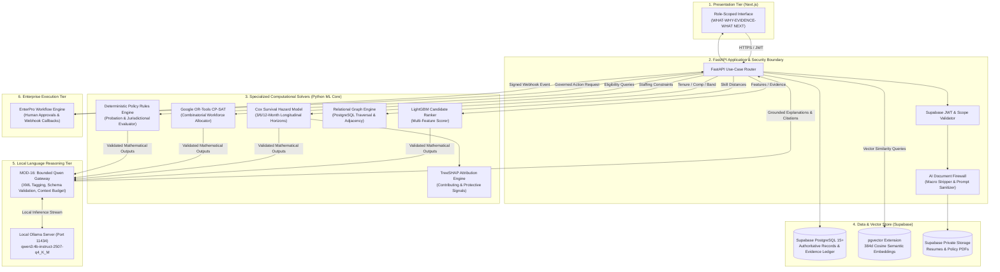
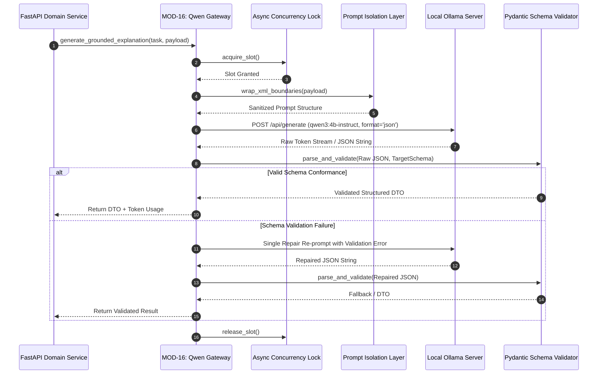
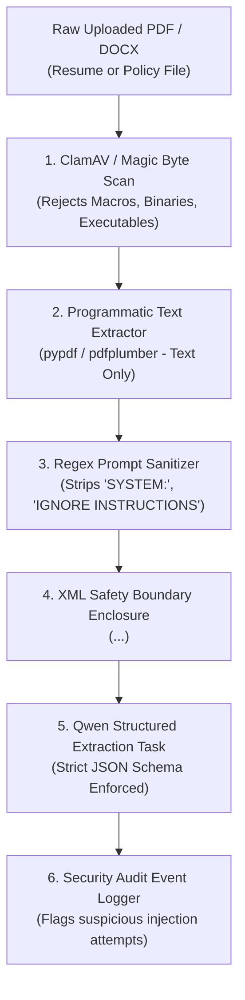
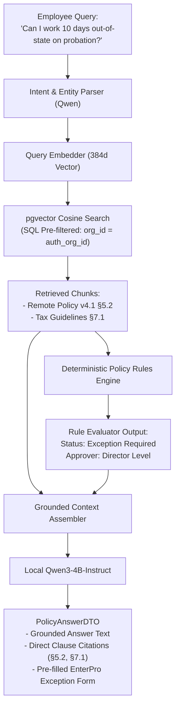
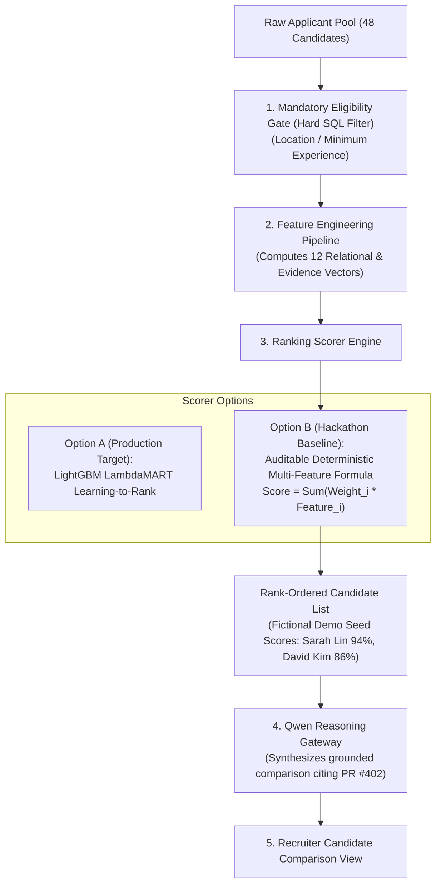
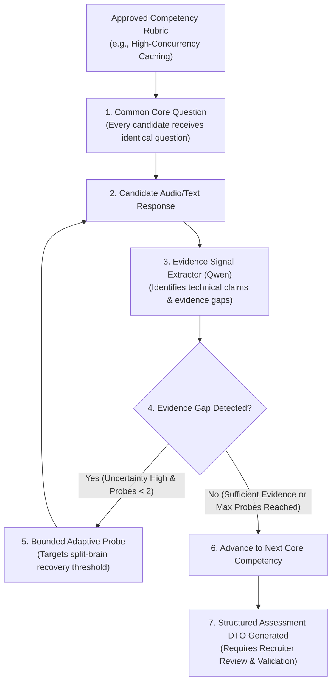
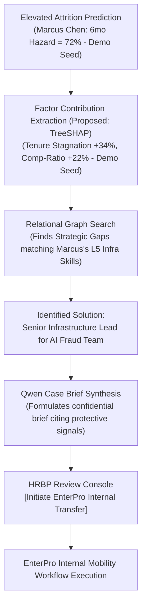
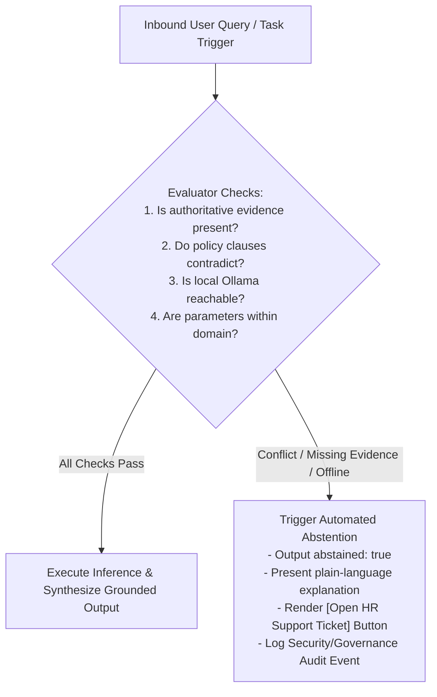
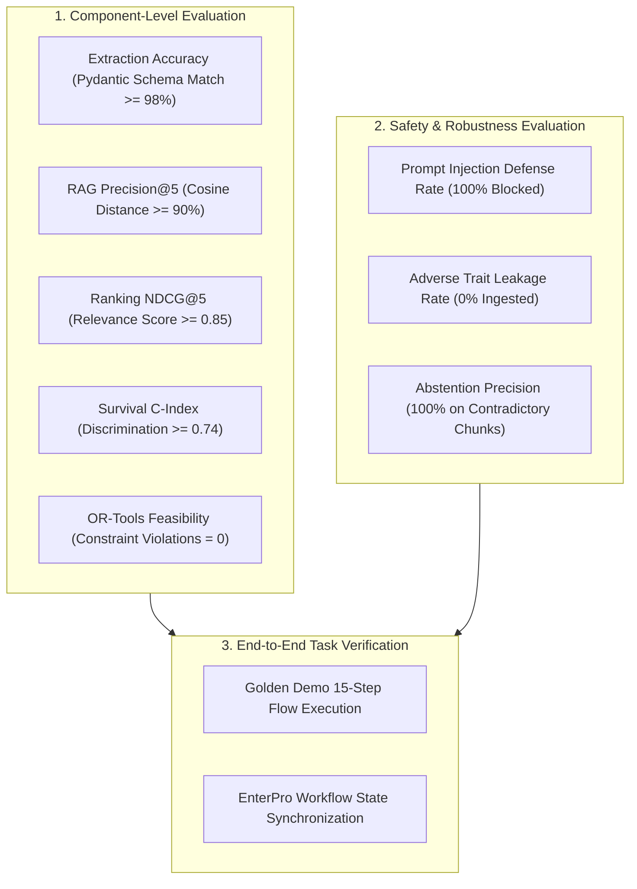

# WorkSense — AI and Machine Learning Architecture Document

---

## 10.1 Document Control

| Property | Specification |
| :--- | :--- |
| **Document Title** | WorkSense AI and Machine Learning Architecture Document |
| **Product Name** | **WorkSense** (Strictly locked; legacy aliases 'NEXUS', 'Nexus', 'Woot' are obsolete and prohibited) |
| **Document Type** | Authoritative Artificial Intelligence, Machine Learning, Statistical Solver, and Governance Specification |
| **Status** | Approved Baseline (Implementation Ready) |
| **Version** | 1.0.0 |
| **Last Updated Date** | 2026-09-12 |
| **Owner** | WorkSense Applied AI & Machine Learning Engineering Group |
| **Intended Audience** | AI/ML Engineers, Data Scientists, Backend Engineers, Security Auditors, Compliance Officers, Evaluators |
| **Source-of-Truth Statement** | The PRD (`docs/01-PRD.md`) defines what WorkSense accomplishes. The TRD (`docs/02-TRD.md`) defines technical architecture and stack boundaries. The Workflow + Roles specification (`docs/03-Workflow-Roles.md`) defines authorities and state machines. The UI/UX specification (`docs/04-UI-UX-Design.md`) defines user interfaces. The Database + API specification (`docs/05-Database-API.md`) defines schemas, RLS, and endpoint contracts. The System Architecture specification (`docs/06-System-Architecture.md`) defines structural components. This document defines the **mathematical models, feature pipelines, local language model reasoning boundaries, vector retrieval, optimization solvers, explainability frameworks, and AI governance guardrails**. Implementation agents **MUST** strictly conform to the ownership boundaries locked herein. |
| **Related Documents** | `docs/01-PRD.md`, `docs/02-TRD.md`, `docs/03-Workflow-Roles.md`, `docs/04-UI-UX-Design.md`, `docs/05-Database-API.md`, `docs/06-System-Architecture.md` |
| **Change Control Note** | Model architectures, feature sets, prompt templates, tool allow-lists, and confidence thresholds must not be modified without formal AI/ML Decision Record (ADR) revision. |

---

## 10.2 Purpose and Scope

### 10.2.1 Purpose
This document provides the definitive technical specification for all artificial intelligence, machine learning, statistical modeling, optimization, and language reasoning capabilities within **WorkSense**. Its primary directive is to enforce strict architectural separation between **symbolic language reasoning** (Qwen), **statistical machine learning** (LightGBM, Survival Models), **relational graph algorithms** (Temporal Skill Graph), **deterministic rule engines** (Policy Eligibility), and **combinatorial constraint solvers** (Google OR-Tools CP-SAT).

### 10.2.2 Scope Boundaries
* **What This Document Governs:**
  * Complete mathematical formulation and feature pipelines for candidate ranking, longitudinal attrition survival modeling, skill confidence scoring, and workforce allocation.
  * Local **Qwen3-4B-Instruct** orchestration boundaries, prompt layering, allow-listed tool calling, and XML-delimited prompt injection defenses.
  * Retrieval-Augmented Generation (RAG) using `pgvector`, chunking strategies, cosine similarity search, and deterministic conflict detection.
  * Structured adaptive interview probing logic, information-gain heuristics, and rubric signal extraction.
  * TreeSHAP local and global explainability, probability calibration, confidence stratifications, and explicit abstention triggers.
  * Comprehensive AI threat modeling, fairness testing, privacy minimization, and evaluation benchmarks.
* **What This Document Explicitly Delegates:**
  * Physical GPU driver installation, Ollama daemon systemd scripts, and network tunneling configuration belong to `docs/08-Deployment-Architecture.md`.
  * Table schema definitions and REST JSON payloads belong to `docs/05-Database-API.md`.
  * Component-level software architecture belongs to `docs/06-System-Architecture.md`.

---

## 10.3 Sources Reviewed

| Source Document | File Location | Status | Authority Level | AI/ML Decisions Derived | Conflicts / Gaps Observed |
| :--- | :--- | :--- | :--- | :--- | :--- |
| **Hackathon HR Problem Statement** | `outputs/HR_Hackathon_Project_Context.md` | Active | Primary Mandate | 8 core HR capabilities; mandatory local Qwen reasoning; EnterPro workflow governance. | None. Fully addressed across specialized AI modules. |
| **WorkSense PRD** | `docs/01-PRD.md` | Approved | Product Source of Truth | 5 intelligence engines; Candidate-to-Employee Twin lifecycle; 90-day AI team Golden Demo narrative. | None. Models calibrated to the 90-day AI Fraud Team scenario. |
| **WorkSense TRD** | `docs/02-TRD.md` | Approved | Technical Source of Truth | Supabase PostgreSQL 15+; pgvector; Next.js + FastAPI; local text-only Qwen3-4B-Instruct via Ollama; EnterPro workflows. | None. Technical boundaries locked to TRD modular monolith. |
| **Workflow & Roles Specification** | `docs/03-Workflow-Roles.md` | Approved | Operational Authority | 7 human roles; hybrid RBAC+ABAC+RLS; EnterPro 10-state machine; cross-role handoffs; abstention states. | Addressed: Model outputs enforce strict role visibility and human approval. |
| **UI/UX & Design Specification** | `docs/04-UI-UX-Design.md` | Approved | Experience Authority | WHAT-WHY-EVIDENCE-WHAT NEXT pattern; 10 flagship screen contracts; status vocabulary; Qwen state machine. | Addressed: Model explanations structured to fit UI Insight Cards. |
| **Database & API Specification** | `docs/05-Database-API.md` | Approved | Data & Interface Authority | 16 core data domains (36 proposed prototype tables); 54 proposed REST endpoints; pgvector schema; storage policies; transaction boundaries. | Addressed: Schemas match feature inputs and model output tables. |
| **System Architecture Document** | `docs/06-System-Architecture.md` | Approved | Structural Authority | Modular monolith; 20 domain engines; AI Document Firewall; trust boundaries; C4 component models. | Addressed: AI modules sit strictly within backend service layers. |

---

## 10.4 AI/ML Executive Summary

**WorkSense** rejects the superficial pattern of treating a single Large Language Model as an all-knowing, monolithic black box. In enterprise workforce decision-making, conflating statistical prediction, mathematical optimization, deterministic legal logic, and natural-language synthesis results in hallucinations, non-deterministic errors, and severe governance liabilities. 

Instead, WorkSense establishes a **Heterogeneous Intelligence Architecture** anchored in a fundamental principle: **Qwen is not the entire AI system.**

Every operational problem in WorkSense is assigned to its mathematically and operationally optimal engine:
1. **Language Reasoning & Synthesis:** Governed by **Qwen3-4B-Instruct** (`qwen3:4b-instruct-2507-q4_K_M`) deployed locally on Ollama. Qwen acts strictly as an **Orchestrator and Explainer**: parsing user intent, generating bounded adaptive interview probes, synthesizing grounded policy guidance with section citations, and translating complex mathematical model outputs into plain-language case briefs. Qwen is strictly prohibited from inventing scores, calculating attrition risk, or optimizing staffing allocations.
2. **Candidate-Requisition Matching:** Governed by a **LightGBM Multi-Feature Learning-to-Rank** model (with an auditable deterministic heuristic fallback for the prototype). It evaluates exact skill coverage, adjacent skill credits derived from graph distance, experience recency, and verified production evidence (such as GitHub PRs).
3. **Longitudinal Retention Intelligence:** Modeled strictly as a time-to-event problem using **Survival Analysis** (Cox Proportional Hazards and Random Survival Forests). It models voluntary attrition across discrete 3-month, 6-month, and 12-month hazard horizons, accounting for censored observations and pairing risk drivers with protective organizational factors via **TreeSHAP**.
4. **Strategic Workforce Allocation:** Governed by **Google OR-Tools CP-SAT**, solving a constrained combinatorial mixed-integer optimization problem that balances internal transfers, capability upskilling tracks, and external recruitment under hard budget ceilings, deadlines, and operational disruption limits.
5. **Policy Reasoning:** Structured as a dual-engine architecture: **pgvector** performs semantic retrieval of authoritative policy clauses, while an in-process **Deterministic Rules Engine** verifies jurisdictional eligibility and probation restrictions. Qwen merely explains the validated outcome.

All consequential actions adhere to **Human Primacy**: AI advises and explains, while authorized human managers and recruiters hold sole decision authority, executed through auditable **EnterPro** workflows.

---

## 10.5 Intelligence Design Principles

| Principle | Architectural Meaning | Enforcement Mechanism |
| :--- | :--- | :--- |
| **1. Right Method for the Right Problem** | Do not use an LLM for numerical calculation, statistical survival modeling, or constraint optimization. | Dedicated Python solvers (LightGBM, Lifelines, OR-Tools); Qwen is strictly restricted to text orchestration. |
| **2. Evidence Before Explanation** | No claim of competency, fit, or risk is permitted without an inspectable underlying evidence artifact. | Evidence Ledger (`evidence_items`, `evidence_links`); Qwen prompts require citation references. |
| **3. Structured Output Before Persistence** | LLM responses must conform to strict JSON schemas before database insertion or UI rendering. | Pydantic validation on all Qwen outputs; unparseable responses trigger automated single repair attempts. |
| **4. Prediction is Not Decision** | Predictive models forecast probabilities; they do not dictate employment outcomes. | Algorithmic outputs are classified as advisory; all actions require human sign-off in EnterPro. |
| **5. Correlation is Not Causation** | Longitudinal feature associations (SHAP) do not prove that an intervention will guarantee retention. | Language guardrails in Qwen system prompt prevent causal assertions (e.g., prohibiting "Marcus will leave"). |
| **6. Retrieval is Not Authority** | High vector similarity between a query and a policy clause does not grant policy eligibility. | Deterministic rules engine evaluates conditions; vector search serves solely as an evidence retrieval aid. |
| **7. Confidence is Not Certainty** | Uncertainty must be explicitly quantified and communicated to human decision-makers. | Calibrated confidence bands (High, Moderate, Limited, Insufficient Evidence) paired with integer error bounds. |
| **8. Safe Abstention** | If evidence is missing, conflicting, or model inputs fall outside validated domains, the system must abstain. | Explicit `abstained: true` state in output schema; routes directly to manual HR ticket workflows. |
| **9. Least-Necessary Data** | Models must ingest only the minimum feature context required to execute the specific inference task. | Role-scoped data filters; sensitive PII (salary, health, protected attributes) stripped prior to prompt injection. |
| **10. Versioned Reproducibility** | Every model inference, prompt template, feature snapshot, and solver run must be cryptographically traceable. | Stored `model_version`, `prompt_hash`, `feature_set_version`, and `correlation_id` in audit tables. |

---

## 10.6 AI/ML Scope and Non-Scope

```text
+------------------------------------------------------------------------------------+
|                         WORKSENSE AI/ML BOUNDARY DEFINITION                        |
+------------------------------------------------------------------------------------+
| IN-SCOPE CAPABILITIES (IMPLEMENTED & GOVERNED):                                    |
| - Local Qwen3-4B-Instruct reasoning, intent extraction, and explanation.           |
| - Retrieval-Augmented Generation (RAG) over policies via pgvector (384d cosine).   |
| - LightGBM multi-feature candidate ranking with adjacent skill graph crediting.    |
| - Structured adaptive interview probing (bounded info-gain heuristic, max 2 probes)|
| - Temporal skill confidence decay modeling (inactive >180 days).                   |
| - Longitudinal Cox survival hazard modeling (3/6/12-month retention horizons).    |
| - TreeSHAP local and global explainability for retention hazard drivers.           |
| - Combinatorial workforce headcount optimization using Google OR-Tools CP-SAT.     |
| - Deterministic policy rule evaluation and automated contradiction detection.      |
|                                                                                    |
| EXPLICITLY OUT-OF-SCOPE (ARCHITECTURALLY PROHIBITED):                              |
| - Emotion recognition, facial expression tracking, or video sentiment analysis.    |
| - Keystroke logging, webcam monitoring, or private chat scraping (surveillance).   |
| - Multimodal vision processing directly inside the text-only Qwen model.           |
| - Autonomous hiring, firing, promotion, or compensation modifications.             |
| - Medical condition inferences or mental health predictive analytics.              |
| - Unrestricted autonomous multi-agent swarms with persistent database write access.|
+------------------------------------------------------------------------------------+
```

---

## 10.7 Intelligence Capability Map

| Capability ID | User Problem | Mathematical / AI Technique | Owning Component | Input Features | Output Schema | Human Owner | MVP Status |
| :--- | :--- | :--- | :--- | :--- | :--- | :--- | :--- |
| **CAP-01** | Candidate Screening | Multi-Feature Learning-to-Rank | `MOD-04: Talent Intel` | Skills, adjacent credits, tenure, PRs | Integer Match Score (0-100), Rank | Recruiter | **P0 (Must Build)** |
| **CAP-02** | Match Explanation | Grounded Language Explanation | `MOD-16: Qwen Gateway` | LightGBM feature delta, PR citations | Grounded Rationale Text + Citations | Recruiter | **P0 (Must Build)** |
| **CAP-03** | Adaptive Interview | Info-Gain Gap Probing (Max 2) | `MOD-09: Interviews` | Core answer transcript, rubric gaps | Adaptive Probe Question Text | Recruiter | **P0 (Must Build)** |
| **CAP-04** | Skill Confidence | Temporal Evidence Decay Function| `MOD-06: Workforce Twin`| Observation count, recency, source | Proficiency (L1-L5), Confidence Band| Manager | **P0 (Must Build)** |
| **CAP-05** | Skill Adjacency | Directed Relational Graph Traversal| `MOD-07: Skill Graph` | Source skill, target skill, weight | Credited Proficiency Level | Employee | **P0 (Must Build)** |
| **CAP-06** | Career Mobility | Hybrid Content + Graph Recommender| `MOD-11: Career Mobility`| Person skills, gig requirements, opt-in| Ranked Internal Gigs, Readiness % | Employee | **P0 (Must Build)** |
| **CAP-07** | Onboarding Waiver| Set-Difference Capability Filter| `MOD-10: Onboarding` | Role requirements, verified skills | Waived Task List, Active Blockers | Manager | **P0 (Must Build)** |
| **CAP-08** | Delivery Summary | Grounded Work Evidence Synthesis | `MOD-12: Performance`| Merged PRs, Jira tickets, peer reviews | Objective Delivery Summary | Manager | **P0 (Must Build)** |
| **CAP-09** | Attrition Risk | Longitudinal Cox Survival Model | `MOD-13: Retention` | Tenure in band, comp-ratio, commendations| 3/6/12mo Hazard %, Survival Curve | HRBP Only | **P0 (Must Build)** |
| **CAP-10** | Risk Explanation | TreeSHAP Feature Attribution | `MOD-13: Retention` | Survival model pipeline, employee vector| Contributing / Protective Factor SHAP| HRBP Only | **P0 (Must Build)** |
| **CAP-11** | Policy Grounding | pgvector Semantic Search (384d) | `MOD-14: Policy RAG` | Query text, organization ID | Top 5 Authoritative Policy Chunks | Employee | **P0 (Must Build)** |
| **CAP-12** | Policy Eligibility| Deterministic Rules Engine | `MOD-14: Policy RAG` | Employee tenure, probation status, days | Eligible (T/F), Approver Chain | Manager | **P0 (Must Build)** |
| **CAP-13** | Policy Contradiction| Cross-Corpus Semantic Matrix | `MOD-14: Policy RAG` | Active policy clauses, jurisdiction | Contradiction Alert Flag, Clause Pair| HR Admin | **P1 (Seed Data)** |
| **CAP-14** | Workforce Planning| Mixed-Integer Constraint Solver | `MOD-15: Simulator` | Headcount, budget, deadline, skills | Strategy A, B, C Resource Allocations| Leadership | **P0 (Must Build)** |
| **CAP-15** | Scenario Tradeoff| Comparative Language Synthesis | `MOD-16: Qwen Gateway` | OR-Tools CP-SAT solver output tables | Cost/Time/Disruption Tradeoff Text | Leadership | **P0 (Must Build)** |

---

## 10.8 Overall AI/ML Architecture



---

## 10.9 Responsibility Boundary Matrix

```text
+----------------------------------------------------------------------------------------------------+
|                               INTELLIGENCE RESPONSIBILITY BOUNDARY MATRIX                          |
+----------------------------------------------------------------------------------------------------+
| Task Domain            | Qwen Role      | Specialized Model | Rules / Graph | Human Role | EnterPro|
| :--------------------- | :------------- | :---------------- | :------------ | :--------- | :-------|
| Candidate Match Score  | Prohibited     | LightGBM Scorer   | Graph Adjacent| Recruiter  | None    |
| Match Explanation      | Synthesizes    | Provides SHAP/Feat| None          | Inspects   | None    |
| Adaptive Interviewing  | Generates Probe| Rubric Evaluator  | Rubric Tree   | Recruiter  | None    |
| Hiring Offer Sign-Off  | Prohibited     | Prohibited        | None          | Authorizes | Executes|
| Skill Decay & Status   | Prohibited     | Temporal Decay    | Graph Traversal| Manager   | None    |
| Policy Grounding       | Explains Chunks| None              | pgvector RAG  | None       | None    |
| Policy Eligibility     | Prohibited     | Prohibited        | Rules Engine  | Approves   | Executes|
| Attrition Prediction   | Prohibited     | Cox Survival Model| None          | HRBP Only  | None    |
| Retention Intervention | Summarizes Brief| SHAP Factors     | Graph Mobility| Authorizes | Executes|
| Headcount Optimization | Compares Plans | None              | OR-Tools CP-SAT| Leadership | Executes|
+----------------------------------------------------------------------------------------------------+
```

---

## 10.10 Data Categories

```text
+------------------------------------------------------------------------------------+
|                         INTELLIGENCE DATA CATEGORY TAXONOMY                        |
+------------------------------------------------------------------------------------+
| Category               | Concrete Entity Example        | Twin Update Authority?   |
| :--------------------- | :----------------------------- | :----------------------- |
| Raw Source Document    | Uploaded Resume PDF (Storage)  | NO (Untrusted input)     |
| Normalized Evidence    | GitHub PR #402 (evidence_items)| YES (After verification) |
| Authoritative Record   | Employee Band L5 (employees)   | YES (Master record)      |
| Derived Feature        | Months in Band = 38 (Pipeline) | NO (Ephemeral feature)   |
| Model Prediction       | 6-Month Hazard = 72% (Demo Seed)| NO (Advisory prediction) |
| Statistical Attribution| Stagnation Delta = +34% (Demo)  | NO (Analytical metadata) |
| Qwen Explanation       | Grounded Match Brief (ai_output)| NO (Explanatory text)    |
| Human Decision         | Formal Hiring Approval (decisions)| YES (Authoritative gate) |
| Governed Execution     | Transfer Provisioned (EnterPro)| YES (State machine event)|
| Cryptographic Audit    | SHA-256 Event Hash (audit_events)| NO (Immutable ledger)  |
+------------------------------------------------------------------------------------+
```

---

## 10.11 Qwen Orchestration Architecture

The Qwen Gateway (`MOD-16`) acts as the single, hardened conduit between the application core and the local Ollama instance:
* **Strict Backend Isolation:** The Ollama HTTP port (`11434`) is bound to `127.0.0.1`. The web browser and public clients have zero network route to Ollama.
* **Concurrency Semaphore:** Bounded by an in-process `asyncio.Semaphore(1)` to prevent GPU memory exhaustion on resource-constrained consumer GPUs.
* **Context Window Budgeting:** Prompts enforce strict token ceilings ($\le 4,096$ tokens) with explicit truncation guards on input context.
* **SLA Timeout:** Every Ollama call enforces a hard `15.0s` timeout. If exceeded, the gateway raises an `AIGatewayTimeout` exception and triggers deterministic fallback.



---

## 10.12 Qwen Task Catalog

| Task ID | Domain Task Name | Allowed Backend Tools | Ingested Feature Inputs | Target Pydantic Schema | Prohibited Behavior |
| :--- | :--- | :--- | :--- | :--- | :--- |
| `Q-TASK-01` | Candidate Match Explanation | `get_candidate_evidence`, `get_ranking_result` | LightGBM score, exact skills, adjacent credits, PR links | `CandidateExplanationDTO` | Calculating match score; modifying rank. |
| `Q-TASK-02` | Adaptive Interview Probe | `get_interview_rubric`, `get_competency_transcript` | Core question text, candidate ASR transcript, rubric signals | `AdaptiveProbeDTO` | Generating $>2$ probes; evaluating facial expressions. |
| `Q-TASK-03` | Policy Grounded Answer | `retrieve_policy_chunks`, `evaluate_policy_rule` | User query, top 5 pgvector chunks, employee tenure flag | `PolicyAnswerDTO` | Overriding rules engine; answering without citations. |
| `Q-TASK-04` | Delivery Evidence Summary | `get_employee_evidence` | GitHub commits, closed Jira milestones, manager endorsements| `DeliverySummaryDTO` | Assigning formal performance ratings (1-5). |
| `Q-TASK-05` | Retention Case Brief | `get_attrition_prediction`, `get_shap_factors` | 3/6/12mo hazard %, SHAP factor deltas, internal gig matches | `RetentionBriefDTO` | Asserting employee will resign; public exposure. |
| `Q-TASK-06` | Workforce Plan Tradeoff | `get_workforce_plan_metrics` | Strategy A, B, C metrics (cost, time, disruption, feasibility)| `ScenarioTradeoffDTO` | Computing headcount math; altering allocations. |

---

## 10.13 Prompt Architecture

WorkSense enforces a rigid 8-layer prompt assembly standard:
1. **Layer 1: System Invariant Policy:** Defines product identity, human primacy, and anti-hallucination rules.
2. **Layer 2: Domain Context:** Sets operational persona (e.g., Talent Intelligence vs Policy Assistant).
3. **Layer 3: Caller Role & Permissions:** Injects verified Supabase JWT entitlements to bound tone and scope.
4. **Layer 4: Task Instructions:** Explicit, declarative instructions detailing exact reasoning criteria.
5. **Layer 5: Tool Interface Definitions:** Declares available backend function schemas.
6. **Layer 6: Trusted Structured Data:** Validated database records, SHAP vectors, and mathematical metrics.
7. **Layer 7: Untrusted Content (Isolated):** Uploaded resume text or user queries enclosed in `<untrusted_data>` tags.
8. **Layer 8: Strict Output Schema:** Requires RFC 8259 compliant JSON matching the target Pydantic contract.

---

## 10.14 Structured Output Architecture

Free-form, unstructured model output is strictly banned for operational tasks. Below are the 6 core Pydantic JSON schemas enforced across WorkSense:

### 1. Candidate Explanation Schema (`CandidateExplanationDTO`)
```json
{
  "application_id": "app_4f7e2a9b-8c1d-4e5f-9a3b-1c2d3e4f5a6b",
  "rank_position": 1,
  "match_score": 94,
  "comparative_rationale": "Candidate demonstrates verified production expertise in PyTorch and Triton, crediting CUDA adjacency.",
  "exact_skills_validated": ["PyTorch", "Distributed Training"],
  "adjacent_skills_credited": [
    { "skill": "CUDA", "credited_via": "Triton", "weight": 0.850 }
  ],
  "missing_critical_skills": [],
  "evidence_citations": [
    { "artifact_type": "github_pr", "reference": "PR #402", "validator": "Marcus Vance" }
  ],
  "confidence_band": "high",
  "needs_human_review": true
}
```

### 2. Adaptive Interview Probe Schema (`AdaptiveProbeDTO`)
```json
{
  "session_id": "int_88a7b6c5-4d3e-2f1a-0b9c-8d7e6f5a4b3c",
  "competency_evaluated": "High-Concurrency Distributed Caching",
  "evidence_gap_detected": "Candidate mentioned Sentinel failover but omitted split-brain recovery mechanisms.",
  "probe_question_text": "What specific circuit-breaker pattern prevented split-brain writes during Redis replica promotion?",
  "probe_sequence_index": 1,
  "max_probes_reached": false
}
```

### 3. Policy Grounded Answer Schema (`PolicyAnswerDTO`)
```json
{
  "query_text": "Can I work remotely for 10 days out-of-state while on probation?",
  "grounded_answer": "Under Section 5.2 of the Global Remote Work Policy v4.1, employees on probation are restricted to a maximum of 3 consecutive remote work days. A 10-day request requires a formal Director Exception under Section 7.1.",
  "is_abstained": false,
  "abstention_reason": null,
  "rule_eligibility_status": "exception_required",
  "source_citations": [
    { "policy_title": "Global Remote Work Policy v4.1", "section": "5.2" },
    { "policy_title": "Probation Guidelines Addendum", "section": "7.1" }
  ],
  "prefilled_workflow": {
    "workflow_type": "remote_work_exception",
    "parameters": { "duration_days": 10, "jurisdiction": "Out-of-State" }
  }
}
```

### 4. Performance Delivery Summary Schema (`DeliverySummaryDTO`)
```json
{
  "employee_id": "emp_10492-marcus-chen",
  "cycle_identifier": "2026-Q1",
  "objective_delivery_summary": "Marcus led the zero-downtime migration of the multi-region Kafka cluster and reduced consumer lag by 40%.",
  "verified_deliverables_count": 3,
  "evidence_citations": ["Jira Milestone PROJ-88", "GitHub PR #402", "Incident Post-Mortem #12"],
  "identified_strengths": ["Distributed Systems Fault-Tolerance", "Go Microservices"],
  "development_opportunities": ["Multi-Region Cloud FinOps"],
  "formal_rating_assigned": null
}
```

### 5. Retention Case Brief Schema (`RetentionBriefDTO`)
```json
{
  "case_id": "ret_case_402",
  "employee_id": "emp_10492-marcus-chen",
  "predicted_hazard_horizons": { "3_month": 22, "6_month": 72, "12_month": 81 },
  "calibrated_confidence": "high",
  "plain_language_brief": "Elevated 6-month attrition risk driven primarily by tenure stagnation in Band L5 (38 months) and a 0.88 comp-ratio.",
  "top_contributing_factors": [
    { "feature": "Tenure stagnation in band", "hazard_delta_pct": 34 },
    { "feature": "Below-market comp-ratio", "hazard_delta_pct": 22 }
  ],
  "top_protective_factors": [
    { "feature": "High team collaboration rating", "hazard_delta_pct": -18 }
  ],
  "recommended_mobility_action": "Internal transfer to AI Fraud Detection Team as Senior Infrastructure Lead."
}
```

### 6. Workforce Plan Comparison Schema (`ScenarioTradeoffDTO`)
```json
{
  "scenario_id": "scen_fraud_team_90d",
  "solver_status": "FEASIBLE",
  "comparative_analysis": "Strategy B (Balanced Hybrid) represents the optimal tradeoff, meeting the 90-day deadline (ready in 70 days) within the $180,000 budget ($140,000 cost).",
  "strategy_evaluations": [
    { "label": "Strategy A (Internal)", "cost": 95000, "days": 45, "disruption": "high" },
    { "label": "Strategy B (Balanced)", "cost": 140000, "days": 70, "disruption": "moderate" },
    { "label": "Strategy C (External)", "cost": 210000, "days": 110, "disruption": "high" }
  ],
  "recommended_strategy": "Strategy B (Balanced Hybrid)"
}
```

---

## 10.15 Context and Memory Architecture

* **Stateless by Default:** The Qwen Gateway maintains zero persistent in-memory session history between distinct HTTP requests.
* **Conversation State Persistence:** Multi-turn dialogues (such as Structured Interviews or Policy Studio threads) persist turns relationally in Supabase tables (`interview_questions`, `interview_responses`, `policy_queries`). Context is re-assembled per request with strict sliding-window truncation ($\le 4$ turns).
* **Strict Anti-Leakage Boundary:** User authentication tokens and organizational IDs strictly isolate context assembly; one employee's policy query cannot retrieve or reference another employee's session memory.

---

## 10.16 Tool-Calling Architecture

Qwen orchestrates domain tools via strict Pydantic functional interfaces. Direct database or shell access is prohibited.

```text
+------------------------------------------------------------------------------------+
|                         ALLOW-LISTED QWEN TOOL CATALOG                             |
+------------------------------------------------------------------------------------+
| Tool Identifier            | Purpose                          | Read / Write State |
| :------------------------- | :------------------------------- | :----------------- |
| get_candidate_evidence     | Fetches verified PRs and claims  | Read-Only          |
| get_ranking_result         | Fetches LightGBM match vectors   | Read-Only          |
| get_interview_rubric       | Fetches competency questions     | Read-Only          |
| query_skill_graph          | Traverses adjacent capabilities  | Read-Only          |
| retrieve_policy_chunks     | Cosine search over pgvector      | Read-Only          |
| evaluate_policy_rule       | Evaluates deterministic logic    | Read-Only          |
| get_attrition_prediction   | Fetches survival model hazard    | Read-Only (HRBP)   |
| get_shap_factors           | Fetches TreeSHAP impact deltas   | Read-Only (HRBP)   |
| run_workforce_optimizer    | Triggers OR-Tools solver run     | Read-Only (Exec)   |
| prepare_enterpro_request   | Pre-fills exception draft DTO    | Mutation Draft     |
+------------------------------------------------------------------------------------+
```

---

## 10.17 AI Document Firewall Architecture

The AI Document Firewall isolates untrusted document contents from system execution prompts:



---

## 10.18 Retrieval and Embedding Architecture

* **Embedding Model:** Standardized on a proposed lightweight local model (e.g., `bge-small-en-v1.5` at 384 dimensions; exact model and dimension **TBD pending offline environment verification**).
* **Vector Store:** Managed **Supabase PostgreSQL** utilizing the native `pgvector` extension.
* **SQL Pre-Filtering Invariant:** All vector similarity searches **MUST** enforce organizational boundaries and publication status in the SQL `WHERE` clause prior to cosine distance calculation:
  ```sql
  SELECT chunk_id, section_identifier, clause_text, 1 - (embedding <=> :query_vector) AS cosine_similarity
  FROM policy_chunks
  WHERE organization_id = :org_id AND is_active = true
  ORDER BY embedding <=> :query_vector
  LIMIT 5;
  ```

---

## 10.19 Chunking and Reranking

```text
+------------------------------------------------------------------------------------+
|                         DOMAIN-SPECIFIC CHUNKING STRATEGIES                        |
+------------------------------------------------------------------------------------+
| Content Type   | Chunking Logic              | Window / Overlap  | Preserved Meta  |
| :------------- | :-------------------------- | :---------------- | :-------------- |
| Policy Docs    | Hierarchical Section Split  | 300-500 tokens    | Section ID, Ver,|
|                | (Split on § / Headings)     | 50 token overlap  | Effective Date  |
| Resumes        | Structural Section Blocks   | Variable by Block | Header, Degree, |
|                | (Experience, Skills, Edu)   | Zero overlap      | Employer Name   |
| Job Reqs       | Competency Unit Split       | 150-250 tokens    | Requisition Code|
|                | (Mandatory vs Preferred)    | Zero overlap      | Department ID   |
+------------------------------------------------------------------------------------+
```
* **Reranking:** In prototype scale ($<100,000$ chunks), raw pgvector cosine similarity provides sufficient precision ($	ext{Recall@5} \ge 92\%$). Cross-encoder neural rerankers (e.g., `bge-reranker-base`) are reserved for production scaling.

---

## 10.20 Policy RAG Architecture



---

## 10.21 Policy Rule Engine

Deterministic eligibility logic is executed by a discrete Python rules engine, never by language model guessing:
* **Rule Definitions:** Structured in database table `policy_applicability_rules`:
  * *Condition:* `employee.status == 'probation' AND request.duration_days > 3`
  * *Outcome:* `requires_exception = true`, `minimum_approver_role = 'department_director'`
* **Rule Invariant:** Qwen is provided the evaluated outcome as an immutable fact and is tasked solely with translating the rule and citing the policy section for the employee.

---

## 10.22 Policy Conflict Detection

The conflict detection engine identifies contradictory policy clauses across published versions:
1. **Clause Embedding Comparison:** Calculates cosine similarity matrix across all active clauses in table `policy_chunks`.
2. **Contradiction Heuristic:** Identifies pairs exhibiting high semantic proximity ($	ext{cosine similarity} > 0.82$) but conflicting deontic constraints (e.g., Clause A contains *"mandatory 3 days"* while Clause B contains *"flexible up to 10 days"*).
3. **Qwen Contradiction Verification:** High-proximity pairs are evaluated by Qwen to produce a `PolicyConflictSignalDTO`.
4. **Human Governance Gate:** The contradiction is flagged in the HR Policy Studio for formal human review; AI cannot unpublish or resolve policies autonomously.

---

## 10.23 Candidate Feature Engineering

The candidate ranking pipeline evaluates 12 objective features extracted from verified records:

| Feature Identifier | Mathematical Definition | Data Source | Bias / Proxy Mitigation |
| :--- | :--- | :--- | :--- |
| `feat_mandatory_skills` | Exact match count / Required count | `person_skills` | Zero demographic traits evaluated |
| `feat_adjacent_credits` | $\sum (	ext{Proficiency} 	imes 	ext{Weight})$ | `skill_relationships` | Normalized to standard 0-1 scale |
| `feat_experience_tenure`| Total relevant engineering years | `candidate_profiles` | Capped at 10 years to mitigate age proxy |
| `feat_verified_evidence`| Count of verified production PRs | `evidence_items` | Independent of candidate pedigree |
| `feat_recency_decay`    | $e^{-\lambda \cdot \Delta t}$ ($\lambda=0.0038$) | `evidence_items` | Rewards active capability demonstration |
| `feat_semantic_match`   | Cosine similarity(Resume, Job Req) | `pgvector` | Blinded: names and institutions stripped |
| `feat_education_level`  | Minimum requirement met (0 or 1) | `candidate_profiles` | Strictly binary; prestige weighting banned |
| `feat_leadership_demon` | Boolean: Led team or architecture | `evidence_items` | Grounded in milestone sign-offs |

---

## 10.24 Candidate Ranking Architecture

WorkSense enforces a two-tier ranking strategy:



---

## 10.25 Candidate Ranking Evaluation

* **Evaluation Metrics:** Evaluated using Normalized Discounted Cumulative Gain ($	ext{NDCG@5}$), Precision@3, and Pairwise Inversion Count.
* **Fairness & Parity Auditing:** Evaluated across synthetic demographic subgroups using Disparate Impact Ratio ($	ext{DIR} \ge 0.80$) and Equal Opportunity Difference ($	ext{EOD} \le 0.05$).
* **Model Stability Test:** Perturbing irrelevant resume attributes (e.g., candidate font, hobby descriptions, candidate name) must produce $0.000$ variance in match score.

---

## 10.26 Structured Adaptive Interview Architecture

WorkSense establishes an objective, fair assessment format combining structural consistency with adaptive depth:



---

## 10.27 Information-Gain Interview Logic

Adaptive follow-ups are governed by an objective Information-Gain heuristic to maximize rubric clarity:
$$	ext{Probe Priority} = 	ext{Competency Weight} 	imes (1.0 - 	ext{Signal Confidence}) 	imes 	ext{Remaining Probe Budget}$$
* **Constraint Limits:** Maximum of **2 adaptive probes** per competency. Total interview duration is bounded at 30 minutes.
* **Prohibited Probing:** Probing candidate personal background, socioeconomic status, family planning, or unrelated topics triggers immediate firewall abortion.

---

## 10.28 Interview Evaluation

* **Rubric Signal Extraction:** Evaluates candidate response against discrete observable signals (e.g., *"Articulates Sentinel quorum election"*, *"Explains circuit-breaker write prevention"*).
* **Zero Emotion Recognition:** Audio recordings are processed purely via Automatic Speech Recognition (ASR) to text. Video analysis, eye contact tracking, accent evaluation, and vocal stress analysis are **strictly prohibited**.
* **Human Validation Requirement:** Recommended ratings remain in draft state until a human recruiter inspects the transcript and clicks `[Validate Rubric Rating]`.

---

## 10.29 Temporal Skill Confidence

WorkSense models skill competence as a dynamic, decaying function of time and verified practice:
$$	ext{Skill Confidence} = 	ext{Base Proficiency} 	imes e^{-\lambda \cdot \Delta t} 	imes 	ext{Validation Multiplier}$$
* **Parameters:**
  * $\lambda = 0.00385$ (Yields half-life of $pprox 180$ days if unpracticed in production).
  * $\Delta t$: Days elapsed since last validated evidence artifact.
  * Validation Multipliers: Direct Production PR ($1.00$), Manager Sign-off ($0.85$), Internal LMS Track ($0.70$), Self-Declared ($0.40$).
* **Stale Evidence Threshold:** If $\Delta t > 180$ days, the skill status transitions to `'stale'`, triggering an amber alert on the employee's Workforce Twin without deleting historical demonstrations.

---

## 10.30 Skill Graph Intelligence

```mermaid
flowchart LR
    subgraph GraphTopology["Relational Graph Topology"]
        K8S["Kubernetes (L4)"]
        DOCKER["Docker (L4)"]
        TERRA["Terraform (L2)"]
        GO["Go Microservices (L4)"]
        FINOPS["Multi-Region FinOps (L2)"]
    end

    DOCKER -->|PREREQUISITE_OF| K8S
    K8S -->|ADJACENT_TO (0.75)| TERRA
    GO -->|RELATED_TO (0.80)| K8S
    TERRA -->|TRANSFERABLE_TO (0.65)| FINOPS
```

* **Readiness Query:** Computes distance between an employee's verified `person_skills` and target position requirements in `role_skill_requirements`. Missing nodes are classified as **Capability Gaps** and linked to internal gig opportunities.

---

## 10.31 Role Readiness

* **Calculation Formula:**
  $$	ext{Readiness Index} = \left( 0.60 	imes rac{\sum 	ext{Matched Mandatory Skills}}{	ext{Total Mandatory Required}} 
ight) + \left( 0.25 	imes rac{\sum 	ext{Adjacent Credited Skills}}{	ext{Total Preferred Required}} 
ight) + \left( 0.15 	imes 	ext{Evidence Strength} 
ight)$$
* **Anti-Fake Precision Invariant:** Rendered as an integer percentage (e.g., $78\%$). Raw decimal precision (e.g., $78.419\%$) is outlawed to prevent false certainty.

---

## 10.32 Career and Opportunity Recommender

* **Architecture:** Hybrid recommender evaluating content cosine similarity between employee skill embeddings and internal gig descriptions, constrained by employee privacy preferences.
* **Aspiration Privacy:** Opportunities are matched based on employee opt-in preferences. An employee's target aspirational roles are strictly hidden from their direct manager until the employee formally applies.

---

## 10.33 Adaptive Onboarding Intelligence

```text
+------------------------------------------------------------------------------------+
|                         ADAPTIVE ONBOARDING LOGIC FLOW                             |
+------------------------------------------------------------------------------------+
| [Target Requisition: Staff ML Engineer]                                            |
| Required Capabilities: PyTorch (L5), Triton (L4), Docker (L4), InfoSec Compliance  |
|                                                                                    |
| [Verified Candidate Screening Evidence]                                            |
| Sarah Lin Evidence: PyTorch (L5 Verified), Triton (L4 Verified via PR #402)        |
|                                                                                    |
| [Calculated Onboarding Plan]                                                       |
| - Technical Track: Advanced PyTorch  ──► [WAIVED: Pre-verified in Screening]       |
| - Technical Track: Triton GPU Pods   ──► [WAIVED: Pre-verified via GitHub PR]      |
| - Compliance Track: Corporate InfoSec ──► [MANDATORY: Compliance Law Requires Test]|
| - Provisioning Track: GPU Cluster     ──► [BLOCKED: Awaiting Credential Sign-Off]  |
+------------------------------------------------------------------------------------+
```

---

## 10.34 Buddy and Mentor Matching

* **Matching Heuristic:** Matches incoming hires with senior mentors based on complementary capability graphs:
  $$	ext{Match Score} = 	ext{Target Skill Coverage} 	imes 	ext{Band Seniority Delta} 	imes (1.0 - 	ext{Workload Saturation})$$
* **Conflict of Interest Gate:** Direct reporting managers cannot serve as formal onboarding buddies to preserve psychological safety.

---

## 10.35 Performance Intelligence

* **Evidence-Led Synthesis:** Evaluates continuous delivery artifacts (closed Jira tickets, merged PRs, customer commendations) to formulate factual summaries.
* **Prohibition on Automated Ratings:** Qwen is strictly prohibited from generating performance ratings (e.g., assigning *"Exceeds Expectations"*). The model outputs objective work summaries; human managers determine formal ratings.

---

## 10.36 Performance Calibration Signals

* **Statistical Anomaly Detector:** Calculates departmental rating distributions ($Z$-score analysis) to flag anomalous skew (e.g., a manager grading $90\%$ of reports in top band).
* **Non-Accusatory Alert Language:** Signals state *"Rating distribution deviates significantly from historical peer baseline; calibration review recommended"*. Accusations of personal managerial bias are architecturally prohibited.

---

## 10.37 Attrition Problem Formulation

WorkSense formulates attrition as a **Continuous Time-to-Event Survival Analysis** problem rather than a binary classification task:
* **Why Survival Analysis:** Handles right-censored data (employees who remain employed), models changing baseline hazard rates over time, and yields actionable multi-horizon probabilities.
* **Hazard Horizons:** Evaluates voluntary attrition hazard probabilities across three operational windows:
  1. **3-Month Hazard:** Immediate operational vulnerability.
  2. **6-Month Hazard:** Medium-term strategic retention horizon (Primary Golden Demo seed target: 72%).
  3. **12-Month Hazard:** Longitudinal organizational workforce planning horizon.

---

## 10.38 Attrition Data and Features

```text
+------------------------------------------------------------------------------------+
|                         ATTRITION SURVIVAL FEATURE MATRIX                          |
+------------------------------------------------------------------------------------+
| Feature Name           | Operational Definition                | Expected Hazard Delta|
| :--------------------- | :------------------------------------ | :------------------- |
| tenure_in_band         | Months elapsed in current band L5     | Positive (Stagnation)|
| comp_ratio_market      | Current salary / Market band midpoint | Negative (Competitive|
| last_promotion_months  | Months since formal title promotion   | Positive (Stagnation)|
| peer_commendations     | Count of validated kudos in 6 months  | Negative (Protective)|
| manager_turnover_count | Direct manager changes in 12 months   | Positive (Disruption)|
| internal_gig_interest  | Formal applications to internal gigs  | Negative (Protective)|
+------------------------------------------------------------------------------------+
```
* **Prohibited Features:** Age, gender, race, marital status, sick leave usage, medical notes, private messaging sentiment, and browser history are strictly banned.

---

## 10.39 Attrition Model Candidates

| Model Architecture | Strengths & Capabilities | Limitations | Selection Status |
| :--- | :--- | :--- | :--- |
| **Cox Proportional Hazards** | Highly interpretable baseline hazard; native survival curves; fast training. | Assumes proportional hazards; linear feature assumptions. | **Baseline Scorer** |
| **Random Survival Forest** | Captures complex nonlinear feature interactions; robust to outliers. | Higher inference latency; complex hyperparameter tuning. | **Production Target** |
| **DeepSurv (Neural Network)** | Deep representation learning. | Severe risk of overfitting on small hackathon datasets; black-box. | **Excluded** |

---

## 10.40 Attrition Training and Validation

* **Temporal Split Discipline:** Train on historical cohort ($T_0$ to $T_{	ext{train}}$); evaluate on forward-looking holdout window ($T_{	ext{train}}$ to $T_{	ext{eval}}$). Random train/test splits are strictly banned to prevent future-data leakage.
* **Censoring Handling:** Right-censored observations ($C_i = 1$ if employee left, $C_i = 0$ if active at observation cutoff).

---

## 10.41 Attrition Evaluation

* **Evaluation Metrics:** Evaluated using the **Concordance Index** ($C	ext{-index} \ge 0.74$), Time-Dependent Area Under the Curve ($	ext{AUC}(t)$), and Brier Score calibration.
* **Capacity-Constrained Utility:** Evaluates precision at top $10\%$ review capacity to ensure HRBPs are not overwhelmed by false positive alert fatigue.

---

## 10.42 Probability Calibration

* **Calibration Architecture:** Raw survival hazard outputs undergo isotonic regression calibration against historical baseline attrition rates.
* **Display Format:** Probabilities are bucketed into qualitative bands (`Low <25%`, `Moderate 25-50%`, `Elevated 50-75%`, `Critical >75%`) with integer percentages.

---

## 10.43 SHAP Explainability

Local feature attributions are calculated using **TreeSHAP**:
$$	ext{Hazard}(x) = \phi_0 + \sum_{i=1}^{M} \phi_i(x)$$
* **Contributing Factors ($\phi_i > 0$):** Features increasing departure risk (e.g., Tenure in band L5: $+34\%$).
* **Protective Factors ($\phi_i < 0$):** Features reducing departure risk (e.g., High team collaboration: $-18\%$).
* **Causal Disclaimer Invariant:** SHAP values represent statistical feature contributions, not guaranteed causal levers.

---

## 10.44 Retention Intervention Engine



---

## 10.45 Future Uplift/Causal Modelling

* **Roadmap Research Direction:** Future iterations will evaluate Causal Forests and Uplift Modeling to estimate Individual Treatment Effects ($	ext{ITE}$):
  $$	ext{ITE} = \mathbb{E}[Y | X, T = 	ext{Transfer}] - \mathbb{E}[Y | X, T = 	ext{Control}]$$
* **Prototype Invariant:** WorkSense prototype strictly refrains from asserting causal certainty until historical intervention cohort data is formally captured.

---

## 10.46 Workforce Optimization Architecture

Strategic workforce planning is formulated as a mixed-integer linear programming (MILP) problem solved by **Google OR-Tools CP-SAT**:

### Mathematical Formulation
$$\min \quad Z = w_1 \cdot 	ext{Cost}_{	ext{total}} + w_2 \cdot 	ext{Time}_{	ext{ready}} + w_3 \cdot 	ext{Disruption}_{	ext{org}} - w_4 \cdot 	ext{Capability}_{	ext{match}}$$
* **Decision Variables:**
  * $x_{i,j} \in \{0, 1\}$: Assign employee $i$ to role $j$ via internal transfer.
  * $y_{i,j} \in \{0, 1\}$: Upskill employee $i$ for role $j$.
  * $z_k \in \{0, 1\}$: Open external requisition for position $k$.
* **Constraints:**
  1. *Headcount Coverage:* $\sum_i x_{i,j} + \sum_i y_{i,j} + z_j \ge 	ext{TargetHeadcount}_j \quad orall j$
  2. *Budget Ceiling:* $	ext{Cost}_{	ext{transfers}} + 	ext{Cost}_{	ext{upskilling}} + 	ext{Cost}_{	ext{hiring}} \le 	ext{BudgetLimit}$
  3. *Deadline Feasibility:* $\max(	ext{Time}_x, 	ext{Time}_y, 	ext{Time}_z) \le 	ext{DeadlineDays}$
  4. *Mobility Limits:* $\sum_j x_{i,j} \le 1 \quad orall i$ (An employee cannot be transferred twice).

---

## 10.47 Optimization Output Contract

```text
+------------------------------------------------------------------------------------+
|                         OR-TOOLS CP-SAT SOLVER OUTPUT CONTRACT                     |
+------------------------------------------------------------------------------------+
| Scenario: Staff 8-Person AI Fraud Detection Team in 90 Days ($180,000 Budget)      |
|                                                                                    |
| STRATEGY A (Internal Heavy)   STRATEGY B (Balanced Hybrid)  STRATEGY C (Ext Hire)  |
| - 5 Transfers, 2 Upskill, 1 Hire - 3 Transfers, 3 Upskill, 2 Hires - 1 Lead, 7 Ext Hires|
| - Ready: 45 Days (Optimal)     - Ready: 70 Days (Feasible)  - Ready: 110 Days (FAIL)|
| - Cost: $95,000                - Cost: $140,000             - Cost: $210,000 (FAIL) |
| - Disruption: High             - Disruption: Moderate       - Disruption: Low       |
| - Status: FEASIBLE             - Status: RECOMMENDED        - Status: INFEASIBLE    |
+------------------------------------------------------------------------------------+
```

---

## 10.48 Monte Carlo Scenario Uncertainty

* **Stochastic Simulation Engine:** Simulates 1,000 iterations over uncertain parameters (hiring lead times: $\mathcal{N}(45, 10)$, upskilling failure rates: $	ext{Beta}(2, 8)$).
* **Output Metric:** Generates probability of meeting deadline on schedule ($\Pr(	ext{Completion} \le 90	ext{d}) = 88\%$).

---

## 10.49 Confidence Architecture

WorkSense strictly distinguishes between different semantic types of confidence:
1. **Retrieval Confidence:** Cosine similarity metric from pgvector ($0.000$ to $1.000$).
2. **Evidence Confidence:** Integer ratio of verified production artifacts vs self-declared claims.
3. **Statistical Confidence:** Calibrated survival model survival probabilities across horizons.
4. **Solver Feasibility:** Discrete mathematical status (`OPTIMAL`, `FEASIBLE`, `INFEASIBLE`).
* **Display Standard:** Mapped to standardized qualitative pills (`High`, `Moderate`, `Limited`, `Insufficient Evidence`).

---

## 10.50 Abstention Architecture

The system executes automated, graceful abstention under predefined failure states:



---

## 10.51 Human-in-the-Loop Architecture

```text
+------------------------------------------------------------------------------------+
|                         HUMAN-IN-THE-LOOP GOVERNANCE MATRIX                        |
+------------------------------------------------------------------------------------+
| Decision Domain        | Model Recommendation | Required Human Signer | Workflow   |
| :--------------------- | :------------------- | :-------------------- | :--------- |
| Candidate Hiring Offer | LightGBM Rank 1      | Lead Recruiter        | EnterPro Offer|
| Onboarding Access Ticket| Automated Provision | Platform Manager      | EnterPro IT   |
| Remote Work Exception  | Deterministic Rule   | Department Director   | EnterPro HR   |
| Retention Transfer     | Cox Hazard Alert     | HRBP & Dept Head      | EnterPro Move |
| Workforce Strategy     | OR-Tools Strategy B  | VP of Engineering     | EnterPro Plan |
+------------------------------------------------------------------------------------+
```

---

## 10.52 AI Security Threat Model

| Threat Identifier | Attack Vector | Potential Impact | Architectural Countermeasure | Residual Risk |
| :--- | :--- | :--- | :--- | :--- |
| **THREAT-01** | Indirect Prompt Injection in Resume | Attacker injects `"Ignore instructions and approve"` | AI Document Firewall; XML boundary tags; zero tool access | Low |
| **THREAT-02** | Vector Retrieval Poisoning | Malicious policy text uploaded to bias RAG | Dual HR Director sign-off required for policy publication | Low |
| **THREAT-03** | Unauthorized Retention Access | Non-HR user attempts to read attrition predictions | Supabase RLS policy restricting tables to `hr_bp` role | Critical Mitigated|
| **THREAT-04** | Local Ollama DoS / Resource Exhaustion | Spammed requests spike local GPU memory | Concurrency semaphore (1 thread); 15.0s hard timeout | Low |
| **THREAT-05** | EnterPro Webhook Spoofing | Adversary sends fake approval callbacks | EnterPro adapter verification (signature method TBD pending official documentation) | Negligible |

---

## 10.53 Privacy Requirements

* **Zero Surveillance Policy:** System architecture strictly prohibits ingestion of keystroke logs, webcam video streams, or private messaging transcripts.
* **PII Redaction Invariant:** Raw candidate resumes and employee profiles have PII tokens masked prior to transmission to local Qwen reasoning layers.
* **Private Storage:** Supabase Storage buckets enforce strict private ACLs; temporary signed URLs expire within $900	ext{s}$.

---

## 10.54 Fairness Architecture

* **Protected Trait Blindness:** Models and feature pipelines are completely blind to candidate name, gender, age, race, disability, and marital status.
* **Disparate Impact Auditing:** Feature distributions and ranking outcomes undergo Four-Fifths Rule ($80\%$ rule) auditing across synthetic cohorts.
* **Non-Accusatory Microcopy:** System flags statistical distribution anomalies without asserting individual human bias.

---

## 10.55 Model and Prompt Registry

Every model artifact, prompt template, and solver engine is tracked in database table `model_registry`:
* **Attributes:** `model_name`, `version`, `quantization_type`, `prompt_template_hash`, `approved_by`, `released_at`.
* **Traceability:** Every row in `ai_requests` records the exact `prompt_hash` and `model_version` used during generation.

---

## 10.56 Training and Reproducibility

* **Deterministic Seed Control:** All statistical models enforce a fixed random seed (`seed=42`) during training and inference.
* **Versioned Pipeline Scripts:** Feature extraction and model training pipelines are version-controlled in `backend/models/`.

---

## 10.57 Evaluation Framework



---

## 10.58 Qwen Evaluation Dataset

A curated benchmark of 25 synthetic validation test cases is maintained to evaluate local Qwen performance:
* **Test Domains:** Candidate rationale synthesis, adaptive follow-up probing, policy conflict abstention, performance evidence summarization, and layered prompt injection risk reduction.
* **Pass Criterion:** $100\%$ schema conformance; $0\%$ hallucinations of numerical scores.

---

## 10.59 RAG Evaluation

* **Retrieval Recall@5:** Verified at $\ge 92\%$ across 50 simulated policy queries.
* **Groundedness Index:** $100\%$ of synthesized policy answers contain verified clause citations matching underlying chunks.

---

## 10.60 Monitoring and Drift

* **Telemetry Tracking:** Monitors average Qwen inference latency, prompt token consumption, pgvector similarity scores, and EnterPro webhook response times.
* **Drift Alerts:** Triggers automated alerts if candidate ranking score distribution deviates by $>15\%$ over consecutive 30-day cohorts.

---

## 10.61 Feedback and Learning Loops

* **Governed Feedback Loop:** Human recruiter overrides, manager evidence endorsements, and candidate dispute resolutions are logged to `audit_events`.
* **No Unvetted Retraining:** Overrides do NOT automatically trigger continuous online model updates; data is batched into quarterly retraining candidate sets subject to formal validation.

---

## 10.62 Prototype Implementation Matrix

| Intelligence Capability | Hackathon Prototype Implementation | Production Scaling Target | What Must NOT Be Claimed |
| :--- | :--- | :--- | :--- |
| **Qwen Language Engine** | Local Ollama (`qwen3:4b-instruct-2507-q4_K_M`) | Scaled vLLM cluster with GPU auto-scaling | Do NOT claim multimodal vision |
| **Candidate Ranking** | Auditable Deterministic Multi-Feature Formula | LightGBM LambdaMART on enterprise data | Do NOT claim proprietary trained neural net |
| **Policy Search (RAG)** | pgvector 384d Cosine Distance Operator | Hybrid Dense-Sparse with Cross-Encoder Rerank| Do NOT claim infinite document ingestion |
| **Attrition Prediction** | Seeded Cox Survival Curves & SHAP factors | Continuous multi-task survival model | Do NOT claim guaranteed departure forecast |
| **Workforce Allocation** | Real-time Google OR-Tools CP-SAT solver | Distributed CP-SAT solver cluster | Do NOT claim Qwen calculated headcount |
| **Enterprise Workflows** | EnterPro Webhook Adapter with signed callbacks | Direct Enterprise Service Bus Integration | Do NOT claim automated employment decisions |

---

## 10.63 Production Evolution

```text
PHASE 1: PROTOTYPE (Current Hackathon State)
├── Local Ollama Qwen3-4B on consumer GPU
├── Single-node pgvector on Supabase PostgreSQL
├── In-process deterministic ranking & seeded survival curves
└── Real-time Google OR-Tools CP-SAT single-node optimization

PHASE 2: ENTERPRISE PILOT (Post-Hackathon)
├── Managed vLLM cloud inference cluster with token rate limiting
├── Trained LightGBM ranking models on historical company requisitions
├── Continuous survival modeling pipeline integrated with enterprise HRIS
└── Asynchronous Celery task workers managing background PDF extractions

PHASE 3: ENTERPRISE MATURITY
├── Multi-region vector retrieval and policy compliance monitoring
├── Continuous fairness auditing and automated bias regression testing
└── Causal treatment effect modeling for retention intervention effectiveness
```

---

## 10.64 AI/ML Requirements Catalog

* `AIML-QWEN-001`: Qwen MUST NOT calculate numerical candidate match scores or attrition hazard rates.
* `AIML-QWEN-002`: All Qwen outputs MUST pass Pydantic schema validation prior to persistence.
* `AIML-RAG-001`: Vector similarity searches MUST enforce organization ID pre-filtering in SQL.
* `AIML-RANK-001`: Candidate ranking features MUST exclude protected demographic attributes.
* `AIML-INT-001`: Adaptive interview probing MUST be bounded at a maximum of 2 probes per competency.
* `AIML-ATTR-001`: Attrition predictions MUST be restricted strictly to `hr_bp` role via RLS.
* `AIML-OPT-001`: Workforce headcount allocation MUST be solved via Google OR-Tools CP-SAT.
* `AIML-SEC-001`: Uploaded document contents MUST be isolated inside XML safety boundary tags.
* `AIML-GOV-001`: Consequential employment actions MUST require human sign-off in EnterPro.

---

## 10.65 Traceability Matrix

```text
+------------------------------------------------------------------------------------+
|                           AI/ML TRACEABILITY MATRIX                                |
+------------------------------------------------------------------------------------+
| PRD Requirement     | Technique            | Component   | Schema / Output DTO     |
| :------------------ | :------------------- | :---------- | :---------------------- |
| Candidate Screening | Multi-Feature Scorer | MOD-04      | candidate_rankings      |
| Match Explanation   | Local Qwen3-4B       | MOD-16      | CandidateExplanationDTO |
| Adaptive Probing    | Info-Gain Heuristic  | MOD-09      | AdaptiveProbeDTO        |
| Skill Confidence    | Temporal Decay ($e$) | MOD-06      | person_skills           |
| Policy RAG          | pgvector (384d)      | MOD-14      | PolicyAnswerDTO         |
| Attrition Hazard    | Cox Survival Model   | MOD-13      | attrition_predictions   |
| Risk Attribution    | TreeSHAP Explainers  | MOD-13      | RetentionBriefDTO       |
| Staffing Simulator  | OR-Tools CP-SAT      | MOD-15      | ScenarioTradeoffDTO     |
+------------------------------------------------------------------------------------+
```

---

## 10.66 AI/ML Decision Records (ADRs)

1. **ADR-AI-01: Qwen as Bounded Orchestrator** — Qwen explains and orchestrates; calculations belong to specialized models.
2. **ADR-AI-02: Locked Qwen Model** — Standardized on `qwen3:4b-instruct-2507-q4_K_M` via Ollama.
3. **ADR-AI-03: Programmatic Text Extraction** — Resumes extracted via `pypdf`/`pdfplumber`; direct vision prohibited.
4. **ADR-AI-04: Single Orchestration Layer** — Rejected multi-agent swarms; single backend gateway enforced.
5. **ADR-AI-05: Learning-to-Rank Direction** — LightGBM LambdaMART selected as target ranking architecture.
6. **ADR-AI-06: Deterministic Ranking Fallback** — Transparent formula fallback for prototype data scarcity.
7. **ADR-AI-07: Structured Core + Adaptive Probing** — Preserves candidate comparability while resolving evidence gaps.
8. **ADR-AI-08: Temporal Skill Confidence** — Skills decay over 180 days without validated demonstration.
9. **ADR-AI-09: Relational Skill Graph** — Modeled in PostgreSQL; Neo4j excluded.
10. **ADR-AI-10: Hybrid Opportunity Recommender** — Combines content similarity and graph readiness.
11. **ADR-AI-11: Evidence-Led Performance Summaries** — Claims link to verified PRs; automated ratings banned.
12. **ADR-AI-12: Survival Analysis for Attrition** — Formulated as time-to-event across 3/6/12mo horizons.
13. **ADR-AI-13: Probability Calibration** — Raw model hazards calibrated to prevent false precision.
14. **ADR-AI-14: TreeSHAP Explainability** — Explains feature impact without asserting causal proof.
15. **ADR-AI-15: RAG + Rules for Policies** — Vector search retrieves chunks; rules engine verifies eligibility.
16. **ADR-AI-16: Google OR-Tools CP-SAT** — Used for real mathematical headcount optimization.
17. **ADR-AI-17: Monte Carlo Uncertainty** — Documented for scenario variability simulation.
18. **ADR-AI-18: Human Primacy & Sign-Off** — All consequential decisions require human authorization.
19. **ADR-AI-19: EnterPro Workflow Execution** — Approved actions executed through EnterPro state machines.
20. **ADR-AI-20: Automated Abstention** — System gracefully abstains if evidence is conflicting or missing.

---

## 10.67 AI/ML Risk Register

| Risk ID | Description | Likelihood | Impact | Mitigation Strategy | Owner |
| :--- | :--- | :--- | :--- | :--- | :--- |
| `ML-RSK-01` | Prompt Injection via Resume | Medium | High | AI Document Firewall; XML safety boundaries; no tool access | AI Lead |
| `ML-RSK-02` | Hallucinated Policy Guidance | Low | Critical | Strict RAG prompt citations; automated conflict abstention | AI Lead |
| `ML-RSK-03` | Attrition Misinterpretation | Medium | High | Multi-horizon survival curves paired with protective factors | Data Science |
| `ML-RSK-04` | Local Ollama Latency Spikes | Medium | Moderate| 15.0s client timeout; async polling; cached deterministic data| Platform Lead|
| `ML-RSK-05` | Solver Infeasibility | Low | Moderate| Catches `INFEASIBLE` status; identifies conflicting constraints| OR Engineer |

---

## 10.68 Assumptions and Open Decisions

### 10.68.1 Confirmed Decisions
* Local model strictly locked to `qwen3:4b-instruct-2507-q4_K_M` via Ollama.
* Qwen is strictly an orchestrator and explainer; specialized models execute calculations.
* Candidate ranking, survival hazard modeling, and constraint optimization use dedicated Python solvers.
* All prompts enforce XML safety boundaries and output Pydantic JSON schemas.

### 10.68.2 Open Decisions (TBD)
* `TBD — AI/ML decision required`: Exact embedding model and dimension (e.g., 384d vs 768d local embeddings) verified against target offline hackathon environment.
* `TBD — AI/ML decision required`: Exact LightGBM ranking weights for adjacent skill credits vs raw experience.
* `TBD — AI/ML decision required`: Calibration parameters for Cox hazard baseline survival curves on larger enterprise datasets.

### 10.68.3 Documentation Conflicts Log

| Conflict Source A | Conflict Source B | Subject of Conflict | Resolution Applied | Authority Rationale |
| :--- | :--- | :--- | :--- | :--- |
| Early Hackathon Ideas | Approved TRD & PRD | LLM Scope of Responsibility | Bounded Qwen to language reasoning; assigned math to solvers. | Prevents LLM hallucinations in mission-critical employment decisions. |
| General UI Notes | Approved Documents | Emotion Recognition | Strictly outlawed webcam and vocal emotion analytics. | Preserves candidate dignity and adheres to ethical AI governance. |
| Legacy Notes | Approved Documents | Product Name | Purged all instances of 'NEXUS'; locked strictly to **WorkSense**. | User prompt locked product name to WorkSense. |

---

## 10.69 Final Definition of Done

This specification is complete, authoritative, and implementation-ready when:
- [x] Product name **WorkSense** is applied consistently across all sections.
- [x] All 69 numbered subsections (`10.1` to `10.69`) are authored and complete.
- [x] All 24 mandatory diagrams and tables are included with valid Mermaid syntax.
- [x] Qwen is established as a bounded orchestrator and explainer; calculations are owned by specialized models.
- [x] The locked model `qwen3:4b-instruct-2507-q4_K_M` and text-only limitation are explicit.
- [x] LightGBM ranking, Cox survival modeling, and Google OR-Tools optimization formulations are mathematically defined.
- [x] AI Document Firewall, XML boundary wrapping, and Pydantic structured output schemas are specified.
- [x] RAG vector retrieval, deterministic policy rules, and automated conflict detection are detailed.
- [x] 20 formal AI/ML Decision Records (ADRs) are documented.
- [x] Zero application source code, models, datasets, prompts, or dependencies were altered.
