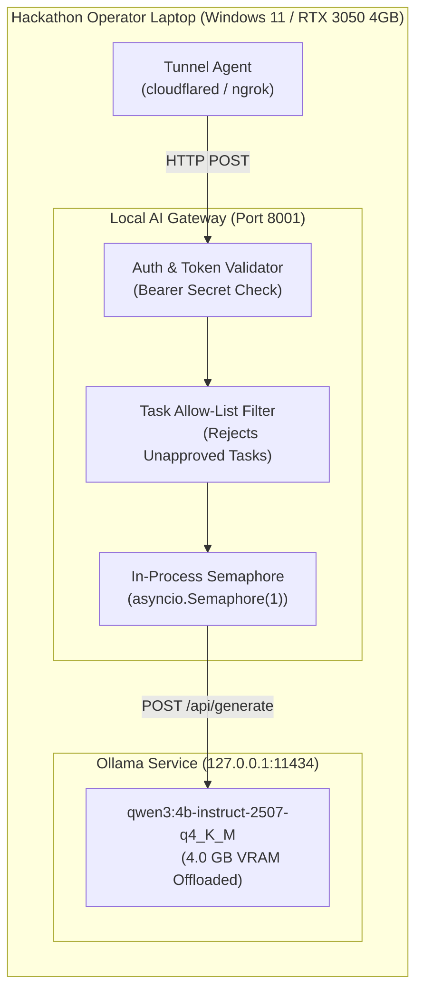
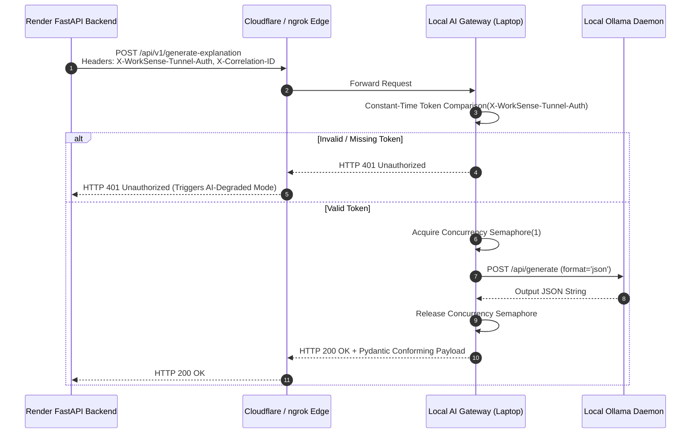
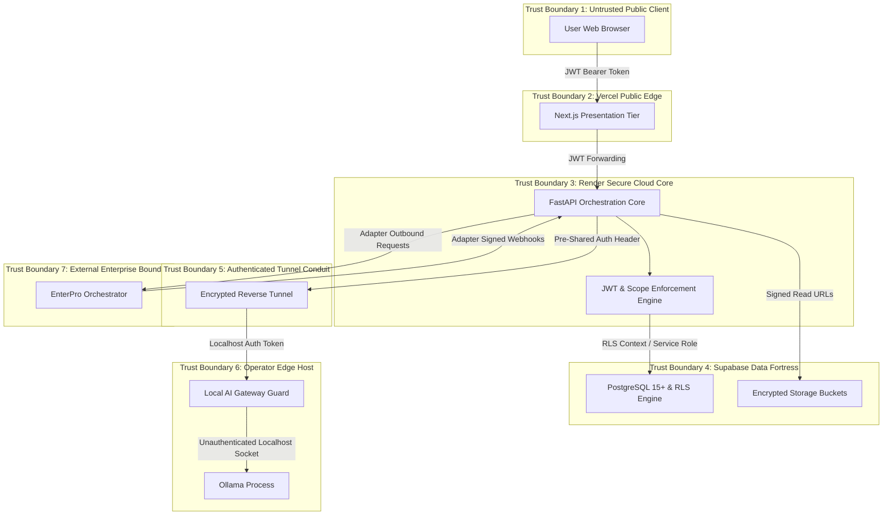
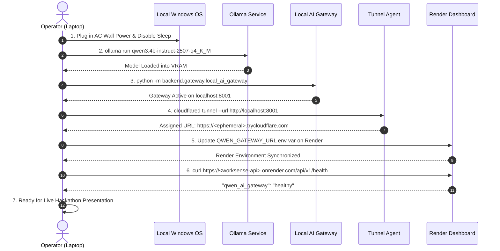
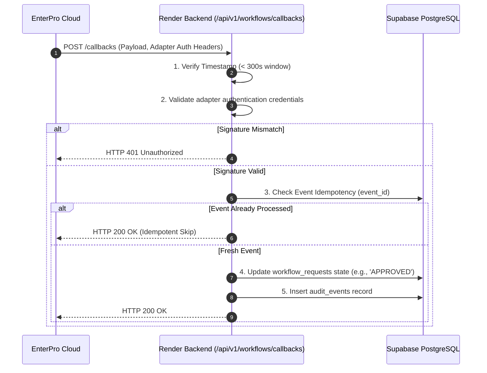
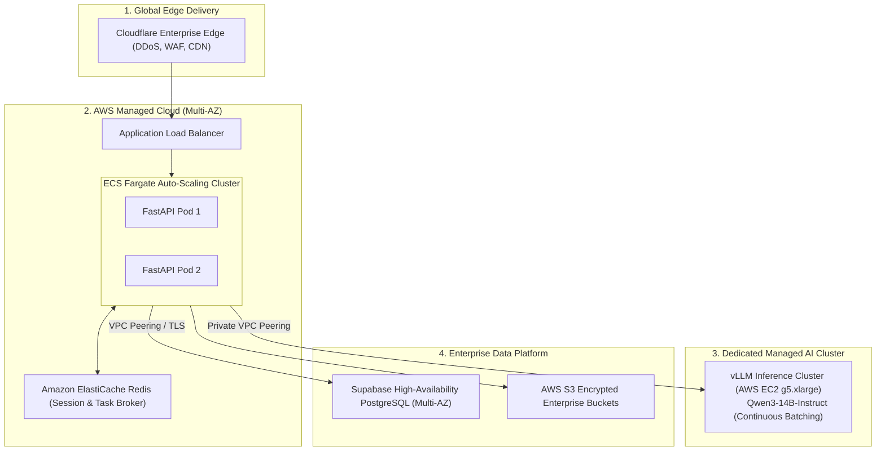

# WorkSense — Deployment Architecture and Operational Runbook

---

## 8.1 Document Control

| Property | Specification |
| :--- | :--- |
| **Document Title** | WorkSense Deployment Architecture and Operational Runbook |
| **Product Name** | **WorkSense** (Strictly locked; legacy aliases 'NEXUS', 'Nexus', 'Woot' are obsolete and prohibited) |
| **Document Type** | Authoritative Hosting Topology, Infrastructure Security, Network Boundary, and Operational Runbook Specification |
| **Status** | Approved Baseline (Implementation Ready) |
| **Version** | 1.0.0 |
| **Last Updated Date** | 2026-09-12 |
| **Owner** | WorkSense DevOps & Infrastructure Engineering Group |
| **Intended Audience** | DevOps Engineers, Backend Engineers, Frontend Engineers, Hackathon Operators, Security Auditors, Technical Judges |
| **Source-of-Truth Statement** | The PRD (`docs/01-PRD.md`) defines product requirements. The TRD (`docs/02-TRD.md`) defines technical stack boundaries. The Workflow + Roles specification (`docs/03-Workflow-Roles.md`) defines state machines and human sign-offs. The UI/UX specification (`docs/04-UI-UX-Design.md`) defines screen layouts and client contracts. The Database + API specification (`docs/05-Database-API.md`) defines tables, RLS, and endpoints. The System Architecture specification (`docs/06-System-Architecture.md`) defines modular monolith structure. The AI + ML Architecture (`docs/07-AI-ML-Architecture.md`) defines model boundaries and solvers. This document defines **where WorkSense components run, how they securely interconnect across managed clouds and local hardware, how secrets are managed, how the hackathon demonstration is operated, and how failures degrade gracefully**. |
| **Related Documents** | `docs/01-PRD.md`, `docs/02-TRD.md`, `docs/03-Workflow-Roles.md`, `docs/04-UI-UX-Design.md`, `docs/05-Database-API.md`, `docs/06-System-Architecture.md`, `docs/07-AI-ML-Architecture.md` |
| **Change Control Note** | Cloud hosting topologies, network boundaries, tunnel configurations, secret policies, and fallback modes must not be modified without formal Deployment Decision Record (ADR) approval. |

---

## 8.2 Purpose and Scope

### 8.2.1 Purpose
This document provides the definitive operational blueprint for deploying, securing, interconnecting, and operating **WorkSense** in the context of HackDriven's *Build Bengaluru* Hackathon. It bridges the gap between software engineering and operational reality, establishing strict runtime trust boundaries, secret containment, health evaluation, and emergency recovery procedures.

### 8.2.2 Scope Boundaries
* **What This Document Governs:**
  * Public cloud hosting topology: **Next.js frontend on Vercel**, **FastAPI backend on Render**, and **PostgreSQL/Auth/Storage/pgvector on Supabase**.
  * Local edge AI hosting: Local **Ollama daemon** running `qwen3:4b-instruct-2507-q4_K_M` on the hackathon laptop GPU, shielded behind an in-process **Local AI Gateway**.
  * Secure ingress tunneling connecting Render to the local laptop via an authenticated HTTPS tunnel (Cloudflare Tunnel or ngrok).
  * Enterprise workflow orchestration and deployment integration with **EnterPro**.
  * Network flow definitions, CORS configurations, trust boundaries, and EnterPro adapter webhook authentication.
  * Operational runbooks: demo startup, graceful shutdown, health/readiness checks, degraded fallback modes (Level 0 through Level 4), and disaster recovery.
* **What This Document Explicitly Delegates:**
  * Application business logic and domain service implementations belong to `docs/06-System-Architecture.md`.
  * Algorithmic formulations and statistical survival analysis belong to `docs/07-AI-ML-Architecture.md`.
  * Database schema migrations and Row-Level Security policies belong to `docs/05-Database-API.md`.
  * Kubernetes cluster deployment, autoscaled GPU pods, multi-region failover, and zero-downtime database migrations are explicitly designated as post-hackathon enterprise roadmap targets.

---

## 8.3 Sources Reviewed

| Source Document | File Location | Status | Authority Level | Deployment Decisions Derived | Observed Conflicts & Resolutions |
| :--- | :--- | :--- | :--- | :--- | :--- |
| **Hackathon Context** | `outputs/HR_Hackathon_Project_Context.md` | Active | Primary Mandate | Mandatory local Qwen execution; EnterPro enterprise workflow governance. | None. Reflected directly in hybrid cloud-edge topology. |
| **WorkSense PRD** | `docs/01-PRD.md` | Approved | Product Baseline | 7 user roles; 90-day AI Fraud Team scenario; continuous Candidate-to-Employee Twin lifecycle. | None. Operational topology sized to support Golden Demo narrative. |
| **WorkSense TRD** | `docs/02-TRD.md` | Approved | Technical Baseline | Vercel (Next.js), Render (FastAPI), Supabase (PostgreSQL 15+), local Ollama (RTX 3050 4GB). | None. Technical boundaries locked to TRD modular monolith. |
| **Workflow & Roles** | `docs/03-Workflow-Roles.md` | Approved | Operational Baseline | EnterPro 10-state machine; cross-role handoffs; human approval gates for consequential actions. | Addressed: Render backend manages signed webhook sync with EnterPro. |
| **UI/UX & Design** | `docs/04-UI-UX-Design.md` | Approved | Experience Baseline | WHAT-WHY-EVIDENCE-WHAT NEXT UI paradigm; client status vocabulary; offline state banners. | Addressed: Frontend surfaces distinct offline pill indicators when AI is degraded. |
| **Database & API** | `docs/05-Database-API.md` | Approved | Data & API Baseline | 16 core data domains (36 proposed prototype tables); 54 proposed REST endpoints; pgvector 384d schema; RLS access boundaries. | Addressed: Supabase service-role key restricted strictly to Render backend. |
| **System Architecture** | `docs/06-System-Architecture.md` | Approved | Structural Baseline | Modular monolith; AI Document Firewall; trust boundaries; synchronous/asynchronous flows. | Addressed: Infrastructure topology directly mirrors C4 deployment model. |
| **AI + ML Architecture**| `docs/07-AI-ML-Architecture.md` | Approved | AI/ML Baseline | Local Qwen3-4B-Instruct; LightGBM ranker; Cox survival model; OR-Tools CP-SAT; TreeSHAP. | Addressed: Local AI Gateway isolates Ollama; non-AI math remains cloud-hosted. |

---

## 8.4 Deployment Executive Summary

**WorkSense** utilizes a pragmatic, highly reliable **Hybrid Cloud-Edge Architecture** tailored specifically for competitive hackathon presentation:
1. **Presentation Tier (Vercel):** The Next.js 14+ frontend is deployed on Vercel's global edge network, delivering zero-configuration server-side rendering, edge asset caching, and lightning-fast user interaction across dark and light themes.
2. **Application & Orchestration Tier (Render):** The FastAPI Python backend is deployed as a Web Service on Render. It acts as the single external integration boundary, enforcing Supabase JWT authentication, Row-Level Security propagation, OR-Tools optimization, deterministic rules evaluation, and EnterPro webhook synchronization.
3. **Data Platform Tier (Supabase Managed Cloud):** Core relational persistence, transactional integrity, JSONB document storage, encrypted object storage for resumes/policies, and 384-dimensional vector similarity search via `pgvector` are fully hosted on Supabase PostgreSQL 15+.
4. **Local Edge AI Inference Tier (Hackathon Laptop):** Natural-language reasoning and intent parsing are powered by the locked **`qwen3:4b-instruct-2507-q4_K_M`** model running locally on the operator's laptop via **Ollama**. To eliminate public exposure and resource exhaustion, Ollama is shielded behind an in-process **Local AI Gateway** that enforces API key authentication, request size bounding, concurrency throttling, and schema validation.
5. **Secured Ingress Tunnel:** Render securely communicates with the local AI gateway over an authenticated, encrypted HTTPS tunnel (Cloudflare Tunnel or ngrok). The public browser has zero network path to Ollama or the tunnel.
6. **Enterprise Workflow Governance (EnterPro):** Governed operational actions (such as remote work policy exceptions, onboarding hardware provisioning, and internal mobility transfers) are dispatched from Render to EnterPro via signed REST webhooks, synchronizing state upon human approval.

---

## 8.5 Deployment Goals

| Goal ID | Objective | Rationale | Architectural Implication | Verification Method |
| :--- | :--- | :--- | :--- | :--- |
| **DG-01** | **Rock-Solid Demo Reliability** | Live hackathon judging must not fail due to transient cloud errors or local GPU crashes. | Multi-tier degraded fallback states (Level 0 through Level 4); pre-warmed cache. | Simulated laptop disconnect test; verify frontend displays offline badge without crashing. |
| **DG-02** | **Zero Browser Exposure of Local AI**| Public clients must never interact directly with the hackathon laptop or Ollama port. | Render backend acts as sole authorized client to the secure tunnel; strict CORS. | Network inspection verifying browser only transmits HTTPS to Vercel and Render. |
| **DG-03** | **Zero Secret Leakage** | Service-role keys, database passwords, and tunnel tokens must never enter client bundles. | Server-side environment isolation; client receives only public publishable keys. | Automated grep on production Next.js build bundle for secret patterns. |
| **DG-04** | **Deterministic Cold-Start Mitigation**| Render free-tier or sleep-mode instances must not cause judge-facing latency timeouts. | Pre-demo warm-up script; ping health endpoint 5 minutes prior to live presentation. | Automated curl script verifying HTTP 200 within 200ms before judging starts. |
| **DG-05** | **Honest Prototype Architecture** | Transparently distinguish between live local AI reasoning, cloud solvers, and seeded demo data. | Explicit UI provenance labels; no fabricated AI claims when offline. | Visual inspection of status pills on Insight Cards during degraded mode testing. |
| **DG-06** | **Rapid Reproducible Recovery** | System must be fully restorable within 180 seconds in the event of laptop sleep or power loss. | Documented 16-step startup runbook and pre-configured environment templates. | Timed dry-run recovery drill from cold laptop boot to live Golden Demo execution. |

---

## 8.6 Deployment Non-Goals

The following enterprise capabilities are deliberately excluded from the hackathon prototype:
* **Kubernetes (K8s) Cluster Deployment:** Complex container orchestration, Helm charts, and custom ingress controllers are excluded in favor of serverless Vercel and managed Render services.
* **Autoscaled Cloud GPU Model Serving:** Hosting Qwen on AWS EC2 `g5.xlarge` or RunPod is excluded; the model is mandated to execute locally on the operator's consumer GPU.
* **Multi-Region Active-Active Database Replication:** Supabase single-region deployment is sufficient; geo-distributed consensus protocols are out of scope.
* **Dedicated Enterprise Message Brokers (Kafka / RabbitMQ):** In-process asynchronous task queues and direct webhook synchronization replace external message brokers.
* **Zero-Downtime Database Schema Blue/Green Migrations:** Database migrations are applied synchronously during pre-demo deployment windows.
* **Automated Continuous Online Model Retraining:** Models are statically versioned; online self-retraining pipelines are strictly prohibited.

---

## 8.7 Deployment Constraints

```text
+------------------------------------------------------------------------------------+
|                         WORKSENSE OPERATIONAL CONSTRAINTS                          |
+------------------------------------------------------------------------------------+
| 1. HARDWARE CONSTRAINT: Laptop running Ollama possesses limited VRAM (RTX 3050 4GB).|
|    Inference concurrency MUST be throttled to 1 active request via Semaphore.      |
|                                                                                    |
| 2. CONNECTIVITY CONSTRAINT: Local AI depends on laptop Wi-Fi and tunnel stability. |
|    If laptop sleeps, closes lid, or drops Wi-Fi, remote Qwen calls immediately fail|
|                                                                                    |
| 3. MODEL CONSTRAINT: Primary Qwen model is strictly text-only. Programmatic text  |
|    extraction MUST execute on Render/FastAPI before dispatching prompt to Qwen.    |
|                                                                                    |
| 4. RENDER TIMEOUT CONSTRAINT: Render Web Service enforces client request timeouts. |
|    Qwen gateway calls enforce a hard 15.0s timeout to avoid dropping Render sockets|
|                                                                                    |
| 5. SECRECY CONSTRAINT: Supabase service-role keys bypass all Row-Level Security.    |
|    Service-role keys MUST NOT be configured in Vercel client-accessible env vars.  |
+------------------------------------------------------------------------------------+
```

---

## 8.8 Environment Model

WorkSense defines four discrete operational environments:

| Dimension | 1. Local Development (`local`) | 2. Shared Prototype (`staging`) | 3. Hackathon Demo (`demo`) | 4. Production Target (`prod`) |
| :--- | :--- | :--- | :--- | :--- |
| **Purpose** | Developer feature iteration | Integration testing & UAT | Live hackathon presentation | Enterprise production |
| **Frontend Host** | `localhost:3000` (Next.js) | Vercel Preview URL | Vercel Production Domain | Vercel Enterprise / Custom CDN |
| **Backend Host** | `localhost:8000` (FastAPI) | Render Staging Service | Render Production Web Service | Dedicated Render / ECS Cluster |
| **Database Tier** | Local / Dev Supabase Project | Staging Supabase Project | Dedicated Demo Supabase Project| High-Availability Supabase Pro |
| **Qwen Host** | `localhost:11434` (Ollama) | Local Laptop via Tunnel | Local Laptop via Secure Tunnel | Managed vLLM Cloud GPU Cluster |
| **EnterPro Tier** | Mock Webhook Server | EnterPro Sandbox Account | Official Hackathon EnterPro Org| Enterprise EnterPro Production |
| **Data Scope** | Minimal mock fixtures | Full synthetic dataset | Curated 90-Day Golden Demo Set | Anonymized Historical HRIS Data |
| **Debug Mode** | Verbose / Reload Active | Verbose error logging | Strict production error masks | Distributed OpenTelemetry traces|

---

## 8.9 Environment Isolation

To ensure stability during live judging, strict isolation boundaries are enforced:
* **Distinct Supabase Projects:** The Hackathon Demo environment operates against a dedicated Supabase project ID, ensuring that local developer experiments cannot corrupt presentation records.
* **Isolated Environment Configurations:** Vercel and Render configurations utilize explicit environment scoping (`production` vs `preview` vs `development`).
* **Storage Bucket Namespacing:** Resumes and policies are segregated into dedicated buckets (`demo-resumes`, `demo-policies`) with strict RLS policies.
* **Anti-Cross-Talk Safeguard:** The Render demo backend rejects tunnel connections unless the request headers contain the pre-shared secret (`X-WorkSense-Tunnel-Auth`).

---

## 8.10 High-Level Deployment Diagram

```mermaid
flowchart TD
    subgraph PublicInternet["1. Public Internet Tier"]
        USER["User Web Browser (Desktop / Mobile)"]
    end

    subgraph VercelCloud["2. Presentation Tier (Vercel Global Edge)"]
        FE["WorkSense Next.js 14+ Frontend
        (SSR, React Server Components, Tailwind CSS)"]
    end

    subgraph RenderCloud["3. Application & Orchestration Tier (Render Managed Cloud)"]
        BE["WorkSense FastAPI Modular Monolith
        (Python 3.11, OR-Tools CP-SAT, Lifelines Survival)"]
        FW["AI Document Firewall
        (Text Extractor, Macro Stripper, XML Boundaries)"]
    end

    subgraph SupabaseCloud["4. Data Platform Tier (Supabase Managed Cloud)"]
        AUTH["Supabase Auth (JWT Engine)"]
        PG["PostgreSQL 15+ (Authoritative Records & RLS)"]
        PGV["pgvector Extension (384d Embeddings)"]
        STOR["Supabase Storage (Encrypted Resumes & Policies)"]
    end

    subgraph TunnelProvider["5. Ingress Tunnel Infrastructure"]
        TUN_CLOUD["Cloudflare Tunnel / ngrok Edge
        (Encrypted TLS 1.3 Reverse Proxy)"]
    end

    subgraph LaptopHost["6. Local Operator Host Tier (Hackathon Laptop - RTX 3050)"]
        TUN_CLIENT["Tunnel Client (cloudflared / ngrok agent)"]
        GW["Local AI Gateway (FastAPI / Port 8001)
        (Auth, Concurrency Semaphore, Schema Validation)"]
        OLLAMA["Ollama Daemon (Port 11434 - 127.0.0.1)
        qwen3:4b-instruct-2507-q4_K_M"]
    end

    subgraph EnterpriseTier["7. Enterprise Governance Tier"]
        ENTERPRO["EnterPro Workflow Engine
        (Human Approvals & Webhook Callback Signer)"]
    end

    %% Network Connections
    USER -->|HTTPS / TLS 1.3| FE
    USER -->|Direct Auth Token Handshake| AUTH
    FE -->|HTTPS / REST + JWT Bearer| BE
    
    BE -->|SQL Pooler (Port 5432) / RLS| PG
    BE -->|pgvector Cosine Queries| PGV
    BE -->|S3 REST / Signed URLs| STOR
    BE -->|JWT Verification| AUTH
    
    BE -->|HTTPS / Adapter Workflow Requests| ENTERPRO
    ENTERPRO -->|HTTPS / Callback Signature| BE

    BE -->|HTTPS / X-WorkSense-Tunnel-Auth| TUN_CLOUD
    TUN_CLOUD -->|Outbound Encrypted WebSocket| TUN_CLIENT
    TUN_CLIENT -->|HTTP / Localhost:8001| GW
    GW -->|HTTP / Localhost:11434| OLLAMA
```

---

## 8.11 Vercel Frontend Deployment

### 8.11.1 Build Specification
* **Framework:** Next.js 14.2+ (App Router).
* **Node Runtime:** Node.js 20.x LTS.
* **Build Command:** `npm run build` (executing `next build`).
* **Output Directory:** `.next` (Standard standalone serverless bundle).

### 8.11.2 Frontend Environment Variables
```ini
# PUBLIC / CLIENT ACCESSIBLE (Exposed via NEXT_PUBLIC_ prefix)
NEXT_PUBLIC_APP_NAME="WorkSense"
NEXT_PUBLIC_APP_ENV="demo"
NEXT_PUBLIC_SUPABASE_URL="https://<demo-project-id>.supabase.co"
NEXT_PUBLIC_SUPABASE_ANON_KEY="eyJhbGciOiJIUzI1NiIsInR5cCI6IkpXVCJ9..."
NEXT_PUBLIC_API_BASE_URL="https://<worksense-api>.onrender.com/api/v1"

# SERVER-SIDE ONLY (Never exposed to browser bundle)
# Strictly zero server-side secrets permitted in Vercel for prototype
```

### 8.11.3 Client Security Headers
Configured in `next.config.js`:
* `X-Frame-Options: DENY`
* `X-Content-Type-Options: nosniff`
* `Referrer-Policy: strict-origin-when-cross-origin`
* `Permissions-Policy: camera=(), microphone=(), geolocation=()`

---

## 8.12 Render Backend Deployment

### 8.12.1 Service Specification
* **Service Type:** Web Service (Render Python Environment).
* **Python Runtime:** Python 3.11.9.
* **Build Command:** `pip install --upgrade pip && pip install -r requirements.txt`
* **Start Command:** `uvicorn backend.main:app --host 0.0.0.0 --port $PORT --workers 1`
* **Worker Allocation:** Strictly **1 worker** to prevent race conditions during in-process OR-Tools optimization and local memory thrashing.

### 8.12.2 Backend Environment Variables
```ini
# SYSTEM & ENVIRONMENT
ENVIRONMENT="demo"
LOG_LEVEL="INFO"
ALLOWED_ORIGINS="https://<worksense-frontend>.vercel.app,http://localhost:3000"

# SUPABASE DATA PLATFORM
SUPABASE_URL="https://<demo-project-id>.supabase.co"
SUPABASE_ANON_KEY="eyJhbGciOiJIUzI1NiIsInR5cCI6IkpXVCJ9..."
SUPABASE_SERVICE_ROLE_KEY="eyJhbGciOiJIUzI1NiIsInR5cCI6IkpXVCJ9...<SECRET>"
DATABASE_URL="postgresql://postgres.<demo-project-id>:<DB_PASSWORD>@aws-0-ap-south-1.pooler.supabase.com:5432/postgres"

# LOCAL AI GATEWAY TUNNEL
QWEN_GATEWAY_URL="https://<tunnel-domain>.trycloudflare.com"
QWEN_TUNNEL_SECRET="ws_tunnel_sec_<RANDOM_64_CHAR_HEX>"
QWEN_TIMEOUT_SECONDS="15.0"
QWEN_MODEL_NAME="qwen3:4b-instruct-2507-q4_K_M"

# ENTERPRO WORKFLOW GOVERNANCE
ENTERPRO_BASE_URL="https://api.enterpro.hackathon.internal/v1"
ENTERPRO_CLIENT_ID="ep_client_worksense"
ENTERPRO_CLIENT_SECRET="ep_sec_<SECRET>"
ENTERPRO_WEBHOOK_SECRET="ep_whsec_<SECRET>"
```

---

## 8.13 Supabase Deployment

* **Database Engine:** PostgreSQL 15.6 with `pgvector v0.6.0+` enabled.
* **Connection Pooling:** Connected via Supabase Transaction Pooler (port 5432) using PgBouncer for efficient connection recycling under concurrent FastAPI async requests.
* **Row-Level Security (RLS) Mandate:** RLS is enabled across all 36 core relational tables. Tables containing employee retention scores (`attrition_predictions`) are locked strictly to the `hr_bp` role.
* **Storage Buckets:**
  * `resumes`: Private bucket; signed download URLs expire after 900 seconds.
  * `policies`: Private bucket; readable by authenticated employees.

---

## 8.14 Local AI Host Architecture

The operator's laptop executes the local AI tier:



---

## 8.15 Local AI Gateway Versus Direct Ollama Exposure

WorkSense strictly prohibits exposing raw Ollama (`127.0.0.1:11434`) directly to the tunnel. The **Local AI Gateway** (`backend/gateway/local_ai_gateway.py`) is required because:
1. **Authentication Enforcement:** Raw Ollama has zero authentication; any internet user discovering the URL could execute arbitrary inferences. The gateway enforces the pre-shared `X-WorkSense-Tunnel-Auth` secret.
2. **Concurrency Protection:** Multiple concurrent requests crash local 4GB consumer GPUs. The gateway's `Semaphore(1)` safely queues requests.
3. **Task Scope Bounding:** The gateway rejects arbitrary prompt injections and restricts generation solely to approved Task IDs (`Q-TASK-01` through `Q-TASK-06`).
4. **Hard Timeouts:** Enforces client-side cancellation if inference stalls past 15.0 seconds.

---

## 8.16 Secure Tunnel Architecture

The operator establishes an outbound-only HTTPS tunnel from the laptop to a public edge proxy:
* **Approved Tunnel Providers:** **Cloudflare Tunnel** (preferred) or **ngrok**.
* **Outbound-Only Invariant:** The tunnel client initiates an outbound TLS connection to Cloudflare/ngrok edge nodes. No incoming firewall ports are opened on the laptop or local Wi-Fi router.
* **Dynamic URL Handling:** When the tunnel initializes, it outputs a dynamic hostname (e.g., `https://random-word.trycloudflare.com`). The operator updates the `QWEN_GATEWAY_URL` environment variable on Render.

---

## 8.17 Tunnel Authentication



---

## 8.18 Network Flow Matrix

| Flow ID | Source Component | Destination Component | Protocol / Port | Auth Mechanism | Data Classification | Timeout | Retry Policy |
| :--- | :--- | :--- | :--- | :--- | :--- | :--- | :--- |
| **NET-01** | User Browser | Vercel Edge Frontend | HTTPS / 443 | None (Public UI Assets) | Public HTML/JS/CSS | 10.0s | None |
| **NET-02** | User Browser | Supabase Auth | HTTPS / 443 | Anon Key + User Credentials | Sensitive Auth Tokens | 10.0s | 1 Retry |
| **NET-03** | Vercel Edge / Browser| Render FastAPI Backend | HTTPS / 443 | Supabase JWT Bearer Token | Role-Scoped Business Data | 25.0s | 0 Retries |
| **NET-04** | Render Backend | Supabase PostgreSQL | TCP (TLS) / 5432 | DB Username & Password | Authoritative Records | 10.0s | 2 Retries |
| **NET-05** | Render Backend | Supabase Storage API | HTTPS / 443 | Service Role Key | Encrypted PDF Artifacts | 15.0s | 1 Retry |
| **NET-06** | Render Backend | Secure Tunnel Edge | HTTPS / 443 | `X-WorkSense-Tunnel-Auth` | Masked Context Prompts | 15.0s | 0 Retries |
| **NET-07** | Tunnel Client | Local AI Gateway | HTTP / 8001 | Pre-shared Bearer Secret | Masked Context Prompts | 15.0s | 0 Retries |
| **NET-08** | Local AI Gateway | Local Ollama Daemon | HTTP / 11434 | Localhost Only (Bound 127.0.0.1)| Raw Token Stream | 15.0s | 0 Retries |
| **NET-09** | Render Backend | EnterPro API Gateway | HTTPS / 443 | Configurable Adapter Auth | Governed Workflow Request | 10.0s | 2 Retries |
| **NET-10** | EnterPro Webhook Signer| Render Callback Route | HTTPS / 443 | Configurable Adapter Header (TBD) | Approval State Updates | 10.0s | Upstream Retry|

---

## 8.19 Trust Boundary Analysis



---

## 8.20 DNS and URL Strategy

All production and demo traffic utilizes TLS 1.3 HTTPS. No cleartext HTTP endpoints are permitted:
* **Frontend Production URL:** `https://worksense-app.vercel.app` (Placeholder: real Vercel assigned domain).
* **Backend API Base URL:** `https://worksense-api.onrender.com/api/v1` (Placeholder: real Render service domain).
* **Supabase API Gateway:** `https://<demo-project-id>.supabase.co`
* **Dynamic Ingress Tunnel URL:** `https://<ephemeral-id>.trycloudflare.com` (Rotated upon each tunnel initialization).

---

## 8.21 CORS and Browser Security

* **FastAPI CORS Middleware Configuration:**
  ```python
  app.add_middleware(
      CORSMiddleware,
      allow_origins=[
          "https://worksense-app.vercel.app",
          "http://localhost:3000"  # Permitted for local frontend development only
      ],
      allow_credentials=True,
      allow_methods=["GET", "POST", "PUT", "PATCH", "DELETE", "OPTIONS"],
      allow_headers=["Authorization", "Content-Type", "X-Correlation-ID"],
      max_age=600
  )
  ```
* **Strict Browser Isolation:** The browser is never granted CORS permission to query the tunnel URL or the local AI gateway.

---

## 8.22 Authentication Across Components

1. **User to Frontend/Backend:** Handled via Supabase Auth issuing RS256-signed JWTs containing user UUID, email, and role claim (`recruiter`, `interviewer`, `manager`, `employee`, `hr_bp`, `leadership`, `admin`).
2. **Backend to Supabase PostgreSQL:** Authenticated via TLS connection string using the PostgreSQL credentials. Backend injects `auth.uid()` and `auth.role()` into session settings to enforce Row-Level Security.
3. **Backend to Local AI Gateway:** Authenticated using the `X-WorkSense-Tunnel-Auth` HTTP header carrying a high-entropy pre-shared key.
4. **Backend to EnterPro & Return Webhook:** Outbound requests dispatched via EnterProAdapter; incoming callbacks validated using configurable authentication headers (exact scheme TBD pending official documentation).

---

## 8.23 Secret Management Inventory

| Secret Name | Consumed By | Environment | Sensitivity | Storage Location | Invalidation / Rotation Action |
| :--- | :--- | :--- | :--- | :--- | :--- |
| `NEXT_PUBLIC_SUPABASE_ANON_KEY` | Vercel Frontend | Demo & Staging | Low (Public) | Vercel Env Vars | Rotate via Supabase Dashboard |
| `SUPABASE_SERVICE_ROLE_KEY` | Render Backend | Demo & Staging | **CRITICAL** | Render Env Vars (Secret) | Immediate rotation; rebuild Render |
| `DATABASE_URL` | Render Backend | Demo & Staging | **CRITICAL** | Render Env Vars (Secret) | Reset DB password in Supabase |
| `QWEN_TUNNEL_SECRET` | Render & Local GW | Demo Only | High | Render Env & Local `.env` | Generate new 64-char hex string |
| `ENTERPRO_CLIENT_SECRET` | Render Backend | Demo & Staging | High | Render Env Vars (Secret) | Re-issue in EnterPro Console |
| `ENTERPRO_WEBHOOK_SECRET` | Render Backend | Demo & Staging | High | Render Env Vars (Secret) | Rotate signing key in EnterPro |

---

## 8.24 Configuration Matrix

| Component | Setting Name | Mandatory? | Format / Type | Example Value | Purpose |
| :--- | :--- | :--- | :--- | :--- | :--- |
| **Vercel** | `NEXT_PUBLIC_API_BASE_URL` | YES | URL String | `https://worksense-api.onrender.com/api/v1` | Points frontend to Render backend |
| **Render** | `ALLOWED_ORIGINS` | YES | Comma-delimited | `https://worksense-app.vercel.app` | Restricts browser CORS origins |
| **Render** | `QWEN_GATEWAY_URL` | YES | URL String | `https://edge-tunnel.trycloudflare.com` | Directs AI requests to secure tunnel |
| **Render** | `QWEN_TIMEOUT_SECONDS` | YES | Float | `15.0` | Prevents hanging sockets |
| **Local Host** | `LOCAL_OLLAMA_URL` | YES | URL String | `http://127.0.0.1:11434` | Gateway communication to Ollama |
| **Local Host** | `LOCAL_PORT` | YES | Integer | `8001` | Ingress port for tunnel traffic |

---

## 8.25 Build Architecture

```mermaid
flowchart TD
    subgraph FrontendBuild["Vercel Build Pipeline"]
        SRC_FE["Git Push / Trigger"] --> INSTALL_FE["npm ci (Node 20)"]
        INSTALL_FE --> LINT_FE["npm run lint && npm run typecheck"]
        LINT_FE --> NEXT_BUILD["next build (Standalone Output)"]
        NEXT_BUILD --> DEPLOY_FE["Deploy Serverless Functions & Edge CDN"]
    end

    subgraph BackendBuild["Render Build Pipeline"]
        SRC_BE["Git Push / Trigger"] --> INSTALL_BE["pip install -r requirements.txt"]
        INSTALL_BE --> TEST_BE["pytest tests/unit/"]
        TEST_BE --> START_BE["uvicorn backend.main:app (Port $PORT)"]
    end
```



---

## 8.26 CI/CD Pipeline

WorkSense enforces a lightweight, hackathon-safe continuous deployment pipeline:
1. **Developer Branch:** Local feature development and testing against local Supabase instance.
2. **Pull Request Validation:** GitHub Actions executes automated linting (`ruff`), typechecking (`mypy`), and unit testing (`pytest`).
3. **Staging Preview:** Merges to `main` trigger automated deployments to Vercel preview environments.
4. **Manual Demo Promotion:** The `demo` branch is strictly protected. Deployments to production Render and Vercel services require manual operator promotion to prevent breaking changes during live judging.

---

## 8.27 Branch and Release Strategy

* `main`: Active development branch for integration testing.
* `demo-freeze`: Locked release branch utilized during hackathon presentations.
* **Code Freeze Protocol:** 2 hours prior to live judging, `demo-freeze` is locked. Zero further commits or dependency updates are permitted unless resolving an active Level 1 disaster.

---

## 8.28 Database Migration Deployment

* **Migration Engine:** Managed SQL migrations located in `backend/database/migrations/`.
* **Execution Strategy:** Migrations are applied explicitly via the Supabase CLI or management dashboard. Automated, uninspected migrations on application startup are **strictly prohibited** to prevent schema corruption.
* **Additive-Only Invariant:** Hackathon migrations must be strictly additive (new tables, new nullable columns). Dropping tables or renaming active columns is prohibited.

---

## 8.29 Seed Data Deployment

To guarantee an impactful live demonstration, the database is pre-seeded with the curated **90-Day Golden Demo Dataset**:
* **Target Scenario:** Staffing the 8-person AI Fraud Detection Team in 90 days.
* **Candidate Persona:** Sarah Lin (Staff ML Candidate, 94% match, PR #402 citation - Fictional Demo Seed Data).
* **Retention Persona:** Marcus Chen (L5 Senior Infra Lead, 6-Month Hazard = 72%, Tenure Stagnation = +34% - Fictional Demo Seed Data).
* **Policy Documents:** Global Remote Work Policy v4.1 and Probation Guidelines Addendum.
* **Reseed Script:** An idempotent Python script (`backend/scripts/seed_demo_data.py`) enables the operator to wipe and re-seed the entire demo state within 15 seconds.

---

## 8.30 Static Assets and Branding Deployment

* **Asset Containment:** All WorkSense logos, SVG icons, and theme illustrations reside in `/public/assets/`.
* **Zero Copying of Reference Brands:** Branding strictly follows the bespoke *Electric Blue & Cyber Lime* design system defined in `docs/04-UI-UX-Design.md`.
* **Optimized Loading:** Fonts (Outfit and Inter) are preloaded via `next/font/google` to guarantee zero layout shift (CLS = 0).

---

## 8.31 Health Checks

The backend provides a structured, multi-component health evaluation endpoint at `/api/v1/health`:

```json
{
  "status": "degraded",
  "timestamp": "2026-09-12T19:30:00Z",
  "environment": "demo",
  "version": "1.0.0",
  "components": {
    "database": { "status": "healthy", "latency_ms": 12 },
    "storage": { "status": "healthy", "latency_ms": 28 },
    "qwen_ai_gateway": { "status": "unavailable", "detail": "Tunnel connection timed out (15.0s)" },
    "enterpro_orchestrator": { "status": "healthy", "latency_ms": 45 }
  }
}
```
* **Liveness Probe:** Returns HTTP 200 if FastAPI process is running.
* **Readiness Probe:** Evaluates database connectivity; returns HTTP 503 if Supabase is unreachable. Notice: Local Qwen unavailability causes a `'degraded'` health status but **does not take down the API**.

---

## 8.32 Readiness and Degraded Modes

```text
+------------------------------------------------------------------------------------+
|                         WORKSENSE OPERATIONAL MODES                                |
+------------------------------------------------------------------------------------+
| MODE             | CONDITION                     | SYSTEM BEHAVIOR                 |
| :--------------- | :---------------------------- | :------------------------------ |
| HEALTHY          | All components reachable      | Full live reasoning & workflows |
| AI-DEGRADED      | Laptop asleep / Tunnel broken | Stored data works; AI shows pill|
| WORKFLOW-DEGRADED| EnterPro unreachable          | Workflows queue in PENDING state|
| CRITICAL         | Supabase PostgreSQL down      | Emergency maintenance screen    |
+------------------------------------------------------------------------------------+
```

---

## 8.33 Timeout and Retry Policy

| Flow | Timeout Ceiling | Max Retries | Backoff Strategy | Idempotency Safeguard |
| :--- | :--- | :--- | :--- | :--- |
| **Browser → Render** | 25.0s | 0 | None | N/A |
| **Render → Supabase DB** | 10.0s | 2 | Exponential (100ms, 200ms) | Transaction Rollback |
| **Render → Qwen Gateway**| 15.0s | 0 | None (Immediate Fallback)| Safe Read-Only Task |
| **Gateway → Ollama** | 15.0s | 0 | None (Fail Fast) | In-Memory Semaphore |
| **Render → EnterPro** | 10.0s | 2 | Exponential (500ms, 1000ms)| Unique `request_id` |

---

## 8.34 Render Cold Start and Resource Constraints

* **Cold Start Management:** Free or starter Render instances spin down after inactivity. 
* **Operator Protocol:** 5 minutes prior to live presentation, the operator runs a keep-warm script (`curl -I https://<worksense-api>.onrender.com/api/v1/health`) to ensure the instance is hot.
* **Memory Headroom:** FastAPI memory consumption is held under 250 MB; heavy survival model fits and OR-Tools solvers execute within tightly bounded memory windows.

---

## 8.35 Local GPU and Qwen Operations

* **VRAM Allocation:** `qwen3:4b-instruct-2507-q4_K_M` occupies approximately 2.8 GB VRAM. On an RTX 3050 (4GB), background GPU applications (e.g., games, 3D rendering, Chrome GPU acceleration) **MUST be terminated**.
* **Power Mandate:** The laptop must be connected to continuous AC wall power. Operating on battery triggers aggressive OS GPU downclocking and causes inference timeouts.
* **Sleep Disabling:** Windows power settings must be configured to `"Never Sleep"` and `"Do Nothing"` when the lid is closed.

---

## 8.36 Local AI Startup Sequence Runbook



---

## 8.37 Local AI Shutdown Sequence

1. Cancel any active interview or Qwen generation requests.
2. Terminate the tunnel agent process (`Ctrl + C` in tunnel terminal).
3. Terminate the Local AI Gateway process.
4. Stop the Ollama daemon (`ollama stop` or terminate process).
5. Verify in Render health check that status reflects `"qwen_ai_gateway": "unavailable"`.

---

## 8.38 EnterPro Deployment and Workflow Integration

* **Governed Workflows:** Used exclusively for high-stakes enterprise mutations:
  1. *Policy Remote Work Exceptions*
  2. *Adaptive Onboarding Hardware Provisioning*
  3. *Internal Mobility Transfers*
* **Security Credentials:** Communicates over TLS using `ENTERPRO_CLIENT_ID` and `ENTERPRO_CLIENT_SECRET`.
* **State Machine Alignment:** Maps directly to EnterPro's 10-state governance lifecycle (`DRAFT`, `SUBMITTED`, `PENDING_APPROVAL`, `APPROVED`, `EXECUTING`, `COMPLETED`, `REJECTED`, `CANCELLED`, `FAILED`, `EXPIRED`).

---

## 8.39 EnterPro Callback Architecture



---

## 8.40 Observability Architecture

WorkSense organizes telemetry into four distinct, segregated streams:
1. **Operational Telemetry:** Monitored via Render and Vercel runtime consoles (HTTP request volume, 5xx rates, endpoint latency).
2. **Security Telemetry:** Failed authentication attempts, invalid tunnel tokens, and AI Document Firewall macro strips logged to `security_events`.
3. **Business Audit Ledger:** Immutable audit trail in Supabase table `audit_events` tracking all candidate offers, policy exceptions, and human sign-offs.
4. **AI Inference Traces:** Stored in `ai_requests` recording task IDs, input token counts, generation latencies, and schema validation flags.

---

## 8.41 Alerting Strategy

Hackathon alerting utilizes lightweight webhook channels:
* **Critical Alerts:** Render API crashes or database disconnects trigger immediate push notifications to the operator's mobile device via Discord / Slack webhook.
* **Degraded AI Alerts:** The frontend automatically displays a persistent amber banner: `"AI Reasoning Engine Offline — Operating in Stored Data Mode"`.

---

## 8.42 Logging and Correlation

Every transaction generates an RFC 4122 `X-Correlation-ID`:
* Injected by Vercel frontend or generated by Render backend on request entry.
* Propagated across Supabase queries, Local AI Gateway invocations, and EnterPro callbacks.
* **Strict PII Redaction:** Passwords, JWT secrets, raw resume texts, and employee compensation numbers are sanitized prior to log output.

---

## 8.43 Backup and Disaster Recovery

* **Database Backups:** Supabase executes daily automated snapshots.
* **Pre-Demo Snapshot:** Prior to judging, the operator executes a logical database dump via `pg_dump`:
  ```bash
  pg_dump --clean --if-exists -O -x -f demo_snapshot_golden.sql "$DATABASE_URL"
  ```
* **Instant Recovery:** If live test data is corrupted during judging, the operator restores the golden state within 30 seconds using `psql -f demo_snapshot_golden.sql "$DATABASE_URL"`.

---

## 8.44 Rollback Architecture

* **Vercel Rollback:** One-click rollback in the Vercel Dashboard to the previous successful deployment hash.
* **Render Rollback:** Revert commit on `demo-freeze` or redeploy prior successful build image via Render console.
* **Database Rollback:** Reseed via `seed_demo_data.py` rather than executing risky downward DDL migrations.

---

## 8.45 Disaster and Demo Recovery Matrix

| Disaster Scenario | Root Cause | Immediate Operator Triage | Presentation Fallback Action | Recovery Time |
| :--- | :--- | :--- | :--- | :--- |
| **Laptop Wi-Fi Disconnects** | Venue network drop | Reconnect to personal phone 5G hotspot | Announce AI-degraded mode; present stored LightGBM scores | < 45 seconds |
| **Ollama Out of Memory** | Competing background app | Kill Chrome/games; restart Ollama daemon | Present Level 3 Seeded Demo Insight Cards | < 60 seconds |
| **Tunnel Domain Rotates** | Laptop sleep / restart | Copy new URL from terminal; update Render env | Refresh browser; proceed with presentation | < 90 seconds |
| **Render Webhook Timeout** | Cold start latency | Pre-warm endpoint via mobile browser | Retry action once; Render instance stays warm | < 15 seconds |
| **Judge Enters Bad Query** | Adversarial prompt | AI Firewall XML boundary strips injection | Display calibrated abstention response | Instant (0s) |

---

## 8.46 Demo Fallback Modes

```text
LEVEL 0: FULL LIVE INTERACTION
├── Vercel, Render, Supabase, and Local Qwen fully operational.
└── Live candidate reasoning, adaptive interview probes, and policy RAG active.

LEVEL 1: AI-DEGRADED MODE (Laptop / Tunnel Down)
├── Qwen reasoning offline; amber status badge visible on UI.
├── Stored candidate rankings, skill graphs, and survival curves fully operable.
└── Policy answers display pre-cached clauses with "AI Explanation Offline" note.

LEVEL 2: WORKFLOW-DEGRADED MODE (EnterPro Down)
├── Read-only operations and AI explanations fully active.
└── Mutation actions queue locally as PENDING_APPROVAL without execution.

LEVEL 3: CONTROLLED SEEDED DEMO MODE
├── Cloud services accessible, but dynamic calculations bypassed.
└── UI showcases pre-verified Golden Demo state for Sarah Lin and Marcus Chen.

LEVEL 4: STATIC BACKUP WALKTHROUGH
└── Full video recording and high-resolution screenshot deck (Judges fallback).
```

---

## 8.47 Demo Readiness Checklist

- [ ] Laptop plugged into continuous AC wall power; sleep disabled.
- [ ] Ollama running locally with `qwen3:4b-instruct-2507-q4_K_M` loaded.
- [ ] Local AI Gateway running on `localhost:8001`.
- [ ] Cloudflare / ngrok tunnel active; URL verified.
- [ ] Render `QWEN_GATEWAY_URL` matches active tunnel URL.
- [ ] Render `/api/v1/health` reports status `healthy` across all components.
- [ ] Database re-seeded to Golden Demo state (`seed_demo_data.py`).
- [ ] Vercel frontend loaded in browser tabs across both Dark and Light themes.
- [ ] Test candidate comparison, policy query, and interview probe executed successfully.
- [ ] Emergency backup slides and screen recordings accessible on desktop.

---

## 8.48 Security Hardening Summary

* **TLS 1.3 Encryption:** Enforced across all external and tunnel connections.
* **No Direct Ollama Access:** Ollama binds to `127.0.0.1`; tunnel routes exclusively through the authenticated gateway.
* **Row-Level Security:** Enforced across all tables; retention risk data restricted to HR Business Partners.
* **AI Document Firewall:** Programmatic text extraction prevents macro execution; `<untrusted_data>` boundaries prevent indirect prompt injections.
* **Zero PII in Prompts:** Sensitive employee data (salaries, protected attributes) is masked before transmission across the tunnel.

---

## 8.49 Performance and Capacity Planning

| Transaction Path | Ingested Payload | Bottleneck Component | Expected Latency | Degraded Threshold |
| :--- | :--- | :--- | :--- | :--- |
| **Initial Dashboard Load** | 12 KB JSON | Render DB Query | < 150ms | > 1,000ms |
| **Candidate Ranking Run** | 48 Candidate Vectors | LightGBM CPU Engine | < 200ms | > 800ms |
| **Survival Hazard Fit** | 600 Employee Rows | Lifelines Cox Model | < 350ms | > 1,500ms |
| **OR-Tools Headcount Solver**| 8 Roles, 30 Constraints | CP-SAT Solver | < 450ms | > 2,000ms |
| **Qwen Intent Parsing** | 150 Tokens | Laptop GPU Inference | 1,200ms - 2,500ms | > 15,000ms (Timeout)|
| **Adaptive Interview Probe** | 300 Tokens | Laptop GPU Inference | 1,800ms - 3,500ms | > 15,000ms (Timeout)|

---

## 8.50 Cost and Resource Awareness

The hackathon prototype is engineered for **$0.00 infrastructure cost**:
* **Vercel:** Deployed on Hobby Tier (Free).
* **Render:** Deployed on Free Web Service Tier.
* **Supabase:** Deployed on Free Tier (500 MB DB, 1 GB Storage).
* **Cloudflare Tunnel:** Free Tier (`cloudflared` Quick Tunnels).
* **Compute:** Local laptop consumer GPU (Zero cloud GPU inference cost).

---

## 8.51 Production Reference Deployment



---

## 8.52 Prototype-to-Production Gap Matrix

| Architectural Domain | Hackathon Prototype State | Production Target State | Transition Trigger |
| :--- | :--- | :--- | :--- |
| **LLM Inference** | Local laptop via tunnel | Managed vLLM cluster on cloud GPUs | Enterprise pilot onboarding |
| **Network Ingress** | Ephemeral Cloudflare tunnel | Private VPC Peering / AWS DirectConnect | SOC2 compliance audit |
| **Backend Compute** | Render single worker | AWS ECS Fargate auto-scaled cluster | Concurrency > 20 users |
| **Worker Processing**| In-process background tasks | Celery + Redis distributed queue | Large-scale PDF ingestion |
| **Model Versioning** | Local file checkpoints | AWS S3 Model Registry + MLflow | Multi-model production rollouts|
| **Disaster Recovery**| Manual SQL dump & re-seed | Multi-AZ automated point-in-time recovery| Enterprise SLA contract |

---

## 8.53 Deployment Requirements Catalog

* `DEP-CORE-001`: The system MUST operate as a modular monolith deployed across Vercel, Render, and Supabase.
* `DEP-VCL-001`: The frontend MUST be deployed on Vercel with zero server-side secrets exposed to the browser.
* `DEP-RND-001`: The backend MUST deploy on Render running Python 3.11 with 1 uvicorn worker.
* `DEP-SUP-001`: Supabase PostgreSQL MUST enforce Row-Level Security across all 36 core relational tables.
* `DEP-QWN-001`: Qwen inference MUST run locally via Ollama; cloud LLM hosting is strictly prohibited for prototype.
* `DEP-TUN-001`: Tunnel connections to the local laptop MUST require pre-shared `X-WorkSense-Tunnel-Auth`.
* `DEP-ENT-001`: EnterPro adapter callbacks MUST verify authentication credentials according to official specifications before updating state.
* `DEP-SEC-001`: Supabase service-role keys MUST NOT be included in frontend environment configurations.
* `DEP-CICD-001`: Deployments to production demo endpoints MUST require manual promotion from `demo-freeze`.
* `DEP-OBS-001`: Every HTTP request MUST propagate an `X-Correlation-ID` across all backend services.
* `DEP-REL-001`: If Qwen is unreachable, the system MUST enter AI-Degraded Mode without dropping data screens.
* `DEP-DEMO-001`: The system MUST support automated zero-data restoration via `seed_demo_data.py`.

---

## 8.54 Deployment Traceability Matrix

| Component | Host Environment | Core Configuration | Security Enforcement | Degraded Behavior |
| :--- | :--- | :--- | :--- | :--- |
| **Next.js Frontend** | Vercel Edge | `NEXT_PUBLIC_API_BASE_URL` | Security Headers, HTTPS Only | Offline Error Boundary |
| **FastAPI Backend** | Render Web Service | `SUPABASE_SERVICE_ROLE_KEY` | Supabase JWT & Scope Check | 503 Maintenance Mode |
| **Supabase DB** | Supabase Cloud | `DATABASE_URL` (Pooler) | RLS Policies, DB Passwords | Read-Only Cache |
| **Local AI Gateway** | Operator Laptop | `LOCAL_PORT=8001` | Pre-Shared Secret Header | Return AI-Degraded DTO |
| **Ollama Service** | Operator Laptop | `127.0.0.1:11434` | Bound to Localhost Only | Fail-Fast to Gateway |
| **EnterPro Webhooks**| Render Endpoint | Configurable Secret Header | Adapter Verification (TBD) | Queue in PENDING state |

---

## 8.55 Deployment Decision Records (ADRs)

1. **ADR-DEP-01: Vercel for Next.js Frontend** — Chosen for zero-config Next.js 14 support, edge asset caching, and rapid preview rollouts.
2. **ADR-DEP-02: Render for FastAPI Backend** — Chosen for native Python 3.11 web service support and seamless GitHub auto-deploy.
3. **ADR-DEP-03: Supabase for Unified Data Tier** — Chosen for managed PostgreSQL 15, Auth, native `pgvector`, and private object storage.
4. **ADR-DEP-04: Local Ollama Model Execution** — Adheres to hackathon mandate; leverages operator GPU without incurring cloud compute fees.
5. **ADR-DEP-05: Outbound-Only Secure Tunneling** — Enables public cloud backend to reach local laptop without dangerous port-forwarding.
6. **ADR-DEP-06: Local AI Gateway Shield** — Mandates authenticated microservice in front of Ollama to enforce rate limiting and authentication.
7. **ADR-DEP-07: Single Backend Worker** — Bounds memory usage on Render free-tier and eliminates concurrency race conditions.
8. **ADR-DEP-08: EnterPro Webhook Integration** — Satisfies enterprise workflow governance requirements via signed REST webhooks.
9. **ADR-DEP-09: Multi-Tier Degraded Modes** — Ensures the application remains demonstrably functional even if local Wi-Fi or GPU stalls.
10. **ADR-DEP-10: Idempotent Demo Reseed Script** — Guarantees instantaneous recovery to pristine Golden Demo state during presentations.
11. **ADR-DEP-11: Exclusion of Kubernetes** — Avoids overengineering; serverless and managed containers provide sufficient hackathon scale.
12. **ADR-DEP-12: Client-Side Secret Isolation** — Hard architectural boundary preventing service-role keys from reaching client bundles.
13. **ADR-DEP-13: Pre-Warmed Render Protocol** — Mitigates free-tier cold-start latency through automated pre-presentation pings.
14. **ADR-DEP-14: Cloudflare Quick Tunnels** — Selected for zero-account local testing with seamless HTTPS termination.
15. **ADR-DEP-15: Static Backup Walkthrough Fallback** — Prepared level 4 emergency assets to guarantee presentation completion under total network loss.

---

## 8.56 Deployment Risk Register

| Risk ID | Risk Description | Likelihood | Impact | Mitigation Strategy | Owner |
| :--- | :--- | :--- | :--- | :--- | :--- |
| `DEP-RSK-01` | Venue Wi-Fi drops laptop connection | Medium | High | Switch to phone 5G hotspot; fallback to AI-Degraded mode | DevOps Lead |
| `DEP-RSK-02` | Render instance cold-start delay | High | Medium | Execute keep-warm ping script 5 minutes prior to presentation | Tech Lead |
| `DEP-RSK-03` | Laptop enters sleep during judging | Medium | High | Set Windows power plan to "Never Sleep"; keep on AC power | Operator |
| `DEP-RSK-04` | Ollama GPU memory exhaustion | Low | High | Enforce Gateway Semaphore(1); close all local GPU applications| AI Lead |
| `DEP-RSK-05` | Tunnel domain changes on restart | Medium | Medium | Run update script to sync `QWEN_GATEWAY_URL` on Render | DevOps Lead |
| `DEP-RSK-06` | EnterPro webhook delivery timeout | Low | Medium | Render implements 10s timeout with local pending state queue | Backend Lead |

---

## 8.57 Assumptions and Open Decisions

### 8.57.1 Confirmed Decisions
* WorkSense is the sole official product name.
* Frontend deploys to Vercel; Backend deploys to Render; Data platform is Supabase.
* Qwen model (`qwen3:4b-instruct-2507-q4_K_M`) executes locally on the operator's laptop.
* A Local AI Gateway shields Ollama; direct raw Ollama exposure is strictly prohibited.
* Render reaches the local gateway over an authenticated HTTPS tunnel.
* Consequential actions are dispatched to EnterPro for human governance.

### 8.57.2 Open Decisions (TBD)
* `TBD — Deployment decision required`: Final selection between Cloudflare Tunnel and ngrok based on venue network UDP/WebSocket filtering.
* `TBD — Deployment decision required`: Evaluation of Render Starter paid plan ($7/mo) versus free tier if cold-start latency exceeds 15 seconds during rehearsal.
* `TBD — Deployment decision required`: Verification of EnterPro enterprise sandbox webhook latency in the hackathon venue environment.

---

## 8.58 Final Definition of Done

This deployment specification is complete, authoritative, and implementation-ready when:
- [x] Product name **WorkSense** is applied consistently across all sections.
- [x] All 58 numbered subsections (`8.1` to `8.58`) are authored and complete.
- [x] All 24 mandatory diagrams and tables are included with valid Mermaid syntax.
- [x] The hybrid cloud-edge topology (Vercel, Render, Supabase, Local Qwen via Ollama) is explicitly detailed.
- [x] The laptop availability dependency and graceful degraded modes (Level 0 through Level 4) are prominent.
- [x] Local AI Gateway architecture, concurrency semaphore, and pre-shared tunnel authentication are specified.
- [x] AI Document Firewall, XML safety boundaries, and prompt-injection mitigations are documented.
- [x] EnterPro workflow integration and signed webhook callback verification are detailed.
- [x] Pre-demo startup runbook, shutdown sequence, and disaster recovery matrix are actionable.
- [x] Zero application source code, deployments, secrets, or cloud configurations were altered during this task.
